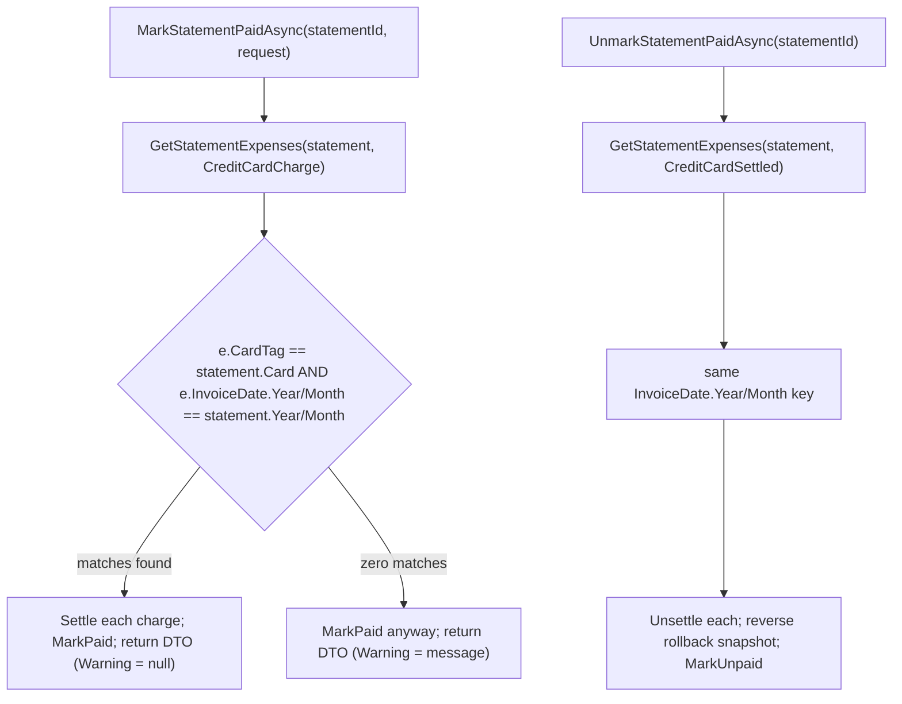

# Spec: F02. Invoice-Period Settlement Matching

## 1. Technical Overview

**What:** Change `CardStatementService`'s charge-matching key from a charge-origination date to `InvoiceDate`, so marking or unmarking a card statement paid operates on exactly the charges assigned to that invoice period — regardless of which calendar month they were actually charged in. Also surface an explicit warning when a mark-paid operation finds zero matching charges, instead of silently succeeding as if charges existed.

**Why:** F01 introduced `InvoiceDate` as the field that should drive settlement grouping (to correctly handle billing-cutoff cases where a charge's month and its invoice period differ), but the F01 PR only re-anchored the matching key to `ChargeDate` as a stability bridge (to avoid a regression before this feature shipped). F02 completes the intended model by making `InvoiceDate` the real matching key.

**Scope:**
- **Included:**
  - `CardStatementService.GetStatementExpenses`'s matching predicate changed from `ChargeDate.Year/Month` to `InvoiceDate.Year/Month`.
  - `MarkStatementPaidAsync` returns a non-null `Warning` on its response DTO when zero charges matched the statement's invoice period; `Warning` stays null otherwise (including the everyday case where 0 charges is the normal state — the response still succeeds, only the message differs from a plain zero-charge success by including the warning text).
  - Domain-level regression coverage for the billing-cutoff scenario named in the PRD (a charge dated near a month boundary, with an explicit `InvoiceDate` override placing it in a different month than its `ChargeDate`, settles against the invoice-period statement).
- **Excluded (later waves/features):**
  - Any Web/WPF UI change to display the new warning (not requested by F02's Capabilities/Experience — F02 is explicitly "not directly user-facing" beyond the existing mark/unmark buttons, matching F01's pattern). Surfacing it in the UI, if ever wanted, is left to a future PRD.
  - `AnnualSummaryService`'s category-total grouping (F03).
  - Any change to `ExpenseService`'s month-list endpoints (F01 already re-anchored those to `ChargeDate ?? Date` for stability; F02's PRD scope is `CardStatementService` only).

## 2. Architecture Impact

**Affected components:**

| Layer | Component | Change |
|---|---|---|
| Application | `Financial.CashFlow.Application/Services/CardStatementService.cs` | `GetStatementExpenses` matching key: `ChargeDate` → `InvoiceDate`; `MarkStatementPaidAsync` computes and returns a warning on zero matches |
| Application | `Financial.CashFlow.Application/DTOs/CardStatementDTO.cs` | Add nullable `Warning` property |
| Application Tests | `Tests/Financial.CashFlow.Application.Tests/Services/CardStatementServiceTests.cs` | Add billing-cutoff regression test and zero-match-warning tests |

**Data flow:**



## 3. Technical Decisions

| Decision | Chosen Approach | Alternative Considered | Trade-off |
|---|---|---|---|
| Matching key | `InvoiceDate.Year/Month`, replacing F01's temporary `ChargeDate.Year/Month` bridge | Keep `ChargeDate` permanently and treat `InvoiceDate` as display-only | Directly contradicts the PRD's stated purpose for `InvoiceDate` (driving settlement matching for billing-cutoff correctness) and this feature's own AC; `ChargeDate` was always meant as a stopgap, not the final key |
| Zero-match warning delivery | Add a nullable `Warning` string to the existing `CardStatementDTO` (returned from `MarkStatementPaidAsync`/`UnmarkStatementPaidAsync`/`GetStatementsForMonthAsync` via the shared `ToDto`, but only populated by the mark-paid zero-match path) | Introduce a new response type or throw a distinct warning exception | A nullable additive field is backward compatible with every existing consumer (Web/WPF both structurally-type the response; an extra/absent field doesn't break parsing) and keeps `MarkStatementPaidAsync`'s success/failure contract unchanged (this is a warning on an otherwise-successful call, not an error) |
| Warning wording condition | Populate the warning whenever `charges.Count == 0` at mark-paid time, regardless of cause (stale invoice period vs. a card that genuinely had no purchases that month) | Only warn when charges are believed to exist somewhere with a mismatched `InvoiceDate` (i.e., try to detect "should have matched") | The PRD's error-handling text describes exactly this condition ("if no charges match... a warning is surfaced") without carving out the everyday empty-statement case; distinguishing "genuinely empty" from "stale invoice period" would require guessing intent the system can't observe. Documented here as a flagged assumption: this means routine statements with zero card activity in a given month will also carry the warning text when marked paid, which is a minor UX quirk deferred to a future UI decision (out of scope, see §1) rather than a functional problem. |

## 4. Component Overview

**Application:**

| File Path | New/Modified | Purpose | Key Responsibilities |
|---|---|---|---|
| `Financial.CashFlow.Application/Services/CardStatementService.cs` | Modified | Statement settlement orchestration | `GetStatementExpenses` matches on `InvoiceDate.Year/Month` instead of `ChargeDate.Year/Month`; `MarkStatementPaidAsync` builds a `Warning` message when the matched-charges list is empty and threads it into the returned DTO |
| `Financial.CashFlow.Application/DTOs/CardStatementDTO.cs` | Modified | Read model | Add `public string? Warning { get; init; }` |

**Tests:**

| File Path | New/Modified | Purpose | Key Responsibilities |
|---|---|---|---|
| `Tests/Financial.CashFlow.Application.Tests/Services/CardStatementServiceTests.cs` | Modified | Application unit tests | Add: billing-cutoff regression (charge's `InvoiceDate` month differs from `ChargeDate` month, settles against the invoice-period statement, not the charge-month one); zero-match warning present when no charges match; warning absent (null) on a normal successful match; existing tests continue to pass unmodified since their fixtures never diverge `InvoiceDate` from `ChargeDate` |

## 5. API Contracts

No new endpoints. The existing `POST /api/v1/financial/card-statements/{id}/mark-paid` and `POST /api/v1/financial/card-statements/{id}/unmark-paid` endpoints (unchanged routes/methods) now return a `CardStatementDTO` with one additional nullable field:

| Field | Type | Description |
|---|---|---|
| `warning` | `string \| null` | Present only on a `mark-paid` response when zero charges matched the statement's invoice period; `null` in every other case (including `unmark-paid` and `get-statements`) |

**Response Example (zero-match case):**
```json
{
  "id": "550e8400-e29b-41d4-a716-446655440000",
  "card": "BarclaysPlatinumVisa8003",
  "year": 2026,
  "month": 7,
  "isPaid": true,
  "outstandingTotal": 0,
  "warning": "No credit card charges matched this statement's invoice period (2026-07); marked paid with 0 linked charges."
}
```

## 6. Data Model

No persisted schema change — `Warning` is a computed response field, never stored on `CardStatement` or `Expense`.

## 7. Testing Strategy

**Test File Structure:**

| Test File | Test Type | Target | Coverage Goal |
|---|---|---|---|
| `Tests/Financial.CashFlow.Application.Tests/Services/CardStatementServiceTests.cs` | Unit | `CardStatementService` | Every F02 acceptance criterion below, plus the existing regression suite unmodified |

**Functions to add:**

| Test Function | Description | Assertions |
|---|---|---|
| `MarkStatementPaidAsync_ChargeNearBillingCutoff_SettlesAgainstInvoicePeriodStatementNotChargeMonth` | A charge is created in month M with an explicit `InvoiceDate` override placing it in month M+1; both months' statements exist | Only the M+1 statement's mark-paid call settles the charge; the M statement's mark-paid call leaves it untouched |
| `MarkStatementPaidAsync_WithNoMatchingCharges_ReturnsWarningAndZeroOutstanding` | Statement has zero charges whose `InvoiceDate` matches its period | Response `IsPaid == true`, `OutstandingTotal == 0`, `Warning` is non-null and mentions the statement's year/month |
| `MarkStatementPaidAsync_WithMatchingCharges_WarningIsNull` | Normal happy path (existing fixture shape) | `Warning` is null |
| `UnmarkStatementPaidAsync_ChargeNearBillingCutoff_RevertsOnlyTheInvoicePeriodMatch` | Mirrors the mark-paid cutoff test for the unmark direction | Only the charge whose `InvoiceDate` matches the unmarked statement's period is reverted |

**Acceptance criteria covered (PRD Section 9, F02):**
- Marking an invoice paid settles only charges whose `InvoiceDate` year/month match the statement's period, regardless of their `ChargeDate` — `MarkStatementPaidAsync_ChargeNearBillingCutoff_SettlesAgainstInvoicePeriodStatementNotChargeMonth` plus the full existing suite (all of which use `InvoiceDate == ChargeDate` fixtures, so they equally prove the key change didn't regress the common case).
- A charge dated near a billing cutoff, with an `InvoiceDate` month different from its `ChargeDate`'s month, settles against the correct (invoice-period) statement, not the charge-month statement — same test.
- Unmarking a paid invoice reverts every charge it had settled, clearing `PaymentSource` and resetting `Date` to `ChargeDate` for each — already covered by F01's `UnmarkStatementPaidAsync_RevertsEverySettledExpenseForTheCardMonth` (unaffected by the key rename) plus the new `UnmarkStatementPaidAsync_ChargeNearBillingCutoff_RevertsOnlyTheInvoicePeriodMatch`.
- The bank balance changes only at mark-paid/unmark-paid time, matching today's behavior exactly (no regression) — unchanged code path (`Settle`/`Unsettle` calls unmoved), covered by the existing `MarkStatementPaidAsync_SettlesEveryChargeForTheCardMonthWithBankAndToday`-style suite.
- A partial failure during settlement rolls back all changes for that statement; the statement remains unpaid — unchanged code path, covered by the existing `MarkStatementPaidAsync_WhenSaveFails_RollsBackStatementAndCascadedExpenses`.

**Cross-Feature Integration criteria this feature satisfies:**
- "`ChargeDate`/`InvoiceDate`/`Settle()`/`Unsettle()` from F01 are correctly used by F02's statement matching (charges settle by invoice period, not charge date)" — directly covered by the billing-cutoff tests above.
- "F02's corrected invoice-period matching is reflected in what F05 and F06 display as 'this invoice's charges' in the Card tab" — F02 supplies the corrected matching; F05/F06 (not yet implemented) will consume it unchanged from this service.

## Assumptions / Decisions Flagged for Review

1. The zero-match warning fires for *any* zero-charge mark-paid call, including the everyday case of a card with no purchases that month — see Technical Decisions §3 for why a narrower "only when stale data is suspected" condition isn't feasible. If this turns out to be too noisy in practice, a future change could gate it behind "the card has at least one existing charge with a non-matching `InvoiceDate`" — flagged here rather than silently narrowed.
2. No UI surfaces the new `Warning` field yet; it's returned by the API but not displayed anywhere in Web/WPF. Left for a future decision since it's outside F02's stated Capabilities/Experience.
