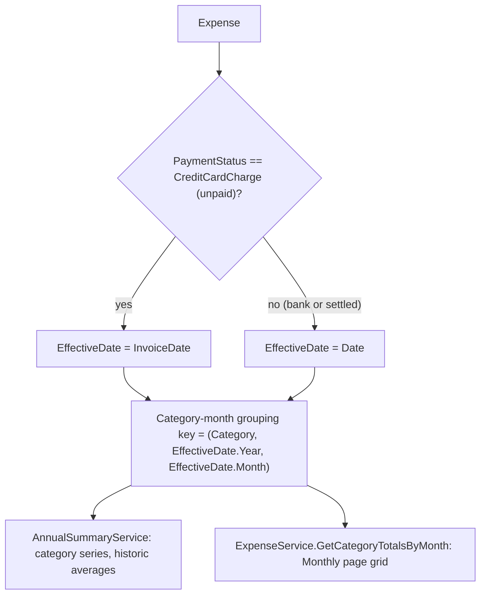

# Spec: F03. Invoice-Aware Category Totals

## 1. Technical Overview

**What:** Rework every category-totals aggregation to group each expense by an "effective date" that depends on its settlement state — `InvoiceDate` for a still-unpaid credit card charge, `Date` for everything else (bank expenses, and settled card expenses, since `Date` already holds the true payment date post-settlement per F01). Apply this consistently to `AnnualSummaryService`'s two named methods (`BuildCategoryMonthlyTotals`/`BuildAllCategorySeriesForYear` and `GetHistoricCategoriesAverageFromYear`) and, for internal consistency, to `ExpenseService.GetCategoryTotalsByMonth` — the Monthly page's category-totals grid, which is the exact surface the PRD's Problem Statement describes ("category totals group strictly by Date... misrepresenting real cash flow for that month").

**Why:** F01 gave every credit-card expense a real `InvoiceDate`; F02 made settlement matching honor it. The one remaining piece is reporting: today, an unpaid charge's spend is attributed to the month it was charged, not the month its invoice is due, so monthly and annual category totals misrepresent upcoming obligations. This is the PRD's headline objective ("Eliminate category-total misassignment for unpaid credit card expenses").

**Scope:**
- **Included:**
  - `AnnualSummaryService.BuildCategoryMonthlyTotals`, its caller `BuildAllCategorySeriesForYear` (including the year-level filter and the current-month-average cutoff), and `GetHistoricCategoriesAverageFromYear` (including its year-level filter and per-year category grouping) — all re-grouped by the new effective-date rule.
  - `ExpenseService.GetCategoryTotalsByMonth` — same effective-date rule, so the Monthly page's category grid and the Annual Summary's category totals never disagree on which month/year an expense counts toward. This extends beyond the PRD's F03 Capabilities list (which names only the two `AnnualSummaryService` methods) but is necessary to satisfy the PRD's own Problem Statement and Objective 1's "100% of unpaid credit card expenses grouped by InvoiceDate" metric — flagged as an explicit scope decision below (§3).
- **Excluded:**
  - `ExpenseService.GetExpensesByMonth`/`GetUnpaidCardChargesByMonth` — these are expense-*list* display endpoints (Card tab / Monthly expense list), not category-totals reporting; F01 already anchored them to `ChargeDate ?? Date` for list-position stability, which is a distinct concern from report grouping and is unaffected here.
  - Any Web/WPF UI change — per PRD's Experience note, "no visual/UI change... existing views automatically reflect the corrected grouping once this logic ships."

## 2. Architecture Impact

**Affected components:**

| Layer | Component | Change |
|---|---|---|
| Application | `Financial.CashFlow.Application/Services/AnnualSummaryService.cs` | New `EffectiveDate` helper; `BuildAllCategorySeriesForYear`'s year filter and current-month cutoff, `BuildCategoryMonthlyTotals`'s grouping key, and `GetHistoricCategoriesAverageFromYear`'s year filter + grouping keys all switch from `e.Date` to `EffectiveDate(e)` |
| Application | `Financial.CashFlow.Application/Services/ExpenseService.cs` | New `CategoryTotalDate` helper (same rule); `GetCategoryTotalsByMonth`'s filter switches from `OriginationDate(e)` (F01's `ChargeDate ?? Date` stability rule) to the invoice-aware rule |
| Application Tests | `Tests/Financial.CashFlow.Application.Tests/Services/AnnualSummaryServiceTests.cs` | Add coverage for unpaid-charge-by-invoice-month, settled-charge-by-payment-month, bank-expense-by-date-month, and the year-boundary case (charge in December, invoice in January) |
| Application Tests | `Tests/Financial.CashFlow.Application.Tests/Services/ExpenseServiceTests.cs` | Add the equivalent coverage for `GetCategoryTotalsByMonth` |

**Data flow:**

## 3. Technical Decisions

| Decision | Chosen Approach | Alternative Considered | Trade-off |
|---|---|---|---|
| Effective-date rule placement | A small private helper (`EffectiveDate` in `AnnualSummaryService`, `CategoryTotalDate` in `ExpenseService` — same logic, kept local to each service rather than shared) | Extract a shared static helper (e.g. on `Expense` itself, or a shared utility class) | The rule is a two-line ternary (`PaymentStatus == CreditCardCharge ? InvoiceDate!.Value : Date`), used by exactly two services; a cross-service utility for something this small is premature abstraction for a personal, non-scaling project (per project conventions). If a third consumer appears later, extracting becomes worthwhile then. |
| Extending scope to `ExpenseService.GetCategoryTotalsByMonth` | Included, despite not being named in PRD F03 Capabilities | Leave it on F01's `ChargeDate ?? Date` stability rule, strictly following the PRD's literal capability list | The PRD's Problem Statement and Objective 1 describe exactly this endpoint's symptom (Monthly page category totals). Leaving it unfixed would mean the Monthly page and Annual Summary silently disagree on category totals for any month with unpaid cutoff-adjacent charges — a correctness gap the PRD's own metric ("100% of unpaid credit card expenses are grouped by their assigned InvoiceDate month/year... verified by spot-checking every active card's unpaid charges") wouldn't actually satisfy otherwise. Flagged here for reviewer visibility since it's a scope call made without a live interview. |
| Year-boundary handling | The effective-date rule is applied to the *year-level* filter too (`BuildAllCategorySeriesForYear`'s `e.Date.Year == year`, `GetHistoricCategoriesAverageFromYear`'s `e.Date.Year <= year`), not just the month-level grouping | Apply the new rule only to the month grouping, keep the outer year filter on `Date.Year` | A December charge invoiced in January must count toward the *following* year's totals, not the charging year's — if the outer year filter stayed on `Date.Year`, such a charge would be silently excluded from both years (filtered out of the charge year, but never reached by the invoice year's query). This is a real edge case the PRD's billing-cutoff framing implies, not a hypothetical. |

## 4. Component Overview

**Application:**

| File Path | New/Modified | Purpose | Key Responsibilities |
|---|---|---|---|
| `Financial.CashFlow.Application/Services/AnnualSummaryService.cs` | Modified | Annual/category reporting | Add `EffectiveDate(Expense)`; use it in `BuildAllCategorySeriesForYear` (year filter, current-month-average cutoff) and `BuildCategoryMonthlyTotals` (grouping key), and in `GetHistoricCategoriesAverageFromYear` (year filter, `sumByYearMonthCategory` grouping, `categoriesByYear` grouping) |
| `Financial.CashFlow.Application/Services/ExpenseService.cs` | Modified | Expense use cases | Add `CategoryTotalDate(Expense)`; use it in `GetCategoryTotalsByMonth`'s filter, replacing the `OriginationDate` (F01 stability) helper for this method only — `GetExpensesByMonth`/`GetUnpaidCardChargesByMonth` keep using `OriginationDate` unchanged |

**Tests:**

| File Path | New/Modified | Purpose | Key Responsibilities |
|---|---|---|---|
| `Tests/Financial.CashFlow.Application.Tests/Services/AnnualSummaryServiceTests.cs` | Modified | Application unit tests | New tests per §7 below |
| `Tests/Financial.CashFlow.Application.Tests/Services/ExpenseServiceTests.cs` | Modified | Application unit tests | New tests per §7 below |

## 5. API Contracts

No contract shape changes — both affected endpoints (`GET /api/v1/financial/expenses/month/{year}/{month}/category-totals` and `GET /api/v1/financial/annual-summary/{year}/category-totals`) return the same DTOs as today; only which month/year an expense's value lands under changes.

## 6. Data Model

No persisted schema change — this is a query/grouping-logic change over existing fields.

## 7. Testing Strategy

**Test File Structure:**

| Test File | Test Type | Target | Coverage Goal |
|---|---|---|---|
| `Tests/Financial.CashFlow.Application.Tests/Services/AnnualSummaryServiceTests.cs` | Unit | `AnnualSummaryService` | Every F03 acceptance criterion, plus the year-boundary edge case |
| `Tests/Financial.CashFlow.Application.Tests/Services/ExpenseServiceTests.cs` | Unit | `ExpenseService.GetCategoryTotalsByMonth` | Same criteria, scoped to the single-month endpoint |

**Functions to add (both files, mirrored):**

| Test Function | Description | Assertions |
|---|---|---|
| `*_UnpaidCardCharge_CountsTowardInvoiceMonthNotChargeMonth` | A charge dated in month M with an explicit `InvoiceDate` override in month M+1 | Counted in M+1's totals, absent from M's |
| `*_SettledCardCharge_CountsTowardPostSettlementDateMonth` | A charge settled in a different month than it was charged | Counted in the settlement month (current `Date`), not the charge month |
| `*_BankExpense_CountsTowardDateMonthUnchanged` | A plain bank expense | Counted in its `Date` month, matching today's behavior exactly |
| `*_NoExpenseCountedInMoreThanOneMonth` | A mixed set of unpaid/settled/bank expenses across two adjacent months | Sum of all monthly totals equals the sum of all expense values, with no double-counting |
| `AnnualSummaryService`-only: `BuildAllCategorySeriesForYear_DecemberChargeInvoicedInJanuary_CountsTowardFollowingYear` | A December charge with `InvoiceDate` in January of the next year | Appears in the January-year's series, absent from the December-year's series |

**Acceptance criteria covered (PRD Section 9, F03):**
- An unpaid credit card expense counts toward category totals in its `InvoiceDate`'s year/month, not its `ChargeDate`'s month — `*_UnpaidCardCharge_CountsTowardInvoiceMonthNotChargeMonth` (both files) and the year-boundary test.
- A settled credit card expense counts toward category totals in the month/year of its (post-settlement) `Date` — `*_SettledCardCharge_CountsTowardPostSettlementDateMonth`.
- A bank expense counts toward category totals in the month/year of its `Date`, unchanged from today — `*_BankExpense_CountsTowardDateMonthUnchanged`.
- No expense is counted in more than one month/year in the same category total run — `*_NoExpenseCountedInMoreThanOneMonth`.

**Cross-Feature Integration criteria this feature satisfies:**
- "F01's fields are correctly consumed by F03's category-total grouping (unpaid vs. paid expenses grouped by the correct field)" — directly covered by the above.

## Assumptions / Decisions Flagged for Review

1. Scope was extended to `ExpenseService.GetCategoryTotalsByMonth` beyond the PRD's literal F03 Capabilities list — see Technical Decisions §3 for the reasoning. Recommend the reviewer confirm this is the intended reading of the PRD's Objective 1 metric.
2. The year-level filters in both `AnnualSummaryService` methods now use the effective date, which can shift a December charge's totals into the following year. This is intentional (see §3) but changes which year a cutoff-adjacent unpaid charge's spend appears under compared to today's behavior — worth confirming this matches the user's mental model of "which year does this belong to."
