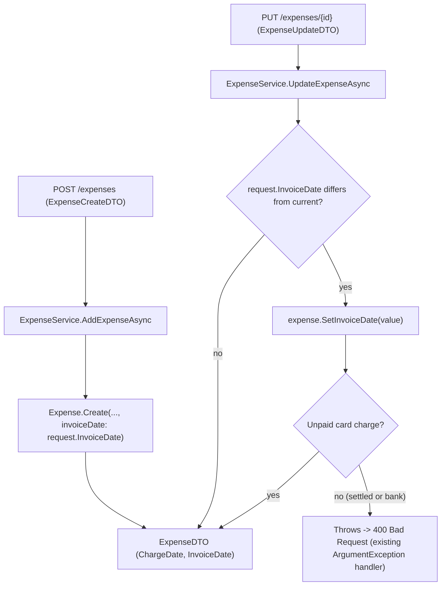

# Spec: F04. Backend Exposure of Charge/Invoice Fields

## 1. Technical Overview

**What:** Expose `ChargeDate` and `InvoiceDate` through the existing `Expense` read/create/update data contracts (`ExpenseDTO`, `ExpenseCreateDTO`, `ExpenseUpdateDTO`) consumed by both the Web and WPF clients. Accept an optional `InvoiceDate` override on create and update; never accept `ChargeDate` as client input (it stays server-derived, per F01). Reject an `InvoiceDate` update once the expense is already settled.

**Why:** F01 built the domain model, F02 made settlement matching honor it, F03 made reporting honor it — but no client can see or edit these fields yet, since they never crossed the Application/Presentation contract boundary. This is the last piece before F05 (Web) and F06 (WPF) can build UI on top of it.

**Scope:**
- **Included:**
  - `ExpenseDTO.ChargeDate`/`InvoiceDate` (read).
  - `ExpenseCreateDTO.InvoiceDate` (optional override, create).
  - `ExpenseUpdateDTO.InvoiceDate` (optional override, update — rejected once settled).
  - Wiring `ExpenseService.AddExpenseAsync`/`UpdateExpenseAsync` to pass the override through to the domain (`Expense.Create`'s `invoiceDate` parameter, `Expense.SetInvoiceDate` — both already built by F01).
- **Excluded:**
  - Any UI (F05, F06).
  - `ChargeDate` as a settable input anywhere — it has no create/update DTO property in this feature or any other; it is exclusively a read-only, server-derived field.

## 2. Architecture Impact

**Affected components:**

| Layer | Component | Change |
|---|---|---|
| Application | `Financial.CashFlow.Application/DTOs/ExpenseDTO.cs` | Add `ChargeDate`, `InvoiceDate` (both `DateOnly?`, read-only) |
| Application | `Financial.CashFlow.Application/DTOs/ExpenseCreateDTO.cs` | Add optional `InvoiceDate` (`DateOnly?`) |
| Application | `Financial.CashFlow.Application/DTOs/ExpenseUpdateDTO.cs` | Add optional `InvoiceDate` (`DateOnly?`) |
| Application | `Financial.CashFlow.Application/Services/ExpenseService.cs` | `AddExpenseAsync` passes `request.InvoiceDate` to `Expense.Create`; `UpdateExpenseAsync` calls `expense.SetInvoiceDate(...)` only when an actual change is requested; `ToDto` maps both new fields |
| Application Tests | `Tests/Financial.CashFlow.Application.Tests/Services/ExpenseServiceTests.cs` | New coverage per §7 |
| Presentation Tests | `Tests/Financial.Api.Tests/ExpenseEndpointsTests.cs` | New coverage per §7 |

**Data flow:**



## 3. Technical Decisions

| Decision | Chosen Approach | Alternative Considered | Trade-off |
|---|---|---|---|
| Update-path "no-op echo" handling | Only call `Expense.SetInvoiceDate` when `request.InvoiceDate` is provided **and differs** from the expense's current `InvoiceDate` | Call `SetInvoiceDate` whenever `request.InvoiceDate` is provided, regardless of whether it changed | A settled expense's other fields (description, value, category) are already editable via `UpdateDetails` today; if a client always echoes back every field it read (a common form pattern), calling `SetInvoiceDate` unconditionally would make *any* update to a settled expense fail the moment the client includes its own unchanged `InvoiceDate` — an unintended side effect the PRD's AC ("attempting to update InvoiceDate on an already-settled expense is rejected") is about a real attempted *change*, not an echo. Diffing first preserves existing settled-expense edit behavior while still rejecting genuine attempts to change it. |
| `ChargeDate` on create/update contracts | No property at all — not merely ignored-if-present, structurally absent | Add a `ChargeDate` property that's silently ignored if the client sends one | A property that exists but is silently discarded invites confusion ("why didn't my value stick?"); omitting it entirely from the contract shape is the clearest way to express "this is never client input," matching the AC's "has no effect" requirement by construction rather than by runtime-ignoring logic |
| `InvoiceDate` omitted on create | Falls through to `Expense.Create`'s existing default (1st of the charge month), since `request.InvoiceDate` (nullable) passes straight through as the optional `invoiceDate` parameter | Have `ExpenseService` compute the default itself before calling `Create` | `Expense.Create` already implements this default (built in F01); duplicating it in the Application layer would be redundant logic to keep in sync |

## 4. Component Overview

**Application:**

| File Path | New/Modified | Purpose | Key Responsibilities |
|---|---|---|---|
| `Financial.CashFlow.Application/DTOs/ExpenseDTO.cs` | Modified | Read model | Add `ChargeDate`, `InvoiceDate` (`DateOnly?`) |
| `Financial.CashFlow.Application/DTOs/ExpenseCreateDTO.cs` | Modified | Create request | Add `InvoiceDate` (`DateOnly?`, optional) |
| `Financial.CashFlow.Application/DTOs/ExpenseUpdateDTO.cs` | Modified | Update request | Add `InvoiceDate` (`DateOnly?`, optional) |
| `Financial.CashFlow.Application/Services/ExpenseService.cs` | Modified | Expense use cases | Wire `InvoiceDate` through create/update; map both new fields in `ToDto` |

**Tests:**

| File Path | New/Modified | Purpose | Key Responsibilities |
|---|---|---|---|
| `Tests/Financial.CashFlow.Application.Tests/Services/ExpenseServiceTests.cs` | Modified | Application unit tests | Coverage per §7 |
| `Tests/Financial.Api.Tests/ExpenseEndpointsTests.cs` | Modified | API integration tests | End-to-end coverage per §7 |

## 5. API Contracts

No new endpoints — the existing `POST /api/v1/financial/expenses` and `PUT /api/v1/financial/expenses/{id}` endpoints gain one optional request field and the existing `GET` paths (list/detail, both proxied through `ExpenseDTO`) gain two response fields.

**Request (create/update) — new field:**

| Field | Type | Required | Validation | Description |
|---|---|---|---|---|
| `invoiceDate` | `DateOnly \| null` | No | None beyond normal date parsing; day component is normalized server-side to the 1st of its month | Overrides the default invoice-period assignment for a credit card expense; ignored/irrelevant for bank expenses (no `CardTag`) |

**Request Example (create, with override):**
```json
{
  "date": "2026-07-29",
  "description": "Cutoff purchase",
  "value": 40.00,
  "category": "Mercado",
  "paymentSource": null,
  "cardTag": "BarclaysPlatinumVisa8003",
  "invoiceDate": "2026-08-01"
}
```

**Response — new fields:**

| Field | Type | Description |
|---|---|---|
| `chargeDate` | `DateOnly \| null` | The immutable original purchase day; non-null only for a credit card expense |
| `invoiceDate` | `DateOnly \| null` | The invoice period this expense is assigned to; non-null only for a credit card expense |

**Response Example:**
```json
{
  "id": "550e8400-e29b-41d4-a716-446655440000",
  "date": "2026-07-29",
  "description": "Cutoff purchase",
  "value": 40.00,
  "category": "Mercado",
  "paymentSource": null,
  "cardTag": "BarclaysPlatinumVisa8003",
  "chargeDate": "2026-07-29",
  "invoiceDate": "2026-08-01",
  "paymentStatus": "CreditCardCharge",
  "roundUpAmount": null,
  "suggestedRoundUpAmount": null
}
```

**Error Codes:**

| Code | HTTP Status | Description |
|---|---|---|
| (existing `ArgumentException` → `Problem`) | 400 | Returned when an update attempts to change `InvoiceDate` on an already-settled expense (message from `Expense.SetInvoiceDate`'s guard, built in F01) |

## 6. Data Model

No persisted schema change — `ChargeDate`/`InvoiceDate` were already added to the `Expense` entity by F01; this feature only exposes them through the Application-layer contracts.

## 7. Testing Strategy

**Test File Structure:**

| Test File | Test Type | Target | Coverage Goal |
|---|---|---|---|
| `Tests/Financial.CashFlow.Application.Tests/Services/ExpenseServiceTests.cs` | Unit | `ExpenseService` | Every F04 acceptance criterion |
| `Tests/Financial.Api.Tests/ExpenseEndpointsTests.cs` | Integration | `POST`/`PUT /expenses` | End-to-end confirmation through the HTTP contract |

**Functions to add:**

| Test Function | Description | Assertions |
|---|---|---|
| `AddExpenseAsync_CreditCardExpense_ReturnsNonNullChargeDateAndInvoiceDate` | Create a card expense, no override | `ChargeDate`/`InvoiceDate` both non-null in the returned DTO |
| `AddExpenseAsync_WithInvoiceDateOverride_UsesProvidedMonth` | Create with an explicit override in a different month | Returned `InvoiceDate` matches the override's month, not the charge month |
| `AddExpenseAsync_WithoutInvoiceDateOverride_DefaultsToChargeMonth` | Create with no override | Returned `InvoiceDate` equals the 1st of the charge date's month |
| `UpdateExpenseAsync_ChangingInvoiceDateWhileUnpaid_PersistsOverride` | Update an unpaid charge's `InvoiceDate` | New value persisted, returned in the DTO |
| `UpdateExpenseAsync_EchoingUnchangedInvoiceDateOnSettledExpense_Succeeds` | Update a settled expense's description, `InvoiceDate` field present but equal to current value | Succeeds (no throw), description updated |
| `UpdateExpenseAsync_ChangingInvoiceDateOnSettledExpense_Throws` | Update a settled expense with a genuinely different `InvoiceDate` | Throws `ArgumentException` |
| `AddExpenseAsync_BankExpense_ChargeDateAndInvoiceDateAreNull` | Create a bank expense | Both fields null in the response |

**Acceptance criteria covered (PRD Section 9, F04):**
- Reading any credit card expense through the API/data contract returns non-null `ChargeDate` and `InvoiceDate` — `AddExpenseAsync_CreditCardExpense_ReturnsNonNullChargeDateAndInvoiceDate` plus the API-level equivalent in `ExpenseEndpointsTests`.
- Creating/updating a credit card expense accepts an optional `InvoiceDate` override; omitting it applies the charge-month default — `AddExpenseAsync_WithInvoiceDateOverride_UsesProvidedMonth`, `AddExpenseAsync_WithoutInvoiceDateOverride_DefaultsToChargeMonth`, `UpdateExpenseAsync_ChangingInvoiceDateWhileUnpaid_PersistsOverride`.
- Attempting to set `ChargeDate` directly via the create/update contract has no effect — satisfied structurally (no such property exists on either DTO); verified implicitly by every create/update test never setting one and `ChargeDate` still being server-derived correctly.
- Attempting to update `InvoiceDate` on an already-settled expense is rejected — `UpdateExpenseAsync_ChangingInvoiceDateOnSettledExpense_Throws`, with `UpdateExpenseAsync_EchoingUnchangedInvoiceDateOnSettledExpense_Succeeds` confirming the no-op-echo carve-out from §3 doesn't over-reject.

**Cross-Feature Integration criteria this feature satisfies:**
- "F01's fields are correctly exposed end-to-end through F04's data contract and displayed/edited in F05 (Web) and F06 (WPF)" — F04 supplies the "exposed end-to-end through the data contract" half; the display/edit half remains F05/F06's job (not yet implemented), so this checkbox stays open until both ship.

## Assumptions / Decisions Flagged for Review

1. The "no-op echo" carve-out (§3) is an interpretation of the PRD's AC text, not explicitly spelled out there. Recommend the reviewer confirm this matches intent — the alternative (rejecting any update that includes `InvoiceDate` at all on a settled expense, even unchanged) would be simpler but riskier for existing client code that resends the full object on every edit.
