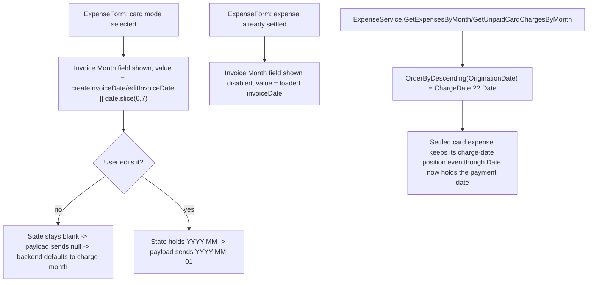

# Spec: F05. Web — Card Tab & Expense Form Support

## 1. Technical Overview

**What:** Add an editable "Invoice month/year" picker to the Web expense form, shown whenever a credit card is the payment method — pre-filled from the charge date, editable while unpaid, read-only once settled. Fix the Card tab's (and the Expense tab's) list ordering so a settled card expense keeps its original position instead of jumping when `Date` changes to the payment date at settlement.

**Why:** F04 exposed `chargeDate`/`invoiceDate` through the API contract; nothing in the Web client surfaces or edits them yet. Separately, codebase discovery for this feature found that `ExpenseService.GetExpensesByMonth`/`GetUnpaidCardChargesByMonth` (the shared Application-layer service both Web and WPF call) still sort by `e.Date` even though their **filter** was already correctly anchored to `ChargeDate ?? Date` back in F01 — this is exactly the "Card tab reordering risk" the PRD's Problem Statement names, and it was never actually fixed until now.

**Scope:**
- **Included:**
  - `ExpenseService.GetExpensesByMonth`/`GetUnpaidCardChargesByMonth` sort key changed from `e.Date` to the existing `OriginationDate(e)` helper (`ChargeDate ?? Date`) — a shared Application-layer fix, not Web-specific code, but the concrete blocker for this feature's own AC. Flagged explicitly below (§3) since it lives outside `Financial.Web/`.
  - `ExpenseForm.tsx`: new "Invoice Month" field, editable in card mode while unpaid, read-only (disabled) once settled.
  - `useMonthly.ts`: new `createInvoiceDate`/`editInvoiceDate` state, wired into the create/update request payloads.
  - `types.ts`: add `chargeDate`/`invoiceDate` to `ExpenseDto`, add `invoiceDate` to `CreateExpenseDto`/`UpdateExpenseDto`; remove the now-stale `settledAt` field (the backend removed `SettledAt` entirely in F01; this frontend field has been dead weight ever since, always `undefined` at runtime).
- **Excluded:**
  - Any new UI structure. Per the PRD's own out-of-scope note ("Card tab UI/layout changes... already shipped in P24; this PRD only changes the date fields/sort key those views read, not their structure") and confirmed by codebase discovery: there is no separate "Card tab" component today — it's the `activeTab === 'card'` section of `MonthlyPage.tsx`, composed of `CardsGrid` (statement summaries) + `ExpensesSection` (fed `unpaidCardCharges`). There is also no dedicated "paid/history" list inside the Card tab — a settled card expense reappears in the general Expense tab's list (`GetExpensesByMonth`). The PRD's "paid/history list" is read as referring to that existing Expense tab list, not a new component; see Assumptions.
  - `ChargeDate` as a settable field anywhere in the UI — it is never client input, per F04.

## 2. Architecture Impact

**Affected components:**

| Layer | Component | Change |
|---|---|---|
| Application (shared) | `Financial.CashFlow.Application/Services/ExpenseService.cs` | `GetExpensesByMonth`/`GetUnpaidCardChargesByMonth` sort key: `e.Date` → `OriginationDate(e)` |
| Application Tests | `Tests/Financial.CashFlow.Application.Tests/Services/ExpenseServiceTests.cs` | New/updated ordering assertions |
| Web | `Financial.Web/src/api/types.ts` | `ExpenseDto` gains `chargeDate`/`invoiceDate`, loses `settledAt`; `CreateExpenseDto`/`UpdateExpenseDto` gain `invoiceDate` |
| Web | `Financial.Web/src/components/ExpenseForm.tsx` | New "Invoice Month" field (editable in card mode, disabled once settled); `ExpenseFormField` union gains `'invoiceDate'` |
| Web | `Financial.Web/src/hooks/useMonthly.ts` | New `createInvoiceDate`/`editInvoiceDate` state, reducer wiring, payload construction |
| Web | `Financial.Web/src/pages/MonthlyPage.tsx` | Pass `invoiceDate` through to `ExpenseForm`; extend `CREATE_FIELD_BY_FORM_FIELD`/`EDIT_FIELD_BY_FORM_FIELD` maps |
| Web Tests | `Financial.Web/src/components/__tests__/ExpenseForm.test.tsx` | New field coverage |
| Web Tests | `Financial.Web/src/pages/__tests__/MonthlyPage.test.tsx` | New field + ordering coverage; remove stale `settledAt:` from fixtures |
| Web Tests | `Financial.Web/src/hooks/useMonthly.test.ts` | New payload-construction coverage; remove stale `settledAt:` from fixtures |
| Web Tests | `Financial.Web/src/components/__tests__/ExpensesSection.test.tsx` | Remove stale `settledAt:` from fixtures (no behavior change — this component doesn't sort) |

**Data flow:**

## 3. Technical Decisions

| Decision | Chosen Approach | Alternative Considered | Trade-off |
|---|---|---|---|
| Sort-key fix location | Fix `ExpenseService.GetExpensesByMonth`/`GetUnpaidCardChargesByMonth` once, in the shared Application layer | Duplicate the fix as client-side sorting in `useMonthly.ts` (and again later in WPF's `MonthlyViewModel.cs` for F06) | The service is consumed by both Web and WPF via the same `IExpenseService`; fixing it here means F06 doesn't need to re-fix it, only add its own UI wiring. Duplicating as client-side sorting would mean two divergent sort implementations to keep in sync, and wouldn't fix the API response order itself (which other consumers, e.g. a future mobile client, would also rely on). Flagged since this file is not under `Financial.Web/` — a backend change riding on a "Web" feature ticket. |
| "Paid/history list" interpretation | The existing Expense tab's `expenses` list (fed by `GetExpensesByMonth`, which already includes settled card expenses) | Add a new, separate "paid/history" section physically inside the Card tab | The PRD's own Out of Scope section for this epic states Card tab UI/layout is unchanged from P24 ("only changes the date fields/sort key those views read, not their structure"). Codebase discovery confirmed no such list exists today. Reading "paid/history list" as the pre-existing Expense tab list (which already contains settled card expenses, distinguishable via `paymentStatus`/`cardTag`) satisfies the AC's sorting requirement without inventing new UI structure. |
| Invoice-date default display vs. stored state | Compute the displayed default (`date.slice(0, 7)`) at render time in `ExpenseForm`; keep the underlying `createInvoiceDate`/`editInvoiceDate` state blank until the user actually edits the field | Eagerly write the derived default into state whenever the card tag or date changes (mirroring the round-up-amount "suggestion" pattern) | A render-time fallback needs no extra reducer syncing logic and automatically tracks live edits to `date` until the user actually overrides the invoice month — simpler, and avoids inventing a second field-sync trigger path. When untouched, the create/update payload sends `null` for `invoiceDate`, and the backend's own default (1st of the charge month) applies — functionally identical to eagerly-written state, with less code. |
| Update-payload invoice-date construction | One unified rule for both create and edit: `paymentMode === 'card' && xInvoiceDate ? \`${xInvoiceDate}-01\` : null` | Special-case the settled-echo behavior separately from the unpaid-override behavior | For a settled expense, the field is rendered `disabled`, so its state can never change from what `SHOW_EDIT_FORM` loaded (the expense's real current `invoiceDate`) — the same rule naturally echoes it back unchanged, satisfying F04's no-op-echo carve-out without a separate code path. |

## 4. Component Overview

**Application (shared backend):**

| File Path | New/Modified | Purpose | Key Responsibilities |
|---|---|---|---|
| `Financial.CashFlow.Application/Services/ExpenseService.cs` | Modified | Expense use cases | `GetExpensesByMonth`/`GetUnpaidCardChargesByMonth` sort by `OriginationDate(e)` instead of `e.Date` |

**Web:**

| File Path | New/Modified | Purpose | Key Responsibilities |
|---|---|---|---|
| `Financial.Web/src/api/types.ts` | Modified | API contract types | `ExpenseDto`: `+chargeDate: string \| null`, `+invoiceDate: string \| null`, `-settledAt`; `CreateExpenseDto`/`UpdateExpenseDto`: `+invoiceDate: string \| null` |
| `Financial.Web/src/components/ExpenseForm.tsx` | Modified | Expense entry/edit form | Add "Invoice Month" `<input type="month">` in the card-mode branch (editable) and in the settled branch (disabled); add `'invoiceDate'` to `ExpenseFormField`; add `invoiceDate: string` prop |
| `Financial.Web/src/hooks/useMonthly.ts` | Modified | Monthly page state/data | `createInvoiceDate`/`editInvoiceDate` state; `CreateFormField`/`EditField` union additions; `SHOW_CREATE_FORM` resets it blank; `SHOW_EDIT_FORM` loads it from `action.payload.invoiceDate`; `CANCEL_EDIT`/`SAVE_SUCCESS`/`CREATE_SUCCESS` reset it; `submitCreate`/`saveEdit` include `invoiceDate` in the request payload |
| `Financial.Web/src/pages/MonthlyPage.tsx` | Modified | Monthly page composition | Pass `invoiceDate` prop through to `ExpenseForm`; extend `CREATE_FIELD_BY_FORM_FIELD`/`EDIT_FIELD_BY_FORM_FIELD` |

**Tests:**

| File Path | New/Modified | Purpose | Key Responsibilities |
|---|---|---|---|
| `Tests/Financial.CashFlow.Application.Tests/Services/ExpenseServiceTests.cs` | Modified | Application unit tests | Ordering assertions per §7 |
| `Financial.Web/src/components/__tests__/ExpenseForm.test.tsx` | Modified | Form unit tests | New field coverage per §7 |
| `Financial.Web/src/pages/__tests__/MonthlyPage.test.tsx` | Modified | Integration tests | New field + ordering coverage; `settledAt:` fixtures removed |
| `Financial.Web/src/hooks/useMonthly.test.ts` | Modified | Hook unit tests | Payload-construction coverage; `settledAt:` fixtures removed |
| `Financial.Web/src/components/__tests__/ExpensesSection.test.tsx` | Modified | Component unit tests | `settledAt:` fixtures removed (mechanical only) |

## 5. API Contracts

No new endpoints — this consumes F04's existing contract additions. No further backend contract change beyond the sort-key fix (§3), which doesn't alter response shape, only order.

## 6. Data Model

No schema change — this is UI/query-ordering work over fields F01/F04 already defined.

## 7. Testing Strategy

**Test File Structure:**

| Test File | Test Type | Target | Coverage Goal |
|---|---|---|---|
| `Tests/Financial.CashFlow.Application.Tests/Services/ExpenseServiceTests.cs` | Unit | `ExpenseService` | Ordering by `ChargeDate` survives settlement |
| `Financial.Web/src/components/__tests__/ExpenseForm.test.tsx` | Unit | `ExpenseForm` | Every F05 form-related acceptance criterion |
| `Financial.Web/src/pages/__tests__/MonthlyPage.test.tsx` | Integration | `MonthlyPage` (Card tab) | Position-unchanged-after-settle AC |

**Functions to add/modify:**

| Test Function | Description | Assertions |
|---|---|---|
| `GetExpensesByMonth_SettledCardExpense_KeepsChargeDatePositionAfterSettlement` (new, `ExpenseServiceTests.cs`) | Two card expenses charged in order A then B; A settled in a later month than B | Order in the returned list still reflects charge order (A before B), not settlement date order |
| `'shows an editable invoice month field pre-filled from the date when card mode is selected'` (new, `ExpenseForm.test.tsx`) | Render in card mode, unpaid | Field present, value defaults from `date` |
| `'persists a changed invoice month while unpaid'` (new, `ExpenseForm.test.tsx`) | Change the field, trigger save | `onFieldChange('invoiceDate', ...)` called with the new value |
| `'shows the invoice month field disabled once settled'` (new, `ExpenseForm.test.tsx`) | Render with `isSettled=true` | Field present but `disabled` |
| `'hides the invoice month field in bank mode'` (new, `ExpenseForm.test.tsx`) | Render in bank mode | Field absent |
| `'an expense's position in the Card tab list is unchanged immediately before and after its invoice is marked paid'` (new, `MonthlyPage.test.tsx`) | Render two card charges, mark one's statement paid, re-render with updated fixtures reflecting the new (unchanged) order returned by the (now-fixed) API | Row order identical before/after |

**Acceptance criteria covered (PRD Section 9, F05):**
- Selecting a credit card in the Web expense form reveals an editable invoice month/year field, pre-filled with the default — the two `ExpenseForm.test.tsx` tests above.
- Changing the invoice month/year before saving persists the overridden value, while the expense is unpaid — `'persists a changed invoice month while unpaid'`.
- The invoice month/year field is read-only once the expense is settled — `'shows the invoice month field disabled once settled'`.
- The Web Card tab's unpaid and paid/history lists are sorted/positioned by `ChargeDate` — `GetExpensesByMonth_SettledCardExpense_KeepsChargeDatePositionAfterSettlement` (the actual ordering fix lives in the shared service both lists' endpoints call).
- An expense's position in the Card tab list is unchanged immediately before and after its invoice is marked paid — the `MonthlyPage.test.tsx` test above, backed by the same service-level fix.

**Cross-Feature Integration criteria this feature partially satisfies:**
- "F01's fields are correctly exposed end-to-end through F04's data contract and displayed/edited in F05 (Web) and F06 (WPF)" — F05 supplies the Web half; stays unchecked in the PRD until F06 (WPF) also ships.
- "F02's corrected invoice-period matching is reflected in what F05 and F06 display as 'this invoice's charges' in the Card tab" — F05 supplies the Web half; same, unchecked until F06 ships.

## Assumptions / Decisions Flagged for Review

1. The sort-key fix in `ExpenseService.cs` is shared backend code, not Web-specific — bundled into F05 because it's the actual blocker for this feature's AC, and to avoid F06 needing to duplicate it. Flagged for reviewer visibility since it's a scope call made without a live interview.
2. "Paid/history list" is read as the pre-existing Expense tab list, not a new UI section — see Technical Decisions §3. Recommend confirming this matches the original intent behind that PRD wording.
3. The stale `settledAt` field is removed from `Financial.Web/src/api/types.ts` and its test fixtures as part of this feature (mechanical cleanup, not a new capability) — it's been dead weight since F01 removed the backend field, and touching `ExpenseDto` for the `chargeDate`/`invoiceDate` additions is the natural point to also drop it.
