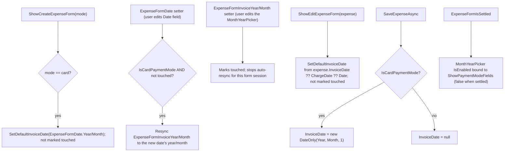

# Spec: F06. WPF — Card Tab & Expense Form Support

## 1. Technical Overview

**What:** Add an editable "Invoice Month" picker to the WPF expense entry/edit dialog (`ExpenseFormView`/`MonthlyViewModel`), shown whenever a credit card is the payment method — pre-filled from the charge date, editable while unpaid, read-only (disabled) once settled. Fix `CreditCardExpensesView`'s date column to display `ChargeDate` instead of `Date`.

**Why:** F04 exposed `ChargeDate`/`InvoiceDate` through the shared `ExpenseDTO`/`ExpenseCreateDTO`/`ExpenseUpdateDTO` contract that WPF already consumes directly (WPF references `Financial.CashFlow.Application` — no separate client-side type layer to update, unlike Web). Nothing in the WPF client surfaces or edits these fields yet. F05 already fixed the shared `ExpenseService.GetExpensesByMonth`/`GetUnpaidCardChargesByMonth` sort key from `Date` to `ChargeDate`-anchored `OriginationDate`, so **no backend change is needed here** — but codebase discovery for this feature found that `CreditCardExpensesView`'s date *column* still displays `Date` rather than `ChargeDate`, which is misleading now that a settled expense's `Date` holds the payment date rather than the charge date.

**Scope:**
- **Included:**
  - `ExpenseFormView.xaml`/`MonthlyViewModel.cs`: new `ExpenseFormInvoiceYear`/`ExpenseFormInvoiceMonth` state bound through the existing reusable `MonthYearPicker` component, wired into the create/update DTOs.
  - `CreditCardExpensesView.xaml`: date column binding changed from `Date` to `ChargeDate`.
- **Excluded:**
  - Any change to `ExpenseService.cs`'s sort key — already fixed by F05 (shared Application-layer code, not duplicated here).
  - Any new UI structure. Per the PRD's own out-of-scope note (Card tab UI/layout unchanged since P24) and confirmed by codebase discovery: `CreditCardExpensesView` shows a single list bound to `UnpaidCardCharges`; there is no separate "paid/history" list in the WPF Card tab either (structurally identical to the Web finding in F05) — a settled expense simply leaves this grid and reappears in `ExpenseSectionView`'s grid on the Expense tab (correctly bound to `Date`, which is the payment date post-settlement).
  - `ChargeDate` as a settable field anywhere in the UI — never client input, per F04.

## 2. Architecture Impact

**Affected components:**

| Layer | Component | Change |
|---|---|---|
| WPF | `Financial.App/ViewModels/CashFlow/MonthlyViewModel.cs` | New `ExpenseFormInvoiceYear`/`ExpenseFormInvoiceMonth` properties with reactive-default-until-touched logic; wired into `ShowCreateExpenseForm`/`ShowEditExpenseForm`/`SaveExpenseAsync` |
| WPF | `Financial.App/Views/CashFlow/ExpenseFormView.xaml` | New "Invoice Month" row using the existing `MonthYearPicker` component, always visible when `IsCardPaymentMode` (editable unless settled) |
| WPF | `Financial.App/Views/CashFlow/CreditCardExpensesView.xaml` | Date column binding: `Date` → `ChargeDate` |
| WPF Tests | `Tests/Financial.Presentation.Tests/ViewModels/CashFlow/MonthlyViewModelTests.cs` | New coverage per §7 |
| WPF Tests | `Tests/Financial.Presentation.Tests/ViewModels/CashFlow/TestStubs.cs` | `StubExpenseService.ToDto`-equivalent fixture helper extended to carry `ChargeDate`/`InvoiceDate` |

**Data flow:**

## 3. Technical Decisions

| Decision | Chosen Approach | Alternative Considered | Trade-off |
|---|---|---|---|
| Month/year picker control | Reuse the existing `MonthYearPicker` `UserControl` (two-`ComboBox` Month+Year, already used by `MonthlyView`/`MensaisView`/`InvestmentSnapshotsView`) | Build a new masked/restricted `DatePicker`, or two raw `ComboBox`es inline | `MonthYearPicker`'s own doc comment states its exact purpose: reusable so pages don't reimplement the same wiring. It already exposes bindable `SelectedYear`/`SelectedMonth` int dependency properties — building anything new here would duplicate an existing, working component for no benefit. |
| Read-only-once-settled mechanism | Bind `MonthYearPicker.IsEnabled` to `ShowPaymentModeFields` (already `false` when settled) | Swap to a separate read-only `TextBlock` display when settled, mirroring the settled-note pattern used for Card/Payment Source | `IsEnabled="False"` on a `UserControl` disables its child controls by default WPF visual-tree inheritance — no extra XAML branching needed. The field stays visually the same control in both states (matches Web's approach of disabling the same `<input>` rather than swapping to different markup), and it must remain **visible** even when settled (unlike the Card/Payment Source fields, which are fully hidden when settled) — so it can't reuse the existing `ShowPaymentModeFields`-gated visibility wrapper; it needs its own row, gated only on `IsCardPaymentMode`. |
| Default-tracking ("pre-filled with the default", staying in sync until touched) | A `_invoiceDateTouchedByUser` flag: `ExpenseFormDate`'s setter re-derives the invoice year/month from the new date whenever `IsCardPaymentMode` is true and the flag is still `false`; the invoice property setters themselves set the flag `true`, permanently stopping the auto-resync for that form session | Skip the reactive resync entirely; only set the default once when the form opens | F06's own PRD Experience text explicitly calls for "keeping visual parity between Web and WPF per the project's established parity pattern" — Web's equivalent field recomputes its displayed default from `date` live, until the user overrides it. A `_expenseFormDate`-only one-time default would silently drift from Web's behavior (e.g., user opens the form, then changes the Date field before ever touching the invoice picker — Web updates the shown default; a one-time default would not). The touched-flag is the minimum needed to match that parity without inventing a heavier sync mechanism. |
| Invoice-date field row placement in `ExpenseFormView.xaml` | Insert as a new, always-visible-when-`IsCardPaymentMode` row (reordering existing rows 5-7 down to 6-8; all 9 `RowDefinition`s already declared in the XAML, only 8 were in use) | Nest it inside the existing `IsCardPaymentMode`-gated `Grid` at row 5, alongside the Card `ComboBox` | Nesting inside the existing card-mode block would put it inside the same `ShowPaymentModeFields`-gated `StackPanel` that hides ALL payment fields once settled — but the invoice field must stay visible (just disabled) when settled, unlike the Card picker itself. It needs to sit outside that wrapper, in its own row. |

## 4. Component Overview

**WPF:**

| File Path | New/Modified | Purpose | Key Responsibilities |
|---|---|---|---|
| `Financial.App/ViewModels/CashFlow/MonthlyViewModel.cs` | Modified | Monthly tab state/data | `ExpenseFormInvoiceYear`/`ExpenseFormInvoiceMonth` properties (public setters mark `_invoiceDateTouchedByUser`); private `SetDefaultInvoiceDate(year, month)` helper (bypasses the touched flag); `ExpenseFormDate` setter resyncs the invoice default when untouched and in card mode; `ShowCreateExpenseForm`/`ShowEditExpenseForm` seed the default and reset the touched flag; `SaveExpenseAsync` includes `InvoiceDate = new DateOnly(Year, Month, 1)` (card mode) or `null` (bank mode) in both DTOs |
| `Financial.App/Views/CashFlow/ExpenseFormView.xaml` | Modified | Expense entry/edit dialog | New row: label + `MonthYearPicker` bound to `ExpenseFormInvoiceYear`/`Month`, `Visibility` gated on `IsCardPaymentMode`, `IsEnabled` gated on `ShowPaymentModeFields` |
| `Financial.App/Views/CashFlow/CreditCardExpensesView.xaml` | Modified | Card tab unpaid-charges grid | Date column `Binding` changed from `Date` to `ChargeDate` |

**Tests:**

| File Path | New/Modified | Purpose | Key Responsibilities |
|---|---|---|---|
| `Tests/Financial.Presentation.Tests/ViewModels/CashFlow/MonthlyViewModelTests.cs` | Modified | ViewModel unit tests | Coverage per §7 |
| `Tests/Financial.Presentation.Tests/ViewModels/CashFlow/TestStubs.cs` | Modified | Shared test fixtures | `StubExpenseService`'s DTO-building helper extended to accept/carry `ChargeDate`/`InvoiceDate` so new tests can construct realistic fixtures |

## 5. API Contracts

None — this consumes F04's existing contract additions (`ChargeDate`/`InvoiceDate` on `ExpenseDTO`, `InvoiceDate` on `ExpenseCreateDTO`/`ExpenseUpdateDTO`), already available to WPF with zero type-layer work since it references the Application project directly.

## 6. Data Model

No schema change — this is UI wiring over fields F01/F04 already defined, using the sort fix F05 already shipped.

## 7. Testing Strategy

**Test File Structure:**

| Test File | Test Type | Target | Coverage Goal |
|---|---|---|---|
| `Tests/Financial.Presentation.Tests/ViewModels/CashFlow/MonthlyViewModelTests.cs` | Unit | `MonthlyViewModel` | Every F06 acceptance criterion |

**Functions to add (mirroring the existing `ShowCreateExpenseFormCommand_CardMode_...` / `EditExpense_SettledExpense_...` naming conventions already in this file):**

| Test Function | Description | Assertions |
|---|---|---|
| `ShowCreateExpenseFormCommand_CardMode_DefaultsInvoiceDateFromExpenseFormDate` | Open create form in card mode | `ExpenseFormInvoiceYear`/`Month` equal `ExpenseFormDate`'s year/month |
| `ExpenseFormDate_ChangedBeforeInvoiceDateTouched_ResyncsInvoiceDefault` | Open create form in card mode, then change `ExpenseFormDate` | `ExpenseFormInvoiceYear`/`Month` follow the new date |
| `ExpenseFormInvoiceMonth_SetByUser_StopsFurtherAutoResync` | Set `ExpenseFormInvoiceMonth` explicitly, then change `ExpenseFormDate` again | Invoice year/month no longer change |
| `EditExpenseCommand_FromUnpaidCardCharges_PrefillsInvoiceDateFromExpense` | Edit an unpaid card charge fixture with `InvoiceDate` set | `ExpenseFormInvoiceYear`/`Month` match the fixture's `InvoiceDate` |
| `EditExpense_SettledExpense_InvoiceDateFieldPresentButPaymentModeFieldsGated` | Edit a settled expense fixture | `ShowPaymentModeFields` is `false` (existing assertion) and `ExpenseFormInvoiceYear`/`Month` are populated from the fixture (field still has a value to display, just not editable through `ShowPaymentModeFields`-gated UI) |
| `AddExpense_CardMode_CallsServiceWithInvoiceDate` | Submit a new card expense | `expenses.LastCreateRequest!.InvoiceDate` equals `new DateOnly(Year, Month, 1)` |
| `AddExpense_BankMode_CallsServiceWithNullInvoiceDate` | Submit a new bank expense | `expenses.LastCreateRequest!.InvoiceDate` is `null` |
| `SaveExpenseAsync_EditingCardExpense_CallsServiceWithInvoiceDate` | Save an edit to an unpaid card charge with a changed invoice month | `expenses.LastUpdateRequest!.InvoiceDate` equals the new value |

**Acceptance criteria covered (PRD Section 9, F06):**
- Selecting a credit card in the WPF expense dialog reveals an editable invoice month/year field, pre-filled with the default — `ShowCreateExpenseFormCommand_CardMode_DefaultsInvoiceDateFromExpenseFormDate`.
- Changing the invoice month/year before saving persists the overridden value, while the expense is unpaid — `AddExpense_CardMode_CallsServiceWithInvoiceDate`, `SaveExpenseAsync_EditingCardExpense_CallsServiceWithInvoiceDate`.
- The invoice month/year field is read-only once the expense is settled — `EditExpense_SettledExpense_InvoiceDateFieldPresentButPaymentModeFieldsGated` (asserts the same `ShowPaymentModeFields`/`IsEnabled` gate the XAML binds to).
- `CreditCardExpensesView`'s unpaid and paid/history lists are sorted/positioned by `ChargeDate` — satisfied by F05's already-merged server-side fix (`ExpenseService.cs`) plus this feature's XAML column-binding correction; no WPF-side re-sort exists to break it (confirmed: `MonthlyViewModel.ReplaceAll` does a plain clear+add, no client sort).
- An expense's position in the Card tab list is unchanged immediately before and after its invoice is marked paid — same as above; `UnpaidCardCharges` only ever holds currently-unpaid items, and the server-side `ChargeDate`-anchored ordering (already covered by F05's `ExpenseServiceTests.cs`) guarantees stable relative position across the settle transition.

**Cross-Feature Integration criteria this feature satisfies:**
- "F01's fields are correctly exposed end-to-end through F04's data contract and displayed/edited in F05 (Web) and F06 (WPF)" — both F05 and F06 now implemented, so this can be checked off.
- "F02's corrected invoice-period matching is reflected in what F05 and F06 display as 'this invoice's charges' in the Card tab" — both F05 and F06 now implemented, so this can be checked off.

## Assumptions / Decisions Flagged for Review

1. No new backend test coverage is added for the "sort by ChargeDate" ACs — F05 already added `ExpenseServiceTests.GetExpensesByMonth_SettledCardExpense_KeepsChargeDatePositionAfterSettlement` covering the shared service both clients call; re-testing the same server behavior from the WPF ViewModel layer would just be testing that `ReplaceAll` preserves array order (already true, trivial, and implicitly exercised by every existing `MonthlyViewModelTests` fixture-loading test).
2. The touched-flag mechanism (§3) is new state (`_invoiceDateTouchedByUser`) not explicitly named in the PRD — it exists solely to match Web's live-default behavior per F06's own parity requirement, and resets every time the form is freshly opened (create or edit), never persisting across form sessions.
