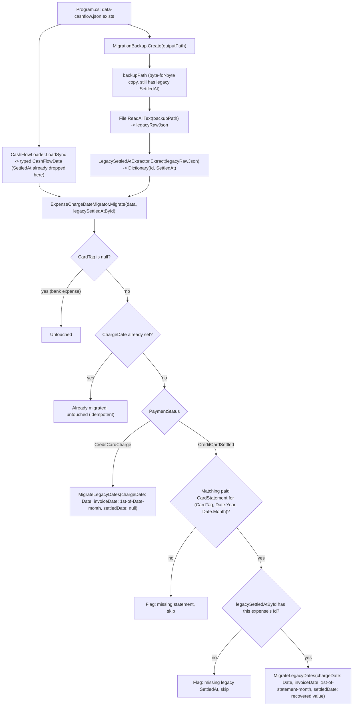

# Spec: F07. Existing Data Migration

## 1. Technical Overview

**What:** A new idempotent migrator, `ExpenseChargeDateMigrator`, that backfills `ChargeDate`/`InvoiceDate` on every pre-existing credit card expense in `data-cashflow.json`, following the `Migrations/<Name>/XyzMigrator.cs` pattern and running in `CashFlowSpreadsheetImport`'s existing migration chain. For a still-unpaid charge: `ChargeDate = Date` (unchanged), `InvoiceDate` defaults to the 1st of `Date`'s month. For an already-settled charge: `ChargeDate` = the pre-migration `Date` (the original charge date), `Date` becomes the pre-migration `SettledAt` value, and `InvoiceDate` is derived from the matching paid `CardStatement`'s year/month.

**Why:** F01 built the `ChargeDate`/`InvoiceDate` model but explicitly deferred backfilling pre-existing records to this feature (see F01's spec Assumptions). Every credit card expense created before this PRD shipped has neither field populated; without this migration, F02's settlement matching and F03's reporting silently misbehave for all historical data (their `InvoiceDate`-based logic finds nothing to match against).

**A critical, time-sensitive complication discovered during this feature's design:** F01 removed the `SettledAt` property from `Expense` entirely. Since the domain model no longer declares that property, a normal typed JSON deserialization (`CashFlowSerializerAdapter`'s reflection-based binding) silently drops any `SettledAt` value present in older JSON — it isn't merely ignored at the point of use, it's discarded the moment the file is loaded into memory. This means the *typed* `CashFlowData` object this migrator would normally receive (matching every other migrator's `Migrate(CashFlowData data)` signature) has **already lost** the exact value F07 needs for already-settled expenses, before the migrator ever runs. Reading `data/data-cashflow.json` directly during this feature's investigation confirmed the live file **still has every `SettledAt` value intact** (the app hasn't resaved it since F01 shipped) — but the very next load+save cycle under the current code will silently and irreversibly drop it. **This is what makes running this migration promptly, and via a route that avoids a lossy round-trip first, genuinely time-sensitive for the user's real data — not merely a hypothetical.**

**Scope:**
- **Included:**
  - A new domain method, `Expense.MigrateLegacyDates(chargeDate, invoiceDate, settledDate)`, the one-time backfill hook F01 anticipated needing (its spec explicitly deferred this design decision here). Guarded so it can only run once per record and only touches `Date` when a `settledDate` is supplied for an already-settled expense.
  - `ExpenseChargeDateMigrator` + `ExpenseChargeDateMigrationSummary`, following the `IncomeMigrationSummary`/(the now-retired) `PaymentStateMigrationSummary` patterns.
  - `LegacySettledAtExtractor` — reads the **raw pre-migration JSON text** (sourced from the backup file `Program.cs` already creates before any load happens) to recover each settled expense's `SettledAt` value by `Id`, independent of — and before — the lossy typed deserialization.
  - Wiring into `CashFlowSpreadsheetImport/Program.cs`'s existing "always run, both modes" migration block.
- **Excluded:**
  - Applying the migration to the user's live `data/data-cashflow.json` or the Google Drive copy — per project convention, this PR only ships the tool; running it for real against live data is the user's own follow-up step, verified first against a temporary copy (see §7 and the Assumptions section for why this is more urgent than usual this time).

## 2. Architecture Impact

**Affected components:**

| Layer | Component | Change |
|---|---|---|
| Domain | `Financial.CashFlow.Domain/Entities/Expense.cs` | New `MigrateLegacyDates(DateOnly chargeDate, DateOnly invoiceDate, DateOnly? settledDate)` method |
| Domain Tests | `Tests/Financial.CashFlow.Domain.Tests/Entities/ExpenseTests.cs` | Coverage for the new method's guards and happy paths |
| Integrations | `Integrations/CashFlowSpreadsheetImport/Migrations/ExpenseChargeDate/ExpenseChargeDateMigrator.cs` | New migrator |
| Integrations | `Integrations/CashFlowSpreadsheetImport/Migrations/ExpenseChargeDate/ExpenseChargeDateMigrationSummary.cs` | New summary/report type |
| Integrations | `Integrations/CashFlowSpreadsheetImport/Migrations/ExpenseChargeDate/LegacySettledAtExtractor.cs` | New raw-JSON recovery helper |
| Integrations | `Integrations/CashFlowSpreadsheetImport/Program.cs` | Reads the backup file's raw text right after `MigrationBackup.Create`, passes it + `data` to the new migrator, prints its summary |
| Integrations Tests | `Tests/Financial.CashFlowSpreadsheetImport.Tests/Migrations/ExpenseChargeDate/ExpenseChargeDateMigratorTests.cs` | New test file covering every PRD scenario |
| Integrations Tests | `Tests/Financial.CashFlowSpreadsheetImport.Tests/Migrations/ExpenseChargeDate/LegacySettledAtExtractorTests.cs` | New test file |

**Data flow:**

## 3. Technical Decisions

| Decision | Chosen Approach | Alternative Considered | Trade-off |
|---|---|---|---|
| Recovering the removed `SettledAt` value | Read the **raw JSON text** of the pre-migration backup file (which `Program.cs` already creates via `MigrationBackup.Create` before the typed load happens) and extract `{Id: SettledAt}` pairs directly with `JsonDocument`, bypassing the typed model entirely | Add `SettledAt` back to `Expense` temporarily, or use reflection to read a "hidden" backing field | F01 deliberately removed `SettledAt` as one of this PRD's explicit acceptance criteria ("no longer exists on the Expense entity") — reintroducing it, even temporarily, would violate that and reopen the exact ambiguity F01 eliminated. Reading the untouched backup's raw text needs no entity or serializer change at all, and the backup already exists in the current migration flow for exactly this kind of recovery purpose. |
| Backfilling `ChargeDate`/`InvoiceDate`/`Date` on an existing entity | One new narrowly-scoped domain method, `Expense.MigrateLegacyDates(...)`, guarded to run at most once per record (throws if `ChargeDate` is already set) and to only touch `Date` when a settled date is supplied for an already-settled expense | Use reflection to set private-setter properties directly, mirroring the deleted `ExpensePaymentStateMigrator` test's now-defunct hack | The retired migrator's own production code *never* used reflection — only its test file did, to simulate an otherwise-unreachable legacy shape. Every real migrator in this codebase mutates state exclusively through the entity's own methods, so the result can never violate a domain invariant. A single purpose-built method preserves that discipline while doing exactly what F01's own spec flagged as deferred design work. |
| Matching key for a settled expense's originating statement | `(CardTag, Date.Year, Date.Month)` using the expense's **current, pre-migration** `Date` (still the original charge date at this point, since `Settle()`'s new Date-swap behavior never touched historical records) | Match by `ChargeDate` or `InvoiceDate` | Neither of those fields exists yet on an un-migrated record — the match must happen using whatever data the record already has, which for a not-yet-migrated settled expense is still its original `Date` |
| Missing legacy `SettledAt` for an already-settled expense (not named in the PRD's Error Handling text) | Flag and skip, same treatment as the PRD's explicit "no matching statement" case | Fall back to some computed/guessed date (e.g., statement month-end, matching the retired migrator's old guess-based approach) | The PRD's whole point for this field is a *real* historical date, and a guess would silently reintroduce the ambiguity this entire epic exists to remove. This case is only reachable if the live file was already resaved under post-F01 code before migration ran — flagging it surfaces exactly that risk to the user rather than masking it with a fabricated value. |

## 4. Component Overview

**Domain:**

| File Path | New/Modified | Purpose | Key Responsibilities |
|---|---|---|---|
| `Financial.CashFlow.Domain/Entities/Expense.cs` | Modified | Core entity | Add `MigrateLegacyDates(DateOnly chargeDate, DateOnly invoiceDate, DateOnly? settledDate)`: throws if `CardTag` is null, throws if `ChargeDate` is already set (one-time-only), throws if `settledDate` is supplied but `PaymentStatus != CreditCardSettled`; otherwise sets `ChargeDate`, `InvoiceDate` (normalized to the 1st, reusing the existing `FirstOfMonth` helper), and `Date` (only when `settledDate` is supplied) |

**Integrations:**

| File Path | New/Modified | Purpose | Key Responsibilities |
|---|---|---|---|
| `Integrations/CashFlowSpreadsheetImport/Migrations/ExpenseChargeDate/ExpenseChargeDateMigrator.cs` | New | Migration orchestration | `Migrate(CashFlowData data, string? legacyRawJson)`: iterates `data.Expenses`, skips bank expenses and already-migrated records, dispatches unpaid vs. settled handling per §2's flow, builds the paid-statement lookup once per run |
| `Integrations/CashFlowSpreadsheetImport/Migrations/ExpenseChargeDate/ExpenseChargeDateMigrationSummary.cs` | New | Report type | Counters for bank (untouched), already-migrated, newly-migrated-unpaid, newly-migrated-settled, plus flagged lists for missing-statement and missing-legacy-SettledAt cases; `Render()` following the existing summary pattern |
| `Integrations/CashFlowSpreadsheetImport/Migrations/ExpenseChargeDate/LegacySettledAtExtractor.cs` | New | Raw-JSON recovery | `Extract(string? rawJson) -> IReadOnlyDictionary<Guid, DateOnly>`: parses the `Expenses` array directly via `JsonDocument`, reading each entry's `Id`/`SettledAt` string properties without going through the typed model |
| `Integrations/CashFlowSpreadsheetImport/Program.cs` | Modified | Migration chain entry point | Capture `legacyRawJson = File.ReadAllText(backupPath)` right after the existing `MigrationBackup.Create` call (only when a backup was actually created); call `ExpenseChargeDateMigrator.Migrate(data, legacyRawJson)` alongside the other "always run, both modes" migrators; print its summary |

**Tests:**

| File Path | New/Modified | Purpose | Key Responsibilities |
|---|---|---|---|
| `Tests/Financial.CashFlow.Domain.Tests/Entities/ExpenseTests.cs` | Modified | Domain unit tests | `MigrateLegacyDates` happy paths (unpaid, settled) and guard-clause throws (bank expense, already migrated, settled-date without settled status) |
| `Tests/Financial.CashFlowSpreadsheetImport.Tests/Migrations/ExpenseChargeDate/ExpenseChargeDateMigratorTests.cs` | New | Migration logic tests | Every scenario in §7 |
| `Tests/Financial.CashFlowSpreadsheetImport.Tests/Migrations/ExpenseChargeDate/LegacySettledAtExtractorTests.cs` | New | Raw-JSON parsing tests | Extracts correctly from a realistic legacy JSON fixture; returns empty for null/blank/malformed input; skips entries missing `SettledAt` or with a non-string value |

## 5. API Contracts

None — this is a standalone CLI migration tool, not an HTTP endpoint.

## 6. Data Model

No new persisted schema — this feature populates fields F01 already defined on `Expense` (`ChargeDate`, `InvoiceDate`) for records that predate them, and updates `Date` for already-settled records to reflect the true historical payment date.

**Migration semantics (per PRD, confirmed against the live data structure):**

| Expense shape (pre-migration) | `ChargeDate` (after) | `InvoiceDate` (after) | `Date` (after) |
|---|---|---|---|
| Bank expense (`CardTag == null`) | unchanged (`null`) | unchanged (`null`) | unchanged |
| Unpaid card charge | = pre-migration `Date` | 1st of pre-migration `Date`'s month | unchanged |
| Settled card charge, matching paid statement + recoverable `SettledAt` found | = pre-migration `Date` | 1st of the matching statement's year/month | = recovered legacy `SettledAt` |
| Settled card charge, no matching paid statement, or `SettledAt` unrecoverable | unchanged (flagged for manual review) | unchanged | unchanged |

## 7. Testing Strategy

**Test File Structure:**

| Test File | Test Type | Target | Coverage Goal |
|---|---|---|---|
| `Tests/Financial.CashFlow.Domain.Tests/Entities/ExpenseTests.cs` | Unit | `Expense.MigrateLegacyDates` | Every guard and happy path |
| `Tests/Financial.CashFlowSpreadsheetImport.Tests/Migrations/ExpenseChargeDate/ExpenseChargeDateMigratorTests.cs` | Unit | `ExpenseChargeDateMigrator` | Every PRD scenario, idempotency, bank-untouched |
| `Tests/Financial.CashFlowSpreadsheetImport.Tests/Migrations/ExpenseChargeDate/LegacySettledAtExtractorTests.cs` | Unit | `LegacySettledAtExtractor` | Extraction correctness and malformed-input tolerance |

**Functions to add:**

| Test Function | Description | Assertions |
|---|---|---|
| `MigrateLegacyDates_OnUnpaidCharge_SetsChargeDateAndInvoiceDate_LeavesDateUnchanged` | Domain, unpaid | `ChargeDate == Date`, `InvoiceDate` = 1st of `Date`'s month, `Date` unchanged |
| `MigrateLegacyDates_OnSettledExpenseWithSettledDate_SetsAllThreeFields` | Domain, settled | `ChargeDate` = old `Date`, `Date` = provided `settledDate`, `InvoiceDate` as provided |
| `MigrateLegacyDates_OnBankExpense_Throws` | Domain guard | Throws `ArgumentException` |
| `MigrateLegacyDates_AlreadyMigrated_Throws` | Domain guard | Throws `ArgumentException` |
| `MigrateLegacyDates_SettledDateOnUnpaidCharge_Throws` | Domain guard | Throws `ArgumentException` |
| `Migrate_UnpaidCardCharge_SetsChargeDateEqualToDateAndDefaultsInvoiceDate` | Migrator | AC: unpaid case |
| `Migrate_SettledChargeWithMatchingStatementAndRecoverableSettledAt_MigratesAllThreeFields` | Migrator | AC: settled case |
| `Migrate_SettledChargeWithNoMatchingStatement_FlagsForReviewAndLeavesUntouched` | Migrator, error handling | Flagged list contains the expense; fields unchanged |
| `Migrate_SettledChargeWithNoRecoverableSettledAt_FlagsForReviewAndLeavesUntouched` | Migrator, error handling (the risk discovered during design) | Flagged list contains the expense; fields unchanged |
| `Migrate_BankExpense_NeverModified` | Migrator | Record count and field values identical before/after |
| `Migrate_SecondRunOnAlreadyMigratedData_ChangesNothing` | Migrator, idempotency | Zero further changes; summary reports all as already-migrated |
| `Extract_RealisticLegacyJson_ReturnsSettledAtByExpenseId` | Extractor | Correct `Id -> SettledAt` mapping |
| `Extract_NullOrBlankInput_ReturnsEmpty` | Extractor | Empty dictionary, no throw |
| `Extract_EntryMissingSettledAt_IsSkipped` | Extractor | That entry absent from the result, others still extracted |

**Acceptance criteria covered (PRD Section 9, F07):**
- Running the migrator against a backup copy of `data-cashflow.json` populates `ChargeDate` for every credit card expense with no data loss — `Migrate_UnpaidCardCharge_...`, `Migrate_SettledChargeWithMatchingStatementAndRecoverableSettledAt_...`, `Migrate_BankExpense_NeverModified`.
- For a still-unpaid expense, `Date` is unchanged and `ChargeDate` equals the pre-migration `Date` — `Migrate_UnpaidCardCharge_SetsChargeDateEqualToDateAndDefaultsInvoiceDate`.
- For an already-settled expense, `Date` becomes the pre-migration `SettledAt` value and `ChargeDate` becomes the pre-migration `Date` value — `Migrate_SettledChargeWithMatchingStatementAndRecoverableSettledAt_MigratesAllThreeFields`.
- `InvoiceDate` is populated for every credit card expense, derived from the matching `CardStatement` where one exists — same test, plus the unpaid-default case.
- Re-running the migrator on already-migrated data makes zero further changes — `Migrate_SecondRunOnAlreadyMigratedData_ChangesNothing`.
- Bank-only expenses are untouched by the migration — `Migrate_BankExpense_NeverModified`.
- A pre-migration backup file exists and is verified intact before the migration is applied to the live local file or the Google Drive copy — satisfied structurally: the migrator only ever reads from the backup `Program.cs` already creates unconditionally before any load; no code path in this feature applies changes without that backup existing first.

**Cross-Feature Integration criteria this feature satisfies:**
- "F01's field definitions are correctly applied by F07's migration to 100% of pre-existing credit card expenses" — covered by the full scenario matrix above.

## Assumptions / Decisions Flagged for Review

1. **Time-sensitive risk discovered during design, not in the original PRD:** the live `data/data-cashflow.json` was inspected (structure only, no sensitive values printed) and confirmed to still have every `SettledAt` value intact as of this feature's design — meaning it predates any post-F01 load+save cycle. The moment any post-F01 code (the API, the WPF app, or even just running this import tool once) reads and re-saves that file, `SettledAt` is silently and permanently gone for any settled expense not yet migrated, since `Expense` no longer declares the property. **Recommend running this migration for real (against a temp copy first, per project convention, then the live file) as soon as this PR is reviewed, before any other post-F01 code path touches `data-cashflow.json`.**
2. The "missing recoverable `SettledAt`" flagged case (§3) is not named in the PRD's Error Handling section — it's an added defensive case this feature's design surfaced, reusing the exact same "flag and skip" treatment the PRD specifies for the "missing matching statement" case.
3. For unpaid legacy charges, the PRD's phrase "if not already resolvable from a matching CardStatement" was read as descriptive, not as an alternate code path: an unpaid charge's own `Date` month is the same month any matching statement would carry (there was no concept of a diverging invoice period before this PRD), so the implementation simply defaults to the 1st of `Date`'s month without a separate statement lookup for this case.
