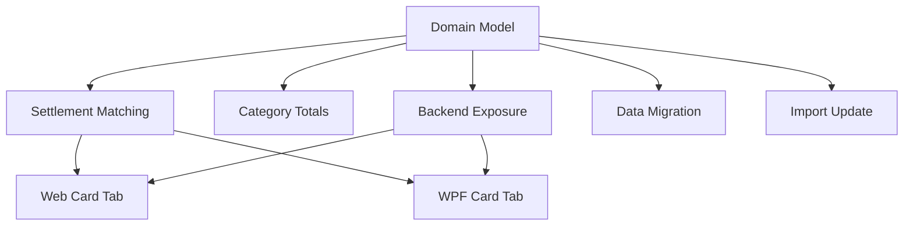

# Credit Card Expense Invoice-Period Date Model

## 1. Executive Summary

This feature reworks how the Financial CashFlow domain tracks dates and settlement state for credit card expenses. Today, a single `Date` field on `Expense` is overloaded to mean both "when the purchase happened" and "when the invoice was paid," while a separate `SettledAt` field independently tracks the payment date — creating ambiguity, redundant state, and incorrect monthly reporting.

The product is a personal, single-user financial tracking application (installed per-person, not multi-tenant). This change is for the account owner who charges expenses to credit cards and settles the resulting invoices against a bank account later, often in a different calendar month than the purchase due to billing-cycle cutoffs.

At a high level, the fix introduces a permanent `ChargeDate` field that always holds the original purchase day, lets `Date` become the authoritative "payment/position date" (equal to `ChargeDate` while unpaid, overwritten with the payment date once settled, reverted on unmark-paid), removes the now-redundant `SettledAt` field, and adds an explicit, user-editable `InvoiceDate` field that drives which invoice a charge settles against and how unpaid charges are grouped for reporting — since billing-cycle cutoffs shift and cannot be derived automatically from the charge date alone.

## 2. Problem and Opportunity

**The Problem**

- **Ambiguous date semantics.** `Expense.Date` currently means "charge date" for unpaid credit card expenses but never changes at settlement, so there is no field that reliably represents "when this was actually paid" without cross-referencing `SettledAt` and `PaymentStatus` together.
- **Wrong month for category totals.** Category totals group strictly by `Date`, so an unpaid credit card charge is counted in the month it was charged rather than the month/year its invoice is actually due — misrepresenting real cash flow for that month and for the eventual payment month.
- **Card tab reordering risk.** If `Date` were ever updated to reflect the payment date (the natural fix for the reporting problem above), every settled expense's position in the Card tab's charge-date-sorted list would shift, breaking the user's expectation that an expense stays where it was originally charged.
- **Redundant, driftable state.** `SettledAt` and the eventual "payment date" concept both exist to answer the same question ("when was this paid?"), risking the two values diverging over time with no single source of truth.
- **Billing cutoffs can't be inferred.** Which invoice month a charge belongs to depends on each card's billing cycle, which is not modeled anywhere today — statement matching assumes charge month always equals invoice month, which is not universally true near cutoff dates.

**The Opportunity**

- Introducing `ChargeDate` as a permanent, immutable record of the purchase day solves the reordering problem directly: the Card tab can sort/position by `ChargeDate`, independent of what `Date` is doing.
- Letting `Date` become the true payment-date-once-settled field (reverting to `ChargeDate` on unmark-paid) collapses two ambiguous fields (`Date` + `SettledAt`) into one unambiguous one, removing `SettledAt` entirely.
- An explicit, editable `InvoiceDate` field gives the user a way to correctly assign a charge to its actual invoice period regardless of billing-cycle cutoffs, and becomes the single grouping key for both settlement matching and unpaid-expense category totals.

## 3. Target Audience

### Primary Users

**Personal Finance Owner**
- Runs their own installed copy of the app to track personal bank accounts, credit cards, and investments.
- Regularly charges expenses to one or more credit cards and pays the resulting invoice later from a bank account, sometimes in a different month than the charge.
- Relies on monthly category totals and the Card tab to understand real spending and upcoming invoice obligations, and needs those numbers to reflect the correct month regardless of when a charge is eventually settled.

## 4. Objectives

- **Eliminate** category-total misassignment for unpaid credit card expenses. *Metric: 100% of unpaid credit card expenses are grouped by their assigned `InvoiceDate` month/year rather than charge month in category totals, verified by spot-checking every active card's unpaid charges after release.*
- **Preserve** the Card tab's visual ordering across settlement. *Metric: 0 position changes observed in the Card tab list when comparing order immediately before and after marking any invoice as paid, tested across all active cards.*
- **Simplify** the settlement state model. *Metric: `SettledAt` is fully removed from the `Expense` schema (1 fewer field per record) with 0 loss of settlement-date information, verified against the pre-migration backup.*
- **Migrate** all existing credit card expenses without data loss. *Metric: 100% of existing credit card expense records (paid and unpaid) in `data-cashflow.json` pass a post-migration reconciliation check against the pre-migration backup, with 0 discrepancies.*
- **Automate** date/invoice-period population on future spreadsheet imports. *Metric: 100% of credit card expense rows in the next spreadsheet import populate `ChargeDate` and a default `InvoiceDate` automatically, requiring 0 manual post-import edits for these fields.*

## 5. User Stories

### F01. Expense Payment-Date Domain Model Rework
- As the system, I want to record a credit card expense's original charge date in a field that is never overwritten so that its position in date-sorted views stays stable after settlement.
- As the system, I want `Date` to equal the charge date while an expense is unpaid and the payment date once it is settled, so that a single field always reflects "when this is/was due to affect the bank."
- As the system, I want unmarking an invoice as paid to revert an expense's `Date` back to its original charge date, so the pre-payment state is fully restored.

### F02. Invoice-Period Settlement Matching
- As a user, I want a credit card invoice to only settle the expenses assigned to that invoice's month/year, so that expenses near a billing cutoff aren't matched to the wrong invoice.
- As a user, I want unmarking an invoice as paid to revert every expense it had settled, including clearing its linked bank source, so I can correct a mistaken payment.
- As a user, I want the bank balance to change only at the moment an invoice is marked paid (never at charge time), exactly as it does today, so my balance always reflects real cash movement.

### F03. Invoice-Aware Category Totals
- As a user, I want unpaid credit card expenses to count toward category totals in their invoice month/year, not the month I made the purchase, so my monthly spending reports match what I'll actually owe that month.
- As a user, I want settled credit card expenses to count toward category totals in the month I actually paid the invoice, so historical reports reflect real cash flow.

### F04. Backend Exposure of Charge/Invoice Fields
- As the system, I want `ChargeDate` and `InvoiceDate` available through the same Expense data contract used by both the WPF and Web clients, so both apps can display and edit them consistently.

### F05. Web — Card Tab & Expense Form Support
- As a user, I want to see and edit an expense's invoice month/year when I assign it to a credit card in the Web expense form, so I can correct it if the default doesn't match the actual billing cycle.
- As a user, I want the Web Card tab to keep an expense in the same position (sorted by its original charge date) after I mark its invoice as paid, so the list doesn't reshuffle.

### F06. WPF — Card Tab & Expense Form Support
- As a user, I want to see and edit an expense's invoice month/year when I assign it to a credit card in the WPF expense form, so I can correct it if the default doesn't match the actual billing cycle.
- As a user, I want the WPF Card tab to keep an expense in the same position (sorted by its original charge date) after I mark its invoice as paid, so the list doesn't reshuffle.

### F07. Existing Data Migration
- As the system, I want a one-off migration tool that populates `ChargeDate` and `InvoiceDate` for every existing credit card expense in `data-cashflow.json`, so historical data conforms to the new model without manual editing.
- As the user, I want the migration to run against a local backup copy first, so I can verify correctness before applying it to my live local file and the Google Drive copy.

### F08. Spreadsheet Import Update
- As the user, I want the spreadsheet import tool to populate `ChargeDate` and a default `InvoiceDate` for every credit card expense row it imports, so future imports don't require a manual fix-up pass.

## 6. Functionalities

### F01. Expense Payment-Date Domain Model Rework

**Provides:**
- `ChargeDate` (immutable original purchase day), `InvoiceDate` (invoice-period assignment), and the updated `Settle()`/`Unsettle()` date-swap behavior on `Expense` (used by F02, F03, F04, F07, F08)

**Capabilities:**
- `ChargeDate`: `DateOnly?`, set once at creation for any expense with a non-null `CardTag`; always equal to `Date` at creation time; never modified afterward except by the F07 migration for pre-existing records. Null for non-credit-card expenses.
- `InvoiceDate`: `DateOnly?`, day component fixed at the 1st (only year/month are meaningful), set at creation for credit card expenses, defaulting to the 1st of `ChargeDate`'s month; null for non-credit-card expenses; remains user-editable after creation as long as the expense is unpaid, and becomes read-only once the expense is settled.
- `Expense.Settle(paymentSource, paymentDate)`: sets `PaymentSource = paymentSource` and `Date = paymentDate`; `ChargeDate` and `InvoiceDate` are left untouched.
- `Expense.Unsettle()`: clears `PaymentSource` and resets `Date = ChargeDate`.
- `SettledAt` field is removed from the entity and from the JSON schema entirely.

**Experience:**
- Not directly user-facing; this is a domain-layer change. Its effects are observable through F02 (settlement), F03 (reporting), and F05/F06 (Card tab, expense form).

### F02. Invoice-Period Settlement Matching

**Consumes:**
- F01: `ChargeDate`, `InvoiceDate` fields and `Settle()`/`Unsettle()` domain behavior

**Capabilities:**
- `CardStatementService.MarkStatementPaidAsync` matches candidate charges via `CardTag == statement.Card && InvoiceDate.Year == statement.Year && InvoiceDate.Month == statement.Month && PaymentStatus == CreditCardCharge` (replacing today's `Date.Year/Month` match), then calls `Settle(paymentSource, paymentDate)` on each.
- `CardStatementService.UnmarkStatementPaidAsync` matches settled charges via the same `InvoiceDate` year/month key with `PaymentStatus == CreditCardSettled`, then calls `Unsettle()` on each, and reverses the linked bank balance impact exactly as today's rollback logic does.
- Bank balance is affected only when `MarkStatementPaidAsync`/`UnmarkStatementPaidAsync` runs — no change to when or how the balance is computed relative to today's behavior.

**Experience:**
- Marking an invoice paid or unpaid behaves exactly as it does today from the user's perspective (same buttons, same confirmation flow in the existing Card tab); only the internal matching key and reverted field (`Date` via `ChargeDate` instead of `SettledAt`) change.

**Error Handling:**
- If settlement fails partway through (e.g., persistence error after some but not all charges are settled), all changes for that statement are rolled back and the statement remains marked unpaid — mirrors the existing cascade-rollback behavior.
- If no charges match a statement's `InvoiceDate` year/month at mark-paid time (e.g., every charge still has a stale invoice period from before this feature), the statement is marked paid with 0 linked charges and a warning is surfaced rather than silently succeeding as if charges existed.
- Unmarking an already-unpaid statement, or marking an already-paid statement paid again, is a no-op that returns the current state rather than double-applying balance changes.

### F03. Invoice-Aware Category Totals

**Consumes:**
- F01: `InvoiceDate`, `ChargeDate` fields

**Capabilities:**
- `AnnualSummaryService.BuildCategoryMonthlyTotals` and `GetHistoricCategoriesAverageFromYear` group an expense by `(InvoiceDate.Year, InvoiceDate.Month)` when `PaymentStatus == CreditCardCharge` (unpaid card charge), and by `(Date.Year, Date.Month)` for every other case (bank expenses, and settled card expenses — since `Date` already holds the payment date post-settlement).
- Category remains the original purchase category in both cases; no change to which category an expense counts against, only which month/year.

**Experience:**
- No visual/UI change — existing category total and annual summary views (Web and WPF) automatically reflect the corrected month/year grouping once this logic ships, since they read from the same summary services.

### F04. Backend Exposure of Charge/Invoice Fields

**Consumes:**
- F01: `ChargeDate`, `InvoiceDate` fields

**Provides:**
- `ChargeDate`, `InvoiceDate` exposed through the existing Expense read/create/update data contracts consumed by both clients (used by F05, F06)

**Capabilities:**
- Read paths (expense list/detail DTOs) include `ChargeDate` and `InvoiceDate`.
- Create/update paths accept `InvoiceDate` as an optional override (defaulting server-side to the 1st of the charge month if omitted, per F01); `ChargeDate` is never accepted as client input — it is always derived server-side at creation.
- The update path rejects an `InvoiceDate` change once the expense is already settled, since it is only editable while unpaid.

**Experience:**
- Not directly user-facing; this is the Application/Presentation-contract layer consumed by F05/F06.

### F05. Web — Card Tab & Expense Form Support

**Consumes:**
- F04: `ChargeDate`, `InvoiceDate` DTO fields
- F02: corrected invoice-period-based matching for which unpaid charges belong to which invoice grouping

**Capabilities:**
- The Web expense form shows an editable "Invoice month/year" picker (month + year only, no day) whenever a credit card is chosen as the payment method, pre-filled with the default (charge month/year); editable only while the expense is unpaid, shown read-only once settled.
- The Web Card tab's unpaid and paid/history lists sort and display using `ChargeDate` instead of `Date`.

**Experience:**
- Selecting a credit card in the expense form reveals the invoice month/year picker immediately (no page reload); changing it updates which invoice grouping the charge appears under in the Card tab on next view.
- After marking an invoice paid, the settled expense remains in its original list position (by `ChargeDate`) in the paid/history section rather than jumping based on the new payment date, and its invoice month/year field becomes read-only.

### F06. WPF — Card Tab & Expense Form Support

**Consumes:**
- F04: `ChargeDate`, `InvoiceDate` DTO fields
- F02: corrected invoice-period-based matching for which unpaid charges belong to which invoice grouping

**Capabilities:**
- The WPF expense entry/edit dialog shows an editable "Invoice month/year" picker (month + year only, no day) whenever a credit card is chosen as the payment method, pre-filled with the default (charge month/year); editable only while the expense is unpaid, shown read-only once settled.
- `CreditCardExpensesView` (WPF Card tab) sorts and displays using `ChargeDate` instead of `Date`, mirroring F05's Web behavior.

**Experience:**
- Matches F05's experience within the WPF client's existing dialogs and grid, keeping visual parity between Web and WPF per the project's established parity pattern (e.g. P21).

### F07. Existing Data Migration

**Consumes:**
- F01: `ChargeDate`, `InvoiceDate` field definitions and `Settle()`/`Unsettle()` semantics

**Capabilities:**
- A new idempotent migrator (`Migrations/ExpenseChargeDate/ExpenseChargeDateMigrator.cs`, following the existing `Migrations/<Name>/XyzMigrator.cs` pattern used by e.g. `ExpensePaymentStateMigrator`) runs as part of `CashFlowSpreadsheetImport`'s existing migration chain in `Program.cs`.
- For each credit card expense (`CardTag != null`) still unpaid (`PaymentStatus == CreditCardCharge`): sets `ChargeDate = Date` (no change to `Date`); sets `InvoiceDate` to the 1st of `Date`'s month/year if not already resolvable from a matching `CardStatement`.
- For each credit card expense already settled (`PaymentStatus == CreditCardSettled`): sets `ChargeDate = Date` (old original charge date), sets `Date = SettledAt` (old payment date), and sets `InvoiceDate` to the 1st of the matching `CardStatement`'s `Year`/`Month`.
- Runs through the existing `MigrationBackup.Create` step before any write, exactly as today's migrators do.
- Is idempotent: re-running against already-migrated data (expenses that already have `ChargeDate` populated) makes no further changes.

**Experience:**
- Invoked the same way as today's consolidated import/migration tool (`dotnet run --` in `CashFlowSpreadsheetImport`), producing a summary report of how many expenses were migrated in each state, matching the existing `XyzMigrationSummary.Render()` pattern.
- Per project convention, must be run and verified against a temporary local copy of `data-cashflow.json` first, never directly against the live local file or the Google Drive copy, before being applied for real (backup step still applies regardless as a safety net).

**Error Handling:**
- If an already-settled expense has no matching `CardStatement` for its `(Date.Year, Date.Month)` (a pre-existing data inconsistency), the migrator logs it as a skipped/flagged record rather than guessing an invoice period, so the user can review it manually.
- If the migration is interrupted mid-run, the pre-migration backup file remains intact and untouched (created before any writes) so the original data can be restored.
- The migration only ever touches credit card expenses (`CardTag != null`); bank expenses are never modified, verified by record count before/after.

### F08. Spreadsheet Import Update

**Consumes:**
- F01: `ChargeDate`, `InvoiceDate` field definitions

**Capabilities:**
- `MonthlyExpenseSheetImporter` sets `ChargeDate` equal to the imported row's date for every credit card expense it creates (mirroring `Expense.Create`'s default behavior from F01).
- `InvoiceDate` defaults to the 1st of the imported charge date's month/year for every imported credit card expense, consistent with the default rule used elsewhere in F01.

**Experience:**
- No change to the import tool's CLI usage (`dotnet run -- [workbookPath] [outputPath] [--mensais-only]`); the only difference is that newly created credit card expense records now come out fully populated with `ChargeDate`/`InvoiceDate` instead of needing a later fix-up.

**Error Handling:**
- If a row's card-tag resolution fails (already an existing failure mode in `MonthlyExpenseSheetImporter`), the row is skipped/flagged exactly as today — no new failure mode is introduced by adding the new fields, since they derive deterministically from the same date already being parsed.
- The importer's existing backup-before-write step (`MigrationBackup.Create`) covers this change with no additional migration needed for the import path itself.

## 7. Out of Scope

- **CreditCard enum → persisted entity migration.** Remains a hardcoded enum in this iteration; deferred to a future PRD (the user's original "Feature 1" context).
- **Card tab UI/layout changes.** The tab, its grouping-by-card-and-invoice structure, and mark-paid actions already shipped in PRD P24; this PRD only changes the date fields/sort key those views read, not their structure.
- **Automatic billing-cycle/due-date modeling.** No per-card configuration of billing cutoffs is introduced; `InvoiceDate` remains manually set (with a simple default), not derived from a stored cycle rule.
- **Editing InvoiceDate after settlement.** Once an expense is settled, its `InvoiceDate` becomes read-only; correcting it requires unmarking the invoice as paid first.
- **RoundUpAmount / RoundUpSuggestion behavior.** Unchanged by this PRD.
- **Retroactive spreadsheet re-import of historical data.** Historical data is corrected only via the one-off migration tool (F07); F08 only affects future import runs.
- **Multi-user/multi-currency considerations.** Out of scope — this remains a single-user, single-installation personal app per record.

## 8. Dependency Graph

### Part 1: Dependency Table

| # | Feature | Priority | Dependencies |
|---|---------|----------|--------------|
| F01 | Expense Payment-Date Domain Model Rework | 1 | None |
| F02 | Invoice-Period Settlement Matching | 1 | F01 |
| F03 | Invoice-Aware Category Totals | 1 | F01 |
| F04 | Backend Exposure of Charge/Invoice Fields | 1 | F01 |
| F05 | Web — Card Tab & Expense Form Support | 1 | F02, F04 |
| F06 | WPF — Card Tab & Expense Form Support | 1 | F02, F04 |
| F07 | Existing Data Migration | 1 | F01 |
| F08 | Spreadsheet Import Update | 2 | F01 |

### Execution Waves

Features within the same wave can be built in parallel. A wave starts only after every feature in earlier waves is complete.

- **Wave 1**: F01
- **Wave 2**: F02, F03, F04, F07, F08
- **Wave 3**: F05, F06

### Priority levels
- **1** = Essential — product does not work without it
- **2** = Important — significant value addition

## 9. Acceptance Criteria

### F01. Expense Payment-Date Domain Model Rework
- [x] A new credit card expense has `ChargeDate == Date` at creation, and both are non-null.
- [x] `InvoiceDate` defaults to the 1st of the charge date's month/year when not explicitly provided at creation.
- [x] Calling `Settle()` updates `Date` to the payment date and leaves `ChargeDate` and `InvoiceDate` unchanged.
- [x] Calling `Unsettle()` reverts `Date` to `ChargeDate` and clears `PaymentSource`.
- [x] `SettledAt` no longer exists on the `Expense` entity or in the serialized JSON schema.
- [x] Bank-only expenses (no `CardTag`) have `ChargeDate` and `InvoiceDate` both null and are unaffected by any of the above.

### F02. Invoice-Period Settlement Matching
- [x] Marking an invoice paid settles only charges whose `InvoiceDate` year/month match the statement's period, regardless of their `ChargeDate`.
- [x] A charge dated near a billing cutoff, with an `InvoiceDate` month different from its `ChargeDate`'s month, settles against the correct (invoice-period) statement, not the charge-month statement.
- [x] Unmarking a paid invoice reverts every charge it had settled, clearing `PaymentSource` and resetting `Date` to `ChargeDate` for each.
- [x] The bank balance changes only at mark-paid/unmark-paid time, matching today's behavior exactly (no regression).
- [x] A partial failure during settlement rolls back all changes for that statement; the statement remains unpaid.

### F03. Invoice-Aware Category Totals
- [x] An unpaid credit card expense counts toward category totals in its `InvoiceDate`'s year/month, not its `ChargeDate`'s month.
- [x] A settled credit card expense counts toward category totals in the month/year of its (post-settlement) `Date`.
- [x] A bank expense counts toward category totals in the month/year of its `Date`, unchanged from today.
- [x] No expense is counted in more than one month/year in the same category total run.

### F04. Backend Exposure of Charge/Invoice Fields
- [x] Reading any credit card expense through the API/data contract returns non-null `ChargeDate` and `InvoiceDate`.
- [x] Creating/updating a credit card expense accepts an optional `InvoiceDate` override; omitting it applies the charge-month default.
- [x] Attempting to set `ChargeDate` directly via the create/update contract has no effect — it remains server-derived.
- [x] Attempting to update `InvoiceDate` on an already-settled expense is rejected.

### F05. Web — Card Tab & Expense Form Support
- [x] Selecting a credit card in the Web expense form reveals an editable invoice month/year field, pre-filled with the default.
- [x] Changing the invoice month/year before saving persists the overridden value, while the expense is unpaid.
- [x] The invoice month/year field is read-only once the expense is settled.
- [x] The Web Card tab's unpaid and paid/history lists are sorted/positioned by `ChargeDate`.
- [x] An expense's position in the Card tab list is unchanged immediately before and after its invoice is marked paid.

### F06. WPF — Card Tab & Expense Form Support
- [ ] Selecting a credit card in the WPF expense dialog reveals an editable invoice month/year field, pre-filled with the default.
- [ ] Changing the invoice month/year before saving persists the overridden value, while the expense is unpaid.
- [ ] The invoice month/year field is read-only once the expense is settled.
- [ ] `CreditCardExpensesView`'s unpaid and paid/history lists are sorted/positioned by `ChargeDate`.
- [ ] An expense's position in the Card tab list is unchanged immediately before and after its invoice is marked paid.

### F07. Existing Data Migration
- [x] Running the migrator against a backup copy of `data-cashflow.json` populates `ChargeDate` for every credit card expense with no data loss (verified by diff against the pre-migration backup).
- [x] For a still-unpaid expense, `Date` is unchanged and `ChargeDate` equals the pre-migration `Date`.
- [x] For an already-settled expense, `Date` becomes the pre-migration `SettledAt` value and `ChargeDate` becomes the pre-migration `Date` value.
- [x] `InvoiceDate` is populated for every credit card expense, derived from the matching `CardStatement` where one exists.
- [x] Re-running the migrator on already-migrated data makes zero further changes (idempotency).
- [x] Bank-only expenses are untouched by the migration (record count and field values identical before/after).
- [x] A pre-migration backup file exists and is verified intact before the migration is applied to the live local file or the Google Drive copy.

### F08. Spreadsheet Import Update
- [x] Every newly imported credit card expense has `ChargeDate` equal to its imported row date.
- [x] Every newly imported credit card expense has `InvoiceDate` defaulted to the 1st of its charge date's month/year.
- [x] Existing import failure/skip behavior for unresolvable card tags is unchanged.
- [x] A pre-import backup is created before the import writes any changes, matching existing behavior.

### Cross-Feature Integration
- [x] `ChargeDate`/`InvoiceDate`/`Settle()`/`Unsettle()` from F01 are correctly used by F02's statement matching (charges settle by invoice period, not charge date).
- [x] F01's fields are correctly consumed by F03's category-total grouping (unpaid vs. paid expenses grouped by the correct field).
- [ ] F01's fields are correctly exposed end-to-end through F04's data contract and displayed/edited in F05 (Web) and F06 (WPF).
- [ ] F02's corrected invoice-period matching is reflected in what F05 and F06 display as "this invoice's charges" in the Card tab.
- [x] F01's field definitions are correctly applied by F07's migration to 100% of pre-existing credit card expenses.
- [x] F01's field definitions are correctly applied by F08 to every newly imported credit card expense going forward.
