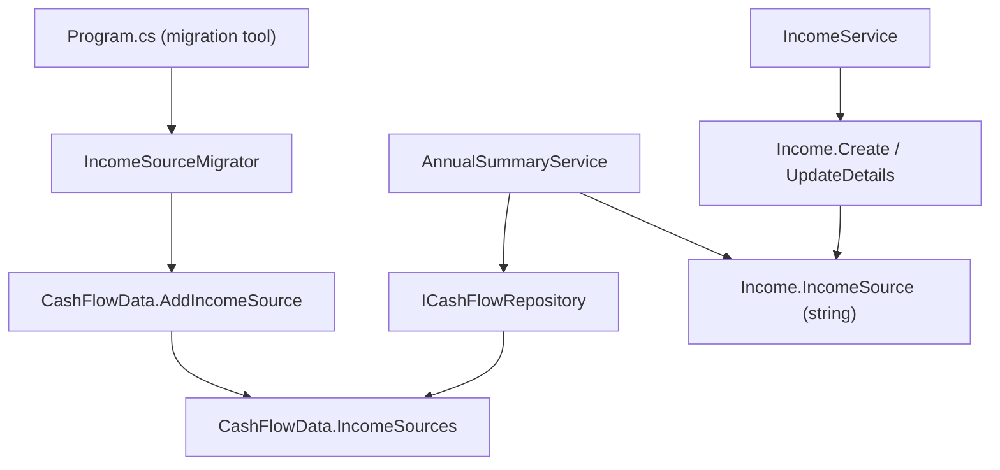

## 1. Technical Overview

**What:** Replace the compiled-in `IncomeSource` enum with a real `IncomeSource` domain entity (`Id`, `Name`, `IsActive`, `Group`), seeded idempotently by a new migrator, following the same "seeded reference entity" shape already established by `Bank` (P13-F01). `Income.IncomeSource` changes from the enum to a plain `string` (the resolved source name), matching how `Income.Bank` already works. `IncomeClassifier` and the old enum are deleted.

**Why:** The enum-to-group mapping currently lives only inside `IncomeClassifier.Classify`, disconnected from the source concept itself. Making `IncomeSource` a seeded entity that carries its own `Group` collapses two disconnected pieces of logic (a compiled enum + a compiled switch statement) into one stored record, mirroring the precedent already set by `Bank`/`PaymentSource`.

**Scope:**
- Included: `IncomeSource` domain entity; `CashFlowData` collection + `AddIncomeSource`; `ICashFlowRepository.GetIncomeSources()` + its single implementation; `CashFlowTypeInfoResolver` registration; `Income.IncomeSource` type change (enum → string) and removal of `Income.Group`; deletion of the old `Domain.Enums.IncomeSource` enum, `IncomeClassifier`, and `IncomeSourceParser`; the idempotent seed migrator (`IncomeSourceMigrator`) wired into `Integrations/CashFlowSpreadsheetImport/Program.cs`; the minimal changes to `IncomeService` and `AnnualSummaryService` required to keep the solution compiling and behaviorally correct after `Income.Group` is removed (see Decision 3).
- Excluded (belongs to later features per the PRD's wave split): source-name validation against the seeded list on create/update (F02 — `IncomeSourceNameResolver`); any further refactor/optimization of `AnnualSummaryService`'s lookup beyond what's needed to compile (F03 owns the formal characterization tests); the `GET /income-sources` endpoint (F04); web/WPF picklists (F05/F06).

## 2. Architecture Impact

**Affected components:**
- `Financial.CashFlow.Domain/Entities/IncomeSource.cs` (new)
- `Financial.CashFlow.Domain/Entities/Income.cs` (modified)
- `Financial.CashFlow.Domain/Entities/CashFlowData.cs` (modified)
- `Financial.CashFlow.Domain/Enums/IncomeSource.cs` (deleted)
- `Financial.CashFlow.Domain/Rules/IncomeClassifier.cs` (deleted)
- `Financial.CashFlow.Application/Interfaces/ICashFlowRepository.cs` (modified)
- `Financial.CashFlow.Infrastructure/Repositories/CashFlowJsonRepository.cs` (modified)
- `Financial.CashFlow.Infrastructure/Persistence/CashFlowTypeInfoResolver.cs` (modified)
- `Financial.CashFlow.Application/Validation/IncomeSourceParser.cs` (deleted)
- `Financial.CashFlow.Application/Services/IncomeService.cs` (modified)
- `Financial.CashFlow.Application/Services/AnnualSummaryService.cs` (modified)
- `Integrations/CashFlowSpreadsheetImport/Migrations/IncomeSources/IncomeSourceMigrator.cs` (new)
- `Integrations/CashFlowSpreadsheetImport/Migrations/IncomeSources/IncomeSourceMigrationSummary.cs` (new)
- `Integrations/CashFlowSpreadsheetImport/Program.cs` (modified)

## 3. Technical Decisions

| Decision | Chosen Approach | Alternative Considered | Trade-off |
|----------|-----------------|-------------------------|-----------|
| Entity/enum naming collision | Delete `Domain.Enums.IncomeSource` outright; the new entity takes the clean name `Domain.Entities.IncomeSource`, same pattern as `PaymentSource` → `Bank` | Keep the enum under a different name (e.g. `LegacyIncomeSource`) for reference | Clean single source of truth per the PRD; no code needs the old enum once `IncomeSourceParser`/`IncomeClassifier` are removed |
| Surrogate `Id` on `IncomeSource` (unlike `Bank`, which has none) | Include `Guid Id`, assigned in `Create`, exactly as PRD §6 specifies; `Name` remains the resolution key everywhere (never used as an FK) | Follow `Bank`'s no-Id precedent for consistency | PRD explicitly calls for `Id` on this entity (unlike `Bank`); accepted as a deliberate PRD-level divergence, documented rather than silently "fixed" to match `Bank` |
| `AnnualSummaryService` after `Income.Group` removal | F01 already swaps every `income.Group` read for a lookup built once per call from `_repository.GetIncomeSources()` (`Dictionary<string, IncomeGroup>`, `StringComparer.OrdinalIgnoreCase`, unresolved name defaults to `IncomeGroup.NonReportable`) — this is the same change PRD §6 assigns to F03 | Leave `AnnualSummaryService` uncompiled/broken until F03 lands | F01's branch must build and pass tests on its own (project workflow requires each feature PR to be green before merge); F03 becomes primarily about locking in byte-identical characterization tests over the lookup this feature introduces, not introducing the lookup itself. This is called out so F03's own spec accounts for reduced remaining scope. |
| `Income.IncomeSource` validation depth in this feature | `Income.Create`/`UpdateDetails` accept a raw non-empty string; `IncomeService.ValidateFields` keeps only a not-null/not-blank guard, dropping the enum parse but NOT adding a seeded-list resolution check | Add full `IncomeSourceNameResolver`-based validation now | Matches the PRD's explicit wave split — F02 (dependent on F01) owns "reject on unresolved source name"; introducing that check early would duplicate F02's acceptance criteria in the wrong feature |
| Migration tool folder placement | `Integrations/CashFlowSpreadsheetImport/Migrations/IncomeSources/`, mirroring `Migrations/Banks/`'s actual current location | A standalone `Integrations/CashFlowIncomeSourceMigration` console project (as P13-F01's original spec proposed for `Bank`, before drift) | Follows the pattern the codebase actually converged on (all migrators folded into one tool), avoids repeating P13-F01's abandoned standalone-project approach |

## 4. Component Overview

**Backend:**

| File Path | New/Modified | Purpose | Key Responsibilities |
|-----------|--------------|---------|----------------------|
| `Financial.CashFlow.Domain/Entities/IncomeSource.cs` | New | Seeded reference entity | Immutable `Id`/`Name`/`IsActive`/`Group`; private ctor + static `Create` factory; no public mutators |
| `Financial.CashFlow.Domain/Entities/Income.cs` | Modified | Income record | `IncomeSource` becomes `string`; `Group` property (and its `IncomeClassifier` call) removed; `Create`/`UpdateDetails` signatures updated |
| `Financial.CashFlow.Domain/Entities/CashFlowData.cs` | Modified | Aggregate root | Adds `_incomeSources`/`IncomeSources` (read-only collection) + `AddIncomeSource`, no `RemoveIncomeSource`, mirroring `Banks`/`AddBank` |
| `Financial.CashFlow.Domain/Enums/IncomeSource.cs` | Deleted | — | Enum superseded by the entity |
| `Financial.CashFlow.Domain/Rules/IncomeClassifier.cs` | Deleted | — | Classification logic now lives as stored `IncomeSource.Group` |
| `Financial.CashFlow.Application/Interfaces/ICashFlowRepository.cs` | Modified | Repository contract | Adds `GetIncomeSources(): IEnumerable<IncomeSource>`, read-only, no add/delete — mirrors `GetBanks()` |
| `Financial.CashFlow.Infrastructure/Repositories/CashFlowJsonRepository.cs` | Modified | Sole repository implementation | `GetIncomeSources() => _data.IncomeSources;` |
| `Financial.CashFlow.Infrastructure/Persistence/CashFlowTypeInfoResolver.cs` | Modified | JSON (de)serialization | Adds `typeof(IncomeSource)` (entity) to `ManagedTypes` so its private setters serialize, matching `Bank`'s registration |
| `Financial.CashFlow.Application/Validation/IncomeSourceParser.cs` | Deleted | — | Enum-parsing validator no longer applicable |
| `Financial.CashFlow.Application/Services/IncomeService.cs` | Modified | Income CRUD orchestration | `ValidateFields` drops the `IncomeSourceParser.TryParse` call; keeps only a not-null/not-blank check on the raw source string; `AddIncomeAsync`/`UpdateIncomeAsync`/`ToDto` updated for the `string` type |
| `Financial.CashFlow.Application/Services/AnnualSummaryService.cs` | Modified | Annual Summary computation | Builds a `name → IncomeGroup` dictionary once per call from `GetIncomeSources()`; replaces every `income.Group` read (in `BuildIncomeSeries` and `GetAnnualAverageIncomeByGroupIncome`) with a dictionary lookup, defaulting to `IncomeGroup.NonReportable` when unresolved |
| `Integrations/CashFlowSpreadsheetImport/Migrations/IncomeSources/IncomeSourceMigrator.cs` | New | Idempotent seeding | Seeds the 4 records (`Gleison`/Salary, `Ariana`/Salary, `Lottery`/NonReportable, `DividendoJuros`/DividendoJuros, all `IsActive=true`); skips a name that already exists (case-insensitive); audits existing `Income.IncomeSource` values that don't match any seeded name (read-only, logged, never fails the run) |
| `Integrations/CashFlowSpreadsheetImport/Migrations/IncomeSources/IncomeSourceMigrationSummary.cs` | New | Console report | Counters (seeded / already-present) + list of unresolved `Income.IncomeSource` values; `Render()` returns the printable summary, matching `BankMigrationSummary`'s shape |
| `Integrations/CashFlowSpreadsheetImport/Program.cs` | Modified | Migration sequencing | Calls `IncomeSourceMigrator.Migrate(data)` in the existing unconditional migration block, after `MigrationBackup.Create(...)` and before `repository.SaveChangesAsync()`; prints `Render()`; adds `IncomeSources` to `CarryOverDataTheSpreadsheetDoesNotOwn` (spreadsheet doesn't own this data, same as `Banks`) |

No API, frontend, or database-migration-file changes in this feature (JSON is schema-less; the "migration" is the `IncomeSourceMigrator` console step described above).

## 5. API Contracts

None — this feature has no HTTP surface. `GET /income-sources` is F04's responsibility.

## 6. Data Model

No relational schema. `data-cashflow.json` gains an `IncomeSources` array (written by `CashFlowJsonRepository` via `CashFlowTypeInfoResolver`), each element shaped as:

| Field | Type | Notes |
|-------|------|-------|
| `Id` | `Guid` | Assigned on creation, never used as a foreign key |
| `Name` | `string` | Non-empty; resolution key for `Income.IncomeSource` |
| `IsActive` | `bool` | `true` for all four seeded records |
| `Group` | `string` (enum name) | One of `Salary` \| `DividendoJuros` \| `NonReportable` |

Existing `Income` records are unaffected — `IncomeSource` already serializes as the string values (`"Gleison"`, `"Ariana"`, `"Lottery"`, `"DividendoJuros"`) that the enum produced, so no rewrite of historical records is required (per PRD §6).

## 7. Testing Strategy

| Test File | Test Type | Target | Coverage Goal |
|-----------|-----------|--------|----------------|
| `Tests/Financial.CashFlow.Domain.Tests/Entities/IncomeSourceTests.cs` | Unit | `IncomeSource.Create` | Valid creation sets all fields; blank/null `Name` throws |
| `Tests/Financial.CashFlow.Domain.Tests/Entities/IncomeTests.cs` | Unit (modified) | `Income.Create`/`UpdateDetails` | Accepts a plain string source; `Group` property no longer exists (compile-level removal, not a runtime test) |
| `Tests/Financial.CashFlow.Domain.Tests/Entities/CashFlowDataTests.cs` | Unit (modified if exists, else new assertions added) | `AddIncomeSource`/`IncomeSources` | Added record appears in the read-only collection; no `RemoveIncomeSource` exists |
| `Tests/Financial.CashFlow.Application.Tests/Services/IncomeServiceTests.cs` | Unit (modified) | `IncomeService.AddIncomeAsync`/`UpdateIncomeAsync` | Any non-blank source string is accepted (no seeded-list rejection yet — that's F02); blank/null source still throws |
| `Tests/Financial.CashFlow.Application.Tests/Services/AnnualSummaryServiceTests.cs` | Unit (modified) | Group-lookup replacement | Fixed set of `Income` + seeded `IncomeSource` fixtures produce the same Salary/DividendoJuros/NonReportable figures as before the change (mirrors PRD F03 AC #1); an income whose source has no matching `IncomeSource` record defaults to `NonReportable` without throwing |
| `Tests/Financial.CashFlowSpreadsheetImport.Tests/Migrations/IncomeSources/IncomeSourceMigratorTests.cs` | Unit | `IncomeSourceMigrator.Migrate` | Seeds exactly 4 records with correct groups on an empty `IncomeSources` collection; re-running is a no-op (same count, same IDs); an `Income.IncomeSource` value with no matching seeded name is reported in the summary without failing the run (PRD F01 AC) |

Deleted test files (superseded by the entity/migration tests above): `Tests/Financial.CashFlow.Domain.Tests/Rules/IncomeClassifierTests.cs`, and any dedicated `IncomeSourceParserTests.cs` if present.

## Assumptions / Decisions (Auto-Accept — no interactive user available)

This spec was generated inside an autonomous multi-feature loop with no user available to interview. Every open decision below was resolved with the documented default (mirroring the skill's Batch Mode Auto-Accept Policy) rather than paused on:

- **Complexity level:** `medium` (multiple layers touched — Domain, Application, Infrastructure, migration tool; no new endpoints in this feature).
- **`IncomeSource.Create` signature:** `Create(string name, IncomeGroup group, bool isActive = true)` — `isActive` defaults to `true` since every current seed and the PRD's "no admin toggle in this PRD" note (§7 Out of Scope) mean it is always `true` in practice today.
- **Unresolved-name default in `AnnualSummaryService`'s lookup:** `IncomeGroup.NonReportable`, since that's the enum's existing "doesn't count toward Salary/DividendoJuros" fallback and keeps the summary from throwing on a data-quality gap the migrator already audits separately.
- **`IncomeService.ValidateFields` return type:** changes from `(IncomeSource IncomeSource, Bank Bank)` to `(string IncomeSource, Bank Bank)` — a mechanical consequence of the type change, not a new design choice.
