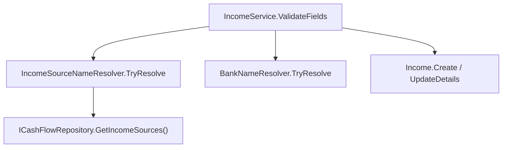

## 1. Technical Overview

**What:** Add a seeded-list resolution check for `Income.IncomeSource` on create and update, rejecting any source name that doesn't match a seeded `IncomeSource` record. Mirrors the existing `Bank`-name validation on `Income` exactly.

**Why:** F01 changed `Income.IncomeSource` from an enum (which rejected unrecognized values implicitly, by construction) to a plain string with no validation, deferring the "must be a seeded name" check to this feature per the PRD's wave split. Without this feature, arbitrary strings are currently accepted as income sources.

**Scope:**
- Included: `IncomeSourceNameResolver` (new, mirrors `BankNameResolver`); wiring it into `IncomeService.ValidateFields` for both `AddIncomeAsync` and `UpdateIncomeAsync`; a validation error naming the invalid source, matching the wording style of the existing Bank-name error.
- Excluded: any change to `IsActive` filtering (validation checks name existence only, not active status — active-only filtering belongs to F05/F06's picklists); no change to `IncomeSourceMigrator` or the entity itself (F01's scope).

## 2. Architecture Impact

**Affected components:**
- `Financial.CashFlow.Application/Validation/IncomeSourceNameResolver.cs` (new)
- `Financial.CashFlow.Application/Services/IncomeService.cs` (modified)

## 3. Technical Decisions

| Decision | Chosen Approach | Alternative Considered | Trade-off |
|----------|-----------------|-------------------------|-----------|
| Resolver shape | Exact mirror of `BankNameResolver`: `TryResolve(string? name, IEnumerable<IncomeSource> sources, out IncomeSource? source)`, case-insensitive `Name` match | A shared generic resolver for both `Bank` and `IncomeSource` | Matches the PRD's explicit instruction ("mirroring `BankNameResolver`") and the codebase's existing per-entity resolver pattern (`BankNameResolver`, and formerly `IncomeSourceParser`); a generic resolver would be premature abstraction over two call sites |
| Error message wording | `$"Income source '{incomeSource}' is not recognized."` | A different phrasing | Matches the existing `$"Bank '{bank}' is not recognized."` pattern in `IncomeService.ValidateFields`, per PRD Experience ("matching the wording style of the existing Bank-name validation error") |
| Where the check runs | Inside `IncomeService.ValidateFields`, replacing the current blank-check-only logic, same call site as the `Bank` check | A separate validator class invoked from the controller | `Bank` validation already lives at this exact call site; keeping both checks together preserves the existing method's single responsibility (resolve-or-reject both foreign-ish string references before construction) |

## 4. Component Overview

**Backend:**

| File Path | New/Modified | Purpose | Key Responsibilities |
|-----------|--------------|---------|----------------------|
| `Financial.CashFlow.Application/Validation/IncomeSourceNameResolver.cs` | New | Seeded-list name resolution | Case-insensitive `TryResolve` against the live `IncomeSource` list, mirroring `BankNameResolver` |
| `Financial.CashFlow.Application/Services/IncomeService.cs` | Modified | Income CRUD orchestration | `ValidateFields` resolves the source name via `IncomeSourceNameResolver` (in addition to the existing `BankNameResolver` check) instead of only checking for blank; unresolved name throws `ArgumentException` naming the invalid source before `Income.Create`/`UpdateDetails` runs |

## 5. API Contracts

No new endpoint. `POST /incomes` and `PUT /incomes/{id}` (existing routes) now return a 400-level validation error when `IncomeSource` doesn't resolve, same response shape as the existing unresolved-`Bank` error on the same endpoints.

## 6. Data Model

No schema change — this is a validation-only feature.

## 7. Testing Strategy

| Test File | Test Type | Target | Coverage Goal |
|-----------|-----------|--------|----------------|
| `Tests/Financial.CashFlow.Application.Tests/Validation/IncomeSourceNameResolverTests.cs` | Unit | `IncomeSourceNameResolver.TryResolve` | Exact-case match resolves; different-casing match resolves; unknown name fails; null/blank name fails; a resolved match with `IsActive = false` still resolves (name existence only) |
| `Tests/Financial.CashFlow.Application.Tests/Services/IncomeServiceTests.cs` | Unit (modified) | `IncomeService.AddIncomeAsync`/`UpdateIncomeAsync` | A seeded source name (case-insensitive) succeeds; an unrecognized source name is rejected with a message naming it (replaces the F01-era "accepted as-is" test); an update to an unresolvable source name is rejected the same way; a source name resolving to an `IsActive = false` record still succeeds |

## Assumptions / Decisions (Auto-Accept — no interactive user available)

Generated inside the same autonomous multi-feature loop as F01, with no user available to interview:

- **Complexity level:** `simple` (one new small validator file + one call-site change, no new endpoints, no schema change).
- **`IncomeSourceNameResolver` overload for the collection parameter:** `IEnumerable<IncomeSource>`, matching `BankNameResolver`'s existing signature exactly rather than the PRD text's `IReadOnlyCollection<IncomeSource>` — `ICashFlowRepository.GetIncomeSources()` (from F01) already returns `IEnumerable<IncomeSource>`, so this avoids a needless `.ToList()` at every call site, and is a cosmetic signature difference from the PRD, not a behavior difference.
