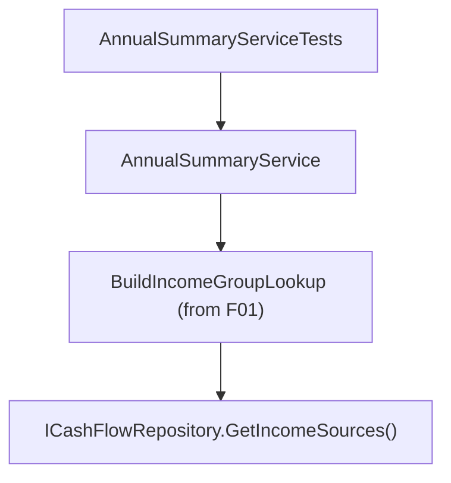

## 1. Technical Overview

**What:** Lock in dedicated characterization test coverage proving `AnnualSummaryService`'s income-group resolution (Salary/DividendoJuros/NonReportable) is byte-identical to the pre-refactor `IncomeClassifier`-based computation, and that an income whose source name has no matching seeded `IncomeSource` degrades gracefully to `NonReportable` instead of throwing.

**Why:** F01 (a prerequisite feature, already merged) had to remove `Income.Group` to keep the solution compiling, and pulled forward the exact group-lookup replacement this feature's PRD entry describes — see F01's spec §3 "Technical Decisions" for the explicit call-out. `AnnualSummaryService.BuildIncomeSeries` and `GetAnnualAverageIncomeByGroupIncome` already resolve group through a `name -> IncomeGroup` dictionary built once per call from `ICashFlowRepository.GetIncomeSources()`, exactly as this feature's Capabilities describe. This feature's remaining, genuinely new scope is closing a test gap: no existing test exercises an income source name that matches *no* seeded `IncomeSource` record (as opposed to one that resolves to the `NonReportable` group, e.g. `Lottery`, which is already covered by pre-existing tests that passed unmodified through F01/F02).

**Scope:**
- Included: two new characterization tests in `AnnualSummaryServiceTests` — one confirming an unresolved (no matching seeded name) income source defaults to `NonReportable` in the Income Summary table's monthly series, one confirming the same for the Historical Averages computation. No production code changes: the implementation these tests characterize already shipped in F01.
- Excluded: any change to `AnnualSummaryService`, `IncomeGroupValueDTO`, `IncomeAnnualSummaryDTO`, or `IncomeAnnualAverageDTO` (none needed — DTOs are already unchanged in shape per F01).

## 2. Architecture Impact

**Affected components:**
- `Tests/Financial.CashFlow.Application.Tests/Services/AnnualSummaryServiceTests.cs` (modified — tests only)

No production code is touched by this feature; `Financial.CashFlow.Application/Services/AnnualSummaryService.cs` already contains the group-lookup implementation (shipped in F01).

## 3. Technical Decisions

| Decision | Chosen Approach | Alternative Considered | Trade-off |
|----------|-----------------|-------------------------|-----------|
| Where the group-lookup logic lives | Already implemented in `AnnualSummaryService` as part of F01 (see F01 spec §3); this feature adds test coverage only, no production change | Re-implement/refactor the lookup as part of this feature | Re-implementing already-shipped, already-tested logic would be pure churn; the PRD's wave split (F03 depends only on F01) is satisfied either way since F01 already delivered the described capability |
| Test scope for "byte-identical" AC | Rely on the existing 303-test `AnnualSummaryServiceTests` suite (unmodified since before F01, still green) as the byte-identical regression proof, and add 2 new tests only for the previously-uncovered unresolved-name edge case | Rewrite the entire income-summary test suite from scratch as new "characterization" tests | The existing suite already pins every Salary/SalaryAfterTaxes/TaxDifference/DividendoJuros/NonReportable figure against fixed income fixtures; duplicating it would be redundant per this project's no-over-engineering guidance |

## 4. Component Overview

**Backend:**

| File Path | New/Modified | Purpose | Key Responsibilities |
|-----------|--------------|---------|----------------------|
| `Tests/Financial.CashFlow.Application.Tests/Services/AnnualSummaryServiceTests.cs` | Modified | Characterization tests | Adds coverage for an income whose source resolves to no seeded `IncomeSource`, in both the Income Summary table path and the Historical Averages path |

## 5. API Contracts

None — no HTTP surface change.

## 6. Data Model

None — no schema change.

## 7. Testing Strategy

| Test File | Test Type | Target | Coverage Goal |
|-----------|-----------|--------|----------------|
| `Tests/Financial.CashFlow.Application.Tests/Services/AnnualSummaryServiceTests.cs` | Unit (new tests added) | `GetIncomeSummaryForYear` | An income whose source name matches no seeded `IncomeSource` contributes 0 to Salary and DividendoJuros monthly totals and does not throw |
| `Tests/Financial.CashFlow.Application.Tests/Services/AnnualSummaryServiceTests.cs` | Unit (new tests added) | `GetHistoricSummaryAverageFromYear` | Same unresolved-source income is excluded from the Salary/DividendoJuros historical averages without throwing |
| `Tests/Financial.CashFlow.Application.Tests/Services/AnnualSummaryServiceTests.cs` | Unit (existing, re-verified) | Full pre-existing suite | Byte-identical Salary/SalaryAfterTaxes/TaxDifference/DividendoJuros figures for seeded-source incomes (PRD F03 AC #1/#2), unchanged since before F01 |

## Assumptions / Decisions (Auto-Accept — no interactive user available)

Generated inside the same autonomous multi-feature loop as F01/F02, with no user available to interview:

- **Complexity level:** `trivial` (test-only change, no new files, no production code).
- **"Fixed set of test income records" (PRD AC #1) interpretation:** satisfied by the pre-existing `AnnualSummaryServiceTests` fixtures already in the suite (unchanged since before F01), rather than a newly-authored fixed dataset — those fixtures are the project's existing byte-identical regression baseline.
