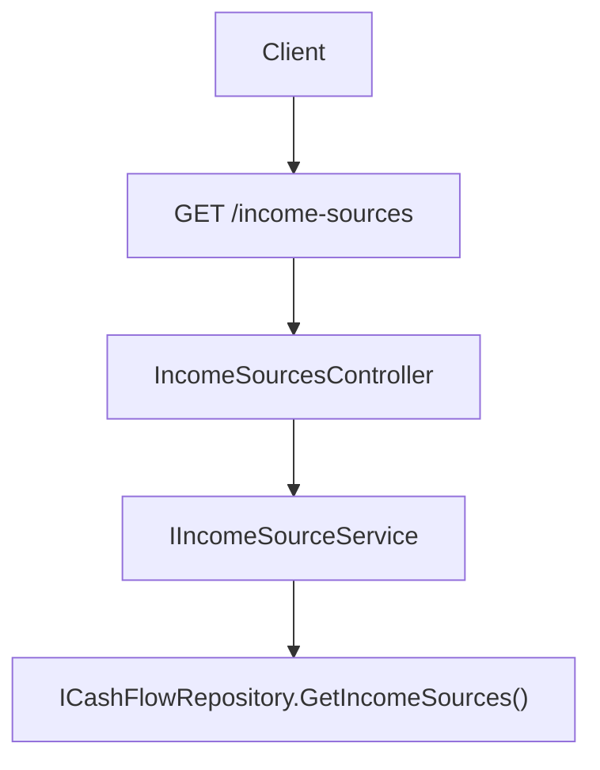

## 1. Technical Overview

**What:** Expose the seeded `IncomeSource` list through a new read-only `GET /income-sources` endpoint, mirroring `GET /banks` exactly (no parameters, no filtering, no pagination).

**Why:** F01 seeded the `IncomeSource` entity and `ICashFlowRepository.GetIncomeSources()`, but nothing outside the backend can read it yet. F05 (web) and F06 (WPF) both need a single source of truth for the picklist instead of a hardcoded array, and this endpoint is that contract.

**Scope:**
- Included: `IncomeSourceDTO` (Application layer); `IIncomeSourceService`/`IncomeSourceService`; `GET /income-sources` on a new `IncomeSourcesController`; DI registration.
- Excluded: `POST`/`PUT`/`DELETE` (no CRUD — seeded-only, per PRD §7 Out of Scope); any client-side consumption (F05/F06).

## 2. Architecture Impact

**Affected components:**
- `Financial.CashFlow.Application/DTOs/IncomeSourceDTO.cs` (new)
- `Financial.CashFlow.Application/Interfaces/IIncomeSourceService.cs` (new)
- `Financial.CashFlow.Application/Services/IncomeSourceService.cs` (new)
- `Financial.CashFlow.Application/DependencyInjection/CashFlowApplicationServiceCollectionExtensions.cs` (modified)
- `Financial.Api/Controllers/IncomeSourcesController.cs` (new)



## 3. Technical Decisions

| Decision | Chosen Approach | Alternative Considered | Trade-off |
|----------|-----------------|-------------------------|-----------|
| `IncomeSourceDTO.Group` type | `string` (mapped via `source.Group.ToString()`) | The raw `IncomeGroup` enum | Matches every other public-facing DTO's enum-as-string convention in this codebase (`ExpenseDTO.Category`, `IncomeDTO.IncomeSource`) and the PRD's explicit "serialized as its string name" instruction |
| New controller vs. extending an existing one | New `IncomeSourcesController` with route `income-sources` | Add a method to `BanksController` (both are seeded reference-data lists) | `IncomeSource` and `Bank` are unrelated domain concepts; a shared controller would conflate two resources under one route prefix, and the PRD explicitly names a new controller as the default option |
| Service registration lifetime | `AddSingleton<IIncomeSourceService, IncomeSourceService>()` | Scoped/Transient | Matches every other CashFlow application service's registration in `CashFlowApplicationServiceCollectionExtensions` (all singletons, since the in-memory `CashFlowData` is itself a singleton-scoped aggregate) |

## 4. Component Overview

**Backend:**

| File Path | New/Modified | Purpose | Key Responsibilities |
|-----------|--------------|---------|----------------------|
| `Financial.CashFlow.Application/DTOs/IncomeSourceDTO.cs` | New | Read model | `Id` (`Guid`), `Name` (`string`), `IsActive` (`bool`), `Group` (`string`) |
| `Financial.CashFlow.Application/Interfaces/IIncomeSourceService.cs` | New | Service contract | `GetIncomeSources(): IReadOnlyList<IncomeSourceDTO>` |
| `Financial.CashFlow.Application/Services/IncomeSourceService.cs` | New | Read-only query service | Maps every `ICashFlowRepository.GetIncomeSources()` record to `IncomeSourceDTO`, unfiltered |
| `Financial.CashFlow.Application/DependencyInjection/CashFlowApplicationServiceCollectionExtensions.cs` | Modified | DI wiring | Registers `IIncomeSourceService` → `IncomeSourceService` as a singleton, alongside `IBankService` |
| `Financial.Api/Controllers/IncomeSourcesController.cs` | New | HTTP surface | `[Route("income-sources")]`; single `[HttpGet]` action returning `IReadOnlyList<IncomeSourceDTO>`; no other verbs |

## 5. API Contracts

**Endpoint: List Income Sources**
- **Method:** GET
- **Path:** `/api/v1/financial/income-sources`
- **Authentication:** None (matches every other endpoint in this single-user personal app)

**Request:** No parameters.

**Response (200 OK):**

| Field | Type | Description |
|-------|------|--------------|
| `id` | `uuid` | Income source identifier |
| `name` | `string` | Income source name (resolution key used by `Income.IncomeSource`) |
| `isActive` | `bool` | Whether the source should appear in an entry-form picklist |
| `group` | `string` | `"Salary"` \| `"DividendoJuros"` \| `"NonReportable"` |

**Response Example:**
```json
[
  { "id": "3f9a1b2c-...", "name": "Gleison", "isActive": true, "group": "Salary" },
  { "id": "7c2d4e5f-...", "name": "Ariana", "isActive": true, "group": "Salary" },
  { "id": "1a2b3c4d-...", "name": "Lottery", "isActive": true, "group": "NonReportable" },
  { "id": "9e8f7a6b-...", "name": "DividendoJuros", "isActive": true, "group": "DividendoJuros" }
]
```

**Error Codes:** None beyond the framework default (this endpoint has no failure path — it always returns the full list, empty or not, with 200 OK).

## 6. Data Model

No schema change — reads the `IncomeSources` collection already added to `CashFlowData` in F01.

## 7. Testing Strategy

| Test File | Test Type | Target | Coverage Goal |
|-----------|-----------|--------|----------------|
| `Tests/Financial.CashFlow.Application.Tests/Services/IncomeSourceServiceTests.cs` | Unit | `IncomeSourceService.GetIncomeSources` | Maps every seeded record's `Id`/`Name`/`IsActive`/`Group` correctly; returns an empty list when none are seeded; does not filter by `IsActive` |
| `Tests/Financial.Api.Tests/IncomeSourcesEndpointsTests.cs` | Integration | `GET /income-sources` | Returns all four seeded records (via `ApiTestFactory`'s fixture data) with `id`/`name`/`isActive`/`group` populated (PRD F04 AC #1); returns the full unfiltered list regardless of `isActive` (PRD F04 AC #2); no `POST`/`PUT`/`DELETE` route exists — asserted via 404/405 on those verbs (PRD F04 AC #3) |

## Assumptions / Decisions (Auto-Accept — no interactive user available)

Generated inside the same autonomous multi-feature loop as F01-F03, with no user available to interview:

- **Complexity level:** `simple` (1 new endpoint, 1-2 new small files, no DB/schema change).
- **Route path casing:** `income-sources` (kebab-case), matching this API's existing multi-word route convention is otherwise single-word (`banks`, `incomes`, `expenses`) — kebab-case is the standard ASP.NET Core convention for multi-word route segments and was applied here since no existing multi-word route exists to follow instead.
- **"No POST/PUT/DELETE route exists" (PRD AC #3) verification approach:** asserted by requesting those verbs against `/income-sources` and confirming the framework's default rejection (405 Method Not Allowed, or 404 if routing doesn't recognize the verb at all for this controller) rather than a 200/201/204 success — either rejection status proves no such route is wired up.
