## 1. Technical Overview

**What:** Replace `IncomeForm.tsx`'s hardcoded `INCOME_SOURCES` array with the live list from `GET /income-sources` (F04), filtered to `isActive === true` and ordered the same way the hardcoded array was.

**Why:** The web income entry form currently compiles the four source names in; any future source addition/rename/retirement requires a code change and redeploy. F04 already exposes the seeded list — this feature makes the web client read from it instead of a static array, matching how the Bank picklist already reads from a fetched `banks` prop.

**Scope:**
- Included: `IncomeSourceDto` type; `financialApiClient.getIncomeSources()`; fetching the list in `useMonthly.ts` alongside the other Monthly-page data; threading it into `IncomeForm.tsx` as a prop; filtering to active + ordering inside `IncomeForm.tsx`; defaulting the "new income" form's selected source to the first active source once fetched (mirroring how `createPaymentSource`/`createIncomeBank` already default to `banks[0]?.name`).
- Excluded: any change to `INCOME_SOURCES_WITH_GROSS_VALUE` (a separate, still-hardcoded `['Gleison', 'Ariana']` array controlling the Gross Value field's visibility — unrelated to the picklist and out of this feature's scope per the PRD).

## 2. Architecture Impact

**Affected components:**
- `Financial.Web/src/api/types.ts` (modified)
- `Financial.Web/src/api/financialApiClient.ts` (modified)
- `Financial.Web/src/hooks/useMonthly.ts` (modified)
- `Financial.Web/src/components/IncomeForm.tsx` (modified)

```mermaid
graph TD
  A[useMonthly] --> B["financialApiClient.getIncomeSources()"]
  A --> C["MonthlyPage (incomeSources prop)"]
  C --> D[IncomeForm]
  D --> E["selectActiveIncomeSources() (filter + order)"]
  E --> F["<select> options"]
```

## 3. Technical Decisions

| Decision | Chosen Approach | Alternative Considered | Trade-off |
|----------|-----------------|-------------------------|-----------|
| Where the fetch lives | Inside `useMonthly.ts`, added to the existing `Promise.all([...])` fetch alongside `getBanks()`, exposed as `incomeSources: IncomeSourceDto[]` on `MonthlyData` and passed into `IncomeForm` as a new prop | A dedicated `useIncomeSources` hook (mirroring `useBankOperations.ts`) | `IncomeForm` is only ever rendered from `MonthlyPage`, in the same place `banks` is already fetched via `useMonthly`; adding a second hook/fetch call would duplicate loading/error-state plumbing `useMonthly` already owns |
| Where filter + order happens | Inside `IncomeForm.tsx`, via a small helper (`selectActiveIncomeSources`) exported from `useMonthly.ts` so the same logic can also pick the default source in the reducer | Filter/sort inside `useMonthly.ts` before ever reaching the component | Matches the PRD's wording ("`IncomeForm.tsx` replaces the hardcoded array... filtered client-side") and mirrors how `banks` is passed to `IncomeForm` unfiltered/raw; a shared helper avoids duplicating the same filter+sort logic in two places (the dropdown and the default-selection logic) |
| Preserving the exact display order (PRD: "matching existing enum declaration order: Gleison, Ariana, Lottery, DividendoJuros") | An explicit `INCOME_SOURCE_DISPLAY_ORDER` array used as a sort comparator (unknown names sort last) | Relying on `GET /income-sources`'s incidental response order (which today happens to match, since the migrator seeds them in this order) | The API contract makes no ordering guarantee; an explicit client-side comparator is correct regardless of how the backend happens to order its response, and degrades gracefully (sorts to the end, doesn't crash) if a source name outside the four is ever seeded |
| Default "new income" source selection | `BLANK_CREATE_INCOME_FORM.createIncomeSource` changes from the hardcoded `'Gleison'` to `''`; `FETCH_SUCCESS` then defaults it to the first active/ordered source once fetched, exactly mirroring the existing `createIncomeBank`/`createPaymentSource` default-selection pattern | Keep `'Gleison'` hardcoded as the default | A hardcoded default source name is exactly the kind of compiled-in value this PRD removes; deriving it from the fetched list keeps the form correct even if a future source is added/reordered/retired without a redeploy |

## 4. Component Overview

**Frontend:**

| File Path | New/Modified | Purpose | Key Responsibilities |
|-----------|--------------|---------|----------------------|
| `Financial.Web/src/api/types.ts` | Modified | DTO types | Adds `IncomeSourceDto { id, name, isActive, group }`, mirroring `BankDto`'s shape |
| `Financial.Web/src/api/financialApiClient.ts` | Modified | API client | Adds `getIncomeSources(): Promise<IncomeSourceDto[]>`, calling `GET /income-sources`, following `getBanks()`'s exact pattern |
| `Financial.Web/src/hooks/useMonthly.ts` | Modified | Page-level data/state hook | Adds `incomeSources` to `MonthlyState`/`MonthlyData`; fetches it in the existing `Promise.all`; exports `selectActiveIncomeSources()` (filter `isActive` + order by the fixed display-order list); defaults `createIncomeSource` from the active list on fetch success, same pattern as `createIncomeBank` |
| `Financial.Web/src/components/IncomeForm.tsx` | Modified | Income entry form | Replaces the hardcoded `INCOME_SOURCES` array with an `incomeSources: IncomeSourceDto[]` prop; renders `selectActiveIncomeSources(incomeSources)` as the dropdown's options |

`MonthlyPage.tsx` also needs a one-line change to pass the new `incomeSources` prop into `<IncomeForm>`, the same way `banks` is already passed.

## 5. API Contracts

Consumes the existing `GET /income-sources` (F04) — no backend change in this feature.

## 6. Data Model

None — frontend-only feature.

## 7. Testing Strategy

| Test File | Test Type | Target | Coverage Goal |
|-----------|-----------|--------|----------------|
| `Financial.Web/src/hooks/useMonthly.test.ts` | Unit (modified) | `useMonthly`'s fetch + `selectActiveIncomeSources` | `incomeSources` populated from the mocked `getIncomeSources`; `createIncomeSource` defaults to the first active/ordered source once fetched; on fetch failure `incomeSources` stays `[]` (PRD F05 AC #3) |
| `Financial.Web/src/hooks/useMonthly.test.ts` (or a small standalone unit test if `selectActiveIncomeSources` warrants its own describe block) | Unit (new tests) | `selectActiveIncomeSources` | Filters out `isActive: false` entries (PRD F05 AC #2); orders a shuffled/out-of-order input back into Gleison/Ariana/Lottery/DividendoJuros order |
| `Financial.Web/src/components/__tests__/IncomeForm.test.tsx` | Component (modified) | Dropdown rendering | Renders exactly the active sources passed via props as `<option>`s (PRD F05 AC #1); an inactive source in the prop list does not render an option (PRD F05 AC #2); an empty `incomeSources` prop renders an empty dropdown, and the existing required-field validation (already covered by `useMonthly.test.ts`'s `submitCreateIncome`/`saveEditIncome` tests) still blocks submission (PRD F05 AC #3) |

## Assumptions / Decisions (Auto-Accept — no interactive user available)

Generated inside the same autonomous multi-feature loop as F01-F04, with no user available to interview:

- **Complexity level:** `simple` (frontend-only, one new type, one new API client method, one hook extended, one component prop added — no new files beyond the type/DTO addition).
- **`IncomeSourceDto.id` type:** `string`, matching every other id field in `types.ts` (the backend's `Guid` serializes to a JSON string) — consistent with the existing convention, not a new decision per se.
