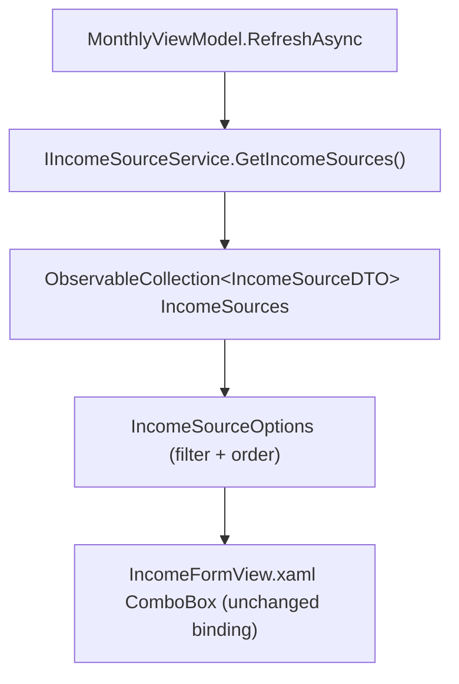

## 1. Technical Overview

**What:** Replace `MonthlyViewModel`'s hardcoded `IncomeSources` static list with the live list from `IIncomeSourceService.GetIncomeSources()` (F04's backend service), filtered to `IsActive == true` and ordered the same way the hardcoded list was, matching F05's web equivalent.

**Why:** Unlike the React web app, the WPF app (`Financial.App`) has no HTTP client — it's an in-process host that calls `Financial.CashFlow.Application` services directly via DI. F04's `GET /income-sources` endpoint exists only for the web client; the WPF-equivalent of "fetch from the endpoint" is injecting `IIncomeSourceService` (the same service the endpoint's controller calls) and invoking it in-process, exactly how `IBankService` is already consumed for the Bank picklist.

**Scope:**
- Included: `IIncomeSourceService` injected into `MonthlyViewModel`; an `ObservableCollection<IncomeSourceDTO> IncomeSources` populated during the existing `RefreshAsync()` load, alongside `Banks`; `IncomeSourceOptions` recomputed from it (active-filter + fixed display order); the "new income" form's default source selection derived from the fetched list instead of the hardcoded first array entry; DI wiring in `App.xaml.cs`.
- Excluded: any XAML change (`IncomeFormView.xaml`'s `ComboBox` already binds to `IncomeSourceOptions` — the binding target doesn't change, only what populates it); `IncomeSourcesWithGrossValue` (a separate, still-hardcoded `["Gleison", "Ariana"]` set controlling the Gross Value field's visibility — unrelated to the picklist, same exclusion F05 made on the web side).

## 2. Architecture Impact

**Affected components:**
- `Financial.App/ViewModels/CashFlow/MonthlyViewModel.cs` (modified)
- `Financial.App/App.xaml.cs` (modified)

## 3. Technical Decisions

| Decision | Chosen Approach | Alternative Considered | Trade-off |
|----------|-----------------|-------------------------|-----------|
| "Fetch from the endpoint" in a client with no HTTP layer | Inject `IIncomeSourceService` (the same service `IncomeSourcesController` calls) and invoke `GetIncomeSources()` in-process via `Task.Run`, exactly like `IBankService` | Add an HTTP client to the WPF app just for this one call | The WPF app has no HTTP client anywhere and calls every CashFlow capability in-process via DI; introducing HTTP here would be a new architectural pattern for one endpoint, contradicting the existing "WPF hosts the application layer directly" design |
| Where filter + order happens | A computed `IncomeSourceOptions` property on `MonthlyViewModel`, mirroring `Financial.Web`'s `selectActiveIncomeSources()` (F05) — active filter + a fixed `IncomeSourceDisplayOrder` comparator (unknown names sort last) | Trust `GetIncomeSources()`'s return order | Same rationale as F05: the service/repository makes no ordering guarantee (JSON source order happens to match today only because of migration seed order); an explicit comparator is correct regardless |
| Default "new income" source selection | `ShowCreateIncomeForm()` sets `IncomeFormSource = IncomeSourceOptions.Count > 0 ? IncomeSourceOptions[0] : string.Empty;`, replacing `IncomeSources[0]` | Keep a hardcoded default | Mirrors the exact adjacent pattern already used one line below for `IncomeFormBank = Banks.Count > 0 ? Banks[0].Name : string.Empty;` — same file, same method, same style, not a new pattern |
| Test double for `IIncomeSourceService` | New `StubIncomeSourceService` in `TestStubs.cs`, matching `StubBankService`'s shape (mutable list property, direct interface implementation, no mocking library) | Moq or another mocking framework | Matches every other stub in this test file; the project doesn't use a mocking library for these ViewModel tests |
| Keeping the existing `CreateViewModel()` test helper's return shape unchanged | Add `IIncomeSourceService`/`StubIncomeSourceService` construction *inside* `CreateViewModel()`, seeded by default with the four standard active sources (so the ~39 existing call sites keep passing unmodified), and add one optional named parameter for tests that need to override the seeded list | Widen the helper's returned tuple to include the new stub | Widening the tuple would force every one of the ~39 existing positional-deconstruction call sites in `MonthlyViewModelTests.cs` to add a placeholder discard, for zero behavioral benefit to those tests; an optional named parameter is additive and backward-compatible |

## 4. Component Overview

**Frontend (WPF):**

| File Path | New/Modified | Purpose | Key Responsibilities |
|-----------|--------------|---------|----------------------|
| `Financial.App/ViewModels/CashFlow/MonthlyViewModel.cs` | Modified | Monthly tab ViewModel | Injects `IIncomeSourceService`; adds `ObservableCollection<IncomeSourceDTO> IncomeSources` populated in `RefreshAsync()`; replaces the hardcoded `IncomeSources` static list and `IncomeSourceOptions` accessor with a computed active-filtered, ordered property; `ShowCreateIncomeForm()` defaults the selected source from the fetched list instead of a hardcoded name |
| `Financial.App/App.xaml.cs` | Modified | DI composition root | Resolves `IIncomeSourceService` (already registered by `AddFinancialCashFlowApplication()`) and passes it into `MonthlyViewModel`'s constructor |

**Tests:**

| File Path | New/Modified | Purpose | Key Responsibilities |
|-----------|--------------|---------|----------------------|
| `Tests/Financial.Presentation.Tests/ViewModels/CashFlow/TestStubs.cs` | Modified | Test doubles | Adds `StubIncomeSourceService : IIncomeSourceService`, mirroring `StubBankService`'s shape, with a settable `ThrowOnGet` exception for the fetch-failure test |
| `Tests/Financial.Presentation.Tests/ViewModels/CashFlow/MonthlyViewModelTests.cs` | Modified | ViewModel tests | `CreateViewModel()` seeds a default `StubIncomeSourceService` (4 active sources) so existing tests are unaffected; new tests cover active-only filtering/ordering, default source selection, and fetch-failure leaving the list empty |

## 5. API Contracts

None — this feature consumes `IIncomeSourceService` in-process; no HTTP surface is involved for the WPF client (unlike F05's web client, which does call `GET /income-sources` over HTTP).

## 6. Data Model

None — no schema change.

## 7. Testing Strategy

| Test File | Test Type | Target | Coverage Goal |
|-----------|-----------|--------|----------------|
| `Tests/Financial.Presentation.Tests/ViewModels/CashFlow/MonthlyViewModelTests.cs` | Unit (new tests) | `IncomeSourceOptions` | Matches the set of `IsActive = true` sources returned by the stub, in Gleison/Ariana/Lottery/DividendoJuros order regardless of input order (PRD F06 AC #1); an `IsActive = false` source is excluded (PRD F06 AC #2) |
| `Tests/Financial.Presentation.Tests/ViewModels/CashFlow/MonthlyViewModelTests.cs` | Unit (new tests) | `ShowCreateIncomeForm()` | Defaults `IncomeFormSource` to the first active/ordered source once loaded |
| `Tests/Financial.Presentation.Tests/ViewModels/CashFlow/MonthlyViewModelTests.cs` | Unit (new test) | `RefreshAsync()` failure path | When `IIncomeSourceService.GetIncomeSources()` throws, `IncomeSourceOptions` stays empty and `HasError`/`Error` reflect the failure; `IncomeFormValidation.BuildValidationMessage` (already existing, unmodified) still rejects a blank source, confirming submission stays blocked (PRD F06 AC #3) |

## Assumptions / Decisions (Auto-Accept — no interactive user available)

Generated inside the same autonomous multi-feature loop as F01-F05, with no user available to interview:

- **Complexity level:** `simple` (one ViewModel extended with one more injected service and one more fetched collection, one DI wiring line — no new files besides the test stub, no XAML change).
- **No HTTP client introduced for WPF:** confirmed by codebase inspection that `Financial.App` has no `HttpClient`/API-client abstraction anywhere; "consuming `GET /income-sources`" for this client means calling the same in-process service the endpoint's controller calls, consistent with how `Bank` is already consumed.
