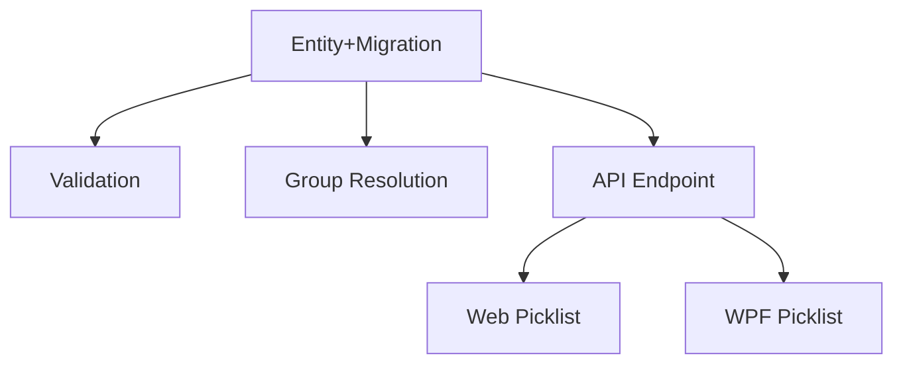

# Income Source Entity

## 1. Executive Summary

This feature refactors how the Financial app models the origin of an income entry. Today, `Income.IncomeSource` is a hardcoded enum (`Gleison`, `Ariana`, `Lottery`, `DividendoJuros`), and its reporting group (`Salary`, `DividendoJuros`, `NonReportable`) is derived on the fly through a static classifier (`IncomeClassifier`) that hardcodes the enum-to-group mapping. This PRD replaces that enum with a real `IncomeSource` domain entity — following the exact pattern already established by the `Bank` entity — that directly carries its own `Group`, `IsActive` status, and identity.

The product is the same personal cash-flow tracker used to record incomes, expenses, transfers, and bank balances (React web app + WPF desktop app, sharing one .NET backend and one JSON data file). The core value of this change is consistency and extensibility: income sources become first-class seeded data (like banks) instead of a compiled-in enum, `IncomeClassifier` — a piece of logic that duplicated information the new entity now owns directly — is deleted, and the two client UIs stop hardcoding the source picklist and instead read it from the backend.

At a high level: a one-time idempotent migration seeds four `IncomeSource` records (mirroring the current enum's four values, each pre-assigned its correct `Group`); `Income.IncomeSource` changes from an enum to a plain string name resolved against that seeded list (the same way `Income.Bank` already resolves against the seeded `Bank` list); any code that needs an income's group now looks it up through the `IncomeSource` entity instead of calling `IncomeClassifier`; and both the web and desktop income-entry forms fetch the active source list from a new read-only endpoint instead of using a compiled-in array.

## 2. Problem and Opportunity

**The Problem**

- **Duplicated source-of-truth for grouping.** The enum-to-group mapping lives only inside `IncomeClassifier.Classify`, disconnected from the `IncomeSource` concept itself — adding or renaming a source requires touching a switch statement in a separate static class rather than editing a single record.
- **Hardcoded picklist in three places.** The same four source values are duplicated across the C# enum, the WPF `MonthlyViewModel.IncomeSources` list, and the React `INCOME_SOURCES` array in `IncomeForm.tsx`. Any future source addition or rename requires a coordinated code change and redeploy across three surfaces instead of an entity update.
- **Inconsistent modeling versus `Bank`.** `Bank` was already migrated from an enum (`PaymentSource`) to a seeded entity in a prior feature (P13-F01), establishing the intended pattern for "reference data" in this codebase. `IncomeSource` staying an enum means the domain model has two different representations for conceptually identical kinds of data (named, seeded, non-CRUD reference entities).
- **No way to express an inactive source without a code change.** Because sources are compiled-in enum values, there's no way to retire a source (e.g. a one-off income origin that will never recur) without editing and redeploying code.

**The Opportunity**

- Consolidating the source and its group into one entity (`IncomeSource { Id, Name, IsActive, Group }`) removes `IncomeClassifier` entirely — the classification logic becomes a stored field lookup rather than compiled logic, matching how `Bank`'s attributes are stored fields rather than derived.
- Seeding `IncomeSource` through the existing migration tool (`CashFlowSpreadsheetImport`) reuses a proven, idempotent pattern already used for `Bank`, so this change carries the same low operational risk as the earlier Bank migration.
- Exposing sources through a read-only API endpoint (mirroring `GET /banks`) lets both clients read the picklist from one source of truth, and the `IsActive` flag gives a documented (if not yet implemented) path to retire a source later without another enum change.

## 3. Target Audience

### Primary Users

**Household Finance Owner**
- Personal user (and their household — e.g. a second income earner) who logs incomes, expenses, and transfers in the app on a regular basis.
- Enters income records using the existing source picklist (currently Gleison/Ariana/Lottery/DividendoJuros) without needing to understand how the value is stored internally.
- Relies on the Annual Summary's Salary/DividendoJuros totals continuing to compute correctly — this refactor must be invisible to them in the UI, apart from where the picklist values are sourced from.

*(This PRD is a single-persona internal refactor; the acting user is the same person who already uses the Monthly and Annual Summary tabs today. No new persona or behavioral profile is introduced.)*

## 4. Objectives

**Product Objectives**

- **Unify** income-source representation under one seeded entity, eliminating the enum/classifier split.
- **Preserve** all existing Annual Summary Salary/DividendoJuros/NonReportable computations byte-for-byte after the migration runs.
- **Centralize** the source picklist so both clients read it from the backend instead of hardcoding it.
- **Match** the established `Bank` entity pattern for reference data (no CRUD, seeded via migration, referenced by name).

**Success Metrics**

- 100% of existing `Income` records resolve to a valid `IncomeSource` after migration (0 orphaned/unresolved source names in the audit log).
- Annual Summary Income Summary table and Historical Averages subtab produce identical Salary/DividendoJuros/NonReportable figures before and after the migration, verified against a pre-migration snapshot.
- 0 remaining references to `IncomeClassifier` or the old `IncomeSource` enum type in the codebase after the change ships.
- Both web and WPF income-entry forms populate their source dropdown exclusively from `GET /income-sources` (0 hardcoded source arrays remaining in either client).

## 5. User Stories

### F01. IncomeSource Domain Entity and Seed Migration
- As the system, I want to store income sources as seeded entities with an id, name, active flag, and group, so that source data is no longer compiled into an enum
- As the system, I want a one-time idempotent migration to create the four existing income sources with their correct group, so that historical income data keeps resolving correctly after the change
- As the system, I want the migration to back up the data file before writing, so that the change is safely reversible if something goes wrong

### F02. Income Source Validation on Create and Update
- As a user, I want my income entry to be rejected with a clear error if I somehow submit an unrecognized source name, so that bad data can't silently enter my records
- As the system, I want to validate an income's source name against the seeded IncomeSource list on create and update, so that every income always resolves to a real source

### F03. Income Group Resolution in Annual Summary
- As a user, I want my Annual Summary Salary and DividendoJuros totals to keep working exactly as before, so that switching the underlying data model doesn't change my reports
- As the system, I want to resolve an income's group by looking up its source in the seeded IncomeSource list, so that grouping logic lives in one place instead of a separate classifier

### F04. Income Sources API Endpoint
- As a client application, I want to fetch the full list of income sources with their active status and group, so that I can build a source picklist without hardcoding values

### F05. Web Income Form Dynamic Source Picklist
- As a user, I want the income entry form's source dropdown to show only active sources fetched from the backend, so that the list I see always matches the app's real configuration

### F06. WPF Income Form Dynamic Source Picklist
- As a user, I want the WPF income entry form's source dropdown to show only active sources fetched from the backend, so that the desktop app behaves consistently with the web app

## 6. Functionalities

### F01. IncomeSource Domain Entity and Seed Migration

**Provides:**
- Seeded `IncomeSource` records — id, name, active flag, group (used by F02, F03, F04)

**Capabilities:**
- `IncomeSource` entity fields: `Id` (Guid, assigned on creation, not used as a foreign key anywhere — `Name` remains the resolution key, consistent with how `Bank` is referenced by name), `Name` (string, non-empty), `IsActive` (bool), `Group` (`IncomeGroup` enum: `Salary`, `DividendoJuros`, `NonReportable`).
- No public mutators beyond the static `Create` factory — `IncomeSource` is immutable after creation, matching the "no CRUD, seeded only" scope of `Bank`.
- `CashFlowData` gains an `IncomeSources` collection (`IReadOnlyCollection<IncomeSource>`) and an `AddIncomeSource(IncomeSource)` method, mirroring `Banks`/`AddBank`.
- `ICashFlowRepository` gains `GetIncomeSources(): IEnumerable<IncomeSource>` (read-only, no add/delete on the repository interface — consistent with `GetBanks()`).
- `IncomeSourceMigrator` (new, under `Integrations/CashFlowSpreadsheetImport/Migrations/IncomeSources/`) seeds exactly four records idempotently (skips a name that already exists, case-insensitive): `Gleison` → `Salary`, `Ariana` → `Salary`, `Lottery` → `NonReportable`, `DividendoJuros` → `DividendoJuros`, all with `IsActive = true`.
- `IncomeSourceMigrator` runs unconditionally as part of `Program.cs`'s existing migration sequence, after the data file backup and before `SaveChangesAsync()` — same wiring as `BankMigrator`.
- `Income.IncomeSource` changes from the enum type to a plain `string` (the source name), matching `Income.Bank`'s existing string-based pattern. The JSON wire shape for existing `Income` records is unchanged (the string values already match the former enum member names), so no rewrite of historical `Income` records is required.
- `Income.Group` (previously `=> IncomeClassifier.Classify(IncomeSource)`) is removed from the `Income` entity.
- `IncomeClassifier` (class and its dedicated unit tests) is deleted.
- `CashFlowTypeInfoResolver` registers `typeof(IncomeSource)` in `ManagedTypes` for private-setter JSON (de)serialization, matching `Bank`'s registration.

**Experience:**
- Entirely a backend/data change — no direct UI. Running the migration tool once (`CashFlowSpreadsheetImport`) is the only manual step; subsequent runs are no-ops for this migrator since the four names already exist.
- The migration's summary output (printed to console like every other migrator's `Render()`) reports how many sources were newly seeded versus already present, and flags (read-only audit, no mutation) any existing `Income.IncomeSource` string value that does not match a seeded name.

**Error Handling:**
- If the data file cannot be backed up before the migration runs, the tool aborts before making any change (existing `MigrationBackup` behavior, reused as-is).
- If an existing `Income` record's source name does not match any of the four seeded names, the migrator logs it in the audit summary as unresolved but does not fail the run or mutate the record — matching `BankMigrator`'s read-only audit behavior for unresolved `PaymentSource` values.
- Re-running the migration against a data file where sources are already seeded is a safe no-op (idempotency check by case-insensitive name match, same as `BankMigrator`).

### F02. Income Source Validation on Create and Update

**Consumes:**
- F01: seeded `IncomeSource` records (name, active flag) for validation lookup

**Capabilities:**
- New `IncomeSourceNameResolver` (Application/Validation layer), mirroring `BankNameResolver`: `TryResolve(string? name, IReadOnlyCollection<IncomeSource> sources, out IncomeSource? source)`, case-insensitive match against the live seeded list.
- Income create and update command handlers call `IncomeSourceNameResolver` before persisting; a name that doesn't resolve to a seeded `IncomeSource` is rejected with a validation error, same failure shape as an unresolved `Bank` name on an `Income`/`Transfer`/`Expense`.
- Validation checks name existence only — it does not additionally require `IsActive = true` (a previously-active-but-now-inactive source must remain assignable to historical or corrective edits; only the entry-form picklist filters by `IsActive`, per F05/F06).

**Experience:**
- No visible UI change to the income entry form's success path — a user selecting from the picklist (F05/F06) always submits a valid, resolvable name.
- If an income is created or updated with a source name that isn't seeded (e.g. via direct API use bypassing the picklist), the request is rejected with a validation error message identifying the invalid source name, matching the wording style of the existing Bank-name validation error.

**Error Handling:**
- Create/update rejected with a 400-level validation error and a message naming the invalid source, when the submitted source name does not match any seeded `IncomeSource`.
- Existing valid income records are never affected by this validation — it only runs on new create/update calls, not retroactively.

### F03. Income Group Resolution in Annual Summary

**Consumes:**
- F01: seeded `IncomeSource` records (name, group) for lookup

**Capabilities:**
- `AnnualSummaryService` replaces every use of the removed `Income.Group` (the Salary/DividendoJuros switch building `IncomeAnnualSummaryDTO`'s monthly arrays, and the `GroupBy(... e.Group)` powering `IncomeGroupValueDTO`/`IncomeAnnualAverageDTO`) with a lookup against the `IncomeSource` list fetched via `ICashFlowRepository.GetIncomeSources()`.
- The lookup is built once per service call as a name → `IncomeGroup` dictionary (case-insensitive), avoiding a per-record linear scan across the income list being aggregated.
- Output DTOs (`IncomeAnnualSummaryDTO`, `IncomeAnnualAverageDTO`, `IncomeGroupValueDTO`) are unchanged in shape — this is purely an internal computation change.

**Experience:**
- Entirely invisible to the user — the Annual Summary's Income Summary table and Historical Averages subtab (web and WPF) render identical figures before and after this change.

### F04. Income Sources API Endpoint

**Consumes:**
- F01: seeded `IncomeSource` records (id, name, active flag, group)

**Provides:**
- Full income source list via API response — id, name, active flag, group (used by F05, F06)

**Capabilities:**
- New `IncomeSourceDTO { Id, Name, IsActive, Group }` (Application layer), `Group` serialized as its string name (e.g. `"Salary"`).
- New read-only endpoint `GET /income-sources` (new `IncomeSourcesController`, or an addition to an existing controller if one already groups reference-data endpoints), returning the full list of seeded sources — mirrors `GET /banks` exactly: no query parameters, no filtering, no pagination (the list is fixed at four records today and expected to stay small).
- No `POST`/`PUT`/`DELETE` — read-only, consistent with `Bank` having no CRUD endpoints.

**Experience:**
- No direct UI — this is the data contract consumed by F05 and F06.

### F05. Web Income Form Dynamic Source Picklist

**Consumes:**
- F04: full income source list (name, active flag) via `GET /income-sources`

**Capabilities:**
- `financialApiClient.ts` gains `getIncomeSources(): Promise<IncomeSourceDto[]>`; `types.ts` gains the corresponding `IncomeSourceDto` type.
- `IncomeForm.tsx` replaces the hardcoded `INCOME_SOURCES` array with a fetched list, filtered client-side to `isActive === true`, sorted the same way the current hardcoded array is ordered (by name, matching existing enum declaration order: Gleison, Ariana, Lottery, DividendoJuros).

**Experience:**
- The income entry form's source dropdown is populated on form mount from the live API response instead of a compiled-in array; a user selecting a source and submitting the form behaves identically to today from their perspective.
- If the fetch fails or returns an empty list, the dropdown renders empty (no fallback to a hardcoded list) and the existing form-level required-field validation prevents submission without a selected source — consistent with how the form already blocks submission on other missing required fields.

### F06. WPF Income Form Dynamic Source Picklist

**Consumes:**
- F04: full income source list (name, active flag) via `GET /income-sources`

**Capabilities:**
- `MonthlyViewModel.IncomeSources` (or equivalent view-model collection) is populated from the API client's income-sources call instead of a static enum-derived list, filtered to `IsActive == true`, same ordering as F05 for cross-client consistency.

**Experience:**
- The WPF income entry form's source combo box behaves identically to today from the user's perspective, now backed by the API call instead of a compiled-in list.
- If the fetch fails, the combo box is empty and the existing required-field validation on the income form prevents submission without a selected source, matching F05's failure behavior.

## 7. Out of Scope

**Entity management**
- No create/edit/delete/activate-deactivate UI or API for `IncomeSource` — it remains seeded-only, identical in scope to `Bank`.
- No admin screen to toggle `IsActive` — the field is seeded as `true` for all four sources and nothing in this PRD flips it; it exists so a future feature can retire a source without another schema change.

**Data model changes beyond this refactor**
- No change to the `IncomeGroup` enum's values or meaning (`Salary`, `DividendoJuros`, `NonReportable` stay exactly as they are).
- No change to `Income`'s other fields (`Bank`, `GrossValue`, `NetValue`, `Date`).
- No change to how `Bank`, `Expense`, `Transfer`, or `BalanceAdjustment` reference their own string-based fields — this PRD only touches the income-source concept.

**Reporting**
- No change to the Annual Summary's visible output, layout, or the Historical Averages subtab — F03 is an internal computation swap that must produce identical results.
- No new report or breakdown by `IncomeSource` (as opposed to `IncomeGroup`) is introduced.

## 8. Dependency Graph

| # | Feature | Priority | Dependencies |
|---|---------|----------|--------------|
| F01 | IncomeSource Domain Entity and Seed Migration | 1 | None |
| F02 | Income Source Validation on Create and Update | 1 | F01 |
| F03 | Income Group Resolution in Annual Summary | 1 | F01 |
| F04 | Income Sources API Endpoint | 1 | F01 |
| F05 | Web Income Form Dynamic Source Picklist | 2 | F04 |
| F06 | WPF Income Form Dynamic Source Picklist | 2 | F04 |

### Execution Waves
Features within the same wave can be built in parallel. A wave starts only after every feature in earlier waves is complete.

- **Wave 1**: F01
- **Wave 2**: F02, F03, F04
- **Wave 3**: F05, F06

### Priority levels
- **1** = Essential — product does not work without it
- **2** = Important — significant value addition
- **3** = Desirable — incremental improvement

## 9. Acceptance Criteria

### F01. IncomeSource Domain Entity and Seed Migration
- [x] Running the migration tool against a data file with no `IncomeSource` records creates exactly four records: Gleison/Salary, Ariana/Salary, Lottery/NonReportable, DividendoJuros/DividendoJuros, all `IsActive = true`
- [x] Running the migration tool a second time makes no additional changes (idempotent, verified by unchanged record count and unchanged IDs)
- [x] A backup of the data file is created before any write occurs
- [x] `IncomeClassifier` class and its dedicated unit tests no longer exist in the codebase
- [x] `Income.Group` property no longer exists on the `Income` entity
- [x] `Income.IncomeSource` is a `string` field, and existing `Income` records deserialize correctly without data loss after the migration
- [x] An `Income` record whose source name matches none of the four seeded names is reported in the migration's audit summary without failing the migration run

### F02. Income Source Validation on Create and Update
- [x] Creating an `Income` with a source name matching a seeded `IncomeSource` (case-insensitive) succeeds
- [x] Creating an `Income` with a source name that matches no seeded `IncomeSource` is rejected with a validation error naming the invalid source
- [x] Updating an existing `Income` to an unresolvable source name is rejected the same way as create
- [x] An income can be created/updated with a source name that resolves to an `IsActive = false` source (validation only checks name existence, not active status)

### F03. Income Group Resolution in Annual Summary
- [x] For a fixed set of test income records, the Annual Summary Income Summary table's Salary, SalaryAfterTaxes, TaxDifference, and DividendoJuros monthly/annual/average figures are byte-identical before and after this change
- [x] The Historical Averages subtab's per-group averages are byte-identical before and after this change
- [x] An income whose source resolves to `NonReportable` continues to be excluded from Salary and DividendoJuros totals, and does not raise an error

### F04. Income Sources API Endpoint
- [x] `GET /income-sources` returns all four seeded records with `id`, `name`, `isActive`, and `group` populated
- [x] The endpoint requires no request parameters and returns the full, unfiltered list regardless of `isActive` value
- [x] No `POST`, `PUT`, or `DELETE` route exists for income sources

### F05. Web Income Form Dynamic Source Picklist
- [ ] The income entry form's source dropdown options match the set of `IncomeSource` records with `isActive = true` returned by `GET /income-sources`
- [ ] A source with `isActive = false` does not appear in the dropdown
- [ ] If the API call fails, the dropdown shows no options and the form's required-field validation blocks submission without a selected source

### F06. WPF Income Form Dynamic Source Picklist
- [ ] The WPF income entry form's source combo box options match the set of `IncomeSource` records with `isActive = true` returned by `GET /income-sources`
- [ ] A source with `isActive = false` does not appear in the combo box
- [ ] If the API call fails, the combo box shows no options and the form's required-field validation blocks submission without a selected source

### Cross-Feature Integration
- [x] Seeded `IncomeSource` records from the migration (F01) are correctly retrievable through `ICashFlowRepository.GetIncomeSources()` and consumed by the validation resolver (F02) to accept/reject income source names
- [x] Seeded `IncomeSource` records from the migration (F01) are correctly consumed by `AnnualSummaryService`'s group lookup (F03), producing unchanged Annual Summary figures
- [x] Seeded `IncomeSource` records from the migration (F01) are correctly returned by `GET /income-sources` (F04), including `id`, `name`, `isActive`, and `group`
- [ ] The income source list returned by `GET /income-sources` (F04) is correctly fetched, filtered to active sources, and rendered as picklist options in both the web income form (F05) and the WPF income form (F06)
