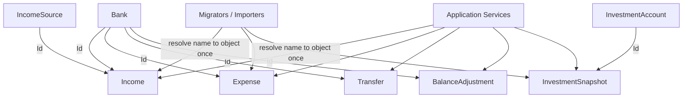

## 1. Technical Overview

**What:** Give `Bank` a `Guid Id` (mirroring `IncomeSource`/`InvestmentAccount`, which already have one), and convert the 7 name-string "reference" fields on `Income`, `Expense`, `Transfer`, `BalanceAdjustment`, and `InvestmentSnapshot` into real object references (`Bank`, `IncomeSource`, `InvestmentAccount`). `Create`/`UpdateDetails` factories on all 5 entities accept the resolved object directly; the old string-emptiness validators are replaced by non-null checks (or, for `Expense.PaymentSourceBank`, remain nullable — an unsettled card charge still has no bank).

**Why:** Today every consumer that needs a related entity's other fields (`Bank.RoundUpEnabled`, `IncomeSource.Group`) re-resolves a name string by hand. Converting to real references removes that indirection at the source: the entity holds the same object instance as `CashFlowData.Banks`/`IncomeSources`/`InvestmentAccounts`, so a consumer just follows `.Bank.RoundUpEnabled` instead of scanning. This is Wave 1 of PRD P27 — the domain-model foundation every later feature (JSON persistence, migration, Application resolvers, API, both UIs) builds on.

**Scope:**
- Included: `Bank.Id`; `Income`/`Expense`/`Transfer`/`BalanceAdjustment`/`InvestmentSnapshot` reference-typed properties and updated `Create`/`UpdateDetails` factories; the minimal changes to every existing call site (6 Application services, `BankMigrator`, `IncomeSourceMigrator`, `InvestmentAccountMigrator`, `MonthlyExpenseSheetImporter`, `IncomeBackfillImporter`) required to keep the solution compiling and behaviorally identical to today.
- Excluded (belongs to later waves per the PRD): the Id-only JSON wire format and reference-resolution converters (F02 — in this feature, `CashFlowTypeInfoResolver`'s existing reflection-based nested-object serialization is left to serialize the referenced entity in full, which is a correct but non-final interim shape); rewriting historical JSON records and any `BankId`/`IncomeSourceId` field on disk (F03); the `BankNameResolver`/`IncomeSourceNameResolver` contract change to Id-based resolution, a new `InvestmentAccountResolver`, and DTO Id+Name fields (F04); Web API route/DTO changes (F05); WPF/React form changes (F06/F07). Deleting `IncomeBackfillImporter` and removing `IncomeMigrator.Migrate`'s workbook parameter is explicitly F03's job (PRD §6 F03) — F01 only makes `IncomeBackfillImporter` compile against the new `Income.Create` signature.

## 2. Architecture Impact

**Affected components:**
- `Financial.CashFlow.Domain/Entities/Bank.cs` (modified — adds `Id`)
- `Financial.CashFlow.Domain/Entities/Income.cs` (modified)
- `Financial.CashFlow.Domain/Entities/Expense.cs` (modified)
- `Financial.CashFlow.Domain/Entities/Transfer.cs` (modified)
- `Financial.CashFlow.Domain/Entities/BalanceAdjustment.cs` (modified)
- `Financial.CashFlow.Domain/Entities/InvestmentSnapshot.cs` (modified)
- `Financial.CashFlow.Application/Services/BankService.cs` (modified — `ComputeBalance` compares by `Id` instead of `Name`)
- `Financial.CashFlow.Application/Services/IncomeService.cs` (modified — passes resolved `Bank`/`IncomeSource` objects into `Income.Create`/`UpdateDetails`; `ToDto` reads `.Name` off the reference)
- `Financial.CashFlow.Application/Services/ExpenseService.cs` (modified — passes resolved `Bank?` into `Expense.Create`/`UpdateDetails`; round-up eligibility checks follow the reference directly instead of re-resolving by name)
- `Financial.CashFlow.Application/Services/TransferService.cs` (modified — passes resolved `Bank` objects; `GetTransfersByBank` still takes a `string` in this feature, now resolves it once via `BankNameResolver` and compares by `Id`)
- `Financial.CashFlow.Application/Services/BalanceAdjustmentService.cs` (modified — same shape as `TransferService`)
- `Financial.CashFlow.Application/Services/InvestmentSnapshotService.cs` (modified — passes resolved `InvestmentAccount` object; `ToDto` compares by `Id` instead of `Name`)
- `Integrations/CashFlowSpreadsheetImport/Migrations/Banks/BankMigrator.cs` (modified — `AuditExpenses` becomes a null-check now that `Expense.PaymentSourceBank` is a direct reference)
- `Integrations/CashFlowSpreadsheetImport/Migrations/IncomeSources/IncomeSourceMigrator.cs` (modified — `AuditIncomes` compares `income.IncomeSource.Id` instead of a name string)
- `Integrations/CashFlowSpreadsheetImport/Migrations/InvestmentAccounts/InvestmentAccountMigrator.cs` (modified — `AuditSnapshots` compares `snapshot.Account.Id` instead of a name string)
- `Integrations/CashFlowSpreadsheetImport/Migrations/Incomes/IncomeBackfillImporter.cs` (modified — resolves `total.Source`/`TargetBankName` against `data.IncomeSources`/`data.Banks` via the existing resolvers before calling `Income.Create`; kept alive here only to compile, since its removal is F03's job)
- `Integrations/CashFlowSpreadsheetImport/SheetImporters/MonthlyExpenseSheetImporter.cs` (modified — resolves the switch's output bank name against `data.Banks` via `BankNameResolver` before calling `Expense.Create`; the hardcoded switch itself stays until F03 replaces it)

## 3. Technical Decisions

| Decision | Chosen Approach | Alternative Considered | Trade-off |
|----------|-----------------|-------------------------|-----------|
| Interim JSON shape while F02 is not yet implemented | Let `CashFlowTypeInfoResolver`'s existing reflection-based serialization nest the full `Bank`/`IncomeSource`/`InvestmentAccount` object inside each referencing record (it already treats all three as managed types), producing duplicated-but-correct JSON until F02 replaces it with Id-only converters | Build a throwaway Id-only converter in F01 and discard it in F02 | F02 owns the real reference-resolution mechanism (PRD §6); building a temporary converter here would be redone immediately and adds a Domain→JSON coupling this feature doesn't need. The interim duplication is invisible to any consumer since every read still goes through the freshly-deserialized object, not a stale copy. |
| `Expense.PaymentSource` → `PaymentSourceBank` ripple | Rename throughout `Expense` (property, `Create`, `UpdateDetails`, `Settle`, `Unsettle`, `ValidatePaymentShape`) since `PaymentStatus`'s null-based state machine keys off this field's nullability directly | Keep the field named `PaymentSource` but change its type | PRD §6 explicitly specifies the rename (`Expense.PaymentSourceBank`); keeping the old name with a new type would misleadingly suggest it's still a raw source string |
| `Transfer`/comparisons of "same bank" | Compare `Bank.Id` (e.g. `SourceBank.Id == DestinationBank.Id`) rather than reference equality | Reference equality (`ReferenceEquals`) | `Id` comparison is correct even if two `Bank` instances happen to be distinct objects with the same identity (not expected to happen post-F02, but F01 doesn't yet guarantee single-instance sharing, since that's F02's job) |
| `BalanceAdjustment.Bank` mutability | Stays set-once in `Create`, unchanged by `UpdateDetails` — matches today's behavior where `BalanceAdjustmentService.UpdateAdjustmentAsync` never reassigns the bank | Allow `UpdateDetails` to also accept a `Bank` | No existing caller ever changes an adjustment's bank after creation; adding the capability now is out of scope for a pure reference-type conversion |
| Scope of the Application-layer touch in this feature | Only what's needed to keep every service compiling and behaviorally byte-identical: swap string equality/`.Name` extraction for `.Id` comparison / passing the object straight through. `BankNameResolver`/`IncomeSourceNameResolver`'s public contract (still name-based `TryResolve`) is untouched, and no new `InvestmentAccountResolver` is introduced | Also ship F04's Id-based resolver contract and DTO Id+Name fields now, since the services are already being touched | PRD §8 explicitly assigns the resolver contract change and DTO shape to F04, which also depends on F02 (needed for by-Id lookups end-to-end); doing it early would duplicate F04's acceptance criteria in the wrong feature, exactly as the precedent set by P26-F01/F03 |

## 4. Component Overview

**Backend:**

| File Path | New/Modified | Purpose | Key Responsibilities |
|-----------|--------------|---------|----------------------|
| `Financial.CashFlow.Domain/Entities/Bank.cs` | Modified | Seeded reference entity | Adds `Guid Id { get; private set; }`, assigned in `Create`, mirroring `IncomeSource`/`InvestmentAccount` exactly |
| `Financial.CashFlow.Domain/Entities/Income.cs` | Modified | Income record | `IncomeSource` (string) → `IncomeSource` (`IncomeSource`, non-null); `Bank` (string) → `Bank` (`Bank`, non-null); `ValidateIncomeSource`/`ValidateBank` become null-checks |
| `Financial.CashFlow.Domain/Entities/Expense.cs` | Modified | Expense record | `PaymentSource` (string?) → `PaymentSourceBank` (`Bank?`); `PaymentStatus`, `Create`, `UpdateDetails`, `Settle`, `Unsettle`, `ValidatePaymentShape` updated to key off the new nullable reference instead of a nullable string |
| `Financial.CashFlow.Domain/Entities/Transfer.cs` | Modified | Transfer record | `SourceBank`/`DestinationBank` (string) → `Bank` references; "must differ" validation compares `Id` |
| `Financial.CashFlow.Domain/Entities/BalanceAdjustment.cs` | Modified | Balance adjustment record | `Bank` (string) → `Bank` reference, set once in `Create` |
| `Financial.CashFlow.Domain/Entities/InvestmentSnapshot.cs` | Modified | Investment snapshot record | `Account` (string) → `InvestmentAccount` reference |
| `Financial.CashFlow.Application/Services/BankService.cs` | Modified | Bank balance computation | `ComputeBalance` compares `i.Bank.Id == bank.Id` etc. instead of string equality; `ToDto` unchanged (`Bank.Name` still exists) |
| `Financial.CashFlow.Application/Services/IncomeService.cs` | Modified | Income CRUD orchestration | `ValidateFields` returns the resolved `IncomeSource`/`Bank` objects instead of flattening to `.Name`; `Create`/`UpdateDetails` calls pass them through; `ToDto` reads `.Name` off each reference for the (still-string) DTO fields |
| `Financial.CashFlow.Application/Services/ExpenseService.cs` | Modified | Expense CRUD orchestration | `ValidateFields` returns the resolved `Bank?` instead of `bank!.Name`; round-up eligibility (`ValidateRoundUpEligibility`, `GetSuggestedRoundUpAmount`) reads `PaymentSourceBank.RoundUpEnabled` directly instead of re-resolving by name |
| `Financial.CashFlow.Application/Services/TransferService.cs` | Modified | Transfer CRUD orchestration | `ResolveBanks` returns the two resolved `Bank` objects; `GetTransfersByBank(string bankName)` keeps its current signature in this feature, resolving once and comparing `Id` |
| `Financial.CashFlow.Application/Services/BalanceAdjustmentService.cs` | Modified | Balance adjustment CRUD orchestration | `ResolveBank` returns the object directly (already did); `AddAdjustmentAsync`/`UpdateAdjustmentAsync` pass it into `Create`; `GetAdjustmentsByBank`/`FindAdjustmentOrThrow` compare `Id` |
| `Financial.CashFlow.Application/Services/InvestmentSnapshotService.cs` | Modified | Investment snapshot orchestration | Passes the resolved `InvestmentAccount` object into `InvestmentSnapshot.Create`; `ToDto`/existing-snapshot lookups compare `Id` |
| `Integrations/CashFlowSpreadsheetImport/Migrations/Banks/BankMigrator.cs` | Modified | Bank seeding + audit | `AuditExpenses` becomes `expense.PaymentSourceBank is null` check only — nothing left to resolve once the field is a direct reference |
| `Integrations/CashFlowSpreadsheetImport/Migrations/IncomeSources/IncomeSourceMigrator.cs` | Modified | Income source seeding + audit | `AuditIncomes` compares `income.IncomeSource.Id` against each seeded source's `Id` |
| `Integrations/CashFlowSpreadsheetImport/Migrations/InvestmentAccounts/InvestmentAccountMigrator.cs` | Modified | Investment account seeding + audit | `AuditSnapshots` compares `snapshot.Account.Id` against each seeded account's `Id` |
| `Integrations/CashFlowSpreadsheetImport/Migrations/Incomes/IncomeBackfillImporter.cs` | Modified | One-time income backfill (still present; F03 removes it) | Resolves `total.Source`/`TargetBankName` against `data.IncomeSources`/`data.Banks` via `IncomeSourceNameResolver`/`BankNameResolver` before calling `Income.Create`, so the tool keeps compiling |
| `Integrations/CashFlowSpreadsheetImport/SheetImporters/MonthlyExpenseSheetImporter.cs` | Modified | Monthly expense import | Resolves the existing hardcoded switch's output name against `data.Banks` via `BankNameResolver` before calling `Expense.Create`; the switch itself is untouched (F03 replaces it) |

No API, frontend, or database-migration-file changes in this feature.

## 5. API Contracts

None — this feature is Domain + minimal Application-layer plumbing only. No HTTP surface changes.

## 6. Data Model

No relational schema. This feature does not change the JSON wire format on disk (F02 owns the Id-only converters). Until F02 lands, `CashFlowTypeInfoResolver`'s existing reflection-based serialization nests the full referenced object under each record that holds a reference (e.g. an `Income`'s JSON gains a nested `Bank` object with its own `Id`/`Name`/etc., rather than a single `BankId` field) — this is a correct but temporary on-disk shape, superseded by F02.

`Bank`'s in-memory shape gains:

| Field | Type | Notes |
|-------|------|-------|
| `Id` | `Guid` | Assigned on creation, mirrors `IncomeSource.Id`/`InvestmentAccount.Id` |

## 7. Testing Strategy

| Test File | Test Type | Target | Coverage Goal |
|-----------|-----------|--------|----------------|
| `Tests/Financial.CashFlow.Domain.Tests/Entities/BankTests.cs` | Unit (modified) | `Bank.Create` | Asserts `Id` is non-empty; two banks created back-to-back have different `Id`s (mirrors `IncomeSourceTests`' pattern) |
| `Tests/Financial.CashFlow.Domain.Tests/Entities/IncomeTests.cs` | Unit (modified) | `Income.Create`/`UpdateDetails` | Accepts a real `IncomeSource`/`Bank` object; throws on a null `IncomeSource` or null `Bank` |
| `Tests/Financial.CashFlow.Domain.Tests/Entities/ExpenseTests.cs` | Unit (modified) | `Expense.Create`/`UpdateDetails`/`Settle`/`Unsettle` | `PaymentSourceBank` accepts null or a `Bank` object; the existing "exactly one of payment source or card tag" rule still rejects both-set and neither-set, now checked against the object reference |
| `Tests/Financial.CashFlow.Domain.Tests/Entities/TransferTests.cs` | Unit (modified) | `Transfer.Create`/`UpdateDetails` | Rejects a `Transfer` whose `SourceBank.Id` equals its `DestinationBank.Id`; accepts two distinct `Bank` objects |
| `Tests/Financial.CashFlow.Domain.Tests/Entities/BalanceAdjustmentTests.cs` | Unit (modified) | `BalanceAdjustment.Create` | Accepts a `Bank` object; `Bank` unchanged by `UpdateDetails` |
| `Tests/Financial.CashFlow.Domain.Tests/Entities/InvestmentSnapshotTests.cs` | Unit (modified) | `InvestmentSnapshot.Create` | Accepts an `InvestmentAccount` object |
| `Tests/Financial.CashFlow.Application.Tests/Services/BankServiceTests.cs` | Unit (modified) | `BankService.ComputeBalance` (via `GetBankBalancesByMonth`/`GetBankBalanceAsOf`) | Same computed balance as before the change, for a fixed set of `Income`/`Expense`/`Transfer`/`BalanceAdjustment` fixtures built against real `Bank` references |
| `Tests/Financial.CashFlow.Application.Tests/Services/IncomeServiceTests.cs` | Unit (modified) | `IncomeService.AddIncomeAsync`/`UpdateIncomeAsync` | Unchanged behavior: valid name resolves and succeeds; unrecognized name still throws `ArgumentException` |
| `Tests/Financial.CashFlow.Application.Tests/Services/ExpenseServiceTests.cs` | Unit (modified) | `ExpenseService` round-up eligibility | Round-up suggestion/eligibility unchanged for a fixture bank with `RoundUpEnabled = true/false` |
| `Tests/Financial.CashFlow.Application.Tests/Services/TransferServiceTests.cs` | Unit (modified) | `TransferService.GetTransfersByBank` | Same results as the pre-change name-based lookup, for a fixed set of test records |
| `Tests/Financial.CashFlow.Application.Tests/Services/BalanceAdjustmentServiceTests.cs` | Unit (modified) | `BalanceAdjustmentService.GetAdjustmentsByBank` | Same results as the pre-change name-based lookup |
| `Tests/Financial.CashFlow.Application.Tests/Services/InvestmentSnapshotServiceTests.cs` | Unit (modified) | `InvestmentSnapshotService` | `ToDto`'s `IsLiability` resolution unchanged for a fixture account |
| `Tests/Financial.CashFlowSpreadsheetImport.Tests/Migrations/Banks/BankMigratorTests.cs` | Unit (modified) | `BankMigrator.AuditExpenses` | Null `PaymentSourceBank` still counted "not applicable"; non-null still counted "resolved" (nothing can be "unresolved" anymore, since the reference is already an object) |
| `Tests/Financial.CashFlowSpreadsheetImport.Tests/Migrations/IncomeSources/IncomeSourceMigratorTests.cs` | Unit (modified) | `IncomeSourceMigrator.AuditIncomes` | Compares by `Id`; same pass/fail outcomes as the pre-change name comparison |
| `Tests/Financial.CashFlowSpreadsheetImport.Tests/Migrations/InvestmentAccounts/InvestmentAccountMigratorTests.cs` | Unit (modified) | `InvestmentAccountMigrator.AuditSnapshots` | Compares by `Id`; same pass/fail outcomes |
| `Tests/Financial.CashFlowSpreadsheetImport.Tests/Migrations/Incomes/IncomeBackfillImporterTests.cs` | Unit (modified) | `IncomeBackfillImporter` | Still produces the same `Income` records against seeded `Bank`/`IncomeSource` fixtures; an unresolvable source/bank name behaves the same as before (kept minimal — full removal is F03) |
| `Tests/Financial.CashFlowSpreadsheetImport.Tests/SheetImporters/MonthlyExpenseSheetImporterTests.cs` | Unit (modified) | `MonthlyExpenseSheetImporter` | Same `Expense.PaymentSourceBank` resolved for `"T"`/`"C"`/default rows as before, now via `data.Banks` lookup instead of a bare string |

## Assumptions / Decisions (Auto-Accept — no interactive user available)

This spec was generated inside an autonomous multi-feature loop (`/loop`) with no user available for the interactive interview. Every open decision below was resolved with the documented default (mirroring the skill's Batch Mode Auto-Accept Policy) rather than paused on, following the same precedent set by the P26 PRD's autonomous run:

- **Complexity level:** `complex` (5 Domain entities changed, 6 Application services touched, 5 migration/import tools touched, no new endpoints — breadth rather than a single deep integration is what drives the rating).
- **Interim JSON on-disk shape:** left to the existing reflection-based nested serialization (see Decision table row 1) rather than hand-rolling a throwaway Id converter, since F02 is the feature that owns the real mechanism.
- **`TransferService.GetTransfersByBank`/`BalanceAdjustmentService`'s bank-scoped methods keep taking `string bankName` in this feature:** the PRD (§6 F04) explicitly assigns the `Guid bankId` parameter change to F04; F01 only fixes the internal comparison to use `Id` so behavior is unchanged.
- **`IncomeBackfillImporter` is updated, not deleted, in this feature:** PRD §6 F03 explicitly owns its removal (and `IncomeMigrator.Migrate`'s workbook-parameter removal); F01 does the minimal resolve-by-name fix so the tool keeps compiling and behaving identically until F03 deletes it.
