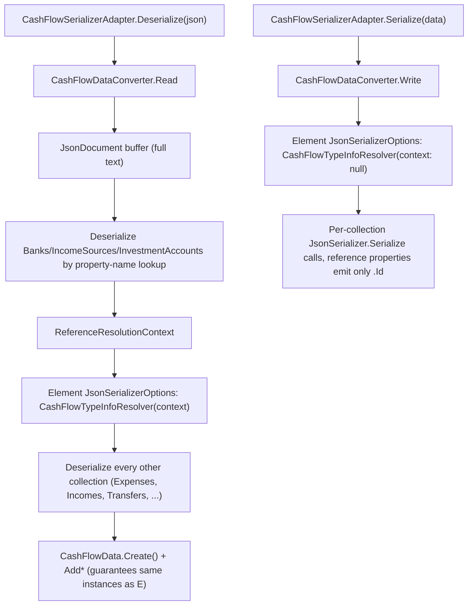

## 1. Technical Overview

**What:** Replace the interim JSON shape F01 left in place (the existing reflection-based `CashFlowTypeInfoResolver` nesting the full `Bank`/`IncomeSource`/`InvestmentAccount` object under every record that references one) with a real Id-only wire format. On disk, `Income.Bank` etc. become single Guid fields (`BankId`, `IncomeSourceId`, `PaymentSourceBankId`, `SourceBankId`, `DestinationBankId`, `InvestmentAccountId`); in memory, the same properties stay the F01 object references, now guaranteed to be the exact same instances held in `CashFlowData.Banks`/`IncomeSources`/`InvestmentAccounts`.

**Why:** F01's interim shape works but duplicates every referenced entity's full data under each record that points to it, and produces a fresh copy on every deserialize rather than a shared instance — the opposite of what "real object reference" should mean for a JSON-backed store. This feature builds the general mechanism (order-independent two-pass resolution) so any future "seeded reference data" collection added to `CashFlowData` gets the same treatment for free, per PRD §2 Opportunity.

**Scope:**
- Included: `ReferenceResolutionContext` (Infrastructure layer); a new `JsonConverter<CashFlowData>` (`CashFlowDataConverter`) that buffers the full document, resolves `Banks`/`IncomeSources`/`InvestmentAccounts` first regardless of JSON property order, then deserializes every other collection through property-level reference converters bound to that context; 3 reference converters (`BankReferenceConverter`, `IncomeSourceReferenceConverter`, `InvestmentAccountReferenceConverter`) attached to exactly the 7 reference-typed properties across the 5 referencing entities; the wire-format rename from a nested object to an `*Id` Guid field; the two error-handling behaviors from PRD §6 F02 (missing-Id-in-seeded-collection, pre-F01 legacy shape).
- Excluded: rewriting historical JSON records on disk (F03's migration writes the new shape going forward — F02 only builds the read/write mechanism); any Application-layer resolver/DTO change (F04); anything about a live production data file (this feature is validated against fixtures/round-trip tests only, never against `data-cashflow.json`, per the project's rule of never running migration-adjacent code against live data).

## 2. Architecture Impact

**Affected components:**
- `Financial.CashFlow.Infrastructure/Persistence/ReferenceResolutionContext.cs` (new)
- `Financial.CashFlow.Infrastructure/Persistence/CashFlowDataConverter.cs` (new)
- `Financial.CashFlow.Infrastructure/Persistence/BankReferenceConverter.cs` (new)
- `Financial.CashFlow.Infrastructure/Persistence/IncomeSourceReferenceConverter.cs` (new)
- `Financial.CashFlow.Infrastructure/Persistence/InvestmentAccountReferenceConverter.cs` (new)
- `Financial.CashFlow.Infrastructure/Persistence/CashFlowTypeInfoResolver.cs` (modified)
- `Financial.CashFlow.Infrastructure/Persistence/CashFlowSerializerAdapter.cs` (modified)

## 3. Technical Decisions

| Decision | Chosen Approach | Alternative Considered | Trade-off |
|----------|-----------------|-------------------------|-----------|
| How reference identity is guaranteed on read | `CashFlowDataConverter.Read` never deserializes `CashFlowData` as a whole object; it deserializes `Banks`/`IncomeSources`/`InvestmentAccounts` once into the context, then builds the final `CashFlowData` via the existing public `CashFlowData.Create()` + `Add*` methods, adding the exact same context instances | Deserialize `CashFlowData` a second time via the default reflection path after building the context | A second full-object deserialize would re-construct fresh `Bank`/`IncomeSource`/`InvestmentAccount` instances for the owning collections, which would NOT be reference-equal to the instances the context resolved into `Income.Bank` etc. — failing the round-trip AC outright. Building via `Create()`/`Add*` sidesteps this by construction. |
| Where property-level reference converters attach | `CashFlowTypeInfoResolver` (already customizes `ManagedTypes`' properties for private setters) gains a second responsibility: for the 7 known reference properties (by declaring type + property name), it sets `jsonProp.CustomConverter` to the matching reference converter and renames `jsonProp.Name` to the `*Id` wire name | A `[JsonConverter]`/`[JsonPropertyName]` attribute pair on each Domain property | Domain must stay framework-free (constitution: no framework code in Domain); all JSON-shape decisions belong in Infrastructure, consistent with `CashFlowTypeInfoResolver` already being the single place that knows the wire shape |
| Avoiding recursion between the top-level converter and its own nested calls | Two distinct `JsonSerializerOptions` instances: the "outer" options (used by `CashFlowSerializerAdapter`) register `CashFlowDataConverter`; the "element" options built inside `Read`/`Write` (used for every nested `JsonSerializer.Serialize/Deserialize` call for a specific collection type) never register it | Reuse one shared options instance everywhere | A single shared instance would make every nested call re-enter `CashFlowDataConverter` for the `CashFlowData` type, but since nested calls always target a collection/element type (`List<Bank>`, `List<Expense>`, ...) this never actually recurses — kept as two instances anyway for clarity and to keep the context (read-only, per-call) from leaking into the cached write-only instance |
| Reference converter's write path when no context is available | Every reference converter (`BankReferenceConverter` etc.) accepts a nullable context; `Write` never touches it (only reads `value.Id`), so the same converter type serves both a context-bound read pass and a context-free write pass | Separate read-only/write-only converter classes | One class per referenced type keeps the 1:1 mapping the PRD names (`BankReferenceConverter`, `IncomeSourceReferenceConverter`, `InvestmentAccountReferenceConverter`) instead of doubling to 6 |
| Legacy-shape detection | Each reference property is marked `IsRequired = true` on read; `CashFlowDataConverter.Read` wraps every per-collection `JsonSerializer.Deserialize` call in a try/catch that rethrows a `JsonException` naming the collection and pointing at the F03 migration when the underlying `JsonException` indicates a missing required property | Manually pre-scan the buffered document for the old field names (`"Bank"`, `"IncomeSource"`, ...) before attempting a typed deserialize | Relies on the JSON contract's own required-property enforcement instead of hand-rolled shape-sniffing, so there's one less thing to keep in sync with the entity list |

## 4. Component Overview

**Backend:**

| File Path | New/Modified | Purpose | Key Responsibilities |
|-----------|--------------|---------|----------------------|
| `Financial.CashFlow.Infrastructure/Persistence/ReferenceResolutionContext.cs` | New | Per-deserialize lookup tables | `Dictionary<Guid, Bank> Banks`, `Dictionary<Guid, IncomeSource> IncomeSources`, `Dictionary<Guid, InvestmentAccount> InvestmentAccounts`; a `TryResolve<T>(Guid, out T)`-shaped helper per dictionary used by the 3 reference converters |
| `Financial.CashFlow.Infrastructure/Persistence/CashFlowDataConverter.cs` | New | Top-level `CashFlowData` (de)serialization | `Read`: buffers the document via `JsonDocument`, resolves the 3 owning collections first (property-name lookup, not text order), builds the context, then deserializes every other `CashFlowData` collection (`Expenses`, `ReserveMovements`, `CardStatements`, `RecurringBills`, `MaeLedgerEntries`, `Incomes`, `Transfers`, `BalanceAdjustments`, `InvestmentSnapshots`) with a context-bound element options instance, assembling the result via `CashFlowData.Create()` + `Add*`. `Write`: serializes each of the 12 collections individually with a context-free element options instance, so reference properties emit only `.Id`. Wraps missing-required-property `JsonException`s with a message naming the collection and pointing at the F03 migration. |
| `Financial.CashFlow.Infrastructure/Persistence/BankReferenceConverter.cs` | New | `Bank`-typed reference properties | `Read`: reads a Guid, resolves against the context, throws a descriptive `JsonException` (naming the missing Id) if unresolved. `Write`: writes `value.Id`. |
| `Financial.CashFlow.Infrastructure/Persistence/IncomeSourceReferenceConverter.cs` | New | `IncomeSource`-typed reference properties | Same shape as `BankReferenceConverter`, for `IncomeSource` |
| `Financial.CashFlow.Infrastructure/Persistence/InvestmentAccountReferenceConverter.cs` | New | `InvestmentAccount`-typed reference properties | Same shape as `BankReferenceConverter`, for `InvestmentAccount` |
| `Financial.CashFlow.Infrastructure/Persistence/CashFlowTypeInfoResolver.cs` | Modified | JSON contract customization | Gains an optional `ReferenceResolutionContext?` constructor parameter; for the 7 known reference properties (`Income.Bank`→`BankId`, `Income.IncomeSource`→`IncomeSourceId`, `Expense.PaymentSourceBank`→`PaymentSourceBankId`, `Transfer.SourceBank`→`SourceBankId`, `Transfer.DestinationBank`→`DestinationBankId`, `BalanceAdjustment.Bank`→`BankId`, `InvestmentSnapshot.Account`→`InvestmentAccountId`), renames `jsonProp.Name` and sets `jsonProp.CustomConverter` to the matching reference converter (constructed with the resolver's context) and `jsonProp.IsRequired = true`. Existing `ManagedTypes`/private-setter wiring is untouched for every other property. |
| `Financial.CashFlow.Infrastructure/Persistence/CashFlowSerializerAdapter.cs` | Modified | Public serializer entry point | `Serialize`/`Deserialize` now use options carrying `CashFlowDataConverter` (plus the existing `JsonStringEnumConverter` and a context-free `CashFlowTypeInfoResolver` for the outer call — the converter itself builds its own context-bound element options internally) |

No API, frontend, or database-migration-file changes in this feature. `data-cashflow.json`'s shape changes, but rewriting the live file is F03's job — F02 only builds the mechanism, exercised here exclusively against test fixtures.

## 5. API Contracts

None — this feature has no HTTP surface.

## 6. Data Model

No relational schema. JSON wire format changes for the 5 referencing entities (each field replaces the equivalent F01-nested-object field):

| Entity | Old (F01 interim) | New (F02) |
|--------|--------------------|-----------|
| `Income` | `"Bank": { ...full object... }` | `"BankId": "<guid>"` |
| `Income` | `"IncomeSource": { ...full object... }` | `"IncomeSourceId": "<guid>"` |
| `Expense` | `"PaymentSourceBank": { ...full object... } \| null` | `"PaymentSourceBankId": "<guid>" \| null` |
| `Transfer` | `"SourceBank": { ...full object... }` | `"SourceBankId": "<guid>"` |
| `Transfer` | `"DestinationBank": { ...full object... }` | `"DestinationBankId": "<guid>"` |
| `BalanceAdjustment` | `"Bank": { ...full object... }` | `"BankId": "<guid>"` |
| `InvestmentSnapshot` | `"Account": { ...full object... }` | `"InvestmentAccountId": "<guid>"` |

`CashFlowData.Banks`/`IncomeSources`/`InvestmentAccounts` continue to serialize their owning collections in full (unchanged from F01 — only the *referencing* fields change shape).

## 7. Testing Strategy

| Test File | Test Type | Target | Coverage Goal |
|-----------|-----------|--------|----------------|
| `Tests/Financial.CashFlow.Infrastructure.Tests/Persistence/CashFlowDataConverterTests.cs` | Unit | `CashFlowDataConverter` | Serializing a `CashFlowData` with cross-references writes only `BankId`/`IncomeSourceId`/`InvestmentAccountId` fields for reference-typed properties, never a nested object (PRD F02 AC #1); a round-trip (serialize then deserialize) reproduces `Income.Bank` as reference-equal (`ReferenceEquals`) to the matching entry in the deserialized `CashFlowData.Banks` (PRD F02 AC #2), and likewise for `IncomeSource`/`InvestmentAccount` references across all 5 entities; deserializing regardless of whether `Banks`/`IncomeSources`/`InvestmentAccounts` appear before or after the records referencing them in the JSON text produces the same resolved graph (order-independence) |
| `Tests/Financial.CashFlow.Infrastructure.Tests/Persistence/BankReferenceConverterTests.cs` | Unit | `BankReferenceConverter` | Resolves a known Guid to the context's `Bank` instance; a Guid absent from the context throws a `JsonException` naming the missing Id and, where derivable, the owning record (PRD F02 AC #3); writes emit exactly the bank's `Id` |
| `Tests/Financial.CashFlow.Infrastructure.Tests/Persistence/IncomeSourceReferenceConverterTests.cs` | Unit | `IncomeSourceReferenceConverter` | Same shape as `BankReferenceConverterTests`, for `IncomeSource` |
| `Tests/Financial.CashFlow.Infrastructure.Tests/Persistence/InvestmentAccountReferenceConverterTests.cs` | Unit | `InvestmentAccountReferenceConverter` | Same shape as `BankReferenceConverterTests`, for `InvestmentAccount` |
| `Tests/Financial.CashFlow.Infrastructure.Tests/Persistence/CashFlowSerializerAdapterTests.cs` | Unit (modified) | `CashFlowSerializerAdapter` | Existing round-trip test updated to assert the new Id-only wire shape and reference equality (superseding the F01-era name-based equality assertions); a JSON payload missing a reference property's Id field (the pre-F01/F01-interim legacy shape) fails deserialization with a message pointing at the F03 migration instead of a generic parse error (PRD F02 Error Handling) |
| `Tests/Financial.CashFlow.Infrastructure.Tests/Repositories/CashFlowJsonRepositoryTests.cs` | Unit (modified where affected) | End-to-end load/save through the repository | A full load→mutate→save→reload cycle preserves reference identity and the Id-only wire shape |

## Assumptions / Decisions (Auto-Accept — no interactive user available)

This spec was generated inside an autonomous multi-feature loop (`/loop`) with no user available for the interactive interview. Every open decision below was resolved with the documented default rather than paused on, following the same precedent set by F01 and the P26 PRD's autonomous run:

- **Complexity level:** `complex` (custom `JsonConverter<T>` plus 3 property-level reference converters, order-independent two-pass buffering, and two distinct error-handling paths — high decision density despite touching only 7 files).
- **Wire field names:** the PRD names `BankId`/`IncomeSourceId`/`InvestmentAccountId` generically; since `Transfer` has two `Bank` references and `Expense`'s is named `PaymentSourceBank`, each field is named `<PropertyName>Id` (`SourceBankId`, `DestinationBankId`, `PaymentSourceBankId`) rather than a single generic `BankId` colliding across properties on the same entity — the only entities with a single unambiguous reference (`Income.Bank`, `BalanceAdjustment.Bank`) use the PRD's literal `BankId`/`IncomeSourceId`/`InvestmentAccountId` names.
- **Legacy-shape error detection:** relies on `IsRequired = true` plus catching the resulting `JsonException`, rather than a bespoke shape-sniffing pre-pass, since the .NET JSON contract API already provides this signal for free.
- **No live-data validation:** per the project's standing rule (never run migration-adjacent tooling against `data-cashflow.json`), this feature's tests exercise only in-memory fixtures; F03 owns proving the mechanism against a real (backed-up, temp-copy) data file.
