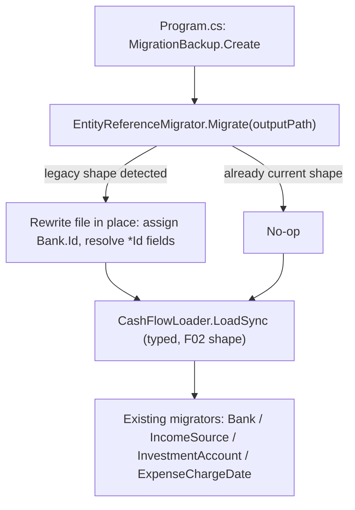

## 1. Technical Overview

**What:** Add `EntityReferenceMigrator`, the first *rewriting* migrator in this codebase: it takes a real pre-F01/F02-shaped `data-cashflow.json` (Bank records with no `Id`; Income/Expense/Transfer/BalanceAdjustment/InvestmentSnapshot records still carrying a raw name string instead of an `*Id` field) and rewrites it into the current Id-based shape. Wire it into `Integrations/CashFlowSpreadsheetImport/Program.cs` at the one point in the pipeline where it can actually run: *before* `CashFlowLoader.LoadSync` — because, as this feature discovered, that call already unconditionally uses the new typed deserializer, which throws (by design, per F02) on exactly the legacy shape this migrator exists to fix. Also complete two loose ends F01 deliberately deferred here: delete `IncomeBackfillImporter` (a one-time backfill from the now-retired income spreadsheet, already complete) and drop the `workbook` parameter from `IncomeMigrator.Migrate`.

**Why:** F02 intentionally made the typed JSON layer reject the old string shape outright (a clear, named error pointing here) rather than silently tolerate two wire formats forever. Something has to actually perform the one-time rewrite for that to be safe to ship — that's this feature. Doing it as a real rewriting migrator (not a manual one-off script) keeps it inside the same reproducible, backed-up, idempotent pipeline every other migrator already uses, per PRD §2's opportunity to build the general mechanism once.

**Scope:**
- Included: `EntityReferenceMigrator` (+ summary type) under `Integrations/CashFlowSpreadsheetImport/Migrations/EntityReferences/`, driven by the data file path rather than an already-loaded `CashFlowData` (since, uniquely among migrators, the file can't be loaded through the normal path until this one has run); the `Program.cs` wiring that runs it between the backup step and `CashFlowLoader.LoadSync`; deleting `IncomeBackfillImporter.cs` + `IncomeBackfillImporterTests.cs` and removing `IncomeMigrator.Migrate`'s `workbook` parameter (updating its one call site and its own tests).
- Excluded: `MonthlyExpenseSheetImporter`'s "hardcoded string switch instead of resolving against the seeded Bank list" AC — already satisfied by F01, which changed `ResolvePaymentSource`'s output to flow through `BankNameResolver.TryResolve(_, banks, _)` before ever reaching `Expense.Create`; the switch itself is an unavoidable single-letter-tag-to-canonical-name lookup table, not a name-resolution bypass, so there is nothing left for F03 to change here (see Assumptions). Validating this feature against the live `data-cashflow.json` file — per the project's standing rule, this is proven against a throwaway temp copy of a realistic fixture, never the live file.

## 2. Architecture Impact

**Affected components:**
- `Integrations/CashFlowSpreadsheetImport/Migrations/EntityReferences/EntityReferenceMigrator.cs` (new)
- `Integrations/CashFlowSpreadsheetImport/Migrations/EntityReferences/EntityReferenceMigrationSummary.cs` (new)
- `Integrations/CashFlowSpreadsheetImport/Program.cs` (modified — new migration step + `IncomeMigrator.Migrate` call site)
- `Integrations/CashFlowSpreadsheetImport/Migrations/Incomes/IncomeMigrator.cs` (modified — drops `workbook` parameter)
- `Integrations/CashFlowSpreadsheetImport/Migrations/Incomes/IncomeBackfillImporter.cs` (deleted)
- `Tests/Financial.CashFlowSpreadsheetImport.Tests/Migrations/Incomes/IncomeBackfillImporterTests.cs` (deleted)
- `Tests/Financial.CashFlowSpreadsheetImport.Tests/Migrations/Incomes/IncomeMigratorTests.cs` (modified — drops workbook-based cases)

## 3. Technical Decisions

| Decision | Chosen Approach | Alternative Considered | Trade-off |
|----------|-----------------|-------------------------|-----------|
| Where this migrator plugs into `Program.cs` | Runs on the file **path**, immediately after `MigrationBackup.Create`/before `CashFlowLoader.LoadSync`, rewriting the file on disk in place when the legacy shape is detected | Follow every other migrator's signature (`Migrate(CashFlowData data)`) | Every other migrator operates on an already-loaded `CashFlowData`, but F02 made loading a legacy-shaped file throw before any of them could run — this migrator is structurally different by necessity, not by choice. Documented here since it's the one migrator that doesn't follow the established `Migrate(CashFlowData)` shape. |
| How the rewrite itself is built | Manually parse the raw legacy JSON via `JsonDocument`; deserialize `Banks`/`IncomeSources`/`InvestmentAccounts`/every untouched collection (`ReserveMovements`, `CardStatements`, `RecurringBills`, `MaeLedgerEntries`) with the *existing* `CashFlowTypeInfoResolver` (their shape didn't change); reconstruct every `Bank` via `Bank.Create` (assigning a fresh `Id`) and every `Income`/`Expense`/`Transfer`/`BalanceAdjustment`/`InvestmentSnapshot` via its normal `Create` factory once its legacy name(s) resolve; assemble the result into a `CashFlowData` via `Create()`/`Add*`; serialize it back out through the existing `CashFlowSerializerAdapter` (which already emits the F02 Id-based shape) | Hand-write raw string/JSON-node surgery producing the new shape directly | Reuses two mechanisms that already exist and are already tested (the resolver for unaffected types, the F02 serializer for the target shape) instead of re-implementing JSON shape knowledge a third time; the PRD's own wording ("reconstructed via the entity's normal `Create` factory") points at exactly this approach |
| Legacy-shape detection (the "no-op on second run" requirement) | Before doing any work, scan the raw document: legacy shape is present if any `Banks` entry lacks an `Id` property, OR any `Incomes`/`Expenses`/`Transfers`/`BalanceAdjustments`/`InvestmentSnapshots` entry has the *old* field name (`Bank`, `IncomeSource`, `PaymentSource`, `SourceBank`, `DestinationBank`, `Account`) instead of the new `*Id` field. If none of these hold, the migrator returns a zero-change summary and never touches the file | Always rewrite and rely on the output being byte-identical to the input | A no-op file write is not "no additional changes" in spirit (it still touches the file's mtime and reformats JSON); detecting first and skipping entirely is a cleaner, unambiguous no-op, and avoids ever needing `Bank.Create` to mint a *second* fresh Id for a bank that already has one (`Bank` has no way to set a specific Id externally) |
| Unresolved name handling | A record whose legacy name doesn't resolve against the seeded collection is **not** written into the rewritten file (it's structurally impossible — `Income.IncomeSource`/`Bank` etc. are non-null references, so there's no way to represent "unresolved" in the new domain shape); it's flagged in the migration summary the same way every existing migrator's audit flags an issue, and the pre-write backup is the recovery path | Abort the whole migration on any unresolved record | Matches the PRD's explicit framing ("An unresolved name is reported in the migration summary... restoring from the pre-write backup is the recovery path") — an all-or-nothing abort would block every other resolvable record over one bad one |
| `IncomeBackfillImporter` removal timing | Deleted in this feature exactly as F01's spec deferred it, along with `IncomeMigrator.Migrate`'s `workbook` parameter and its one call site in `Program.cs` | Leave it until a later feature | F01 explicitly scoped this deletion out and PRD §6 F03 assigns it here; the importer's own `AlreadyImported` guard has made every real run a no-op for a while, per its doc comment |
| Record identity across the rewrite | The 5 referencing entities (`Income`/`Expense`/`Transfer`/`BalanceAdjustment`/`InvestmentSnapshot`) keep their **original** `Id` through the rewrite: each is reconstructed via its normal `Create` factory (which mints a fresh Id), then that Id is overwritten back to the value read from the legacy JSON, using the same private-setter-via-reflection technique the codebase already uses in `ExpenseChargeDateMigratorTests`/`SimulateLegacyCardExpense` to force a specific shape. `Bank` is the one exception — it never had an Id before this migration, so it always gets a genuinely new one | Let every record get the fresh Id its `Create` factory mints, matching the PRD's literal "no special migration-only entity method is needed" | `ExpenseChargeDateMigrator` (already existing, runs immediately after this migrator in `Program.cs`) correlates a settled expense's recoverable `SettledAt` against `legacyRawJson` **by `Expense.Id`**. If this migrator minted fresh Expense Ids, that correlation would silently break on the very first real run — every settled expense would incorrectly appear to have no recoverable `SettledAt`. Preserving the original Id is required for this existing downstream migrator to keep working, not just a data-hygiene nicety. This is a deliberate, narrow, tested divergence from the PRD's literal wording, made because a literal reading would silently corrupt an existing migrator's cross-run correlation. |

## 4. Component Overview

**Backend:**

| File Path | New/Modified | Purpose | Key Responsibilities |
|-----------|--------------|---------|----------------------|
| `Integrations/CashFlowSpreadsheetImport/Migrations/EntityReferences/EntityReferenceMigrator.cs` | New | Rewrites a legacy-shaped data file to the F02 Id-based shape | `Migrate(string dataPath)`: reads `dataPath`, detects legacy shape, and if present: assigns a fresh `Guid Id` to every `Bank`; resolves every legacy name (case-insensitive) against the seeded `Bank`/`IncomeSource`/`InvestmentAccount` collections; reconstructs each referencing record via its entity's `Create` factory; carries every untouched collection through unchanged; serializes the result via `CashFlowSerializerAdapter` and writes it back to `dataPath`. Returns a summary either way (zero-change summary when already current) |
| `Integrations/CashFlowSpreadsheetImport/Migrations/EntityReferences/EntityReferenceMigrationSummary.cs` | New | Console report | Counters (Banks Id-assigned; Incomes/Expenses/Transfers/BalanceAdjustments/InvestmentSnapshots resolved) + per-entity-type lists of unresolved raw legacy records (Id + stored name) for manual review; `Render()` matches every other migrator's summary format |
| `Integrations/CashFlowSpreadsheetImport/Program.cs` | Modified | Migration sequencing | Calls `EntityReferenceMigrator.Migrate(outputPath)` immediately after `MigrationBackup.Create(outputPath)`/before `CashFlowLoader.LoadSync(storage, serializer)`; prints its `Render()`; `IncomeMigrator.Migrate(data, workbook)` call site becomes `IncomeMigrator.Migrate(data)` |
| `Integrations/CashFlowSpreadsheetImport/Migrations/Incomes/IncomeMigrator.cs` | Modified | Income audit | `Migrate(CashFlowData data)` — drops the `workbook` parameter and the `IncomeBackfillImporter.Import` call; `IncomeMigrationSummary`'s `EntriesImportedCount` is no longer populated by this type (kept on the summary type only if still meaningfully reachable — see Deviations if removed instead) |
| `Integrations/CashFlowSpreadsheetImport/Migrations/Incomes/IncomeBackfillImporter.cs` | Deleted | — | One-time backfill already complete; no longer needed under the new reference model |

No API, frontend, or database-migration-file changes in this feature.

## 5. API Contracts

None — this feature has no HTTP surface.

## 6. Data Model

No relational schema. This feature's entire job is rewriting `data-cashflow.json` from the pre-F01/F02 shape to the F02 shape already specified in F02's spec (Section 6 there). No new fields are introduced here.

**Legacy shape this migrator must read (raw JSON, via `JsonDocument`, never through the typed deserializer):**

| Entity | Legacy field(s) | Rewritten to |
|--------|------------------|--------------|
| `Bank` | *(no `Id` field present)* | `Id` (Guid, newly assigned) |
| `Income` | `"Bank": "<name>"`, `"IncomeSource": "<name>"` | `"BankId": "<guid>"`, `"IncomeSourceId": "<guid>"` |
| `Expense` | `"PaymentSource": "<name>" \| null` | `"PaymentSourceBankId": "<guid>" \| null` |
| `Transfer` | `"SourceBank": "<name>"`, `"DestinationBank": "<name>"` | `"SourceBankId": "<guid>"`, `"DestinationBankId": "<guid>"` |
| `BalanceAdjustment` | `"Bank": "<name>"` | `"BankId": "<guid>"` |
| `InvestmentSnapshot` | `"Account": "<name>"` | `"InvestmentAccountId": "<guid>"` |

## 7. Testing Strategy

| Test File | Test Type | Target | Coverage Goal |
|-----------|-----------|--------|----------------|
| `Tests/Financial.CashFlowSpreadsheetImport.Tests/Migrations/EntityReferences/EntityReferenceMigratorTests.cs` | Unit | `EntityReferenceMigrator.Migrate` | Against a temp file containing a hand-built legacy-shaped fixture (raw JSON string, mirroring `ExpenseChargeDateMigratorTests`' `BuildLegacyRawJson` style): assigns a unique `Id` to every `Bank`; resolves and rewrites one record of each of `Income`/`Expense`/`Transfer`/`BalanceAdjustment`/`InvestmentSnapshot` via its `Create` factory, preserving each record's original `Id` (PRD F03 AC); running it a second time against its own output makes no further changes (PRD F03 AC); a backup is created before any write (assert via `MigrationBackup`'s naming convention / an existing `*.backup-migration-*` file appearing) (PRD F03 AC); an unresolvable name is reported in the summary and its record is absent from the rewritten output (PRD F03 AC); untouched collections (`ReserveMovements`, `CardStatements`, `RecurringBills`, `MaeLedgerEntries`) survive the rewrite unchanged; the rewritten file round-trips cleanly through `CashFlowSerializerAdapter`/`CashFlowLoader` (i.e., F02's typed loader can now read it without throwing) |
| `Tests/Financial.CashFlowSpreadsheetImport.Tests/Migrations/Incomes/IncomeMigratorTests.cs` | Unit (modified) | `IncomeMigrator.Migrate(CashFlowData)` | Existing cases updated to the single-parameter signature; workbook-backfill-specific cases removed |

Deleted test file: `Tests/Financial.CashFlowSpreadsheetImport.Tests/Migrations/Incomes/IncomeBackfillImporterTests.cs`.

## Assumptions / Decisions (Auto-Accept — no interactive user available)

This spec was generated inside an autonomous multi-feature loop (`/loop`) with no user available for the interactive interview. Every open decision below was resolved with the documented default rather than paused on, following the same precedent set by F01/F02:

- **Complexity level:** `complex` (a genuinely novel migrator shape — the only one in the codebase that must run before the file can be loaded at all — plus two coordinated deletions).
- **`MonthlyExpenseSheetImporter`'s AC is already satisfied by F01**: its `ResolvePaymentSource` switch only maps a 1-2 character spreadsheet tag to a canonical bank *name*; the actual `Expense.PaymentSourceBank` value has already gone through `BankNameResolver.TryResolve(_, data.Banks, _)` since F01 (`SheetImporters/MonthlyExpenseSheetImporter.cs`, `Import`'s `banks` parameter). There is no remaining "hardcoded switch bypassing the seeded list" to fix — the switch is an unavoidable short-tag lookup, not a resolution bypass. No code change made for this AC in F03; it's marked satisfied by F01's prior work.
- **`IncomeMigrationSummary.EntriesImportedCount`**: left on the type even though nothing populates it anymore after `IncomeBackfillImporter` is deleted (defaults to `0`), rather than removing the property and touching every call site that reads it — the `Render()` method's existing `if (EntriesImportedCount > 0)` guard already makes this a silent, harmless no-op line. Flagged here rather than silently dropped, so a later cleanup pass can remove it if desired.
- **No live-data validation**: per the project's standing rule (never run migration-adjacent tooling against `data-cashflow.json`), this feature's tests exercise only a temp-file copy of a hand-built fixture, never the live file.
