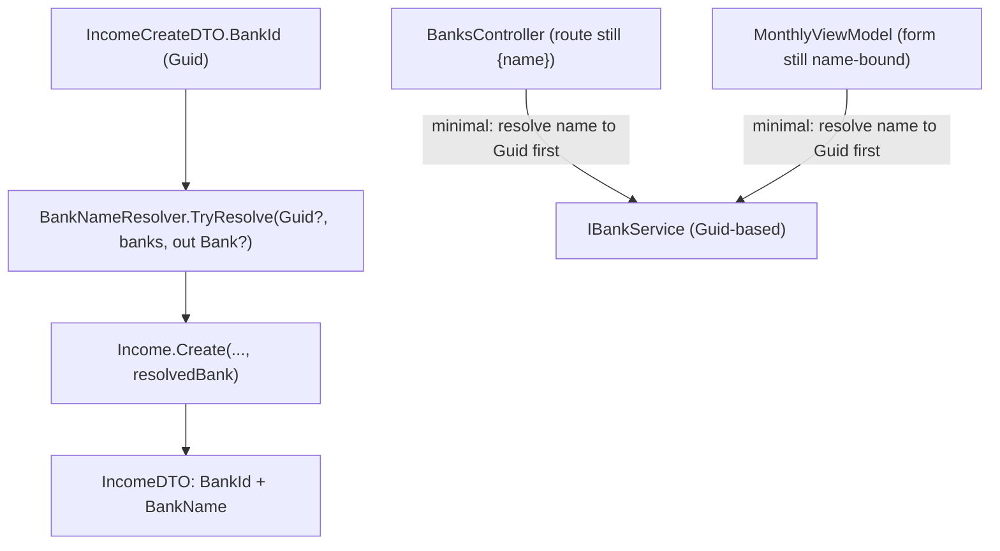

## 1. Technical Overview

**What:** Change the Application layer's public contract from name-based to Id-based for every Bank/IncomeSource/InvestmentAccount reference: `BankNameResolver`/`IncomeSourceNameResolver` resolve by `Guid` instead of `string`; a new `InvestmentAccountResolver` is added (mirroring the same shape, didn't exist before); `IncomeService`/`ExpenseService`/`TransferService`/`BalanceAdjustmentService`/`CardStatementService`'s create/update paths and bank-scoped query methods take a `Guid` instead of a name; every `ToDto` mapper emits both the Id and a denormalized display name for each reference; `BankDTO` gains the `Id` it never had; `BankService.UpdateOpeningBalanceAsync`/`GetBankBalanceAsOf` move to `Guid bankId`.

**Why:** This is the layer every consumer (F05's Web API, F06's WPF forms, F07's React forms) will build against — it has to land before any of them can submit or receive an Id instead of a name. Doing it here, once, keeps the Id-based contract consistent across all 3 client-facing waves instead of each inventing its own shape.

**Scope:**
- Included: `BankNameResolver`/`IncomeSourceNameResolver` signature change; new `InvestmentAccountResolver`; `IncomeService`/`ExpenseService`/`TransferService`/`BalanceAdjustmentService`/`InvestmentSnapshotService`/`BankService`/`CardStatementService` updated to resolve by Id and emit Id+Name; every affected Create/Update/Read DTO's field shape; the **minimal, compile-preserving** touches this forces onto `Financial.Api`'s controllers and `Financial.App`'s `MonthlyViewModel` (both keep their current name-based external contract — HTTP routes and WPF form bindings are untouched here; only the internal call now resolves a name to the Id the Application layer requires before calling it, exactly mirroring the precedent F01 set for `Integrations/CashFlowSpreadsheetImport`).
- Excluded: the HTTP route/DTO wire shape exposed to callers (`/banks/{name}/...` → `/banks/{id}/...`, request/response JSON) — that's F05; WPF picklists becoming Id-backed (`SelectedValuePath`) — that's F06; React forms — that's F07. `MonthlyExpenseSheetImporter`'s existing by-name Bank lookup (spreadsheet cells can't carry a Guid) is preserved via its own small inline lookup rather than the now-Id-based `BankNameResolver`.

## 2. Architecture Impact

**Affected components:**
- `Financial.CashFlow.Application/Validation/BankNameResolver.cs` (modified — Id-based)
- `Financial.CashFlow.Application/Validation/IncomeSourceNameResolver.cs` (modified — Id-based)
- `Financial.CashFlow.Application/Validation/InvestmentAccountResolver.cs` (new)
- `Financial.CashFlow.Application/DTOs/*.cs` (modified — see Data Model)
- `Financial.CashFlow.Application/Interfaces/I*Service.cs` (modified signatures) and their `Services/*.cs` implementations: `IncomeService`, `ExpenseService`, `TransferService`, `BalanceAdjustmentService`, `InvestmentSnapshotService`, `BankService`, `CardStatementService`
- `Integrations/CashFlowSpreadsheetImport/SheetImporters/MonthlyExpenseSheetImporter.cs` (modified — inline by-name Bank lookup, no longer via `BankNameResolver`)
- `Financial.Api/Controllers/BanksController.cs`, `TransfersController.cs` (modified — minimal: resolve the existing `{name}` route segment to a `Guid` before calling the now-Id-based service method; routes themselves unchanged, that's F05)
- `Financial.App/ViewModels/CashFlow/MonthlyViewModel.cs` (modified — minimal: resolve a form's selected name to a `Guid` against the already-loaded `Banks`/income-source list before calling a now-Id-based service method; form bindings/UX unchanged, that's F06)

## 3. Technical Decisions

| Decision | Chosen Approach | Alternative Considered | Trade-off |
|----------|-----------------|-------------------------|-----------|
| Resolver class names | Keep `BankNameResolver`/`IncomeSourceNameResolver` as-is even though they're now Id-based | Rename to `BankResolver`/`IncomeSourceResolver` | PRD §6 F04 literally names them unchanged ("`BankNameResolver`/`IncomeSourceNameResolver` change contract... "); renaming would touch every call site's `using`/reference for a cosmetic gain not worth it on a personal project (constitution: no over-engineering) |
| `MonthlyExpenseSheetImporter`'s Bank lookup | Inlines its own `banks.FirstOrDefault(b => name-match)` instead of calling `BankNameResolver` | Keep a second, string-based overload on `BankNameResolver` | A spreadsheet cell can only ever carry a name, never a Guid — keeping a name-based overload on the shared resolver just to serve one caller reintroduces the exact ambiguity this PRD is removing everywhere else; a 3-line local lookup is simpler and scoped to where it's actually needed |
| `TransferService.GetTransfersByBank(Guid)` / `BalanceAdjustmentService.GetAdjustmentsByBank(Guid)` internals | Filter directly by `Id` equality (`t.SourceBank.Id == bankId \|\| t.DestinationBank.Id == bankId`); no resolver call needed | Keep the existing "resolve first, then filter" shape, now with `BankNameResolver.TryResolve(Guid?, ...)` | The resolver's only job for a name was case-insensitive normalization before comparing; a `Guid` needs no normalization, so resolving first buys nothing — direct filtering already returns an empty list for an Id matching no bank, satisfying the PRD's "resolves to no Bank returns empty" behavior for free |
| `BalanceAdjustmentService` → `IBankService.GetBankBalanceAsOf` coupling | Now passes `bank.Id` (the already-resolved `Bank` object's Id) instead of re-flattening to `bank.Name` | Leave the re-flattening in place | `GetBankBalanceAsOf` itself becomes `Guid`-based in this same feature, so passing the Id directly is not just possible but strictly simpler than passing a name only to re-resolve it a second time inside `BankService` |
| Minimal `Financial.Api`/`Financial.App` touches | Both keep their current name-based external contract (HTTP route segments, WPF form bindings) unchanged; each gets a small local "resolve the name I already have to the Guid the Application layer now requires" step right before the call that would otherwise fail to compile | Defer all of F04 until F05/F06 can land in the same wave | F04's own service signature changes make `Financial.Api`/`Financial.App` fail to compile immediately — the same situation F01 hit with `Integrations/CashFlowSpreadsheetImport`, resolved the same way: minimal, behavior-preserving fixes now, full route/UI rework deferred to the wave that owns it |
| `InvestmentSnapshotService.ToDto`'s account lookup | Replaced with `InvestmentAccountResolver.TryResolve(snapshot.Account.Id, accounts, out account)` | Leave the existing inline `accounts.FirstOrDefault(a => a.Id == snapshot.Account.Id)` | PRD §6 F04 explicitly calls out introducing `InvestmentAccountResolver` to replace this exact inline lookup, for consistency with the other two reference types now that a resolver exists |

## 4. Component Overview

**Backend:**

| File Path | New/Modified | Purpose | Key Responsibilities |
|-----------|--------------|---------|----------------------|
| `Financial.CashFlow.Application/Validation/BankNameResolver.cs` | Modified | Bank Id resolution | `TryResolve(Guid? id, IEnumerable<Bank> banks, out Bank? bank)` — direct `Id` equality, no more string comparison |
| `Financial.CashFlow.Application/Validation/IncomeSourceNameResolver.cs` | Modified | IncomeSource Id resolution | Same shape as above, for `IncomeSource` |
| `Financial.CashFlow.Application/Validation/InvestmentAccountResolver.cs` | New | InvestmentAccount Id resolution | Same shape, for `InvestmentAccount` — mirrors the other two exactly |
| `Financial.CashFlow.Application/DTOs/Income*.cs` | Modified | Income contracts | `IncomeCreateDTO`/`IncomeUpdateDTO`: `IncomeSource`(string)→`IncomeSourceId`(Guid), `Bank`(string)→`BankId`(Guid); `IncomeDTO`: adds `IncomeSourceId`+`IncomeSourceName`, `BankId`+`BankName` (replacing the bare `IncomeSource`/`Bank` strings) |
| `Financial.CashFlow.Application/DTOs/Expense*.cs` | Modified | Expense contracts | `ExpenseCreateDTO`/`ExpenseUpdateDTO`: `PaymentSource`(string?)→`PaymentSourceBankId`(Guid?); `ExpenseDTO`: adds `PaymentSourceBankId`+`PaymentSourceBankName` (nullable) replacing `PaymentSource` |
| `Financial.CashFlow.Application/DTOs/Transfer*.cs` | Modified | Transfer contracts | `TransferCreateDTO`/`TransferUpdateDTO`: `SourceBank`/`DestinationBank`(string)→`SourceBankId`/`DestinationBankId`(Guid); `TransferDTO`: adds `SourceBankId`+`SourceBankName`, `DestinationBankId`+`DestinationBankName` |
| `Financial.CashFlow.Application/DTOs/BalanceAdjustment*.cs` | Modified | Balance adjustment contracts | `BalanceAdjustmentDTO`: adds `BankId`+`BankName` replacing bare `Bank` string (Create/Update DTOs are unchanged — the bank is a method parameter, not a body field, both before and after) |
| `Financial.CashFlow.Application/DTOs/InvestmentSnapshotDTO.cs` | Modified | Investment snapshot read contract | Adds `AccountId`+`AccountName` replacing bare `Account` string |
| `Financial.CashFlow.Application/DTOs/BankDTO.cs` | Modified | Bank read contract | Gains `Id` (Guid) — didn't have one before |
| `Financial.CashFlow.Application/DTOs/MarkStatementPaidDTO.cs` | Modified | Card statement payment contract | `PaymentSource`(string?)→`PaymentSourceBankId`(Guid?) |
| `Financial.CashFlow.Application/Interfaces/IIncomeService.cs` + `Services/IncomeService.cs` | Modified | Income CRUD | `ValidateFields` resolves `Guid IncomeSourceId`/`Guid BankId`; `ToDto` emits Id+Name pairs |
| `Financial.CashFlow.Application/Interfaces/IExpenseService.cs` + `Services/ExpenseService.cs` | Modified | Expense CRUD | `ValidateFields` resolves `Guid? PaymentSourceBankId`; `ToDto` emits Id+Name pair (nullable) |
| `Financial.CashFlow.Application/Interfaces/ITransferService.cs` + `Services/TransferService.cs` | Modified | Transfer CRUD | `ResolveBanks` takes two `Guid`s; `GetTransfersByBank(Guid bankId)`; `ToDto` emits both Id+Name pairs |
| `Financial.CashFlow.Application/Interfaces/IBalanceAdjustmentService.cs` + `Services/BalanceAdjustmentService.cs` | Modified | Balance adjustment CRUD | `AddAdjustmentAsync`/`UpdateAdjustmentAsync`/`DeleteAdjustmentAsync`/`GetAdjustmentsByBank` take `Guid bankId`; `ToDto` emits Id+Name pair |
| `Financial.CashFlow.Application/Services/InvestmentSnapshotService.cs` | Modified | Investment snapshot orchestration | `ToDto` uses `InvestmentAccountResolver`; emits `AccountId`+`AccountName` |
| `Financial.CashFlow.Application/Interfaces/IBankService.cs` + `Services/BankService.cs` | Modified | Bank operations | `UpdateOpeningBalanceAsync(Guid bankId, ...)`, `GetBankBalanceAsOf(Guid bankId, ...)`; `ToDto` emits `Id` |
| `Financial.CashFlow.Application/Services/CardStatementService.cs` | Modified | Card statement payment | Resolves `request.PaymentSourceBankId` (Guid?) via `BankNameResolver.TryResolve` |
| `Integrations/CashFlowSpreadsheetImport/SheetImporters/MonthlyExpenseSheetImporter.cs` | Modified | Monthly expense import | `ResolvePaymentSource`'s output name resolved via an inline `banks.FirstOrDefault` instead of `BankNameResolver.TryResolve` (whose signature is no longer name-based) |
| `Financial.Api/Controllers/BanksController.cs` | Modified | Bank/adjustment routes (still name-keyed) | `UpdateOpeningBalance`/`AddAdjustment`/`UpdateAdjustment`/`DeleteAdjustment`/`GetAdjustmentsByBank`: resolve the existing `{name}` route segment to a `Bank`/`Guid` via `_bankService.GetBanks()` before calling the now-Guid-based service method; 404 if the name doesn't resolve (same externally observable behavior as today) |
| `Financial.Api/Controllers/TransfersController.cs` | Modified | Transfer-by-bank route (still name-keyed) | `GetTransfersByBank(string name)`: same resolve-then-call pattern |
| `Financial.App/ViewModels/CashFlow/MonthlyViewModel.cs` | Modified | Monthly tab forms (still name-bound) | Every place that builds an Income/Expense/Transfer/Adjustment create/update DTO or calls a bank-scoped service method resolves the already-selected name against the already-loaded `Banks`/income-source list to the `Guid` the Application layer now requires; every place that reads a DTO's denormalized name (`income.BankName`, `adjustment.BankName`, etc.) for display swaps to the new field name |

No database-migration-file changes in this feature (JSON is schema-less; the wire shape itself doesn't change here — F05 is where the HTTP contract's JSON shape changes for callers outside this backend).

## 5. API Contracts

None directly — this feature doesn't touch `Financial.Api`'s route definitions or its DTOs' *wire* shape as seen by an HTTP client (still `{name}` in the URL, JSON body still whatever `Financial.Api`'s own request/response types declare, which are separate from the Application-layer DTOs this feature changes... except where `Financial.Api` reuses an Application DTO directly, e.g. `BankOpeningBalanceUpdateDTO`, in which case the same "still resolves a name locally" minimal fix in the controller keeps the wire shape identical). F05 owns the actual HTTP contract change.

## 6. Data Model

No relational schema. Every DTO field rename below preserves the JSON property name convention the project already uses (PascalCase, matching the C# property name — see F02's spec for the same convention on the persistence side).

| DTO | Before | After |
|-----|--------|-------|
| `IncomeCreateDTO`/`IncomeUpdateDTO` | `IncomeSource: string`, `Bank: string` | `IncomeSourceId: Guid`, `BankId: Guid` |
| `IncomeDTO` | `IncomeSource: string`, `Bank: string` | `IncomeSourceId: Guid`, `IncomeSourceName: string`, `BankId: Guid`, `BankName: string` |
| `ExpenseCreateDTO`/`ExpenseUpdateDTO` | `PaymentSource: string?` | `PaymentSourceBankId: Guid?` |
| `ExpenseDTO` | `PaymentSource: string?` | `PaymentSourceBankId: Guid?`, `PaymentSourceBankName: string?` |
| `TransferCreateDTO`/`TransferUpdateDTO` | `SourceBank: string`, `DestinationBank: string` | `SourceBankId: Guid`, `DestinationBankId: Guid` |
| `TransferDTO` | `SourceBank: string`, `DestinationBank: string` | `SourceBankId: Guid`, `SourceBankName: string`, `DestinationBankId: Guid`, `DestinationBankName: string` |
| `BalanceAdjustmentDTO` | `Bank: string` | `BankId: Guid`, `BankName: string` |
| `InvestmentSnapshotDTO` | `Account: string` | `AccountId: Guid`, `AccountName: string` |
| `BankDTO` | *(no Id)* | `Id: Guid` (new field) |
| `MarkStatementPaidDTO` | `PaymentSource: string?` | `PaymentSourceBankId: Guid?` |

## 7. Testing Strategy

| Test File | Test Type | Target | Coverage Goal |
|-----------|-----------|--------|----------------|
| `Tests/Financial.CashFlow.Application.Tests/Validation/BankNameResolverTests.cs` | Unit (modified) | `BankNameResolver.TryResolve(Guid?, ...)` | Known Id resolves to the matching `Bank`; an Id matching no bank returns `false`; `null` Id returns `false` |
| `Tests/Financial.CashFlow.Application.Tests/Validation/IncomeSourceNameResolverTests.cs` | Unit (modified) | Same shape, `IncomeSource` | — |
| `Tests/Financial.CashFlow.Application.Tests/Validation/InvestmentAccountResolverTests.cs` | Unit (new) | Same shape, `InvestmentAccount` | — |
| `Tests/Financial.CashFlow.Application.Tests/Services/IncomeServiceTests.cs` | Unit (modified) | `IncomeService` | Creating/updating with a valid `IncomeSourceId`/`BankId` succeeds (PRD F04 AC); an unresolvable Id is rejected naming the invalid Id (PRD F04 AC); `ToDto` returns both Id and name for each reference (PRD F04 AC) |
| `Tests/Financial.CashFlow.Application.Tests/Services/ExpenseServiceTests.cs` | Unit (modified) | `ExpenseService` | Same shape for `PaymentSourceBankId` (nullable) |
| `Tests/Financial.CashFlow.Application.Tests/Services/TransferServiceTests.cs` | Unit (modified) | `TransferService` | Same shape for `SourceBankId`/`DestinationBankId`; `GetTransfersByBank(Guid)` returns the same results as the pre-change name-based lookup for a fixed set of test records (PRD F04 AC) |
| `Tests/Financial.CashFlow.Application.Tests/Services/BalanceAdjustmentServiceTests.cs` | Unit (modified) | `BalanceAdjustmentService` | Same shape; bank-scoped methods take `Guid bankId` and match pre-change results (PRD F04 AC) |
| `Tests/Financial.CashFlow.Application.Tests/Services/InvestmentSnapshotServiceTests.cs` | Unit (modified) | `InvestmentSnapshotService` | `ToDto` returns `AccountId`+`AccountName` |
| `Tests/Financial.CashFlow.Application.Tests/Services/BankServiceTests.cs` | Unit (modified) | `BankService` | `UpdateOpeningBalanceAsync`/`GetBankBalanceAsOf` take `Guid bankId`; unresolvable Id still throws `KeyNotFoundException`; `ToDto` includes `Id` |
| `Tests/Financial.CashFlow.Application.Tests/Services/CardStatementServiceTests.cs` | Unit (modified) | `CardStatementService` | `MarkStatementPaidAsync` resolves `PaymentSourceBankId` |
| `Tests/Financial.CashFlowSpreadsheetImport.Tests/SheetImporters/MonthlyExpenseSheetImporterTests.cs` | Unit (modified where affected) | `MonthlyExpenseSheetImporter` | Unaffected behavior confirmed after switching off the now-Id-based `BankNameResolver` to an inline name lookup |
| `Tests/Financial.Api.Tests/BanksEndpointsTests.cs`, `BalanceAdjustmentsEndpointsTests.cs`, `TransfersEndpointsTests.cs` | Integration (modified where affected) | Controllers | Existing name-based route tests continue to pass unchanged (external contract untouched by this feature) |

## Assumptions / Decisions (Auto-Accept — no interactive user available)

This spec was generated inside an autonomous multi-feature loop (`/loop`) with no user available for the interactive interview. Every open decision below was resolved with the documented default rather than paused on, following the same precedent set by F01-F03:

- **Complexity level:** `complex` (touches every DTO in the CashFlow Application layer, 7 services, 3 resolvers, plus mandatory minimal touches to 2 Presentation-layer projects to keep the solution compiling — comparable in breadth to F01, with an added cross-layer ripple F01 didn't have).
- **`BalanceAdjustmentCreateDTO`/`UpdateDTO` unchanged**: the bank is already a method parameter (`AddAdjustmentAsync(string bankName, BalanceAdjustmentCreateDTO request)`), not a DTO field, both before and after this feature — only the method parameter's type changes (`string`→`Guid`), not the DTO shape.
- **`GetTransfersByBank`/`GetAdjustmentsByBank` behavior preserved exactly**: an Id matching no real bank still returns an empty list rather than throwing, matching the PRD's explicit Error Handling note and today's name-based behavior for an unrecognized name.
- **Minimal `Financial.Api`/`Financial.App` scope boundary**: only enough is touched in each to keep them compiling and behaviorally identical to today (still name-based end-to-end from an external caller's perspective) — no route, DTO-wire-shape, or UI/binding changes are made here; those are F05's and F06's explicit scope respectively.
