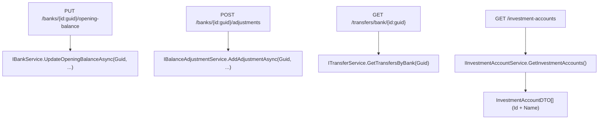

## 1. Technical Overview

**What:** Cut `Financial.Api`'s bank-scoped routes over from name segments to Guid segments — `BanksController`'s `/banks/{name}/...` routes become `/banks/{id:guid}/...`, `TransfersController`'s `/transfers/bank/{name}` becomes `/transfers/bank/{id:guid}` — removing the name→Guid resolution shim F04 added to keep those controllers compiling, since the route itself now carries the Guid directly. Adds a new read-only `GET /investment-accounts` endpoint mirroring the existing `GET /income-sources`/`GET /banks` pattern. The request/response DTOs themselves need no changes here — F04 already converted every `Income`/`Expense`/`Transfer`/`BalanceAdjustment`/`InvestmentSnapshot`/`Bank` DTO to the Id+Name shape this feature's contract requires.

**Why:** F04 made the Application layer Id-native but kept `Financial.Api`'s external HTTP contract name-based (a deliberate, minimal, compile-preserving stopgap). This feature finishes the cutover so the wire contract itself is Id-based — the contract F06 (WPF) and F07 (React) will build against.

**Scope:**
- Included: `BanksController`/`TransfersController` route parameter type change (`{name}` → `{id:guid}`); dropping the now-unnecessary local name→Guid resolution helpers those controllers gained in F04; the new `GET /investment-accounts` endpoint (`InvestmentAccountDTO`, `IInvestmentAccountService`/`InvestmentAccountService`, `InvestmentAccountsController`), DI-registered the same way `IIncomeSourceService` is.
- Excluded: any change to the Application-layer DTOs themselves (already Id-shaped since F04) or to the CashFlow services (already Guid-based since F04); WPF (`Financial.App`) and React (`Financial.Web`) callers of these routes — F06 and F07 respectively update them to send Guids instead of names. Until F06/F07 land, WPF's Balance Adjustment/Move Money/Opening Balance forms and React's equivalents will 404 against these specific routes (see Technical Decisions).

## 2. Architecture Impact

**Affected components:**
- `Financial.Api/Controllers/BanksController.cs` (modified — route params become `{id:guid}`; `ResolveBankId`/`TryResolveBankId` helpers removed; adjustment routes' unresolvable-id case moves from 400/empty-list to 404 for the write actions)
- `Financial.Api/Controllers/TransfersController.cs` (modified — `GetTransfersByBank` route param becomes `{id:guid}`; the controller-local `_bankService.GetBanks().FirstOrDefault(...)` lookup is removed since the route Guid is used directly)
- `Financial.CashFlow.Application/DTOs/InvestmentAccountDTO.cs` (new)
- `Financial.CashFlow.Application/Interfaces/IInvestmentAccountService.cs` (new)
- `Financial.CashFlow.Application/Services/InvestmentAccountService.cs` (new)
- `Financial.CashFlow.Application/DependencyInjection/CashFlowApplicationServiceCollectionExtensions.cs` (modified — registers `IInvestmentAccountService`)
- `Financial.Api/Controllers/InvestmentAccountsController.cs` (new)



## 3. Technical Decisions

| Decision | Chosen Approach | Alternative Considered | Trade-off |
|----------|-----------------|-------------------------|-----------|
| WPF/React breakage between F05 and F06/F07 | Accept it — `Financial.App`/`Financial.Web` keep sending bank *names* in these URL segments until F06/F07 land, so calls to `/banks/{id}/...` and `/transfers/bank/{id}` will 404 (a name fails the `{id:guid}` route constraint) in the meantime | Keep dual name+Guid routes alive during the transition | The PRD sequences F06/F07 as the very next features in this same wave-1→wave-2 rollout specifically to close this gap fast; a temporary dual-route shim adds real complexity (two routes, two resolution paths) for a personal single-user app's few-hour transition window — not worth it per the project's explicit no-over-engineering constitution |
| Unresolvable `{id}` on a **write** route (`PUT .../opening-balance`, `POST/PUT/DELETE .../adjustments`) | 404 Not Found, consistently across all four | Keep `AddAdjustment`'s current 400 (a F04-era workaround) | The PRD's F05 Error Handling states plainly: "A request to a `/banks/{id}/...` ... route with an Id that doesn't resolve to a real Bank returns 404" — the `{id}` here names the specific bank resource being mutated, so a non-existent one is a 404 (route-level), not a 400 (body-content validation); this also makes all four bank-scoped write actions consistent with each other, where today `AddAdjustment` is the odd one out |
| Unresolvable `{id}` on the **list** routes (`GET /banks/{id}/adjustments`, `GET /transfers/bank/{id}`) | Keep returning an empty list (unchanged from F04/pre-F04 behavior) | Also switch these to 404, per a literal reading of the same Error Handling sentence | The PRD's own Capabilities bullet for these two routes says they must "return the same records the equivalent name-based route returned before this change" — for an unrecognized bank that was always an empty list, never a 404 (see F04's own Error Handling: "A bank-scoped query ... with an Id that resolves to no `Bank` returns an empty result set rather than throwing"); the 404 sentence in Error Handling reads more naturally as targeting the mutation routes, where "operating on a resource that doesn't exist" is the correct REST framing |
| `InvestmentAccountDTO` shape | `Id`, `Name`, `IsActive`, `IsLiability` — mirrors `IncomeSourceDTO`'s shape exactly, using `InvestmentAccount`'s own fields | Include `Aliases` too | Nothing in the PRD or in F06/F07's stated needs (Id/Name resolution for a picklist) calls for aliases; `IncomeSourceDTO` set the precedent of exposing only what a picklist/read-model actually needs |
| `InvestmentAccountService` scope | Read-only `GetInvestmentAccounts()`, mirroring `IncomeSourceService` exactly (single method, no filtering) | Filter to `IsActive` only, matching how `InvestmentSnapshotService` scopes accounts internally | PRD explicitly says "returns the full seeded list with `Id` and `Name`" (Section 9 AC) — full list, not a filtered one; `IncomeSourcesController`/`GET /income-sources` already sets this precedent (unfiltered) for the exact same category of endpoint |

## 4. Component Overview

**Backend:**

| File Path | New/Modified | Purpose | Key Responsibilities |
|-----------|--------------|---------|----------------------|
| `Financial.Api/Controllers/BanksController.cs` | Modified | Bank/adjustment routes | `{name}` → `{id:guid}` on `UpdateOpeningBalance`, `AddAdjustment`, `UpdateAdjustment`, `DeleteAdjustment`, `GetAdjustmentsByBank`; route Guid passed straight to the service (no local resolution); write actions return 404 when the service reports the bank doesn't exist (via a small existence check against `IBankService.GetBanks()`), `GetAdjustmentsByBank` keeps returning an empty list for an unknown Id; `ResolveBankId`/`TryResolveBankId` helpers removed (or repurposed as a pure existence check, no longer a name lookup) |
| `Financial.Api/Controllers/TransfersController.cs` | Modified | Transfer-by-bank route | `GetTransfersByBank(string name)` → `GetTransfersByBank(Guid id)`; calls `ITransferService.GetTransfersByBank(id)` directly; drops the controller-local `_bankService.GetBanks().FirstOrDefault(b => b.Name == name)` lookup and the `IBankService` dependency it existed only for |
| `Financial.CashFlow.Application/DTOs/InvestmentAccountDTO.cs` | New | Investment account read model | `Id: Guid`, `Name: string`, `IsActive: bool`, `IsLiability: bool` — mirrors `IncomeSourceDTO` |
| `Financial.CashFlow.Application/Interfaces/IInvestmentAccountService.cs` | New | Investment account read contract | `IReadOnlyList<InvestmentAccountDTO> GetInvestmentAccounts()` |
| `Financial.CashFlow.Application/Services/InvestmentAccountService.cs` | New | Investment account read implementation | `GetInvestmentAccounts()` maps `_repository.GetInvestmentAccounts()` to `InvestmentAccountDTO`, mirroring `IncomeSourceService` line-for-line |
| `Financial.CashFlow.Application/DependencyInjection/CashFlowApplicationServiceCollectionExtensions.cs` | Modified | DI registration | Adds `services.AddSingleton<IInvestmentAccountService, InvestmentAccountService>();` alongside the existing `IIncomeSourceService` registration |
| `Financial.Api/Controllers/InvestmentAccountsController.cs` | New | Investment account endpoint | `[Route("investment-accounts")]`, single `GET` action returning `IReadOnlyList<InvestmentAccountDTO>` — mirrors `IncomeSourcesController` exactly |

No frontend files in this feature — F06 (WPF) and F07 (React) consume this contract separately.

## 5. API Contracts

**`PUT /banks/{id}/opening-balance`** (was `/banks/{name}/opening-balance`)
```
Request:  BankOpeningBalanceUpdateDTO { OpeningBalance: decimal, OpeningBalanceDate: date }
Response: 200 OK -> BankDTO { Id, Name, RoundUpEnabled, OpeningBalance, OpeningBalanceDate }
          400 Bad Request -> validation error (e.g. negative balance)
          404 Not Found -> {id} does not match a seeded Bank
```

**`POST /banks/{id}/adjustments`** (was `/banks/{name}/adjustments`)
```
Request:  BalanceAdjustmentCreateDTO { Date, TargetBalance, Note? }
Response: 200 OK -> BalanceAdjustmentDTO { Id, Date, BankId, BankName, TargetBalance, Delta, Note }
          400 Bad Request -> validation error (e.g. negative target balance)
          404 Not Found -> {id} does not match a seeded Bank
```

**`PUT /banks/{id}/adjustments/{adjustmentId}`** (was `/banks/{name}/adjustments/{adjustmentId}`)
```
Response: 200 OK -> BalanceAdjustmentDTO
          400 Bad Request -> validation error
          404 Not Found -> {id} does not match a seeded Bank, or {adjustmentId} does not exist
```

**`DELETE /banks/{id}/adjustments/{adjustmentId}`** (was `/banks/{name}/adjustments/{adjustmentId}`)
```
Response: 200 OK
          404 Not Found -> {id} does not match a seeded Bank, or {adjustmentId} does not exist
```

**`GET /banks/{id}/adjustments`** (was `/banks/{name}/adjustments`)
```
Response: 200 OK -> BalanceAdjustmentDTO[] (empty array if {id} matches no Bank)
```

**`GET /transfers/bank/{id}`** (was `/transfers/bank/{name}`)
```
Response: 200 OK -> TransferDTO[] (empty array if {id} matches no Bank)
```

**`GET /investment-accounts`** (new)
```json
Response: 200 OK
[
  { "id": "8f3b1c1a-...-200000000002", "name": "PlatinumVisa8003", "isActive": true, "isLiability": true },
  { "id": "8f3b1c1a-...-200000000008", "name": "ChaseSave", "isActive": true, "isLiability": false }
]
```

`GET /banks` (unchanged route, already returns `Id` since F04's `BankDTO` change — no work needed here, just confirming via test).

`POST /transfers`, `PUT /transfers/{id}`, income/expense create/update endpoints: routes and DTOs unchanged in this feature — they already carry Guid *body* fields (`SourceBankId`, `IncomeSourceId`, etc.) since F04; a request that sends a name string in one of those fields already fails JSON model binding with a 400, satisfying the PRD's "reject a request carrying a name string" AC with no new code.

## 6. Data Model

No relational schema; no DTO field renames in this feature (F04 already did that). One new DTO:

| DTO | Fields |
|-----|--------|
| `InvestmentAccountDTO` | `Id: Guid`, `Name: string`, `IsActive: bool`, `IsLiability: bool` |

## 7. Testing Strategy

| Test File | Test Type | Target | Coverage Goal |
|-----------|-----------|--------|----------------|
| `Tests/Financial.CashFlow.Application.Tests/Services/InvestmentAccountServiceTests.cs` | Unit (new) | `InvestmentAccountService` | `GetInvestmentAccounts()` maps every repository account to `Id`+`Name`+`IsActive`+`IsLiability`; empty repository returns empty list |
| `Tests/Financial.Api.Tests/InvestmentAccountsEndpointsTests.cs` | Integration (new) | `GET /investment-accounts` | Returns the full seeded list with `Id` and `Name` for every account (PRD F05 AC) |
| `Tests/Financial.Api.Tests/BanksEndpointsTests.cs` | Integration (modified) | `BanksController` | `PUT /banks/{id}/opening-balance` with a valid seeded Id succeeds; with an unresolvable Id returns 404 naming the invalid Id (PRD F05 AC); `GET /banks` items include `Id` (PRD F05 AC) |
| `Tests/Financial.Api.Tests/BalanceAdjustmentsEndpointsTests.cs` | Integration (modified) | `BanksController` adjustment routes | `POST`/`PUT`/`DELETE /banks/{id}/adjustments...` with a valid seeded Id return the same records the pre-change name-based route did (PRD F05 AC); with an unresolvable Id return 404 (PRD F05 AC); `GET /banks/{id}/adjustments` with an unresolvable Id returns an empty list, not 404 (behavior-preservation carried over from F04) |
| `Tests/Financial.Api.Tests/TransfersEndpointsTests.cs` | Integration (modified) | `TransfersController` | `GET /transfers/bank/{id}` with a valid seeded Id returns the same records the pre-change name-based route did (PRD F05 AC); with an unresolvable Id returns an empty list (behavior-preservation); `POST`/`PUT /transfers` reject a request whose Guid field carries a name string with 400 (PRD F05 AC) |
| `Tests/Financial.Api.Tests/ExpenseEndpointsTests.cs`, `IncomesEndpointsTests.cs` | Integration (modified where needed) | Expense/Income endpoints | Confirm `GET` responses include both Id and denormalized name for each reference (PRD F05 AC) — likely already covered by F04's test port; add only if a gap is found |
| `Tests/Financial.Api.Tests/Controllers/ControllerGuardClauseTests.cs` | Unit (modified) | Guard-clause stubs | `StubBankService`/`StubBalanceAdjustmentService`/`StubTransferService` signatures already match (Guid-based since F04) — no change expected, verify during implementation |

## Assumptions / Decisions (Auto-Accept — no interactive user available)

This spec was generated inside an autonomous multi-feature loop (`/loop`) with no user available for the interactive interview. Every open decision below was resolved with the documented default rather than paused on, following the same precedent set by F01-F04:

- **Complexity level:** `medium` (2 controller route-shape changes + 3 new small files for the investment-accounts endpoint + DI registration + tests; no DTO or service-layer changes needed, since F04 already delivered those).
- **WPF/React breakage window accepted**: between this feature merging and F06/F07 landing, `Financial.App`'s Balance Adjustment/Move Money/Opening Balance flows and `Financial.Web`'s equivalents will 404 against the now-Guid-only bank-scoped routes, since they still send names. This is a deliberate, temporary, and explicitly PRD-sequenced gap (F06/F07 are the very next features in this loop), not an oversight — see Technical Decisions.
- **404-vs-empty-list split** between write routes (404 for an unresolvable `{id}`) and list/query routes (empty list, unchanged) resolves an apparent tension between the PRD's Error Handling bullet (which reads as blanket 404) and its Capabilities/AC bullet for the two list routes (which explicitly requires unchanged, pre-existing behavior) — see Technical Decisions for the full reasoning.
- **No wire-shape changes to income/expense/transfer create/update DTOs**: F04 already made every body field Guid-typed; this feature only needs to prove (via tests) that a stray name string in one of those fields already 400s through normal ASP.NET Core model binding, not add new validation code.
