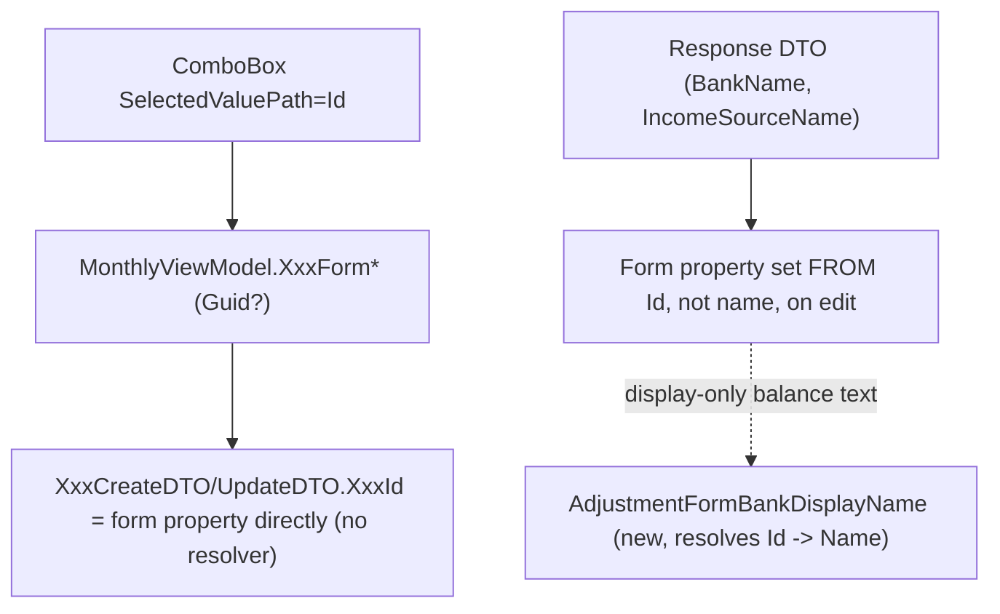

## 1. Technical Overview

**What:** Convert `MonthlyViewModel`'s six form-bound bank/income-source properties (`ExpenseFormPaymentSource`, `IncomeFormSource`, `IncomeFormBank`, `TransferFormSourceBank`, `TransferFormDestinationBank`, `AdjustmentFormBankName`) from `string` (name) to `Guid?`, switch every ComboBox bound to `Banks`/`IncomeSources` from `SelectedValuePath="Name"` to `SelectedValuePath="Id"`, and delete the `ResolveBankId`/`ResolveIncomeSourceId` name→Guid lookup shims F04 added — every one of their 12 call sites now passes the already-Guid form property straight through. The `MarkPaidSources` dictionary (card-statement "pay from" bank) moves from `Dictionary<Guid, string>` to `Dictionary<Guid, Guid>`, trivial since `CardsGridView.xaml.cs`'s code-behind already holds the full `BankDTO` (with `.Id`) at the point it currently discards it for `.Name`.

**Why:** F05 finished cutting the Web API's wire contract over to Guid; F04 already made the Application layer Guid-native. `MonthlyViewModel` is the last name-based link in the chain — its forms still submit bank/income-source *names*, which F05's route/DTO changes make invalid the moment F06 doesn't land. This feature retires the F04-era compile-preserving shims (their own doc comment literally says "Forms remain name-based until F06 introduces Id-based picklists") and finishes the cutover with zero visible UX change.

**Scope:**
- Included: the 6 named form properties' type change; `IncomeSourceOptions`'s projection (from a flat name list to an `Id`+`Name`-carrying list so its ComboBox can bind `SelectedValuePath="Id"`); `MarkPaidSources`; every validation class (`ExpenseFormValidation`, `IncomeFormValidation`, `TransferFormValidation`) whose signature carries a bank/source name parameter; `IsSameBankTransfer`/`IsAdjustmentBankSelected`/`ShowIncomeGrossValueField`/`ShowRoundUpField` (all currently string-keyed comparisons touching the converted properties); `AdjustmentFormBankName`'s current-balance lookup (needs `BankTotalRow` to gain a `BankId` field, since the lookup can no longer match by name); the `AdjustmentFormBankName` display-text `MultiBinding` (needs a separate name-only display property so the UI doesn't print a raw Guid); `CardsGridView.xaml.cs`'s one-line `bank.Name`→`bank.Id` change; deleting the two now-dead resolver shims.
- Excluded (explicitly, and confirmed by existing tests proving they're client-side-only): `SelectedBankFilter`/`BankFilterOptions` (the Bank tab's cross-bank filter — PRD's F06 Capabilities list names the 6 form properties only, not this filter; `BankFilter_ChangingSelection_DoesNotRefetchData` proves it never calls a service, so there's no wire-contract pressure forcing a change here). `BankOperationRow`'s name-carrying display fields (`SourceBank`/`DestinationBank`/`Bank`/`BankLabel`) — pure read-only display composites, no submission path. Grid columns showing `*Name` fields — already correct since a prior fix. React forms — that's F07.

## 2. Architecture Impact

**Affected components:**
- `Financial.App/ViewModels/CashFlow/MonthlyViewModel.cs` (modified — the 6 form properties, `IncomeSourceOptions`, `MarkPaidSources`/`SetMarkPaidSource`, `IsSameBankTransfer`, `IsAdjustmentBankSelected`, `ShowIncomeGrossValueField`, `ShowRoundUpField`, `AdjustmentFormBankName`'s balance lookup, `ShowMoveMoneyFormCommand`'s parameter type, deletion of `ResolveBankId`/`ResolveIncomeSourceId` and simplification of their 12 call sites)
- `Financial.App/ViewModels/CashFlow/BankTotalRow.cs` (modified — adds `BankId`, needed by `AdjustmentFormBankName`'s current-balance lookup)
- `Financial.App/ViewModels/CashFlow/ExpenseFormValidation.cs`, `IncomeFormValidation.cs`, `TransferFormValidation.cs` (modified — bank/source parameters become `Guid?`)
- `Financial.App/Views/CashFlow/IncomeFormView.xaml`, `ExpenseFormView.xaml`, `TransferFormView.xaml`, `BalanceAdjustmentFormView.xaml` (modified — `SelectedValuePath="Name"` → `"Id"`, `SelectedValue`/`SelectedItem` bindings adjusted where needed; `BalanceAdjustmentFormView.xaml`'s current-balance `MultiBinding` switches from `AdjustmentFormBankName` to a new display-only property)
- `Financial.App/Views/CashFlow/CardsGridView.xaml.cs` (modified — one line)

## 3. Technical Decisions

| Decision | Chosen Approach | Alternative Considered | Trade-off |
|----------|-----------------|-------------------------|-----------|
| Property type for all 6 converted fields | `Guid?` (nullable) uniformly | `Guid` (non-nullable) with `Guid.Empty` as the "unselected" sentinel | `AdjustmentFormBankName` already represents "no bank chosen yet" as `string.Empty` on create, and `ExpenseFormPaymentSource` is cleared to empty in card-payment mode — `null` is a cleaner, unambiguous "nothing selected" than a magic `Guid.Empty` sentinel, and keeps every validator's check a simple `is null` rather than a comparison against a sentinel value |
| `SelectedBankFilter`/`BankFilterOptions` (Bank tab filter) | Left as `string`, untouched | Convert to `Guid?` for full consistency | Not in the PRD's F06 Capabilities list (which names exactly the 6 form properties); it's a pure client-side filter over an already-loaded `BankOperationRow` list with a proven-by-test no-refetch guarantee (`BankFilter_ChangingSelection_DoesNotRefetchData`) — converting it doesn't retire any shim or unblock any F05 wire-contract requirement, so it's out of scope per the project's no-over-engineering constitution |
| `AdjustmentFormBankName`'s current-balance display text | Add `BankTotalRow.BankId` and a new `AdjustmentFormBankDisplayName` computed property (`Banks.FirstOrDefault(b => b.Id == AdjustmentFormBankName)?.Name`); XAML's `MultiBinding` switches to the new property | Add a Guid→Name `IValueConverter` | A computed ViewModel property is simpler than a converter for a single call site, consistent with how the codebase already exposes other computed display properties (`ShowRoundUpField`, `IsSameBankTransfer`, etc.) rather than reaching for XAML converters |
| `IncomeSourceOptions` | Changes from `IReadOnlyList<string>` to `IReadOnlyList<IncomeSourceDTO>` (same filter-by-`IsActive` + custom display-order sort, now projecting the whole DTO instead of just `.Name`) | Introduce a small `{Id, Name}` display record | Reusing `IncomeSourceDTO` directly avoids introducing a new type for a same-shape purpose; the ComboBox only needs `DisplayMemberPath="Name"`/`SelectedValuePath="Id"`, both of which `IncomeSourceDTO` already has |
| `IncomeSourceRank`/`IncomeSourcesWithGrossValue`/`ShowIncomeGrossValueField` | Stay name-keyed (`IncomeSourceDisplayOrder`/`IncomeSourcesWithGrossValue` remain `string[]`/`HashSet<string>` of names); `ShowIncomeGrossValueField` resolves `IncomeFormSource` (now `Guid?`) back to its name via `IncomeSources.FirstOrDefault(s => s.Id == IncomeFormSource)?.Name` before checking membership | Convert `IncomeSourcesWithGrossValue` to a `HashSet<Guid>` of hardcoded seeded Ids | Seeded Ids are freshly generated per deployment (see F01's migration tooling) and are not stable across environments the way the *names* "Gleison"/"Ariana" are — hardcoding Guids would break on every fresh install; a one-line resolve-then-check is a minimal, correct fix that doesn't reintroduce a general-purpose name resolver |
| `ShowMoveMoneyFormCommand`'s parameter type | `RelayCommand<string>` → `RelayCommand<Guid?>`, `ShowCreateTransferForm(string? sourceBank)` → `ShowCreateTransferForm(Guid? sourceBank)` | Leave as `string`, since no current XAML caller actually passes a value | The parameter type must match `TransferFormSourceBank`'s new `Guid?` type for the method body (`TransferFormSourceBank = sourceBank ?? ...`) to compile; leaving it `string` would just reintroduce a name round-trip at the one place it's currently unused, which is worse than fixing the type now while it's already being touched |
| `adjustmentsByBank` dictionary (`RefreshAsync`, keyed by bank name) | Left as-is (`Dictionary<string, IReadOnlyList<BalanceAdjustmentDTO>>`) | Convert to `Dictionary<Guid, ...>` for consistency | Confirmed via codebase inspection that the string keys are never read back (only `.Values` is consumed by `BuildBankOperations`) — it's vestigial but harmless, and not a form-bound property in this feature's scope; touching it would be unrelated scope creep |

## 4. Component Overview

**Frontend (WPF):**

| File Path | New/Modified | Purpose | Key Responsibilities |
|-----------|--------------|---------|----------------------|
| `Financial.App/ViewModels/CashFlow/MonthlyViewModel.cs` | Modified | Monthly tab forms | `ExpenseFormPaymentSource`/`IncomeFormSource`/`IncomeFormBank`/`TransferFormSourceBank`/`TransferFormDestinationBank`/`AdjustmentFormBankName` become `Guid?`; `IncomeSourceOptions` becomes `IReadOnlyList<IncomeSourceDTO>`; `MarkPaidSources` becomes `Dictionary<Guid, Guid>`; `SetMarkPaidSource(Guid, Guid)`; `IsSameBankTransfer`/`IsAdjustmentBankSelected` use Guid comparisons; `ShowIncomeGrossValueField` resolves Id→name before the membership check; `ShowRoundUpField` compares `Banks` by `Id`; new `AdjustmentFormBankDisplayName` computed property; `ShowMoveMoneyFormCommand`/`ShowCreateTransferForm` take `Guid?`; `ResolveBankId`/`ResolveIncomeSourceId` deleted, all 12 call sites simplified to pass the form property directly |
| `Financial.App/ViewModels/CashFlow/BankTotalRow.cs` | Modified | Bank totals row | Adds `required Guid BankId { get; init; }`, populated from `bank.Id` in `BuildBankTotals` |
| `Financial.App/ViewModels/CashFlow/ExpenseFormValidation.cs` | Modified | Expense form validation | `paymentSource: string` → `Guid? paymentSource`; check becomes `paymentSource is null` |
| `Financial.App/ViewModels/CashFlow/IncomeFormValidation.cs` | Modified | Income form validation | `incomeSource: string` → `Guid? incomeSource`, `bank: string` → `Guid? bank`; checks become `is null` |
| `Financial.App/ViewModels/CashFlow/TransferFormValidation.cs` | Modified | Transfer form validation | `sourceBank`/`destinationBank: string` → `Guid?`; same-bank check becomes a Guid equality (already correct semantics, now type-safe) |
| `Financial.App/Views/CashFlow/IncomeFormView.xaml` | Modified | Income form | Source ComboBox: `ItemsSource="{Binding IncomeSourceOptions}"` gains `DisplayMemberPath="Name"` `SelectedValuePath="Id"`, `SelectedItem` → `SelectedValue`; Bank ComboBox: `SelectedValuePath="Name"` → `"Id"` |
| `Financial.App/Views/CashFlow/ExpenseFormView.xaml` | Modified | Expense form | Payment Source ComboBox: `SelectedValuePath="Name"` → `"Id"` |
| `Financial.App/Views/CashFlow/TransferFormView.xaml` | Modified | Transfer form | Both bank ComboBoxes: `SelectedValuePath="Name"` → `"Id"` |
| `Financial.App/Views/CashFlow/BalanceAdjustmentFormView.xaml` | Modified | Balance adjustment form | Bank ComboBox: `SelectedValuePath="Name"` → `"Id"`; current-balance `MultiBinding` switches from `AdjustmentFormBankName` to `AdjustmentFormBankDisplayName` |
| `Financial.App/Views/CashFlow/CardsGridView.xaml.cs` | Modified | Card statement "pay from" handler | `viewModel.SetMarkPaidSource(statement.Id, bank.Name)` → `viewModel.SetMarkPaidSource(statement.Id, bank.Id)` |

No backend files in this feature — the Web API contract (F05) and Application layer (F04) are already correct; this feature only changes how the WPF client talks to them.

## 5. API Contracts

None — this feature only changes what the already-Guid-typed `Financial.Api` request DTOs get populated *with* on the client side (the form's selected Guid, submitted directly instead of resolved from a name). No route or DTO shape changes.

## 6. Data Model

No relational schema. ViewModel-local type changes only:

| Type | Before | After |
|------|--------|-------|
| `MonthlyViewModel.ExpenseFormPaymentSource` | `string` | `Guid?` |
| `MonthlyViewModel.IncomeFormSource` | `string` | `Guid?` |
| `MonthlyViewModel.IncomeFormBank` | `string` | `Guid?` |
| `MonthlyViewModel.TransferFormSourceBank` | `string` | `Guid?` |
| `MonthlyViewModel.TransferFormDestinationBank` | `string` | `Guid?` |
| `MonthlyViewModel.AdjustmentFormBankName` | `string` | `Guid?` |
| `MonthlyViewModel.IncomeSourceOptions` | `IReadOnlyList<string>` | `IReadOnlyList<IncomeSourceDTO>` |
| `MonthlyViewModel.MarkPaidSources` | `Dictionary<Guid, string>` | `Dictionary<Guid, Guid>` |
| `BankTotalRow.BankId` | *(doesn't exist)* | `Guid` (new field) |
| `MonthlyViewModel.AdjustmentFormBankDisplayName` | *(doesn't exist)* | `string` (new, computed, read-only) |

## 7. Testing Strategy

| Test File | Test Type | Target | Coverage Goal |
|-----------|-----------|--------|----------------|
| `Tests/Financial.Presentation.Tests/ViewModels/CashFlow/MonthlyViewModelTests.cs` | Unit (modified) | Expense/Income form save/edit/delete, round-up visibility, gross-value visibility | Every test currently setting `ExpenseFormPaymentSource`/`IncomeFormSource`/`IncomeFormBank` to a name string instead sets it to the corresponding seeded bank/source's `Id`; assertions on `LastCreateRequest.PaymentSourceBankId`/`BankId`/`IncomeSourceId` continue to pass since those DTO fields were already Guid-typed; round-up field visibility (`SelectingRoundUpEnabledBank_ShowsRoundUpField` etc.) and gross-value visibility (`AddIncome_GleisonSource_ShowsGrossValueField` etc.) re-verified against Guid-keyed selection |
| `Tests/Financial.Presentation.Tests/ViewModels/CashFlow/MonthlyViewModelBanksCardsTests.cs` | Unit (modified) | Transfer/Adjustment save/edit/delete, card mark-paid | `TransferFormSourceBank`/`TransferFormDestinationBank`/`AdjustmentFormBankName` test setup switches to Ids; `AddTransfer_SameSourceAndDestination_BlocksSaveWithoutServiceCall` re-verified with Guid equality; `MarkCardStatementPaid_RequiresBankSelected_ThenCallsService` updated for `SetMarkPaidSource(Guid, Guid)` |
| `Tests/Financial.Presentation.Tests/ViewModels/CashFlow/MonthlyViewModelBankOperationsTests.cs` | Unit (unaffected, re-run to confirm) | Bank tab filter/operations list | Confirms `SelectedBankFilter`/`BankFilterOptions` and `BankOperationRow` continue to work untouched (PRD AC: "dropdowns display the same set of options as before this change") |
| `Tests/Financial.Presentation.Tests/ViewModels/CashFlow/ExpenseFormValidationTests.cs`, `IncomeFormValidationTests.cs`, `TransferFormValidationTests.cs` | Unit (modified) | Form validators | String bank/source literals replaced with `Guid.NewGuid()`/`null` per case; assert the same validation-message behavior for present vs. missing selection |
| `Tests/Financial.Presentation.Tests/ViewModels/CashFlow/BalanceAdjustmentFormValidationTests.cs` | Unit (unaffected, re-run to confirm) | Balance adjustment validator | Signature unchanged (`date, targetBalance` only) — confirms no regression |

## Assumptions / Decisions (Auto-Accept — no interactive user available)

This spec was generated inside an autonomous multi-feature loop (`/loop`) with no user available for the interactive interview. Every open decision below was resolved with the documented default rather than paused on, following the same precedent set by F01-F05. A dedicated Explore pass was run first to build an exhaustive map of every affected property, call site, XAML binding, and test file before any decision was made — see Technical Decisions for the reasoning behind each one.

- **Complexity level:** `complex` (6 interconnected form properties across 1 large ViewModel, 4 XAML views, 1 code-behind, 3 validation classes, deletion of 2 shim methods across 12 call sites, plus a genuine UX-preservation risk in `AdjustmentFormBankName`'s display text that needed its own fix).
- **`Guid?` (nullable) chosen uniformly** over `Guid` + `Guid.Empty` sentinel for all 6 converted properties — see Technical Decisions.
- **`SelectedBankFilter`/`BankFilterOptions` explicitly excluded** from this feature's scope — confirmed out of the PRD's named property list and proven client-side-only by existing tests.
- **`AdjustmentFormBankDisplayName`** is a new addition not explicitly named in the PRD, added to prevent a real UX regression (a raw Guid appearing in the "Current calculated balance for X" text) that a literal reading of the PRD's property list would otherwise silently introduce.
