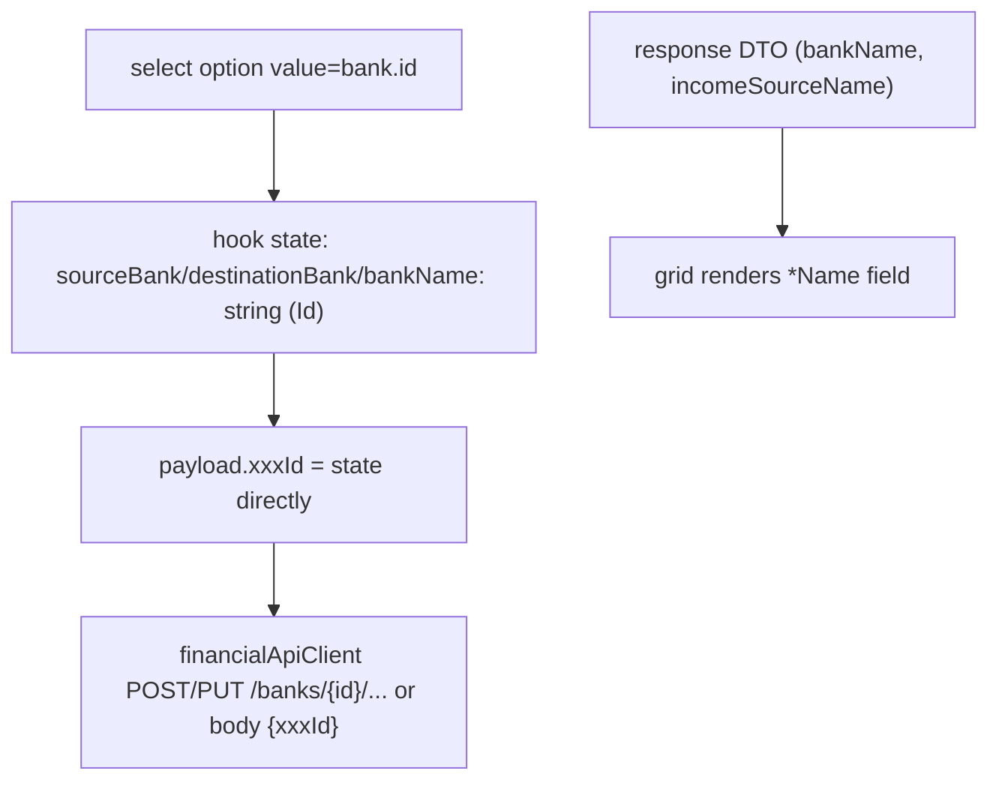

## 1. Technical Overview

**What:** Bring `Financial.Web`'s `types.ts` DTOs and the Income/Expense/Transfer/BalanceAdjustment forms up to date with the Guid-based contract F05 already shipped. `types.ts` currently describes the *pre-F04* shape entirely — none of its CashFlow interfaces (`ExpenseDto`, `IncomeDto`, `TransferDto`, `BalanceAdjustmentDto`, `BankDto`, `MarkCardStatementPaidDto`, and their Create/Update variants) match the real API's current JSON field names at all, so every one of these fields already deserializes as `undefined` against the live backend. This is not a forward-looking conversion — the frontend is currently broken against the real API and this feature is the fix.

**Why:** F05 finished the backend cutover (Guid DTOs, Guid routes); F06 did the equivalent for the WPF client. `Financial.Web` is the last unconverted client. Its Balance Adjustment forms are the most severely affected: `useBalanceAdjustmentForm.ts` builds URLs like `/banks/${bankName}/adjustments`, and F05's route now requires `{id:guid}` — a name segment fails ASP.NET Core's route constraint outright, so every adjustment create/update/list/delete call already 404s against the real backend, exactly the same breakage F06's PR fixed on the WPF side.

**Scope:**
- Included: `types.ts`'s `BankDto`, `IncomeSourceDto` (already correct), `ExpenseDto`/`CreateExpenseDto`/`UpdateExpenseDto`, `IncomeDto`/`CreateIncomeDto`/`UpdateIncomeDto`, `TransferDto`/`CreateTransferDto`/`UpdateTransferDto`, `BalanceAdjustmentDto`, `MarkCardStatementPaidDto` — updated to the real Guid+Name JSON shape. `IncomeForm.tsx`/`ExpenseForm.tsx`/`TransferForm.tsx`/`BalanceAdjustmentForm.tsx`'s bank/source `<select>` options switch from `value={x.name}` to `value={x.id}`. `useMonthly.ts`, `useTransferForm.ts`, `useBalanceAdjustmentForm.ts` submit Id fields; `financialApiClient.ts`'s `createBalanceAdjustment`/`updateBalanceAdjustment`/`getAdjustmentsByBank`/`deleteBalanceAdjustment` (and `useBankOperations.ts`'s callers) switch their bank-name URL parameter to a bank Id, matching F05's route. Read-only grids (`ExpensesSection.tsx`, `IncomeSection.tsx`, `BanksGrid.tsx`, `IncomingGrid.tsx`, `BankOperationsSection.tsx`, `CardsGrid.tsx`'s mark-paid picker) switch to reading the denormalized `*Name` field.
- Excluded: `InvestmentAccountDto`/`GET /investment-accounts` — not consumed by any of these four forms (mirrors F06's own scope boundary: no Investment Snapshot account picker is part of this PRD's named reference forms). Card-tag `<select>` in `ExpenseForm.tsx` — a hardcoded enum list, not a Bank/IncomeSource reference. `mapTransferErrorToField.ts`/`mapBalanceAdjustmentErrorToField.ts` — confirmed (see Technical Decisions) to need no change, since they compare the error message's extracted value against whatever the caller currently holds in `sourceBank`/`destinationBank` state, which will already be the matching Guid string post-conversion.

## 2. Architecture Impact

**Affected components:**
- `Financial.Web/src/api/types.ts` (modified — DTO shape corrections, see Data Model)
- `Financial.Web/src/api/financialApiClient.ts` (modified — balance-adjustment methods' bank parameter renamed/repurposed from name to Id; no URL-shape change, just what's interpolated)
- `Financial.Web/src/components/IncomeForm.tsx`, `ExpenseForm.tsx`, `TransferForm.tsx`, `BalanceAdjustmentForm.tsx` (modified — `<option value>` switches to `.id`; props switch from name-string to id-string)
- `Financial.Web/src/components/CardsGrid.tsx` (modified — mark-paid bank picker option value switches to `.id`; grid's own card-tag display unaffected)
- `Financial.Web/src/components/ExpensesSection.tsx`, `IncomeSection.tsx`, `BanksGrid.tsx`, `IncomingGrid.tsx`, `BankOperationsSection.tsx` (modified — read the corrected `*Name` field)
- `Financial.Web/src/hooks/useMonthly.ts` (modified — create/update payloads send Id fields; `bankTotals`/round-up/gross-value lookups compare by Id; `BankTotal` gains `bankId`)
- `Financial.Web/src/hooks/useTransferForm.ts` (modified — state and payload become Id-based; destination-bank exclusion filter compares by Id)
- `Financial.Web/src/hooks/useBalanceAdjustmentForm.ts` (modified — state becomes Id-based; `resolveCurrentBalance` compares by `bankId`; API client calls pass Id instead of name)
- `Financial.Web/src/hooks/useBankOperations.ts` (modified — `getAdjustmentsByBank`/`deleteAdjustment` pass bank Id; `BankOperationEntry` carries Id fields alongside display names)

## 3. Technical Decisions

| Decision | Chosen Approach | Alternative Considered | Trade-off |
|----------|-----------------|-------------------------|-----------|
| Frontend "unselected" sentinel for a bank/source Id | Keep `string` typing with `''` as the "nothing chosen" sentinel (matching the codebase's existing convention: `TransferForm.tsx`/`BalanceAdjustmentForm.tsx` already render `<option value="">Select a bank</option>`) | Introduce `string \| null`, mirroring the WPF F06 conversion's `Guid?` choice | A native HTML `<select>`'s `value` can never literally be `null` (only a string), so `string \| null` would just require an extra `?? ''` at every binding point for no benefit; the codebase already has a working `''`-as-unselected idiom in two of the four forms — extending it to all four keeps one consistent pattern instead of two |
| `mapTransferErrorToField.ts` / `mapBalanceAdjustmentErrorToField.ts` | No code change | Update the bank-not-found regex to expect a Guid pattern | Traced through: the regex extracts whatever value is embedded in the backend's error message and compares it against the `sourceBank`/`destinationBank` strings the *caller* passes in — once those caller-side strings become Guid strings (this feature's own change), the comparison keeps working automatically, since the backend's message and the frontend's state will both hold the same Guid text. No Guid-specific parsing needed. |
| `BankTotal`/`BankOperationEntry`/`IncomeTotal` (read-only aggregate rows) | Add `bankId`/`sourceBankId`/`destinationBankId` fields only where an existing lookup needs to switch off name-matching to Id-matching (`BankTotal.bankId`, needed by `resolveCurrentBalance`); leave purely-display fields (`IncomeTotal.source`, `BankOperationEntry`'s display text) grouped/rendered by name, unchanged | Convert every aggregate's grouping key to Id | Mirrors the exact same scope boundary F06 drew for `BankTotalRow`/`IncomeTotalRow` on the WPF side — only add an Id where a real lookup depends on it, not for aggregates that are purely for display |
| `INCOME_SOURCES_WITH_GROSS_VALUE` (`['Gleison', 'Ariana']`) | Stays a name array; the gross-value-field visibility check resolves the selected Id back to its name via the fetched `incomeSources` list before checking membership | Convert to a hardcoded Guid array | Same reasoning as F06's `IncomeSourcesWithGrossValue`: seeded Guids aren't stable across deployments (fresh migration run mints new ones), but the names "Gleison"/"Ariana" are; a one-line resolve-then-check is minimal and correct |
| `financialApiClient.ts` balance-adjustment method parameter | Rename `bankName: string` → `bankId: string` (still a plain string parameter, just now expected to hold a Guid) | Change the parameter type to a branded `Guid` type | TypeScript has no native Guid type and the codebase doesn't use branded types anywhere else for this; a plain `string` with a renamed parameter and updated JSDoc is consistent with how every other Id already flows through this file (e.g. `id: string` on `updateTransfer`) |

## 4. Component Overview

**Frontend (React):**

| File Path | New/Modified | Purpose | Key Responsibilities |
|-----------|--------------|---------|----------------------|
| `Financial.Web/src/api/types.ts` | Modified | CashFlow DTO shapes | `BankDto` gains `id: string`; `ExpenseDto`/`Create`/`UpdateExpenseDto`: `paymentSource` → `paymentSourceBankId: string \| null` (Create/Update), read DTO adds `paymentSourceBankName: string \| null`; `IncomeDto`/`Create`/`UpdateIncomeDto`: `incomeSource`/`bank` → `incomeSourceId`/`bankId: string` (Create/Update), read DTO adds `incomeSourceName`/`bankName: string`; `TransferDto`/`Create`/`UpdateTransferDto`: `sourceBank`/`destinationBank` → `sourceBankId`/`destinationBankId: string` (Create/Update), read DTO adds `sourceBankName`/`destinationBankName: string`; `BalanceAdjustmentDto`: `bank` → `bankId`/`bankName: string`; `MarkCardStatementPaidDto`: `paymentSource` → `paymentSourceBankId: string \| null` |
| `Financial.Web/src/api/financialApiClient.ts` | Modified | HTTP client | `createBalanceAdjustment`/`updateBalanceAdjustment`/`getAdjustmentsByBank`/`deleteBalanceAdjustment`'s `bankName` parameter renamed `bankId`, still interpolated into the same URL segment shape |
| `Financial.Web/src/components/IncomeForm.tsx` | Modified | Income form | Source/Bank `<select>` options: `value={x.name}` → `value={x.id}`; `incomeSource`/`bank` props become Id strings |
| `Financial.Web/src/components/ExpenseForm.tsx` | Modified | Expense form | Payment Source `<select>`: `value={b.name}` → `value={b.id}`; `paymentSource` prop becomes an Id string; `selectedBank` lookup switches to `.id` |
| `Financial.Web/src/components/TransferForm.tsx` | Modified | Transfer form | From/To `<select>`s: `value={b.name}` → `value={b.id}`; `sourceBank`/`destinationBank` props become Id strings; destination-exclusion filter compares by `.id` |
| `Financial.Web/src/components/BalanceAdjustmentForm.tsx` | Modified | Balance adjustment form | Bank `<select>`: `value={b.name}` → `value={b.id}`; `bankName` prop becomes an Id string (name kept only where already displayed as static text while editing, sourced from the denormalized `bankName` display field passed in separately) |
| `Financial.Web/src/components/CardsGrid.tsx` | Modified | Card statement mark-paid picker | Bank `<select>` option value switches to `.id` |
| `Financial.Web/src/components/ExpensesSection.tsx`, `IncomeSection.tsx`, `BanksGrid.tsx`, `IncomingGrid.tsx`, `BankOperationsSection.tsx` | Modified | Read-only grids | Read `paymentSourceBankName`/`bankName`/`incomeSourceName`/`sourceBankName`/`destinationBankName` instead of the stale name field |
| `Financial.Web/src/hooks/useMonthly.ts` | Modified | Expense/Income CRUD, aggregates | Create/update payloads send `*Id` fields; `bankTotals` compares `expense.paymentSourceBankId === bank.id`, `bankBalances.find` unaffected (backend `BankBalanceDTO` isn't part of this conversion — still name-keyed, see Data Model); `incomeTotals` groups by `income.incomeSourceName`; gross-value visibility resolves Id→name before the `INCOME_SOURCES_WITH_GROSS_VALUE` check; `markStatementPaid` sends the selected bank's Id |
| `Financial.Web/src/hooks/useTransferForm.ts` | Modified | Transfer CRUD | State/payload become Id-based; default source bank uses `banks[0]?.id`; edit pre-fill reads `transfer.sourceBankId`/`.destinationBankId` |
| `Financial.Web/src/hooks/useBalanceAdjustmentForm.ts` | Modified | Balance adjustment CRUD | State becomes Id-based; `resolveCurrentBalance` compares `bankTotal.bankId === bankId`; `createBalanceAdjustment`/`updateBalanceAdjustment` calls pass the bank Id |
| `Financial.Web/src/hooks/useBankOperations.ts` | Modified | Bank tab operations list | `getAdjustmentsByBank`/`deleteAdjustment` pass bank Id; `BankOperationEntry` reads `*BankName`/`bankName` fields from the corrected DTOs for display |

No backend files in this feature — F04/F05 already delivered the Guid contract this feature consumes.

## 5. API Contracts

None — this feature only changes what the already-correct `Financial.Api` endpoints are called with and how their responses are typed on the client. No route or backend DTO shape changes (see F05's spec for the actual contract).

## 6. Data Model

No relational schema. `types.ts` interface field changes:

| Interface | Before | After |
|-----------|--------|-------|
| `BankDto` | `{ name, roundUpEnabled }` | `{ id, name, roundUpEnabled }` (`openingBalance`/`openingBalanceDate` exist on the backend DTO too but aren't currently modeled or used by these forms — out of scope, left as-is) |
| `ExpenseDto` | `paymentSource: string \| null` | `paymentSourceBankId: string \| null`, `paymentSourceBankName: string \| null` |
| `CreateExpenseDto` / `UpdateExpenseDto` | `paymentSource: string \| null` | `paymentSourceBankId: string \| null` |
| `IncomeDto` | `incomeSource: string`, `bank: string` | `incomeSourceId`, `incomeSourceName`, `bankId`, `bankName: string` |
| `CreateIncomeDto` / `UpdateIncomeDto` | `incomeSource: string`, `bank: string` | `incomeSourceId: string`, `bankId: string` |
| `TransferDto` | `sourceBank: string`, `destinationBank: string` | `sourceBankId`, `sourceBankName`, `destinationBankId`, `destinationBankName: string` |
| `CreateTransferDto` / `UpdateTransferDto` | `sourceBank: string`, `destinationBank: string` | `sourceBankId: string`, `destinationBankId: string` |
| `BalanceAdjustmentDto` | `bank: string` | `bankId: string`, `bankName: string` |
| `MarkCardStatementPaidDto` | `paymentSource: string` | `paymentSourceBankId: string \| null` |
| `BankTotal` (frontend-only aggregate, in `useMonthly.ts`) | `{ bank, balance, roundUpTotal }` | `{ bankId, bank, balance, roundUpTotal }` (new `bankId`, `bank` name kept for display) |

`IncomeSourceDto` and `IncomeTotal` are unaffected (already/still correctly Id+name where needed, or purely display-name where an Id was never required).

## 7. Testing Strategy

| Test File | Test Type | Target | Coverage Goal |
|-----------|-----------|--------|----------------|
| `Financial.Web/src/components/__tests__/IncomeForm.test.tsx`, `ExpenseForm.test.tsx`, `TransferForm.test.tsx`, `BalanceAdjustmentForm.test.tsx` | Unit (modified) | Form components | Every fixture bank/income-source object gains an `id`; option-selection assertions and `onFieldChange` expectations switch from name strings to Id strings; round-up visibility (by bank id), gross-value visibility (by resolved name), same-bank/destination-exclusion logic (by id) re-verified |
| `Financial.Web/src/components/__tests__/CardsGrid.test.tsx`, `BanksGrid.test.tsx`, `IncomingGrid.test.tsx`, `ExpensesSection.test.tsx`, `IncomeSection.test.tsx`, `BankOperationsSection.test.tsx` | Unit (modified where needed) | Read-only grids | Fixtures updated to the new DTO shape (`*Name` fields); rendered text assertions unchanged (still names), proving the display-layer AC ("Existing records display their correct bank/source/account name") |
| `Financial.Web/src/hooks/__tests__/useMonthly.test.ts`, `useTransferForm.test.ts`, `useBalanceAdjustmentForm.test.ts`, `useBankOperations.test.ts` | Unit (modified) | Hooks | Create/update payload assertions switch to Id fields (PRD F07 AC: "Submitting each form sends a Guid Id... for every affected field"); `useBalanceAdjustmentForm`'s and `useBankOperations`' API-client-call assertions switch from a bank name argument to a bank Id argument, proving the F05 route-compatibility fix |
| `Financial.Web/src/hooks/__tests__/mapTransferErrorToField.test.ts`, `mapBalanceAdjustmentErrorToField.test.ts` | Unit (re-run to confirm) | Error-to-field mapping | Confirms no regression — these compare against whatever `sourceBank`/`destinationBank` state the caller passes, which is now a Guid string end-to-end |
| `Financial.Web/src/pages/__tests__/MonthlyPage.test.tsx` | Integration (modified) | Full form CRUD via component tree | End-to-end re-verification that dropdowns list the same options (PRD F07 AC: "dropdowns display the same set of options as before this change") and every save/edit flow submits and displays correctly through the real component tree against a mocked API client |

## Assumptions / Decisions (Auto-Accept — no interactive user available)

This spec was generated inside an autonomous multi-feature loop (`/loop`) with no user available for the interactive interview. Every open decision below was resolved with the documented default rather than paused on, following the same precedent set by F01-F06. A dedicated Explore pass was run first (twice, after the first attempt was cut off mid-stream by a transient API error) to build an exhaustive map of `types.ts`, all four form components, all four hooks, every read-only grid, and existing test coverage before any decision was made — see Technical Decisions for the reasoning behind each one.

- **Complexity level:** `complex` (a completely stale `types.ts` needing a full DTO-shape correction across 8+ interfaces, 4 form components, 4 hooks, 6 read-only display components, and the widest-blast-radius integration test file in the frontend, `MonthlyPage.test.tsx`).
- **`''` (empty string) chosen as the "unselected" sentinel** over `string | null`, extending the codebase's own existing convention rather than introducing the WPF F06 conversion's `Guid?`-null pattern — see Technical Decisions.
- **`InvestmentAccountDto`/`GET /investment-accounts` explicitly excluded** — confirmed via Explore that no form in this PRD's scope (Income/Expense/Transfer/BalanceAdjustment) uses it; mirrors F06's identical scope boundary.
- **Error-message-to-field mapper files confirmed to need no change** — traced the actual comparison logic rather than assuming a Guid-specific rewrite was needed; see Technical Decisions.
- **`types.ts` is being corrected, not just extended**: this is best understood as fixing a frontend that has been broken against the real API since F04 merged (every affected field currently deserializes as `undefined`), not as a forward-looking migration — the PRD's framing of F06/F07 as "the same UX, now backed by Id" undersells how broken the current React client already is against the live backend for Balance Adjustments specifically (404 on every route).
