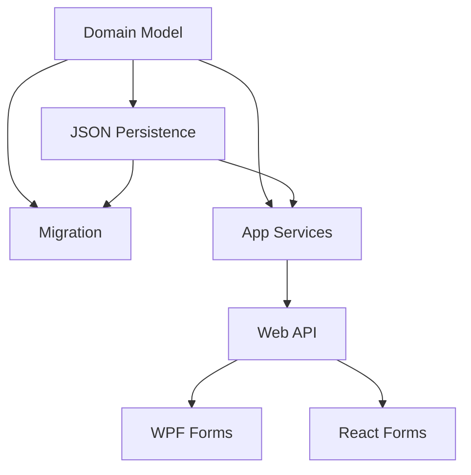

# Cashflow Entity References

## 1. Executive Summary

This PRD replaces name-string "references" in the CashFlow domain model with real object references. Today, `Income.IncomeSource`, `Income.Bank`, `Expense.PaymentSource`, `Transfer.SourceBank`/`DestinationBank`, `BalanceAdjustment.Bank`, and `InvestmentSnapshot.Account` are plain strings holding another entity's display name, validated ad hoc at write time by two static resolvers (`BankNameResolver`, `IncomeSourceNameResolver`) that look up the real `Bank`/`IncomeSource` entity and then discard it, re-passing only its `.Name`. The entity itself never holds a reference — every consumer that needs the related entity's other fields (`Bank.RoundUpEnabled`, `IncomeSource.Group`) re-resolves the string by name on every read.

The product is the same personal cash-flow tracker used to record incomes, expenses, transfers, and bank balances (React web app + WPF desktop app, sharing one .NET backend and one JSON data file). This change makes the domain model a real object graph: `Expense.PaymentSourceBank` becomes the literal same `Bank` instance found in `CashFlowData.Banks`, not a copy of its name. `Bank` gains a `Guid Id` (it has none today — `Name` is its only key), bringing it in line with `IncomeSource` and `InvestmentAccount`, which already have one. Every place in the system that currently keys `Bank` by name — API routes, `BankService` methods, WPF/React bindings — moves to Id-based keying for consistency, not just the 7 flagged fields.

At a high level: the JSON file continues to store only Ids (no duplication, no serialization cycles); a new Infrastructure-layer reference-resolution mechanism rehydrates the real object graph on load and flattens it back to Ids on save; a one-time migration (the first *rewriting* migrator in this codebase — every prior migrator only audits) assigns Bank Ids and rewrites existing records; the Application layer's resolvers and services are updated to resolve by Id and pass the resolved object straight into the domain entity; and both client UIs move their pick­lists and submitted payloads from name strings to Ids, with read DTOs carrying both the Id and a denormalized display name so no extra lookup is needed to render a list.

## 2. Problem and Opportunity

**The Problem**

- **References modeled as free-text strings, not real references.** `Income.Bank`, `Expense.PaymentSource`, `Transfer.SourceBank`/`DestinationBank`, `BalanceAdjustment.Bank`, and `InvestmentSnapshot.Account` are all plain strings that happen to match a `Bank`/`InvestmentAccount` name. Nothing in the type system enforces that relationship — a typo, a rename, or a stray record can silently produce an unresolvable value that's only caught if something happens to try to resolve it.
- **Every consumer re-resolves the same name by hand.** `ExpenseService.GetSuggestedRoundUpAmount`, `InvestmentSnapshotService.ToDto`, and others each run their own `FirstOrDefault(x => x.Name == field)` scan whenever they need the related entity's other fields, instead of following a reference that's already resolved once.
- **Inconsistent identity across the three reference entities.** `IncomeSource` and `InvestmentAccount` both have a `Guid Id`; `Bank` has none — `Name` is its only key. The domain model has two different identity conventions for conceptually identical "seeded reference data" entities.
- **Bank-by-name coupling spreads well beyond these 7 fields.** API routes (`/banks/{name}/adjustments`), `BankService` methods, and WPF/React bindings (`SelectedValuePath="Name"`) all key `Bank` by name too — the same fragility exists everywhere `Bank` is referenced, not only in the fields this PRD started from.

*Why this doesn't apply everywhere:* `Financial.Investment.Domain` also keys `Broker`/`Portfolio`/`Asset` by `Name` (no `Guid Id` on any of them) and that's *not* the same problem. `Investments` → `Broker` → `Portfolio` → `Asset` is a pure containment tree — each child lives in exactly one parent's collection, so nothing can drift out of sync, and the JSON persists as a plain nested object with no reference-resolution needed. `Bank`, by contrast, is referenced independently from five unrelated collections (`Income`, `Expense`, `Transfer`, `BalanceAdjustment`, and indirectly via round-up eligibility checks) with no single owner — that's what makes a name-string an unsafe stand-in for a real reference here, and why `Bank` needs a `Guid Id` while `Broker`/`Portfolio`/`Asset` correctly don't.

**The Opportunity**

- Converting these fields to real object references means every consumer follows a resolved reference instead of re-scanning by name — `expense.PaymentSourceBank.RoundUpEnabled` instead of a linear lookup.
- This builds directly on two patterns already established in this codebase: `Bank`'s seeded-entity-with-migration pattern (P13) and `IncomeSource`'s Id + resolver + read-endpoint pattern (P26) — this PRD is the natural continuation that makes the reference *itself* real, not just its validation.
- Giving `Bank` a `Guid Id` removes the special case and lets all three reference entities share one identity convention, one resolver shape, and one JSON reference-resolution mechanism.
- The new Infrastructure reference-resolution layer is general — any future "seeded reference data" entity added to `CashFlowData` gets the same Id-on-disk / object-in-memory treatment for free.

## 3. Target Audience

### Primary Users

**Household Finance Owner**
- Personal user (and their household — e.g. a second income earner) who logs incomes, expenses, transfers, and bank adjustments in the app on a regular basis.
- Selects a bank, income source, or investment account from a picklist without needing to know how the value is stored internally.
- Relies on every existing total (Annual Summary, Monthly totals, round-up eligibility, bank balances) continuing to compute correctly — this refactor must be invisible to them in the UI, apart from picklists now being Id-backed under the hood.

*(This PRD is a single-persona internal refactor; the acting user is the same person who already uses the Monthly and Annual Summary tabs today. No new persona or behavioral profile is introduced.)*

## 4. Objectives

**Product Objectives**

- **Unify** reference representation so entities hold real object references instead of ad hoc name-matched strings.
- **Standardize** identity across `Bank`, `IncomeSource`, and `InvestmentAccount` on `Guid Id`.
- **Preserve** every existing computed figure (Annual Summary, Monthly totals, round-up eligibility, bank balances) byte-for-byte after the migration runs.
- **Eliminate** redundant name-based re-resolution — any consumer needing a related entity's fields follows the reference directly.
- **Align** both clients (WPF, React) on a single Id-based API contract for every Bank/IncomeSource/InvestmentAccount picklist and submission.

**Success Metrics**

- 100% of existing `Income`/`Expense`/`Transfer`/`BalanceAdjustment`/`InvestmentSnapshot` records resolve to a valid `Bank`/`IncomeSource`/`InvestmentAccount` reference after migration (0 unresolved names in the audit log).
- 0 remaining string-typed name-reference fields for `Bank`/`IncomeSource`/`InvestmentAccount` across the 5 affected entities in the codebase after the change ships.
- Annual Summary and Monthly totals produce figures identical to a pre-migration snapshot, for a fixed set of test records, before and after the change.
- Both web and WPF forms populate every affected picklist and submit every affected field exclusively via `Guid` Id (0 remaining name-string submissions for these 7 fields).

## 5. User Stories

### F01. Bank Identity and Domain Reference Model
- As the system, I want `Bank` to have a `Guid Id` like `IncomeSource` and `InvestmentAccount` already do, so that all three reference entities share one identity convention
- As the system, I want `Income`, `Expense`, `Transfer`, `BalanceAdjustment`, and `InvestmentSnapshot` to hold real `Bank`/`IncomeSource`/`InvestmentAccount` object references instead of name strings, so that consumers can follow the reference instead of re-resolving a name

### F02. Infrastructure Reference-Resolution Persistence
- As the system, I want the JSON file to store only the referenced entity's Id, so that Bank/IncomeSource/InvestmentAccount data is never duplicated across every record that references it
- As the system, I want the referenced entity's actual object rehydrated in memory when the file loads, so that `expense.PaymentSourceBank` is the same object instance as the matching entry in `CashFlowData.Banks`
- As the system, I want a clear failure if a record's Id doesn't resolve to a real Bank/IncomeSource/InvestmentAccount, so that corrupted or unmigrated data is caught at load time instead of producing a silent null reference

### F03. Live-Data Reference Migration
- As the system, I want the migration to assign every existing Bank a fresh Id and rebuild every existing record's stored name into a resolved Bank/IncomeSource/InvestmentAccount reference, so that historical data keeps working under the new model
- As the system, I want the migration to back up the data file before writing, so that the change is safely reversible using the same recovery path every other migrator already provides
- As the system, I want `MonthlyExpenseSheetImporter` (the still-active monthly expense importer) to resolve bank names against the seeded `Bank` list instead of using a hardcoded string switch, so that newly-imported expense records are born with a valid reference
- As the system, I want `IncomeBackfillImporter` removed, so that the one-time backfill from the now-retired income spreadsheet — already complete — doesn't need to be carried forward into the new reference model

### F04. Application Resolvers, Services, and DTOs
- As a user, I want my income/expense/transfer/adjustment entry to be rejected with a clear error if I submit an unrecognized bank/source/account Id, so that bad data can't silently enter my records
- As the system, I want to resolve a submitted Id against the seeded Bank/IncomeSource/InvestmentAccount list on create and update, so that every record always resolves to a real reference
- As the system, I want every response DTO to carry both the reference's Id and its display name, so that clients can render a list without a second lookup

### F05. Web API Id-Based Endpoints and Routes
- As a client application, I want to create and update incomes/expenses/transfers/adjustments using a Bank/IncomeSource/InvestmentAccount Id instead of a name, so that the request can't be broken by a name that doesn't exactly match
- As a client application, I want bank-scoped routes to accept a Bank Id instead of a name, so that scoping is consistent with every other reference in the API
- As a client application, I want to fetch the full list of investment accounts with their Id and name, so that I can build an account picklist the same way I already do for banks and income sources

### F06. WPF Id-Based Reference Forms
- As a user, I want the WPF Income/Expense/Transfer/Adjustment forms' bank, source, and account dropdowns to keep working exactly as before, so that this refactor is invisible to me even though it's now backed by Ids

### F07. React Id-Based Reference Forms
- As a user, I want the web Income/Expense/Transfer/Adjustment forms' bank, source, and account dropdowns to keep working exactly as before, so that this refactor is invisible to me even though it's now backed by Ids

## 6. Functionalities

### F01. Bank Identity and Domain Reference Model

**Provides:**
- `Bank.Id` (Guid) and `Income`/`Expense`/`Transfer`/`BalanceAdjustment`/`InvestmentSnapshot` entities exposing `Bank`/`IncomeSource`/`InvestmentAccount` object-reference properties, constructed via their normal `Create`/`UpdateDetails` factories (used by F02, F03, F04)

**Capabilities:**
- `Bank` gains `Guid Id { get; }`, assigned by `Bank.Create`, mirroring `IncomeSource`/`InvestmentAccount`.
- `Income.IncomeSource` (string) becomes `Income.IncomeSource` (`IncomeSource`, non-null); `Income.Bank` (string) becomes `Income.Bank` (`Bank`, non-null).
- `Expense.PaymentSource` (string?) becomes `Expense.PaymentSourceBank` (`Bank?`, nullable — an expense still may be an unsettled card charge with no bank yet).
- `Transfer.SourceBank`/`DestinationBank` (string) become `Bank` references; the existing "source and destination must differ" validation compares by `Id` instead of by string.
- `BalanceAdjustment.Bank` (string) becomes a `Bank` reference.
- `InvestmentSnapshot.Account` (string) becomes an `InvestmentAccount` reference.
- `Create`/`UpdateDetails` factory methods on all 5 entities accept the resolved object instead of a raw string; the previous string-emptiness validators (`Income.ValidateIncomeSource`, `ValidateBank`) are removed and replaced by a non-null check.
- No special migration-only constructor or mutator is added to any entity: F03 rebuilds every affected record from scratch through the same `Create` factory every other caller uses, once it has resolved the legacy name to a real object — there's no in-place "upgrade this instance" step to design around, since the migration tool (`CashFlowSpreadsheetImport`) already fully rebuilds/re-seeds the data file on every run rather than patching one in place (see F03).

**Experience:**
- Entirely a backend/data-model change — no direct UI.

**Error Handling:**
- Creating or updating any of the 5 entities with a null Bank/IncomeSource/InvestmentAccount reference (where required) throws immediately, preventing an entity from ever existing without its reference resolved.
- `Expense`'s existing "can't have both a payment source and a card tag" shape validation continues to reject that combination, now checked against the object reference instead of the string.

### F02. Infrastructure Reference-Resolution Persistence

**Consumes:**
- F01: `Bank.Id`; `Income`/`Expense`/`Transfer`/`BalanceAdjustment`/`InvestmentSnapshot` reference-typed properties

**Provides:**
- `CashFlowData` load/save that resolves Ids to real object references in memory and flattens them back to Ids on disk (used by F03, F04)

**Capabilities:**
- New `ReferenceResolutionContext` (Infrastructure layer): holds `Dictionary<Guid, Bank>`, `Dictionary<Guid, IncomeSource>`, `Dictionary<Guid, InvestmentAccount>`, built fresh on every `Deserialize()` call.
- New `JsonConverter<CashFlowData>` that on read: buffers the full document, deserializes `Banks`/`IncomeSources`/`InvestmentAccounts` first by property-name lookup on the buffered document (not dependent on JSON text order), populates the context, then deserializes every other collection using a derived `JsonSerializerOptions` carrying 3 new per-type reference converters (`BankReferenceConverter`, `IncomeSourceReferenceConverter`, `InvestmentAccountReferenceConverter`) that read a `Guid` and resolve it against the context.
- On write, the same reference converters emit only the referenced entity's `Id` for a reference-typed property; the owning `Banks`/`IncomeSources`/`InvestmentAccounts` collections continue to serialize in full via the existing mechanism.
- Wire format: `BankId`, `IncomeSourceId`, `InvestmentAccountId` (Guid) replace the old `Bank`/`IncomeSource`/`Account` string fields on the 5 referencing entities; `Bank`'s JSON object gains an `Id` field alongside its existing `Name`.
- `CashFlowTypeInfoResolver`'s existing `ManagedTypes`/private-setter wiring is unchanged for every non-reference property — the new converters only intercept the specific reference-typed properties.

**Experience:**
- Entirely backend-only, exercised on every app startup (load) and every save; invisible to the user.

**Error Handling:**
- The app fails to start with a descriptive error naming the missing Id and the owning record's Id/type, if the data file references a Bank/IncomeSource/InvestmentAccount Id absent from the corresponding seeded collection.
- A record still carrying the pre-migration string shape (missing the new Id field) fails deserialization with a message pointing at running the F03 migration first, instead of a generic JSON parse error.
- Serializing and immediately re-deserializing a `CashFlowData` reproduces the identical object graph (verified by reference equality on the resolved properties), guarding against the reference-resolution mechanism silently producing a copy instead of the shared instance.

### F03. Live-Data Reference Migration

**Consumes:**
- F01: entity reference model and `Create` factories
- F02: Id-based JSON write capability

**Capabilities:**
- New migrator (e.g. `EntityReferenceMigrator`, under `Integrations/CashFlowSpreadsheetImport/Migrations/EntityReferences/`), following the same shape every other migrator in `CashFlowSpreadsheetImport` already uses — this tool is routinely re-run as part of the normal import/rebuild workflow (`Program.cs` already re-runs every migrator on every invocation), so this isn't a fragile one-shot script; it's designed to be run again like the rest of the pipeline.
- Assigns a fresh `Guid Id` to every existing `Bank` record.
- Reads each legacy `Income`/`Expense`/`Transfer`/`BalanceAdjustment`/`InvestmentSnapshot` record's stored name string directly from the backed-up pre-migration JSON (the same raw-JSON-extraction technique `LegacySettledAtExtractor` already uses for `ExpenseChargeDateMigrator`, since F02's new domain-typed deserializer no longer understands the old string shape), resolves each name (case-insensitive) against the seeded `Bank`/`IncomeSource`/`InvestmentAccount` collections, and reconstructs the record via its normal `Create` factory with the resolved object — no special migration-only entity method is needed.
- Creates a timestamped backup via the existing `MigrationBackup.Create()` before writing, exactly like every prior migrator.
- Naturally a no-op on a second run: once a file is in the new Id-based shape there's no legacy string left to extract, so no explicit "already migrated" guard needs to be built — this falls out of the data shape itself, the same way `BankMigrator`'s seeding is a no-op once a name already exists.
- Unresolved names are reported in the migration's summary (matching the audit style of every existing migrator, e.g. `BankMigrator`'s `FlagUnresolvedExpense`) rather than requiring a bespoke transactional/dry-run guarantee — the pre-write backup is the existing recovery path if a run needs to be undone.
- `MonthlyExpenseSheetImporter` (still actively re-run every full import, per `Program.cs`) is updated to resolve `PaymentSource` against `data.Banks` by name instead of its current hardcoded string switch (`"T"`→`"Trading212"`, `"C"`→`"Chase"`, default `"Barclays"`).
- `IncomeBackfillImporter` and the `workbook` parameter on `IncomeMigrator.Migrate` are **removed**, not updated: this importer exists only to backfill historical `Income` records from the now-retired income-totals spreadsheet — a one-time transition that already completed (its `AlreadyImported` guard has made every real run a no-op for some time). Since local and Google Drive both simply get replaced with the freshly-migrated JSON, there's no reason to carry this dead one-time path forward into the new reference model.

**Experience:**
- Run as part of the normal `CashFlowSpreadsheetImport` invocation; console summary (matching every other migrator's `Render()` output) reports Bank Ids assigned and records resolved per entity type.

**Error Handling:**
- If the data file cannot be backed up, the tool aborts before making any change (reused `MigrationBackup` behavior).
- An unresolved name is reported in the migration summary, the same way every existing migrator already surfaces an unresolved `PaymentSource`/`IncomeSource` — restoring from the pre-write backup is the recovery path if a run needs to be undone.

### F04. Application Resolvers, Services, and DTOs

**Consumes:**
- F01: entities with reference-typed properties
- F02: working load/save so services operate on a fully-resolved object graph

**Provides:**
- Response DTOs carrying both Id and denormalized display name for each Bank/IncomeSource/InvestmentAccount reference (used by F05)

**Capabilities:**
- `BankNameResolver`/`IncomeSourceNameResolver` change contract from name-based to Id-based resolution (e.g. `BankResolver.TryResolve(Guid? id, IEnumerable<Bank>, out Bank? bank)`), still returning the resolved entity object.
- New `InvestmentAccountResolver`, mirroring the above two — didn't exist before; `InvestmentSnapshotService` previously did its own inline `FirstOrDefault` by name.
- `IncomeService`, `ExpenseService`, `TransferService`, `BalanceAdjustmentService`, `InvestmentSnapshotService`: create/update paths resolve the submitted Id via the resolver and pass the resolved object straight into the Domain `Create`/`UpdateDetails` call.
- `ToDto` mappers across all 5 services updated to emit both the Id and denormalized name for each reference (e.g. `BankId = entity.Bank.Id`, `BankName = entity.Bank.Name`).
- `TransferService.GetTransfersByBank` and `BalanceAdjustmentService`'s bank-scoped methods change their `string bankName` parameter to `Guid bankId`.
- `BankService.UpdateOpeningBalanceAsync` and `GetBankBalanceAsOf` change their `string bankName`/`name` parameter to `Guid bankId`.

**Experience:**
- Backend-only; no direct UI.

**Error Handling:**
- Create/update rejected with a validation error naming the invalid/missing Id when a submitted Id doesn't resolve to a seeded Bank/IncomeSource/InvestmentAccount — same failure shape as today's name-based rejection.
- A bank-scoped query (transfers-by-bank, adjustments-by-bank) with an Id that resolves to no `Bank` returns an empty result set rather than throwing, matching today's behavior for an unrecognized bank name.
- Existing valid records are never affected by this validation — it only runs on new create/update calls, not retroactively.

### F05. Web API Id-Based Endpoints and Routes

**Consumes:**
- F04: services and Id+Name DTOs

**Provides:**
- Id-based REST contract for incomes/expenses/transfers/balance-adjustments/investment-snapshots, plus bank-scoped routes and a full investment-accounts list (used by F06, F07)

**Capabilities:**
- `IncomeCreateDTO`/`UpdateDTO`, `ExpenseCreateDTO`/`UpdateDTO`, `TransferCreateDTO`/`UpdateDTO` fields change from a name string to a `Guid` Id (`IncomeSourceId`, `BankId`, `PaymentSourceBankId`, `SourceBankId`, `DestinationBankId`).
- Read DTOs (`IncomeDTO`, `ExpenseDTO`, `TransferDTO`, `BalanceAdjustmentDTO`, `InvestmentSnapshotDTO`) gain both the Id and a denormalized name for each reference (e.g. `BankId` + `BankName`).
- `BankDTO` (existing `GET /banks` response) gains `Id` (Guid) alongside its existing `Name`.
- `BanksController`'s `/banks/{name}/adjustments...` routes move to `/banks/{id}/adjustments...` (Guid route parameter); `TransfersController`'s `/transfers/bank/{name}` moves to `/transfers/bank/{id}`.
- New read-only `GET /investment-accounts` endpoint, mirroring `GET /income-sources` (P26-F04) and `GET /banks` — didn't exist before; needed so clients can resolve `InvestmentAccount` Id/name the same way they already do for Bank/IncomeSource.

**Experience:**
- No direct UI — this is the contract consumed by F06/F07.

**Error Handling:**
- A create/update request referencing a non-existent Bank/IncomeSource/InvestmentAccount Id is rejected with a 400-level validation error naming the invalid Id.
- A request to a `/banks/{id}/...` or `/transfers/bank/{id}` route with an Id that doesn't resolve to a real Bank returns 404.

### F06. WPF Id-Based Reference Forms

**Consumes:**
- F05: Id+Name API contract

**Capabilities:**
- `MonthlyViewModel`'s `IncomeFormSource`/`IncomeFormBank`/`ExpenseFormPaymentSource`/`TransferFormSourceBank`/`TransferFormDestinationBank`/`AdjustmentFormBankName` change from `string` to `Guid`/`Guid?`.
- Every ComboBox bound to these fields (`IncomeFormView.xaml`, `TransferFormView.xaml`, the expense and adjustment forms) switches `SelectedValuePath` from `"Name"` to `"Id"`.
- Every string-keyed comparison in `MonthlyViewModel` (bank/income-source/account grouping, round-up eligibility lookups, `BankTotals`) is updated to compare by Id instead of by name.
- DTOs sent to the API populate the new Id fields; read-only grids render the denormalized `*Name` field from the response DTO — no client-side name lookup needed.

**Experience:**
- Functionally identical to today from the user's perspective — the same dropdowns, the same selection and submit behavior — now backed by Id under the hood.

### F07. React Id-Based Reference Forms

**Consumes:**
- F05: Id+Name API contract

**Capabilities:**
- `types.ts` DTOs updated to the new Id+Name shape; `BankDto` gains `id`.
- `IncomeForm.tsx`, `ExpenseForm.tsx`, `TransferForm.tsx`, `BalanceAdjustmentForm.tsx` change their `<option value={x.name}>` picklist options to `<option value={x.id}>`.
- `useMonthly.ts`, `useTransferForm.ts`, `useBalanceAdjustmentForm.ts` submit Id fields instead of name strings; `useBalanceAdjustmentForm.ts`'s `createBalanceAdjustment`/`updateBalanceAdjustment` calls change their bank-name URL segment to a bank Id, matching F05's route change.
- List/grid displays render the denormalized `*Name` field from read DTOs.

**Experience:**
- Functionally identical to today from the user's perspective — the same dropdowns, the same selection and submit behavior — now backed by Id under the hood.

## 7. Out of Scope

**Entity management**
- No create/edit/delete UI or API for `Bank`, `IncomeSource`, or `InvestmentAccount` — they remain seeded-only, unchanged from today.
- No admin screen to retire or rename a Bank/IncomeSource/InvestmentAccount; deleting a referenced entity remains unsupported, same as today.

**Data model changes beyond this refactor**
- No change to `IncomeGroup`, `Category`, `CreditCard`, `ReserveBucket`, `Area`, or `Currency` enums — none of these are name-string entity references, so they're outside this PRD's scope.
- No change to `CardStatement.Card`/`Expense.CardTag` — already strongly-typed enums, not strings.
- No change to `Income`'s, `Expense`'s, `Transfer`'s, or `BalanceAdjustment`'s other fields beyond the reference conversion described here.

**Reporting and behavior**
- No change to any report's visible output, layout, or computed figures — every feature here must produce results identical to today; this is purely an internal representation change.
- No performance/scale work beyond what's needed for correctness — this remains a personal single-user app; the reference-resolution design favors clarity over high-volume throughput.

## 8. Dependency Graph

| # | Feature | Priority | Dependencies |
|---|---------|----------|--------------|
| F01 | Bank Identity and Domain Reference Model | 1 | None |
| F02 | Infrastructure Reference-Resolution Persistence | 1 | F01 |
| F03 | Live-Data Reference Migration | 1 | F01, F02 |
| F04 | Application Resolvers, Services, and DTOs | 1 | F01, F02 |
| F05 | Web API Id-Based Endpoints and Routes | 1 | F04 |
| F06 | WPF Id-Based Reference Forms | 2 | F05 |
| F07 | React Id-Based Reference Forms | 2 | F05 |

### Execution Waves
Features within the same wave can be built in parallel. A wave starts only after every feature in earlier waves is complete.

- **Wave 1**: F01
- **Wave 2**: F02
- **Wave 3**: F03, F04
- **Wave 4**: F05
- **Wave 5**: F06, F07

### Priority levels
- **1** = Essential — product does not work without it
- **2** = Important — significant value addition
- **3** = Desirable — incremental improvement

## 9. Acceptance Criteria

### F01. Bank Identity and Domain Reference Model
- [x] `Bank.Create` assigns a `Guid Id`, and `Bank.Id` is never empty/default for a newly-created bank
- [x] `Income.Create`/`UpdateDetails` accept a `Bank` and an `IncomeSource` object and reject a null value for either
- [x] `Expense.Create`/`UpdateDetails` accept a nullable `Bank` reference for `PaymentSourceBank`, preserving the existing "exactly one of payment source or card tag" shape rule
- [x] `Transfer.Create`/`UpdateDetails` reject a `Transfer` whose `SourceBank.Id` equals its `DestinationBank.Id`
- [x] `BalanceAdjustment.Create` accepts a `Bank` object
- [x] `InvestmentSnapshot.Create` accepts an `InvestmentAccount` object

### F02. Infrastructure Reference-Resolution Persistence
- [x] Serializing a `CashFlowData` writes only `BankId`/`IncomeSourceId`/`InvestmentAccountId` (Guid) for reference-typed fields, not a nested object
- [x] Deserializing a valid file produces an `Income.Bank` that is reference-equal (same object instance) to the matching entry in the deserialized `CashFlowData.Banks`
- [x] Deserializing a file whose record references a Bank/IncomeSource/InvestmentAccount Id absent from the corresponding collection throws a descriptive exception naming the missing Id and owning record
- [x] A round-trip (serialize, then deserialize) of a `CashFlowData` with cross-references reproduces an equivalent object graph with no data loss

### F03. Live-Data Reference Migration
- [x] Running the migrator against a pre-migration data file assigns a unique `Guid Id` to every existing `Bank` record
- [x] Running the migrator resolves and rewrites every existing `Income`/`Expense`/`Transfer`/`BalanceAdjustment`/`InvestmentSnapshot` record's name field to a resolved reference, reconstructed via the entity's normal `Create` factory
- [x] Running the migrator a second time against an already-migrated file makes no additional changes, because there is no legacy string shape left to extract
- [x] A backup of the data file is created before any write occurs
- [x] A record whose name is unresolvable against the seeded lists is reported in the migration summary
- [x] `MonthlyExpenseSheetImporter`'s newly-created `Expense` records resolve `PaymentSource` against the seeded `Bank` list instead of using a hardcoded string switch
- [x] `IncomeBackfillImporter.cs` and its dedicated tests no longer exist in the codebase, and `IncomeMigrator.Migrate` no longer takes a workbook parameter

### F04. Application Resolvers, Services, and DTOs
- [ ] Creating an `Income`/`Expense`/`Transfer`/`BalanceAdjustment`/`InvestmentSnapshot` with an Id matching a seeded Bank/IncomeSource/InvestmentAccount succeeds
- [ ] Creating any of the above with an Id that matches no seeded entity is rejected with a validation error naming the invalid Id
- [ ] Updating an existing record to an unresolvable Id is rejected the same way as create
- [ ] Every `ToDto` mapper returns both the Id and the denormalized display name for each reference field
- [ ] `TransferService.GetTransfersByBank` and the balance-adjustment bank-scoped methods accept a `Guid bankId` and return the same results as the equivalent name-based lookup did before this change, for a fixed set of test records

### F05. Web API Id-Based Endpoints and Routes
- [ ] `POST`/`PUT` requests for income, expense, and transfer accept a Guid Id for each reference field and reject a request carrying a name string in that field's place
- [ ] `GET` responses for income, expense, transfer, balance-adjustment, and investment-snapshot include both the Id and denormalized name for each reference field
- [ ] `GET /banks` response items include `Id`
- [ ] `/banks/{id}/adjustments...` and `/transfers/bank/{id}` routes accept a Guid and return the same records the equivalent name-based route returned before this change
- [ ] `GET /investment-accounts` returns the full seeded list with `Id` and `Name`
- [ ] A request referencing a non-existent Id is rejected with a 400-level error naming the invalid Id

### F06. WPF Id-Based Reference Forms
- [ ] The Income, Expense, Transfer, and Adjustment forms' bank/source/account dropdowns display the same set of options as before this change
- [ ] Submitting each form sends a Guid Id (not a name string) for every affected field
- [ ] Existing records display their correct bank/source/account name in read-only grids after this change

### F07. React Id-Based Reference Forms
- [ ] The Income, Expense, Transfer, and Adjustment forms' bank/source/account dropdowns display the same set of options as before this change
- [ ] Submitting each form sends a Guid Id (not a name string) for every affected field
- [ ] Existing records display their correct bank/source/account name in read-only grids after this change

### Cross-Feature Integration
- [x] `Bank.Id` and the reference-typed entity properties from F01 are correctly read and written by the F02 JSON persistence layer, producing a real object graph on load
- [x] The Id-based JSON write capability from F02 and the reference model from F01 are correctly used together by the F03 migrator to produce a fully-migrated data file with no unresolved records
- [ ] The resolved object graph from F02 and the reference model from F01 are correctly consumed by the F04 resolvers/services, which reject an unresolvable Id and accept a valid one
- [ ] The Id+Name DTOs provided by F04 are correctly exposed through the F05 API contract, including the new `/investment-accounts` endpoint and the Id-based bank-scoped routes
- [ ] The F05 API contract is correctly consumed by both the F06 WPF forms and the F07 React forms, each submitting and displaying records via Id with a correctly-rendered denormalized name
