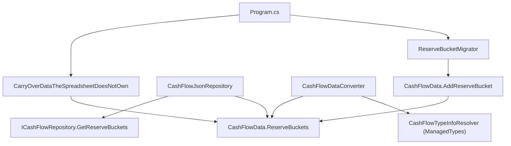

# F01. ReserveBucket Domain Entity and Seed Migration

## 1. Technical Overview

**What:** Introduce a `ReserveBucket` domain entity (`Id`, `Name`, `IsActive`, `SplitPercentage`) in `Financial.CashFlow.Domain.Entities`, wire it through `CashFlowData`, `ICashFlowRepository`, `CashFlowJsonRepository`, and JSON (de)serialization, and add a `ReserveBucketMigrator` that idempotently seeds the four historical buckets (Investimento, HouseTreats, Ariana, Gleison) with their historical implicit percentages. This is the seeded-entity groundwork the rest of the P28 PRD (F02–F08) builds on.

**Why:** `ReserveBucket` is currently a compiled-in 4-member enum (`Financial.CashFlow.Domain.Enums.ReserveBucket`) with the split percentage hardcoded as exact fractions inside `ReserveSplitCalculator`. This feature establishes the entity itself and its seed data, following the exact `Bank`/`IncomeSource` pattern (private-setter entity, static `Create` factory, no CRUD, seeded via `CashFlowSpreadsheetImport`). Consuming this entity (movement references, split computation, balances, API, UI, import) is out of scope here — that's F02–F08.

**Scope:**
- Included: `ReserveBucket` entity, `CashFlowData.ReserveBuckets` + `AddReserveBucket`, `ICashFlowRepository.GetReserveBuckets()`, `CashFlowJsonRepository` passthrough, JSON (de)serialization wiring (`ManagedTypes` registration + a plain top-level `ReserveBuckets` collection in `CashFlowDataConverter`), `ReserveBucketMigrator` + `ReserveBucketMigrationSummary`, `Program.cs` wiring (seed + carry-over), and the namespace-collision mitigation described in Decision 1 below.
- Excluded: `ReserveMovement.Bucket` stays the enum type (F02), income-split computation stays untouched (F03), balances/API/UI stay untouched (F04–F07), spreadsheet importer's bucket resolution stays untouched (F08). The old `Financial.CashFlow.Domain.Enums.ReserveBucket` enum is **not** deleted in this feature (PRD's "enum deleted" outcome is only true once F02 finishes removing every consumer of it — see Decision 1).

## 2. Architecture Impact

**Affected components:**
- `Financial.CashFlow.Domain/Entities/ReserveBucket.cs` (new)
- `Financial.CashFlow.Domain/Entities/CashFlowData.cs` (modified — new collection + `AddReserveBucket`)
- `Financial.CashFlow.Application/Interfaces/ICashFlowRepository.cs` (modified — `GetReserveBuckets()`)
- `Financial.CashFlow.Infrastructure/Repositories/CashFlowJsonRepository.cs` (modified — passthrough)
- `Financial.CashFlow.Infrastructure/Persistence/CashFlowTypeInfoResolver.cs` (modified — register `ReserveBucket` in `ManagedTypes`)
- `Financial.CashFlow.Infrastructure/Persistence/CashFlowDataConverter.cs` (modified — read/write the `ReserveBuckets` collection)
- `Integrations/CashFlowSpreadsheetImport/Migrations/ReserveBuckets/ReserveBucketMigrator.cs` (new)
- `Integrations/CashFlowSpreadsheetImport/Migrations/ReserveBuckets/ReserveBucketMigrationSummary.cs` (new)
- `Integrations/CashFlowSpreadsheetImport/Program.cs` (modified — seed before/after import, carry-over)
- 4 production files touched only to fully-qualify the pre-existing enum reference (Decision 1): `ReserveMovement.cs`, `ReserveService.cs`, `ReserveBucketParser.cs`, `ReservasSheetImporter.cs`
- 7 test files touched for the same reason: `ReserveMovementTests.cs`, `ReserveServiceTests.cs`, `ReserveBucketParserTests.cs`, `ReservasSheetImporterTests.cs`, `CashFlowJsonRepositoryTests.cs`, `CashFlowDataTests.cs`, `CashFlowSerializerAdapterTests.cs`



## 3. Technical Decisions

| Decision | Chosen Approach | Alternative Considered | Trade-off |
|----------|-----------------|------------------------|-----------|
| Avoiding a `ReserveBucket` name collision while the enum still exists | Introduce `Financial.CashFlow.Domain.Entities.ReserveBucket` now, and in every file that currently references the enum type unqualified, add `using ReserveBucketEnum = Financial.CashFlow.Domain.Enums.ReserveBucket;` and rename the local usages to `ReserveBucketEnum`. The enum itself is untouched. | Delete/rename the enum in F01 too (absorbing F02's scope) | Keeps F01 scoped exactly to "entity + migration" per the PRD, at the cost of a small, mechanical, behavior-preserving touch to 11 files that F02 will clean up when it swaps each `ReserveBucketEnum` usage to the real entity and deletes the enum. Without this, introducing the entity breaks compilation immediately (CS0104 ambiguous reference in every file that already has both `using Financial.CashFlow.Domain.Entities;` and `using Financial.CashFlow.Domain.Enums;` in scope, e.g. `ReserveService.cs`) |
| `ReserveBuckets` JSON wiring in `CashFlowDataConverter` | Added as a plain top-level collection (same tier as `Expenses`/`CardStatements`), deserialized/written with the ordinary `resolvedOptions`/`elementOptions` — **not** added to the early Banks/IncomeSources/InvestmentAccounts resolution block yet | Wire it into `ReferenceResolutionContext` now, ahead of need | Nothing references a bucket by id yet (that's F02), so early resolution would be dead code this feature can't test meaningfully. F02 moves it into the early-resolution block when `ReserveMovement.Bucket` starts referencing it |
| Migration audit of existing `ReserveMovement`s | Compare `movement.Bucket.ToString()` (the enum's member name) against seeded bucket names, case-insensitive — mirrors `IncomeSourceMigrator`'s pre-P27 string-based audit shape | Compare by id | `ReserveMovement.Bucket` is still the enum in F01, so there's no id to compare; F02 will simplify this audit to an id comparison once the reference exists (same evolution `IncomeSourceMigrator`'s audit went through) |
| Split-percentage validation on `ReserveBucket.Create` | Reject `SplitPercentage < 0` or `> 100` with `ArgumentException`, matching `Bank.Create`/`IncomeSource.Create`'s single-field validation style | Also enforce exactly 2 decimal places | The PRD's 0–100/2-decimal description is a seed-data convention, not a hard invariant worth enforcing at the entity boundary — avoids over-engineering for a personal project with no CRUD UI that could submit odd values |

## 4. Component Overview

**Domain:**

| File Path | New/Modified | Purpose | Key Responsibilities |
|-----------|--------------|---------|----------------------|
| `Financial.CashFlow.Domain/Entities/ReserveBucket.cs` | New | Seeded reference-data entity | `Id`, `Name`, `IsActive`, `SplitPercentage`; static `Create(name, splitPercentage, isActive = true)` with name/range validation; no public mutators |
| `Financial.CashFlow.Domain/Entities/CashFlowData.cs` | Modified | Aggregate root | Add `_reserveBuckets` list + `ReserveBuckets` read-only exposure + `AddReserveBucket(ReserveBucket)`, mirroring `Banks`/`AddBank` |

**Application:**

| File Path | New/Modified | Purpose | Key Responsibilities |
|-----------|--------------|---------|----------------------|
| `Financial.CashFlow.Application/Interfaces/ICashFlowRepository.cs` | Modified | Repository contract | Add `IEnumerable<ReserveBucket> GetReserveBuckets();` (read-only, no add/delete — consistent with `GetBanks()`/`GetIncomeSources()`) |

**Infrastructure:**

| File Path | New/Modified | Purpose | Key Responsibilities |
|-----------|--------------|---------|----------------------|
| `Financial.CashFlow.Infrastructure/Repositories/CashFlowJsonRepository.cs` | Modified | Repository implementation | `GetReserveBuckets() => _data.ReserveBuckets;` passthrough |
| `Financial.CashFlow.Infrastructure/Persistence/CashFlowTypeInfoResolver.cs` | Modified | JSON contract customization | Add `typeof(ReserveBucket)` to `ManagedTypes` so the private constructor/setters (de)serialize correctly. No entry added to `ReferenceProperties` in this feature |
| `Financial.CashFlow.Infrastructure/Persistence/CashFlowDataConverter.cs` | Modified | Top-level (de)serializer | `Read`: deserialize a `"ReserveBuckets"` collection with `resolvedOptions` and `AddReserveBucket` each into `data`. `Write`: add a `WriteCollection(writer, "ReserveBuckets", value.ReserveBuckets, elementOptions);` call |

**Migration tool (`Integrations/CashFlowSpreadsheetImport`):**

| File Path | New/Modified | Purpose | Key Responsibilities |
|-----------|--------------|---------|----------------------|
| `Migrations/ReserveBuckets/ReserveBucketMigrator.cs` | New | Idempotent seed + audit | `Migrate(CashFlowData data): ReserveBucketMigrationSummary` — seeds the 4 buckets by name (case-insensitive skip-if-present, mirroring `BankMigrator`/`IncomeSourceMigrator`), then audits existing `ReserveMovement`s per Decision 1, then computes the active-buckets split-percentage sum for the warning |
| `Migrations/ReserveBuckets/ReserveBucketMigrationSummary.cs` | New | Migration outcome/report | Counts seeded/already-present buckets, counts resolved/unresolved movements (with the unresolved list for manual review), stores the active split-percentage sum, and `Render()`s a console report including a warning line only when that sum falls outside 99.99–100.01 |
| `Program.cs` | Modified | Orchestration | Add `ReserveBucketMigrator.Migrate(data);` immediately after the existing `BankMigrator.Migrate(data);` call (before the workbook import block) and a second `var reserveBucketSummary = ReserveBucketMigrator.Migrate(data);` alongside the other end-of-run migrator re-runs; add `Console.WriteLine(reserveBucketSummary.Render());`; add a `foreach (var bucket in existingData.ReserveBuckets) data.AddReserveBucket(bucket);` loop inside `CarryOverDataTheSpreadsheetDoesNotOwn` |

**Namespace-collision mitigation (Decision 1) — behavior-preserving, no functional change:**

| File Path | Change |
|-----------|--------|
| `Financial.CashFlow.Domain/Entities/ReserveMovement.cs` | Add `using ReserveBucketEnum = Financial.CashFlow.Domain.Enums.ReserveBucket;`; change `Bucket`/`Create`/`Update` parameter and property type from `ReserveBucket` to `ReserveBucketEnum` |
| `Financial.CashFlow.Application/Services/ReserveService.cs` | Same alias; qualify all `ReserveBucket.<Member>` and `Enum.GetValues<ReserveBucket>()`/`GetBalance(ReserveBucket bucket)` usages |
| `Financial.CashFlow.Application/Validation/ReserveBucketParser.cs` | Same alias; qualify the `out ReserveBucket bucket` parameter |
| `Integrations/CashFlowSpreadsheetImport/SheetImporters/ReservasSheetImporter.cs` | Same alias; qualify the `BucketColumns` tuple array's `ReserveBucket` element type and literals |
| `Tests/Financial.CashFlow.Domain.Tests/Entities/ReserveMovementTests.cs`, `Tests/Financial.CashFlow.Application.Tests/Services/ReserveServiceTests.cs`, `Tests/Financial.CashFlow.Application.Tests/Validation/ReserveBucketParserTests.cs`, `Tests/Financial.CashFlowSpreadsheetImport.Tests/SheetImporters/ReservasSheetImporterTests.cs`, `Tests/Financial.CashFlow.Infrastructure.Tests/Repositories/CashFlowJsonRepositoryTests.cs`, `Tests/Financial.CashFlow.Domain.Tests/Entities/CashFlowDataTests.cs`, `Tests/Financial.CashFlow.Infrastructure.Tests/Persistence/CashFlowSerializerAdapterTests.cs` | Same alias pattern applied to whichever bare `ReserveBucket.<Member>` literals each file uses |

## 5. API Contracts

Not applicable — this feature exposes no HTTP endpoint (introduced in F05).

## 6. Data Model

No relational schema — persistence is a single JSON document (`data-cashflow.json`). New top-level array:

**Collection: `ReserveBuckets`**

| Field | Type | Nullable | Description |
|-------|------|----------|--------------|
| `Id` | `guid` | No | Assigned by `ReserveBucket.Create` |
| `Name` | `string` | No | Non-empty; matched case-insensitively during seeding |
| `IsActive` | `bool` | No | Gates participation in future income-split computation (F03) |
| `SplitPercentage` | `decimal` | No | 0–100 |

**Seed data (via `ReserveBucketMigrator`):**

| Name | SplitPercentage | IsActive |
|------|------------------|----------|
| Investimento | 33.33 | true |
| HouseTreats | 33.33 | true |
| Ariana | 16.67 | true |
| Gleison | 16.67 | true |

**Example JSON:**
```json
"ReserveBuckets": [
  { "Id": "b1f4...", "Name": "Investimento", "IsActive": true, "SplitPercentage": 33.33 },
  { "Id": "c2a9...", "Name": "HouseTreats", "IsActive": true, "SplitPercentage": 33.33 },
  { "Id": "d3b0...", "Name": "Ariana", "IsActive": true, "SplitPercentage": 16.67 },
  { "Id": "e4c1...", "Name": "Gleison", "IsActive": true, "SplitPercentage": 16.67 }
]
```

## 7. Testing Strategy

| Test File | Test Type | Target | Coverage Goal |
|-----------|-----------|--------|----------------|
| `Tests/Financial.CashFlow.Domain.Tests/Entities/ReserveBucketTests.cs` | Unit | `ReserveBucket` entity | Create success/validation paths |
| `Tests/Financial.CashFlow.Domain.Tests/Entities/CashFlowDataTests.cs` | Unit | `CashFlowData.AddReserveBucket`/`ReserveBuckets` | Existing file, extended — plus qualification touch per Decision 1 |
| `Tests/Financial.CashFlow.Infrastructure.Tests/Repositories/CashFlowJsonRepositoryTests.cs` | Unit | `CashFlowJsonRepository.GetReserveBuckets` | Existing file, extended — plus qualification touch per Decision 1 |
| `Tests/Financial.CashFlow.Infrastructure.Tests/Persistence/CashFlowSerializerAdapterTests.cs` | Unit | `ReserveBuckets` round-trip (de)serialization | Existing file, extended — plus qualification touch per Decision 1 |
| `Tests/Financial.CashFlowSpreadsheetImport.Tests/Migrations/ReserveBuckets/ReserveBucketMigratorTests.cs` | Unit | `ReserveBucketMigrator` | Seed-on-empty, idempotent-rerun, partial-seed, resolved/unresolved movement audit, split-percentage-sum warning threshold, null-arg-throws — mirrors `IncomeSourceMigratorTests.cs` |

**`ReserveBucketTests.cs` — test functions:**

| Test Function | Description | Assertions |
|----------------|-------------|------------|
| `Create_WithValidValues_SetsAllProperties` | Happy path | `Id` non-empty, `Name`/`IsActive`/`SplitPercentage` set as given |
| `Create_DefaultsIsActiveToTrue` | Optional param behavior | `IsActive == true` when omitted |
| `Create_WithBlankName_ThrowsArgumentException` | `[Theory]` over `null`/`""`/`"   "` | Throws `ArgumentException` |
| `Create_WithSplitPercentageBelowZero_ThrowsArgumentException` | Range validation | Throws `ArgumentException` |
| `Create_WithSplitPercentageAboveHundred_ThrowsArgumentException` | Range validation | Throws `ArgumentException` |

**`ReserveBucketMigratorTests.cs` — test functions (mirrors `IncomeSourceMigratorTests.cs`):**

| Test Function | Description | Assertions |
|----------------|-------------|------------|
| `Migrate_WithEmptyData_SeedsAllFourBuckets` | Seed-on-empty | 4 buckets created with expected names/percentages/`IsActive = true`; summary counts 4 seeded, 0 already-present |
| `Migrate_RunTwice_IsIdempotent` | Idempotency | Second run seeds 0 new, reports 4 already-present, same `Id`s as first run |
| `Migrate_WithPartialExistingBuckets_SeedsOnlyMissing` | Partial seed | Pre-seeded subset is left untouched (same `Id`); only the missing ones are created |
| `Migrate_WithMovementMatchingSeededBucketName_CountsResolved` | Audit — resolved | `IncomesResolvedCount`-equivalent counter increments |
| `Migrate_WithMovementNotMatchingAnySeededBucket_FlagsUnresolved` | Audit — unresolved | Movement appears in the unresolved list; migration still succeeds (no throw) |
| `Migrate_WithActivePercentagesSummingTo100_RenderDoesNotWarn` | Warning threshold — pass | `Render()` output contains no warning line |
| `Migrate_WithActivePercentagesNotSummingTo100_RenderIncludesWarning` | Warning threshold — fail | `Render()` output contains the warning line, migration still succeeds (no throw) |
| `Migrate_WithNullData_ThrowsArgumentNullException` | Guard clause | Throws `ArgumentNullException` |

**Acceptance-criteria traceability (PRD Section 9, F01):**
- "Seeds exactly four records with correct percentages/`IsActive`" → `Migrate_WithEmptyData_SeedsAllFourBuckets`
- "Idempotent second run" → `Migrate_RunTwice_IsIdempotent`
- "Backup created before write" → covered by the existing, unmodified `MigrationBackup`/`Program.cs` flow (no new test needed — `Program.cs`'s existing backup call already runs before any migrator, unchanged by this feature)
- "Audit warns on percentage-sum drift without failing" → `Migrate_WithActivePercentagesNotSummingTo100_RenderIncludesWarning` / `Migrate_WithActivePercentagesSummingTo100_RenderDoesNotWarn`
- "Unresolved movement reported without failing the run" → `Migrate_WithMovementNotMatchingAnySeededBucket_FlagsUnresolved`

No Cross-Feature Integration criteria reference F01 as a consumer (F01 has no `Consumes` block — it's the root of the dependency graph); the criteria where F01 is the *provider* (consumed by F02–F05, F08) are exercised by those features' own test suites once they exist.
