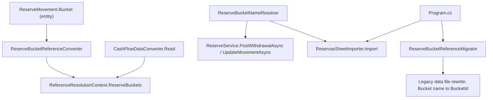

# F02. ReserveMovement Reference to ReserveBucket

## 1. Technical Overview

**What:** Change `ReserveMovement.Bucket` from `Financial.CashFlow.Domain.Enums.ReserveBucket` (enum) to `Financial.CashFlow.Domain.Entities.ReserveBucket` (the entity introduced in F01) — a real object reference, resolved and shared the same way `Income.Bank`/`Income.IncomeSource` already are. Add the supporting JSON reference-converter and reference-resolution wiring, a `ReserveBucketNameResolver` for DTO-supplied bucket names, a one-time raw-JSON rewrite migrator for existing data files (`"Bucket": "Investimento"` → `"BucketId": "<guid>"`), and delete `ReserveBucketParser`.

**Why:** F01 seeded `ReserveBucket` as data; F02 makes it the thing `ReserveMovement` actually points to, so every later feature (F03's split computation, F04's balances, F08's import) operates on real entities instead of a closed enum.

**Scope — and why it's larger than "change one property type":** `ReserveMovement.Create`/`Update` currently take the enum by value. Every call site that constructs or updates a `ReserveMovement` passes an enum literal today — `ReserveService.PostIncomeSplitAsync` (4 hardcoded enum literals), `ReserveService.PostWithdrawalAsync`/`UpdateMovementAsync` (via `ReserveBucketParser`), and `ReservasSheetImporter.Import` (its static `BucketColumns` table). Changing `Create`/`Update`'s parameter type to the entity is a breaking signature change that every one of these call sites must compile against — there is no way to land the entity-reference change in isolation and leave the others broken, since this branch of the codebase must build and pass tests at every merge point (see F01's Decision 1 for the same constraint applied to a smaller case).

**Included:**
- The entity-reference change itself (`ReserveMovement`, `CashFlowTypeInfoResolver`, `CashFlowDataConverter`, `ReferenceResolutionContext`, new `ReserveBucketReferenceConverter`).
- `ReserveBucketNameResolver` (replaces `ReserveBucketParser`) for `PostWithdrawalAsync`/`UpdateMovementAsync` — this is F02's own real, described-in-PRD capability.
- A minimal, **behavior-preserving** adaptation of `PostIncomeSplitAsync`, `GetBucketBalances`, and `ReservasSheetImporter.Import` so they compile against the new entity type, producing byte-identical output to today. These are the call sites F03/F04/F08 own — F02 only does the smallest change that keeps them compiling and correct, not their real feature work.
- A new one-time raw-JSON migrator that rewrites existing `ReserveMovement` records (and, if needed, bootstraps `ReserveBuckets`) from the pre-F02 shape to the reference shape, mirroring the existing `EntityReferenceMigrator` pattern from a prior PRD.

**Excluded (left for later features, by design):**
- `PostIncomeSplitAsync` still uses `ReserveSplitCalculator`'s hardcoded fractions, not stored `SplitPercentage` (F03).
- `GetBucketBalances` still iterates exactly the 4 canonical buckets by name, not `_repository.GetReserveBuckets()` (F04) — the two behave identically today (F01 seeds exactly those 4, all active), but the *iteration strategy* itself is F04's change to make, not F02's.
- `ReservasSheetImporter` still expects exactly 4 fixed column→bucket-name mappings; it's adapted only enough to resolve those 4 names against real entities instead of enum literals (F08 is the feature that makes the resolution itself dynamic/robust, e.g. its own unresolved-column audit).

## 2. Architecture Impact

**Affected components:**
- `Financial.CashFlow.Domain/Entities/ReserveMovement.cs` — `Bucket`/`Create`/`Update` retype to the entity; the F01 `ReserveBucketEnum` alias is removed entirely (no longer needed).
- `Financial.CashFlow.Infrastructure/Persistence/ReferenceResolutionContext.cs` — add `ReserveBuckets` dictionary.
- `Financial.CashFlow.Infrastructure/Persistence/CashFlowTypeInfoResolver.cs` — add `[(typeof(ReserveMovement), nameof(ReserveMovement.Bucket))] = "BucketId"` and a `ReserveBucketReferenceConverter` branch.
- `Financial.CashFlow.Infrastructure/Persistence/CashFlowDataConverter.cs` — move `ReserveBuckets` from the F01 plain-collection read into the early Banks/IncomeSources/InvestmentAccounts resolution block; generalize the stale "Run the F03 migration" error text (F03 there refers to a *different*, already-shipped PRD's feature and is no longer the right pointer).
- `Financial.CashFlow.Infrastructure/Persistence/ReserveBucketReferenceConverter.cs` (new) — one-line `ReferenceConverter<ReserveBucket>` subclass, mirroring `BankReferenceConverter`/`IncomeSourceReferenceConverter`.
- `Financial.CashFlow.Application/Validation/ReserveBucketNameResolver.cs` (new) — case-insensitive name → entity resolver, replacing `ReserveBucketParser`.
- `Financial.CashFlow.Application/Validation/ReserveBucketParser.cs` and its test — deleted.
- `Financial.CashFlow.Application/Services/ReserveService.cs` — `PostWithdrawalAsync`/`UpdateMovementAsync` use `ReserveBucketNameResolver`; `PostIncomeSplitAsync`/`GetBucketBalances` resolve the 4 canonical buckets by name instead of using enum literals; `ToDto` reads `movement.Bucket.Name` instead of `movement.Bucket.ToString()` (a real bug fix — `ToString()` on the entity would print the type name, not the bucket name).
- `Integrations/CashFlowSpreadsheetImport/SheetImporters/ReservasSheetImporter.cs` — `Import` gains a `IReadOnlyCollection<ReserveBucket> buckets` parameter, resolving each of its 4 column names against it via `ReserveBucketNameResolver` instead of the `ReserveBucketEnum` literal table.
- `Integrations/CashFlowSpreadsheetImport/Program.cs` — the `ImportReservasSheet` call site passes `data.ReserveBuckets`.
- `Integrations/CashFlowSpreadsheetImport/Migrations/ReserveBucketReferences/ReserveBucketReferenceMigrator.cs` + `ReserveBucketReferenceMigrationSummary.cs` (new) — one-time raw-JSON rewrite, wired into `Program.cs` alongside the existing `EntityReferenceMigrator.Migrate(outputPath)` call.
- Test files updated for the signature/behavior changes: `ReserveMovementTests.cs`, `ReserveServiceTests.cs`, `CashFlowDataTests.cs`, `CashFlowJsonRepositoryTests.cs`, `CashFlowSerializerAdapterTests.cs`, `ReservasSheetImporterTests.cs`.



## 3. Technical Decisions

| Decision | Chosen Approach | Alternative Considered | Trade-off |
|----------|-----------------|------------------------|-----------|
| Scope of the forced call-site adaptation | Minimal, behavior-preserving fixes to `PostIncomeSplitAsync`, `GetBucketBalances`, and `ReservasSheetImporter.Import` — resolve the same 4 canonical buckets by name, keep every other line of logic (split fractions, 4-row balance shape, fixed column mapping) untouched | Merge F02+F03+F04+F08 into one feature | Keeps the PRD's feature/PR boundaries and acceptance criteria intact; the cost is that F02's diff touches files "owned" by later features, but only in the smallest way needed to keep the build green |
| One-time raw-JSON rewrite migrator | New, dedicated `ReserveBucketReferenceMigrator` in its own folder, mirroring `EntityReferenceMigrator`'s pattern (read raw JSON → detect legacy shape → backup → rewrite → save) but as a separate class | Extend the existing `EntityReferenceMigrator` to also handle `ReserveMovement.Bucket` | `EntityReferenceMigrator`'s own docstring scopes it to a specific prior PRD's Bank/IncomeSource/InvestmentAccount transition; folding an unrelated PRD's migration into the same class would grow an already-large god-class and blur two independent historical migrations. A second small, focused migrator following the same proven pattern is cheaper to reason about long-term |
| Bootstrapping `ReserveBuckets` inside the raw-JSON migrator | If the raw file has no `"ReserveBuckets"` array yet (F01's typed migrator never ran against this specific file), seed the canonical 4 with fresh Ids as part of the same rewrite pass, mirroring `EntityReferenceMigrator.ReadLegacyBanks`'s bootstrap | Assume `ReserveBuckets` always already exists | The live production data file has not necessarily had the F01 migrator run against it yet by the time F02 ships; the migrator must be safe to run standalone against a fully pre-F01 file |
| `ReserveBucketNameResolver` signature | `TryResolve(string? name, IEnumerable<ReserveBucket> buckets, out ReserveBucket? bucket)` — case-insensitive name match | Mirror `BankNameResolver`/`IncomeSourceNameResolver`'s exact `Guid? id` signature | Those two resolvers match by **Id**, not name, because their callers already carry a Guid (a later PRD's change). `WithdrawalRequestDTO.Bucket`/`UpdateReserveMovementDTO.Bucket` are plain bucket-name strings, so a name-based resolver is what these call sites actually need — same class shape (`TryResolve` → bool, out entity), different match key, consistent with how `ReserveBucketParser` already worked by name |
| Unresolved reserve movement during the raw-JSON rewrite | Skip the record (drop it from the rewritten file) and flag it in the summary for manual review, mirroring `EntityReferenceMigrator`'s handling of an unresolved legacy Income/Expense/Transfer | Fail the whole migration | Consistent with the established precedent; in practice this can only happen if the file's `Bucket` value isn't one of the 4 enum members, which the JSON schema doesn't otherwise allow, so this path is a safety net, not an expected outcome |

## 4. Component Overview

**Domain:**

| File Path | New/Modified | Purpose | Key Responsibilities |
|-----------|--------------|---------|----------------------|
| `Financial.CashFlow.Domain/Entities/ReserveMovement.cs` | Modified | Entity | `Bucket` property, `Create`, and `Update` retyped from the enum to `ReserveBucket` (entity); F01's `ReserveBucketEnum` alias/using removed |

**Application:**

| File Path | New/Modified | Purpose | Key Responsibilities |
|-----------|--------------|---------|----------------------|
| `Financial.CashFlow.Application/Validation/ReserveBucketNameResolver.cs` | New | Name → entity resolution | `TryResolve(string? name, IEnumerable<ReserveBucket> buckets, out ReserveBucket? bucket)`, case-insensitive |
| `Financial.CashFlow.Application/Validation/ReserveBucketParser.cs` | Deleted | — | Superseded by `ReserveBucketNameResolver` |
| `Financial.CashFlow.Application/Services/ReserveService.cs` | Modified | Reserve business logic | See Section 2; `PostWithdrawalAsync`/`UpdateMovementAsync` use the new resolver, `PostIncomeSplitAsync`/`GetBucketBalances` resolve the 4 canonical buckets by name, `ToDto` fixed to use `.Name` |

**Infrastructure:**

| File Path | New/Modified | Purpose | Key Responsibilities |
|-----------|--------------|---------|----------------------|
| `Financial.CashFlow.Infrastructure/Persistence/ReserveBucketReferenceConverter.cs` | New | JSON reference converter | `ReferenceConverter<ReserveBucket>(lookup, bucket => bucket.Id, "ReserveBucket")` |
| `Financial.CashFlow.Infrastructure/Persistence/ReferenceResolutionContext.cs` | Modified | Lookup context | Add `Dictionary<Guid, ReserveBucket> ReserveBuckets` |
| `Financial.CashFlow.Infrastructure/Persistence/CashFlowTypeInfoResolver.cs` | Modified | JSON contract customization | Register the `ReserveMovement.Bucket` → `"BucketId"` reference property and its converter |
| `Financial.CashFlow.Infrastructure/Persistence/CashFlowDataConverter.cs` | Modified | Top-level (de)serializer | `ReserveBuckets` moves into the early resolution block (built into the context before `ReserveMovements` is read); generalize the stale migration-pointer error text |

**Migration tool (`Integrations/CashFlowSpreadsheetImport`):**

| File Path | New/Modified | Purpose | Key Responsibilities |
|-----------|--------------|---------|----------------------|
| `Migrations/ReserveBucketReferences/ReserveBucketReferenceMigrator.cs` | New | One-time raw-JSON rewrite | `Migrate(string dataPath): ReserveBucketReferenceMigrationSummary` — detects the legacy `"Bucket"` field shape, bootstraps `ReserveBuckets` if absent, rewrites every `ReserveMovement`'s `Bucket` to `BucketId`, backs up, saves; no-op if the file is already current or doesn't exist |
| `Migrations/ReserveBucketReferences/ReserveBucketReferenceMigrationSummary.cs` | New | Migration outcome/report | Whether already current, count of buckets bootstrapped (if any), count of movements rewritten, unresolved movements for manual review |
| `SheetImporters/ReservasSheetImporter.cs` | Modified | Spreadsheet import | `Import(IXLWorksheet sheet, IReadOnlyCollection<ReserveBucket> buckets)` — resolves each of the 4 fixed column names against `buckets` via `ReserveBucketNameResolver` |
| `Program.cs` | Modified | Orchestration | Add `ReserveBucketReferenceMigrator.Migrate(outputPath)` alongside the existing `EntityReferenceMigrator.Migrate(outputPath)` call (same early, pre-typed-load stage); pass `data.ReserveBuckets` into `ReservasSheetImporter.Import` |

## 5. API Contracts

Not applicable — no HTTP endpoint changes in this feature (F05 introduces the first reserve-bucket endpoint).

## 6. Data Model

**`ReserveMovements` collection — wire shape change:**

Before (enum, via `JsonStringEnumConverter`):
```json
{ "Id": "...", "Bucket": "Investimento", "Amount": 28.42, "Date": "2025-10-31", "Description": "..." }
```

After (entity reference, via `ReserveBucketReferenceConverter`):
```json
{ "Id": "...", "BucketId": "b1f4...", "Amount": 28.42, "Date": "2025-10-31", "Description": "..." }
```

No change to `ReserveBuckets`' own shape (established in F01).

## 7. Testing Strategy

| Test File | Test Type | Target | Coverage Goal |
|-----------|-----------|--------|----------------|
| `Tests/Financial.CashFlow.Domain.Tests/Entities/ReserveMovementTests.cs` | Unit | `ReserveMovement.Create`/`Update` against a `ReserveBucket` entity | Retyped, same assertions as before plus reference-identity check |
| `Tests/Financial.CashFlow.Application.Tests/Services/ReserveServiceTests.cs` | Unit | `ReserveService` | All existing tests updated to seed `StubCashFlowRepository.ReserveBuckets` with the 4 canonical entities instead of passing enum values; `ToDto`'s `.Name` fix covered |
| `Tests/Financial.CashFlow.Infrastructure.Tests/Persistence/CashFlowSerializerAdapterTests.cs` | Unit | Round-trip + reference resolution | `ReserveMovement.Bucket` round-trips to the same shared instance as the seeded `ReserveBucket`; wire shape asserts `BucketId`, not `Bucket` |
| `Tests/Financial.CashFlow.Infrastructure.Tests/Persistence/ReserveBucketReferenceConverterTests.cs` | New | `ReserveBucketReferenceConverter` | Mirrors `BankReferenceConverterTests.cs`: resolves a known Id, throws on unknown Id, writes only the Id |
| `Tests/Financial.CashFlow.Application.Tests/Validation/ReserveBucketNameResolverTests.cs` | New | `ReserveBucketNameResolver` | Case-insensitive match success, no-match failure, null-name failure |
| `Tests/Financial.CashFlowSpreadsheetImport.Tests/SheetImporters/ReservasSheetImporterTests.cs` | Unit | `Import` with the new `buckets` parameter | Existing scenarios updated to pass a 4-bucket fixture; new case for a column whose expected name isn't in the passed-in buckets |
| `Tests/Financial.CashFlowSpreadsheetImport.Tests/Migrations/ReserveBucketReferences/ReserveBucketReferenceMigratorTests.cs` | New | `ReserveBucketReferenceMigrator` | Legacy-shaped file with no `ReserveBuckets` (bootstrap case), legacy-shaped file with `ReserveBuckets` already present, already-current file (no-op), unresolvable bucket name flagged and skipped, missing file (no-op), file-not-found guard |

**Acceptance-criteria traceability (PRD Section 9, F02):**
- "`ReserveMovement.Bucket` deserializes to the same instance as the seeded record" → `CashFlowSerializerAdapterTests` reference-identity assertion
- "Withdrawal/update with a valid bucket name succeeds" / "with an invalid name is rejected" → `ReserveServiceTests` (existing cases, retargeted to the new resolver)
- "`ReserveBucketParser` and its test file no longer exist" → verified structurally (file deletion), not by a test

**Cross-Feature Integration (PRD Section 9, referencing F02 as consumer of F01):**
- Seeded `ReserveBucket` records from F01 are correctly resolved by `ReserveBucketNameResolver` to accept/reject bucket names on withdrawal/update → covered by `ReserveServiceTests`
