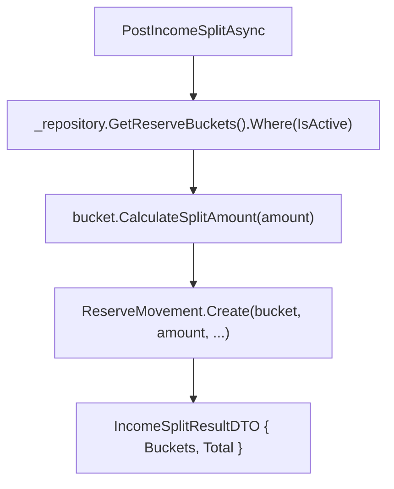

# F03. Income Split Computation via Bucket Percentages

## 1. Technical Overview

**What:** Replace `ReserveSplitCalculator`'s hardcoded fraction math (1/3, 1/3, 1/6, 1/6) with each active `ReserveBucket` computing its own share of a posted amount from its stored `SplitPercentage`. `ReserveService.PostIncomeSplitAsync` iterates every currently-active bucket from the repository instead of the 4 hardcoded canonical names F02 temporarily introduced, and `IncomeSplitResultDTO` becomes a dynamic per-bucket list instead of 4 fixed fields.

**Why:** This is the feature the whole P28 migration exists for — the split amount a user actually sees was, until now, computed from a fraction baked into code, disconnected from the `SplitPercentage` F01 seeded and F05+ will make editable/visible. F02 already made every call site compile against real `ReserveBucket` entities; F03 is the first feature to change what those buckets actually *do*.

**Scope:**
- Included: `ReserveBucket.CalculateSplitAmount`, deletion of `ReserveSplitCalculator`/`ReserveSplitResult`, `PostIncomeSplitAsync` rewritten to iterate active buckets, `IncomeSplitResultDTO`/new `BucketSplitAmountDTO` shape change, the "no active buckets" error path.
- Excluded: `GetBucketBalances` keeps F02's canonical-4-names adaptation untouched — iterating *all* seeded buckets (active and inactive) is F04's change, not this one. `ReservasSheetImporter` and its fixed column mapping are untouched (F08). No API contract versioning/negotiation — the DTO shape simply changes, consistent with how F01/F02 changed wire shapes directly since this is a personal, single-deployment app with no external API consumers to version against.
- Known, accepted collateral: the WPF `ReservaView` binds to `LastSplitResult`'s old fixed properties (`Investimento`, `HouseTreats`, etc.) in XAML. Those bindings resolve at runtime, not compile time, so this change doesn't break the WPF build — but the split-result panel will render blank until F07 updates it to the new dynamic shape. This is the same "later feature repairs the UI" pattern already accepted for F02's web/WPF collateral, and is explicitly F07's job per the PRD.

## 2. Architecture Impact

**Affected components:**
- `Financial.CashFlow.Domain/Entities/ReserveBucket.cs` — new `CalculateSplitAmount(decimal totalAmount): decimal` method.
- `Financial.CashFlow.Domain/Rules/ReserveSplitCalculator.cs`, `ReserveSplitResult.cs` — deleted.
- `Financial.CashFlow.Application/DTOs/IncomeSplitResultDTO.cs` — reshaped to a per-bucket list + total.
- `Financial.CashFlow.Application/DTOs/BucketSplitAmountDTO.cs` (new) — one bucket's name + computed amount.
- `Financial.CashFlow.Application/Services/ReserveService.cs` — `PostIncomeSplitAsync` rewritten to iterate active buckets; `CanonicalBucketNames`/`ResolveCanonicalBuckets()` stay (still used by `GetBucketBalances`, per F04's scope).
- Test files: `Tests/Financial.CashFlow.Domain.Tests/Entities/ReserveBucketTests.cs` (new method coverage), `Tests/Financial.CashFlow.Application.Tests/Services/ReserveServiceTests.cs`, `Tests/Financial.Api.Tests/ReserveEndpointsTests.cs`; deleted: `Tests/Financial.CashFlow.Domain.Tests/Rules/ReserveSplitCalculatorTests.cs`.



## 3. Technical Decisions

| Decision | Chosen Approach | Alternative Considered | Trade-off |
|----------|-----------------|------------------------|-----------|
| Where split math lives | `ReserveBucket.CalculateSplitAmount(decimal)` — the bucket computes its own share | A revived static calculator taking `(amount, buckets)` | Matches the PRD's explicit intent ("each bucket computing its own share of a posted amount, so that split logic lives on the entity that owns the data instead of a separate calculator class") and keeps the entity self-contained; no separate class needed for one line of arithmetic |
| Rounding | `Math.Round(totalAmount * SplitPercentage / 100m, 2, MidpointRounding.AwayFromZero)`, independent per bucket, no penny-reconciliation | Redistribute rounding remainder to one bucket | Matches `ReserveSplitCalculator`'s existing rounding behavior exactly (already independent per-bucket, no reconciliation) — a deliberate prior decision (see P11 spec) this PRD doesn't revisit |
| "No active buckets" error type | `ArgumentException`, mapped by the existing `ReserveController` catch block to 400 | New dedicated exception type + new controller catch | The existing `PostIncomeSplitAsync` already throws `ArgumentException` for amount/description validation failures reaching the same controller action; reusing it needs zero controller changes and keeps all of this endpoint's request-level failures behind one status code |
| `IncomeSplitResultDTO` shape | `{ Buckets: BucketSplitAmountDTO[], Total: decimal }`, `BucketSplitAmountDTO = { Bucket: string, Amount: decimal }` | Keep 4 fixed fields, add a 5th "extra buckets" list alongside them | A hybrid shape would still hardcode an assumption about which 4 names always exist; a plain list is the only shape that's actually correct once bucket count/names are seed-driven, matching the PRD's explicit "should become a per-bucket list" description |

## 4. Component Overview

**Domain:**

| File Path | New/Modified | Purpose | Key Responsibilities |
|-----------|--------------|---------|----------------------|
| `Financial.CashFlow.Domain/Entities/ReserveBucket.cs` | Modified | Entity | Add `CalculateSplitAmount(decimal totalAmount): decimal` |
| `Financial.CashFlow.Domain/Rules/ReserveSplitCalculator.cs` | Deleted | — | Superseded by `ReserveBucket.CalculateSplitAmount` |
| `Financial.CashFlow.Domain/Rules/ReserveSplitResult.cs` | Deleted | — | Superseded by `IncomeSplitResultDTO`'s new shape |

**Application:**

| File Path | New/Modified | Purpose | Key Responsibilities |
|-----------|--------------|---------|----------------------|
| `Financial.CashFlow.Application/DTOs/BucketSplitAmountDTO.cs` | New | One bucket's computed share | `Bucket: string` (name), `Amount: decimal` |
| `Financial.CashFlow.Application/DTOs/IncomeSplitResultDTO.cs` | Modified | Split outcome | `Buckets: IReadOnlyList<BucketSplitAmountDTO>`, `Total: decimal` |
| `Financial.CashFlow.Application/Services/ReserveService.cs` | Modified | `PostIncomeSplitAsync` | Iterates `_repository.GetReserveBuckets().Where(b => b.IsActive)`; throws `ArgumentException` if none are active; creates one `ReserveMovement` per active bucket via `bucket.CalculateSplitAmount(request.Amount)`; builds the response from the created movements |

## 5. API Contracts

**Endpoint: Post Income Split** (existing endpoint, response shape changes)
- **Method:** POST
- **Path:** `/reserve/income-split`
- **Authentication:** None (single-user local app)

**Response (Success - 200), new shape:**
```json
{
  "buckets": [
    { "bucket": "Investimento", "amount": 654.33 },
    { "bucket": "HouseTreats", "amount": 654.33 },
    { "bucket": "Ariana", "amount": 327.17 },
    { "bucket": "Gleison", "amount": 327.17 }
  ],
  "total": 1963.00
}
```

**Error Codes (unchanged endpoint, one new case):**

| Code | HTTP Status | Description |
|------|-------------|--------------|
| (existing) | 400 | Amount not greater than zero, or description missing |
| (new) | 400 | No reserve bucket is currently active |

## 6. Data Model

No schema/collection shape change — `ReserveMovement` and `ReserveBucket` are unchanged from F01/F02. This feature only changes computation and the API response DTO.

## 7. Testing Strategy

| Test File | Test Type | Target | Coverage Goal |
|-----------|-----------|--------|----------------|
| `Tests/Financial.CashFlow.Domain.Tests/Entities/ReserveBucketTests.cs` | Unit | `ReserveBucket.CalculateSplitAmount` | Extended with split-math cases |
| `Tests/Financial.CashFlow.Application.Tests/Services/ReserveServiceTests.cs` | Unit | `PostIncomeSplitAsync` | Active-only participation, no-active-buckets error, dynamic bucket count, rollback on save failure |
| `Tests/Financial.Api.Tests/ReserveEndpointsTests.cs` | E2E | `POST /reserve/income-split` | New response shape, 400 on no active buckets |

**`ReserveBucketTests.cs` — new test functions:**

| Test Function | Description | Assertions |
|----------------|-------------|------------|
| `CalculateSplitAmount_AppliesPercentageAndRoundsAwayFromZero` | Core math | `1963m` at `33.33%` → `654.33m` (matches the historical `ReserveSplitCalculator` output for the same input, confirming the percentage-based math reproduces the prior exact-fraction result within rounding) |
| `CalculateSplitAmount_WithZeroPercentage_ReturnsZero` | Edge case | `0%` → `0m` |
| `CalculateSplitAmount_RoundsToTwoDecimalPlacesAwayFromZero` | Rounding | A value landing exactly on `.xx5` rounds away from zero, matching `MidpointRounding.AwayFromZero` |

**`ReserveServiceTests.cs` — new/updated test functions:**

| Test Function | Description | Assertions |
|----------------|-------------|------------|
| `PostIncomeSplitAsync_WithValidRequest_PostsOneMovementPerActiveBucketAndReturnsAmounts` | Updated from the F01/F02 4-bucket version | One movement per active seeded bucket; `result.Buckets` has one entry per active bucket with the correct computed amount; `result.Total` sums them |
| `PostIncomeSplitAsync_WithInactiveBucket_ExcludesItFromMovementsAndResult` | New | An `IsActive = false` bucket receives no movement and doesn't appear in `result.Buckets` |
| `PostIncomeSplitAsync_WithNoActiveBuckets_ThrowsArgumentExceptionBeforeTouchingRepository` | New | Empty movements, no `SaveChangesAsync` call, `ArgumentException` thrown |
| `PostIncomeSplitAsync_WhenSaveFails_RollsBackAllCreatedMovements` | Updated | Still passes with a dynamic bucket count instead of a fixed 4 |

**Acceptance-criteria traceability (PRD Section 9, F03):**
- "Posting an income split creates exactly one `ReserveMovement` per bucket with `IsActive = true`, each amount equal to `Math.Round(...)`" → `PostIncomeSplitAsync_WithValidRequest_...` + `CalculateSplitAmount_...`
- "No movement is created for any bucket with `IsActive = false`" → `PostIncomeSplitAsync_WithInactiveBucket_...`
- "Posting an income split when zero buckets are active is rejected with a clear error and creates no movements" → `PostIncomeSplitAsync_WithNoActiveBuckets_...`
- "`ReserveSplitCalculator` and `ReserveSplitResult` no longer exist in the codebase" → verified structurally (file deletion)
- "`IncomeSplitResultDTO` returns a per-bucket list... sized to the number of active buckets" → `PostIncomeSplitAsync_WithValidRequest_...`
- "If the save fails after movements are created in memory, all movements from that split are rolled back" → `PostIncomeSplitAsync_WhenSaveFails_...`

**Cross-Feature Integration (PRD Section 9, referencing F03):**
- "Seeded `ReserveBucket` records (F01) are correctly consumed by the income-split computation (F03)" → covered by `PostIncomeSplitAsync_WithValidRequest_...`/`..._WithInactiveBucket_...`
- "`ReserveMovement.Bucket` entity references (F02) are correctly created by the income-split flow (F03)" → covered by the same tests (assert `movement.Bucket` is the correct seeded instance)
