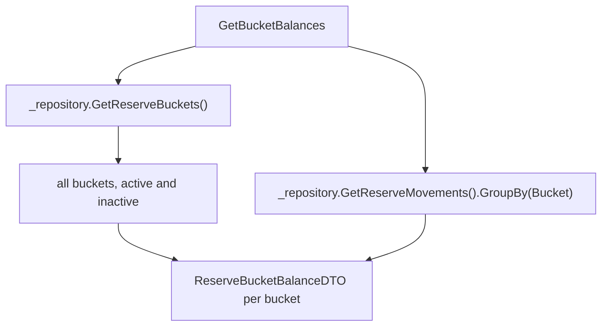

# F04. Reserve Bucket Balances for All Buckets

## 1. Technical Overview

**What:** `ReserveService.GetBucketBalances()` iterates every seeded `ReserveBucket` from the repository (active and inactive) instead of the 4 hardcoded canonical names F02 introduced as a compile-preserving placeholder. This is the last consumer of that placeholder, so `CanonicalBucketNames`/`ResolveCanonicalBuckets()` are deleted entirely.

**Why:** F02 needed `GetBucketBalances` to keep compiling against the new entity-reference `ReserveMovement.Bucket` without changing its behavior; F03 already made the "real" switch for `PostIncomeSplitAsync`. F04 is the matching change for balances — and because balances (unlike the income split) must include inactive buckets so historical money remains visible, this can't reuse F03's active-only iteration.

**Scope:**
- Included: `GetBucketBalances()` rewritten to iterate `_repository.GetReserveBuckets()` directly; deletion of the now-fully-unused `CanonicalBucketNames`/`ResolveCanonicalBuckets()`.
- Excluded: `ReserveBucketBalanceDTO`'s shape is unchanged (`Bucket: string`, `Balance: decimal`) — this is a data-source change, not a contract change. No new API endpoint (F05). No UI changes (F06/F07).

## 2. Architecture Impact

**Affected components:**
- `Financial.CashFlow.Application/Services/ReserveService.cs` — `GetBucketBalances()` rewritten; `CanonicalBucketNames`/`ResolveCanonicalBuckets()` deleted.
- `Tests/Financial.CashFlow.Application.Tests/Services/ReserveServiceTests.cs` — updated/new balance tests.

## 3. Technical Decisions

| Decision | Chosen Approach | Alternative Considered | Trade-off |
|----------|-----------------|------------------------|-----------|
| Iteration source | `_repository.GetReserveBuckets()` directly, no filtering | Filter to `IsActive` like `PostIncomeSplitAsync` | The PRD explicitly requires inactive buckets to remain visible in balances (money already allocated must stay trackable/withdrawable) — this is the entire reason F04 is a separate feature from F03 rather than reusing its active-only logic |
| `CanonicalBucketNames`/`ResolveCanonicalBuckets()` | Deleted | Leave in place unused | F03 already removed their only other caller; keeping unreferenced code violates the project's Clean Code rules and would just be dead weight |

## 4. Component Overview

**Application:**

| File Path | New/Modified | Purpose | Key Responsibilities |
|-----------|--------------|---------|----------------------|
| `Financial.CashFlow.Application/Services/ReserveService.cs` | Modified | `GetBucketBalances()` | Iterate all repository buckets (not just active ones), group movements by bucket, build one `ReserveBucketBalanceDTO` per bucket; remove `CanonicalBucketNames`/`ResolveCanonicalBuckets()` |

## 5. API Contracts

Not applicable — `GET /reserve/balances`'s response shape (`ReserveBucketBalanceDTO[]`) is unchanged; only which buckets appear changes (all seeded buckets instead of a fixed 4).

## 6. Data Model

No changes.

## 7. Testing Strategy

| Test File | Test Type | Target | Coverage Goal |
|-----------|-----------|--------|----------------|
| `Tests/Financial.CashFlow.Application.Tests/Services/ReserveServiceTests.cs` | Unit | `GetBucketBalances` | All-buckets iteration, inactive-bucket inclusion, dynamic bucket count |

**New/updated test functions:**

| Test Function | Description | Assertions |
|----------------|-------------|------------|
| `GetBucketBalances_IncludesInactiveBucketsWithTheirBalance` | New — F04's core capability | An `IsActive = false` bucket with movement history still appears in the result with its correct non-zero balance |
| `GetBucketBalances_IsNotHardcodedToFourBuckets` | New | Seeding a 5th bucket (test fixture) results in 5 rows |
| `GetBucketBalances_AlwaysReturnsExactlyFourBuckets` (existing, still valid) | Unchanged assertion, new data source | With only the 4 default seeded buckets, still returns exactly 4 rows, all zero balance |
| `GetBucketBalances_ReflectsPostedMovements` (existing) | Unchanged | Still passes — same repository shape, different iteration source produces the same result for this case |

**Acceptance-criteria traceability (PRD Section 9, F04):**
- "`GetBucketBalances()` returns exactly one row per seeded `ReserveBucket`, regardless of `IsActive`" → `GetBucketBalances_AlwaysReturnsExactlyFourBuckets` + `GetBucketBalances_IncludesInactiveBucketsWithTheirBalance`
- "A bucket with `IsActive = false` and existing movement history shows its correct non-zero balance" → `GetBucketBalances_IncludesInactiveBucketsWithTheirBalance`
- "The balance list is not hardcoded to 4 rows" → `GetBucketBalances_IsNotHardcodedToFourBuckets`

**Cross-Feature Integration (PRD Section 9, referencing F04):**
- "Seeded `ReserveBucket` records (F01) and `ReserveMovement.Bucket` references (F02) are both correctly consumed by `GetBucketBalances()` (F04), producing one balance row per bucket including inactive ones" → covered by the tests above
