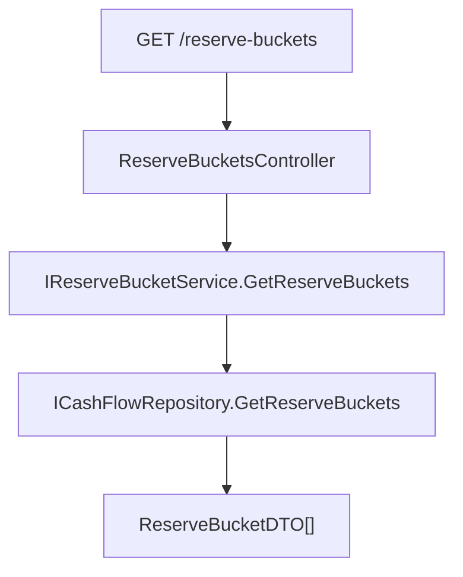

# F05. Reserve Buckets API Endpoint

## 1. Technical Overview

**What:** A new read-only `GET /reserve-buckets` endpoint exposing the full seeded `ReserveBucket` list (id, name, active flag, split percentage), following the exact `Bank`/`IncomeSource` reference-data endpoint pattern already established in this codebase.

**Why:** F01-F04 made `ReserveBucket` a first-class, percentage-driven entity, but nothing outside the backend can see it yet. F06/F07 (dynamic web/WPF picklists and the split-imbalance warning) need this data over HTTP.

**Scope:**
- Included: `ReserveBucketDTO`, `IReserveBucketService`/`ReserveBucketService`, `ReserveBucketsController` (`GET /reserve-buckets` only), DI registration.
- Excluded: No `POST`/`PUT`/`DELETE` — buckets remain seeded-only, identical in scope to `Bank`/`IncomeSource`. No query parameters or filtering. No web/WPF consumption (F06/F07).

## 2. Architecture Impact

**Affected components:**
- `Financial.CashFlow.Application/DTOs/ReserveBucketDTO.cs` (new)
- `Financial.CashFlow.Application/Interfaces/IReserveBucketService.cs` (new)
- `Financial.CashFlow.Application/Services/ReserveBucketService.cs` (new)
- `Financial.CashFlow.Application/DependencyInjection/CashFlowApplicationServiceCollectionExtensions.cs` (modified — register the new service)
- `Financial.Api/Controllers/ReserveBucketsController.cs` (new)
- Tests: `Tests/Financial.CashFlow.Application.Tests/Services/ReserveBucketServiceTests.cs` (new), `Tests/Financial.Api.Tests/ReserveBucketsEndpointsTests.cs` (new)



## 3. Technical Decisions

| Decision | Chosen Approach | Alternative Considered | Trade-off |
|----------|-----------------|------------------------|-----------|
| Overall shape | Mirror `IncomeSourcesController`/`IIncomeSourceService`/`IncomeSourceService`/`IncomeSourceDTO` exactly (one `GetReserveBuckets()` method, `AddSingleton` DI, no CRUD) | Fold into `ReserveController` as another action | A dedicated controller matches the established one-controller-per-reference-entity convention (`BanksController`, `IncomeSourcesController`) rather than mixing reference-data read endpoints into the transactional `ReserveController` |

## 4. Component Overview

**Application:**

| File Path | New/Modified | Purpose | Key Responsibilities |
|-----------|--------------|---------|----------------------|
| `Financial.CashFlow.Application/DTOs/ReserveBucketDTO.cs` | New | Read model | `Id: Guid`, `Name: string`, `IsActive: bool`, `SplitPercentage: decimal` |
| `Financial.CashFlow.Application/Interfaces/IReserveBucketService.cs` | New | Contract | `IReadOnlyList<ReserveBucketDTO> GetReserveBuckets();` |
| `Financial.CashFlow.Application/Services/ReserveBucketService.cs` | New | Implementation | Maps every `_repository.GetReserveBuckets()` entity to a DTO, unfiltered |
| `Financial.CashFlow.Application/DependencyInjection/CashFlowApplicationServiceCollectionExtensions.cs` | Modified | DI | `services.AddSingleton<IReserveBucketService, ReserveBucketService>();` |

**Presentation:**

| File Path | New/Modified | Purpose | Key Responsibilities |
|-----------|--------------|---------|----------------------|
| `Financial.Api/Controllers/ReserveBucketsController.cs` | New | HTTP surface | `[Route("reserve-buckets")]`, single `[HttpGet]` action returning `Ok(_reserveBucketService.GetReserveBuckets())` |

## 5. API Contracts

**Endpoint: List Reserve Buckets**
- **Method:** GET
- **Path:** `/reserve-buckets`
- **Authentication:** None (single-user local app)

**Response (Success - 200):**

| Field | Type | Description |
|-------|------|--------------|
| `id` | `uuid` | Bucket identifier |
| `name` | `string` | Bucket name |
| `isActive` | `bool` | Whether the bucket participates in income splits |
| `splitPercentage` | `decimal` | Stored share of a posted income split, 0-100 |

**Response Example:**
```json
[
  { "id": "b1f4...", "name": "Investimento", "isActive": true, "splitPercentage": 33.33 },
  { "id": "c2a9...", "name": "HouseTreats", "isActive": true, "splitPercentage": 33.33 },
  { "id": "d3b0...", "name": "Ariana", "isActive": true, "splitPercentage": 16.67 },
  { "id": "e4c1...", "name": "Gleison", "isActive": true, "splitPercentage": 16.67 }
]
```

No query parameters. No error codes beyond the framework default (this action has no failure path of its own).

## 6. Data Model

No changes — reads the existing `ReserveBuckets` collection established in F01.

## 7. Testing Strategy

| Test File | Test Type | Target | Coverage Goal |
|-----------|-----------|--------|----------------|
| `Tests/Financial.CashFlow.Application.Tests/Services/ReserveBucketServiceTests.cs` | Unit | `ReserveBucketService` | Maps every repository bucket, doesn't filter by `IsActive`, empty-list case, null-repository guard |
| `Tests/Financial.Api.Tests/ReserveBucketsEndpointsTests.cs` | E2E | `GET /reserve-buckets` | Returns the 4 seeded buckets with correct fields, requires no parameters, returns the full unfiltered list, no `POST`/`PUT`/`DELETE` route exists |

**`ReserveBucketServiceTests.cs` — test functions:**

| Test Function | Description | Assertions |
|----------------|-------------|------------|
| `Constructor_WithNullRepository_Throws` | Guard clause | `ArgumentNullException` |
| `GetReserveBuckets_MapsEveryRepositoryBucketToADto` | Core mapping | Id/Name/IsActive/SplitPercentage all correctly mapped |
| `GetReserveBuckets_DoesNotFilterByIsActive` | No hidden filter | An `IsActive = false` bucket still appears in the result |
| `GetReserveBuckets_WithNoBuckets_ReturnsEmptyList` | Edge case | Empty repository → empty list |

**`ReserveBucketsEndpointsTests.cs` — test functions:**

| Test Function | Description | Assertions |
|----------------|-------------|------------|
| `GetReserveBuckets_ReturnsTheFourSeededBucketsWithCorrectFields` | Happy path | 200 OK, 4 buckets, correct names/percentages/`isActive` |
| `GetReserveBuckets_RequiresNoParameters_AndReturnsFullUnfilteredList` | Contract | No query params needed, full list regardless of `isActive` |
| `ReserveBuckets_UnsupportedVerbs_DoNotSucceed` (`[Theory]` POST/PUT/DELETE) | Read-only enforcement | Each verb fails (`IsSuccessStatusCode` false) |

**Acceptance-criteria traceability (PRD Section 9, F05):**
- "`GET /reserve-buckets` returns all seeded records with `id`, `name`, `isActive`, and `splitPercentage` populated" → `GetReserveBuckets_ReturnsTheFourSeededBucketsWithCorrectFields`
- "The endpoint requires no request parameters and returns the full, unfiltered list regardless of `isActive` value" → `GetReserveBuckets_RequiresNoParameters_AndReturnsFullUnfilteredList`
- "No `POST`, `PUT`, or `DELETE` route exists for reserve buckets" → `ReserveBuckets_UnsupportedVerbs_DoNotSucceed`

**Cross-Feature Integration (PRD Section 9, referencing F05):**
- "Seeded `ReserveBucket` records (F01) are correctly returned by `GET /reserve-buckets` (F05), including `id`, `name`, `isActive`, and `splitPercentage`" → covered by all tests above
