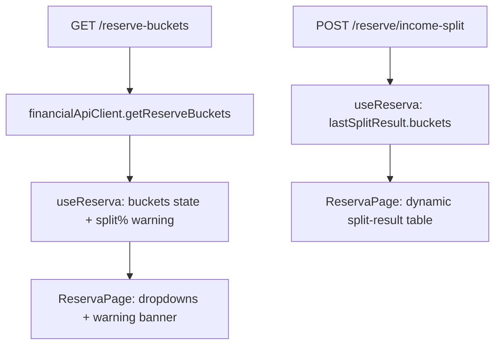

# F06. Web Dynamic Reserve Bucket UI

## 1. Technical Overview

**What:** Replace the React Reserva page's hardcoded 4-bucket array and hardcoded 4-row split-result table with data fetched live from `GET /reserve-buckets` (F05) and the now-dynamic income-split response (F03), plus a client-side warning banner when active buckets' percentages don't sum to ~100%.

**Why:** `RESERVE_BUCKETS` is a compiled-in array duplicating the seeded `ReserveBucket` list, and the split-result table still reads the pre-F03 `IncomeSplitResultDto` shape (`investimento`/`houseTreats`/`ariana`/`gleison`), which no longer matches the API response — the table is currently broken.

**Scope:**
- Included: `types.ts` (`ReserveBucketDto`, `BucketSplitAmountDto`, corrected `IncomeSplitResultDto`), `financialApiClient.ts` (`getReserveBuckets`), `useReserva.ts` (fetched bucket list, split-imbalance warning, bucket-required validation), `ReservaPage.tsx` (dynamic dropdowns, dynamic split-result table, warning banner).
- Excluded: No bucket create/edit/delete UI. No change to the balances table (already dynamic since F04).

## 2. Architecture Impact

**Affected components:**
- `Financial.Web/src/api/types.ts` (modified)
- `Financial.Web/src/api/financialApiClient.ts` (modified)
- `Financial.Web/src/hooks/useReserva.ts` (modified)
- `Financial.Web/src/pages/ReservaPage.tsx` (modified)
- Tests: `Financial.Web/src/hooks/useReserva.test.ts`, `Financial.Web/src/pages/__tests__/ReservaPage.test.tsx` (both modified)



## 3. Technical Decisions

| Decision | Chosen Approach | Alternative Considered | Trade-off |
|----------|-----------------|------------------------|-----------|
| Bucket-list fetch wiring | Fold `getReserveBuckets()` into the existing `fetchReservaData` call using `Promise.allSettled` for all 3 calls; a rejected buckets call leaves `buckets: []` without failing the page, while balances/movements failure still surfaces the full-page `ErrorState` | A separate independent `useEffect`/fetch for buckets | The PRD requires buckets-fetch failure to degrade to empty dropdowns (not a full-page error) while keeping one fetch/retry cycle instead of two independent ones — `Promise.allSettled` gets both properties without a second effect |
| Default selected bucket | On successful fetch, `withdrawalBucket` defaults to `buckets[0]?.name ?? ''` only if not already set; `CANCEL_WITHDRAWAL_FORM`/`WITHDRAWAL_SUCCESS` reset back to `state.buckets[0]?.name ?? ''` instead of a hardcoded string | Leave `withdrawalBucket` `''` after reset, relying on the browser's default first-option selection | A controlled `<select>` must have its value match a rendered option or React/DOM state silently diverge; explicit reset avoids that mismatch |
| Bucket-required validation | `submitWithdrawal` and `saveMovementEdit` reject with `'Bucket is required'` if the field is blank, mirroring the existing amount/date/description checks | Rely on the native `<select>` never producing an empty value | Satisfies the AC that an empty-dropdown state (fetch failure) blocks submission instead of silently posting an empty bucket name |
| Warning banner visibility | Computed unconditionally from `state.buckets` (sum of `isActive` buckets' `splitPercentage`), rendered once near the top of the page whenever it's non-null — not gated behind having an open form or a `lastSplitResult` | Only show the warning inside the split-result panel | The PRD describes the warning as informational about current configuration, not tied to a specific split action; showing it whenever relevant surfaces the issue before the user attempts a split |

## 4. Component Overview

| File Path | New/Modified | Purpose | Key Responsibilities |
|-----------|--------------|---------|----------------------|
| `Financial.Web/src/api/types.ts` | Modified | Types | Add `ReserveBucketDto { id, name, isActive, splitPercentage }` and `BucketSplitAmountDto { bucket, amount }`; change `IncomeSplitResultDto` to `{ buckets: BucketSplitAmountDto[], total }` |
| `Financial.Web/src/api/financialApiClient.ts` | Modified | API client | Add `getReserveBuckets: () => request<ReserveBucketDto[]>('/reserve-buckets')`, mirroring `getBanks`/`getIncomeSources` |
| `Financial.Web/src/hooks/useReserva.ts` | Modified | State/logic | Remove `RESERVE_BUCKETS`; add `buckets` state fetched via `Promise.allSettled`; compute `splitPercentageWarning`; add bucket-required validation to withdrawal/edit-movement submission |
| `Financial.Web/src/pages/ReservaPage.tsx` | Modified | UI | Dropdowns iterate fetched `buckets`; split-result table iterates `lastSplitResult.buckets`; render warning banner |

## 5. API Contracts

No backend changes (F05/F03 already shipped). Frontend-consumed shapes:

**`GET /reserve-buckets` response (existing, F05):**
```json
[{ "id": "b1f4...", "name": "Investimento", "isActive": true, "splitPercentage": 33.33 }]
```

**`POST /reserve/income-split` response (existing, F03):**
```json
{ "buckets": [{ "bucket": "Investimento", "amount": 654.27 }], "total": 1963 }
```

## 6. Business Rules

- Withdrawal/edit-movement dropdowns list every fetched bucket (active and inactive) by `name`, keyed by `id`.
- `splitPercentageWarning` = `"Active bucket percentages sum to {sum}%, not 100%"` when the sum of `isActive` buckets' `splitPercentage` falls outside `[99.99, 100.01]`; `null` when within band, when there are zero buckets, or while the bucket list hasn't loaded yet.
- `withdrawalBucket`/`editMovementBucket` must be non-empty to submit; empty triggers `'Bucket is required'` without calling the API.

## 7. Testing Strategy

| Test File | Test Type | Target | Coverage Goal |
|-----------|-----------|--------|----------------|
| `Financial.Web/src/hooks/useReserva.test.ts` | Hook (RTL `renderHook`) | `useReserva` | Buckets loaded into state; default bucket selection; split-imbalance warning computed correctly (balanced, unbalanced, empty); bucket-required validation; buckets-fetch failure leaves `buckets: []` without triggering `error` |
| `Financial.Web/src/pages/__tests__/ReservaPage.test.tsx` | Component (RTL) | `ReservaPage` | Dropdowns render fetched buckets including inactive; split-result table renders one row per `lastSplitResult.buckets` entry; warning banner shown/hidden based on fixture percentages |

**Acceptance-criteria traceability (PRD Section 9, F06):**
- "Dropdowns list every bucket returned by `GET /reserve-buckets`, including inactive ones" → new `ReservaPage` test rendering an inactive bucket in both dropdowns
- "Split-result table renders one row per entry in the income-split response" → new `ReservaPage` test with a 3-bucket split result
- "Warning banner appears/does not appear based on percentage sum" → new `useReserva`/`ReservaPage` tests with balanced and unbalanced fixtures
- "If the bucket-list fetch fails, dropdowns render empty and validation blocks submission" → new `useReserva` test asserting `buckets: []` and a `'Bucket is required'` validation error on submit
