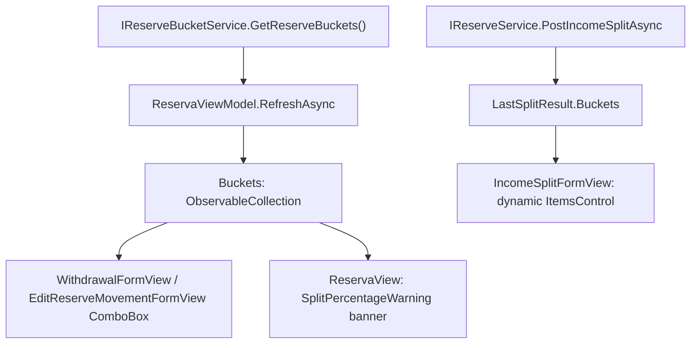

# F07. WPF Dynamic Reserve Bucket UI

## 1. Technical Overview

**What:** Replace the WPF Reserva tab's hardcoded `ReservaViewModel.Buckets` string array and the `IncomeSplitFormView`'s hardcoded 4-line split-result display with data sourced from `IReserveBucketService` (already implemented by F05) and the now-dynamic `IncomeSplitResultDTO.Buckets` shape (already implemented by F03), plus a split-imbalance warning — mirroring F06's web implementation.

**Why:** `ReservaViewModel.Buckets` (`["Investimento", "HouseTreats", "Ariana", "Gleison"]`) is a compiled-in array, and `IncomeSplitFormView.xaml` still binds to `LastSplitResult.Investimento`/`.HouseTreats`/`.Ariana`/`.Gleison`, properties that no longer exist on `IncomeSplitResultDTO` since F03 changed its shape to `{ Buckets: BucketSplitAmountDTO[], Total }`. WPF bindings fail silently, so this panel is currently non-functional — F07 fixes the same class of bug F06 already fixed on the web.

**Architectural note:** unlike the web app, `Financial.App` has no HTTP client — it is a monolithic desktop app that references `Financial.CashFlow.Application`/`Infrastructure` directly and resolves services from an in-process DI container. `IReserveBucketService` (F05) is already registered in that container; F07 is "inject it into `ReservaViewModel` and bind an `ObservableCollection<ReserveBucketDTO>`," not "call an HTTP endpoint."

**Scope:**
- Included: `ReservaViewModel.cs` (bucket collection, default-bucket selection, split-percentage warning), `IncomeSplitFormView.xaml` (dynamic split-result display), `WithdrawalFormView.xaml`/`EditReserveMovementFormView.xaml` (dynamic bucket `ComboBox`), `ReservaView.xaml` (warning banner), `App.xaml.cs` (DI wiring).
- Excluded: No changes to `Balances`/`Movements` loading (already dynamic per F04). No bucket create/edit/delete UI.

## 2. Architecture Impact

**Affected components:**
- `Financial.App/ViewModels/CashFlow/ReservaViewModel.cs` (modified)
- `Financial.App/Views/CashFlow/IncomeSplitFormView.xaml` (modified)
- `Financial.App/Views/CashFlow/WithdrawalFormView.xaml` (modified)
- `Financial.App/Views/CashFlow/EditReserveMovementFormView.xaml` (modified)
- `Financial.App/Views/CashFlow/ReservaView.xaml` (modified — warning banner)
- `Financial.App/App.xaml.cs` (modified — DI registration gains `IReserveBucketService`)
- Tests: `Tests/Financial.Presentation.Tests/ViewModels/CashFlow/TestStubs.cs` (modified — new `StubReserveBucketService`), `Tests/Financial.Presentation.Tests/ViewModels/CashFlow/ReservaViewModelTests.cs` (modified)

## 3. Technical Decisions

| Decision | Chosen Approach | Alternative Considered | Trade-off |
|----------|-----------------|------------------------|-----------|
| Bucket loading | Fetch buckets inside the existing `RefreshAsync` (parallel `Task.Run` alongside balances/movements via `Task.WhenAll`), matching exactly how `MonthlyViewModel` already loads `Banks`/`IncomeSources` | A separate load cycle/command for buckets | Consistency with the established Bank/IncomeSource pattern in this same codebase; no reason to diverge |
| Buckets-fetch degradation | Wrap the bucket fetch in its own try/catch inside its `Task.Run`, defaulting to an empty list on failure, so a bucket-service failure never sets the page-level `Error` (which would hide the whole tab behind the error panel) | Let a bucket failure propagate into the shared `catch` and fail the whole `RefreshAsync` | Mirrors F06's requirement that a bucket-list failure degrades to empty dropdowns, not a full-page error |
| Re-fetching buckets on every mutation-triggered refresh | Keep buckets in the single `RefreshAsync` used by all mutation success paths (split/withdrawal/edit/delete) — no `includeBuckets` flag | Add an opt-out flag like F06's web fix, to skip the bucket re-fetch after mutations | F06's flag existed because the web fetch is a real HTTP round-trip; `IReserveBucketService.GetReserveBuckets()` is an in-process, in-memory call — the same category of "always re-fetch" cost already accepted for `GetBucketBalances()`/`GetMovementHistory()` on every mutation. Adding the flag here would be complexity with no measurable benefit, contrary to CLAUDE.md's no-over-engineering guidance for this personal project |
| Default bucket selection | `DefaultBucketName()` helper: first `IsActive` bucket, falling back to the first bucket overall, empty string if none — matches F06's post-code-review fix exactly | Always take `Buckets[0]` | Avoids ever silently defaulting a new withdrawal to an inactive bucket when bucket ordering isn't guaranteed |
| `ComboBox` binding for bucket pickers | `ItemsSource="{Binding Buckets}" DisplayMemberPath="Name" SelectedValue="{Binding WithdrawalBucket}" SelectedValuePath="Name"` | Switch the bound field to `Guid?` like `ExpenseFormPaymentSource`/`Guid` bank ids | The wire-level DTOs (`WithdrawalRequestDTO.Bucket`, `UpdateReserveMovementDTO.Bucket`) are plain bucket-name strings per F02's decision — `WithdrawalBucket`/`EditBucket` stay `string`, only their source of truth (static array → live collection) changes |
| Split-imbalance warning display | A `TextBlock` with `Foreground="Red"` bound to a computed `SplitPercentageWarning` string (empty when no warning), reusing the exact idiom already used for `WithdrawalSaveError`/`SameBankTransferError` | Introduce a new amber/warning-colored `Border` style, matching the web's `.reserva-page__warning` visual treatment | WPF has zero existing precedent for an amber/informational banner (only red-error and modal-`MessageBox` warning conventions exist). Introducing a new visual style for one banner is unwarranted UI-system growth for a single-user personal app; the existing red-text-when-non-empty convention is already used for the one non-error case in this codebase (`SameBankTransferError`), so this is reuse, not a new pattern |
| Split-result display | An `ItemsControl` bound to `LastSplitResult.Buckets`, `DataTemplate` using a `MultiBinding` with `StringFormat="{}{0}: {1:N2}"` | A fixed-row `Grid` sized to the current bucket count | `ItemsControl` naturally renders however many entries the response contains; the `MultiBinding`/`StringFormat` idiom already exists in this exact file's sibling view (`ReservaView.xaml`'s `RowDetailsTemplate`), so this reuses an established pattern rather than introducing a new one |

## 4. Component Overview

| File Path | New/Modified | Purpose | Key Responsibilities |
|-----------|--------------|---------|----------------------|
| `Financial.App/ViewModels/CashFlow/ReservaViewModel.cs` | Modified | State/logic | Remove `static readonly string[] Buckets`; add `IReserveBucketService` dependency, `ObservableCollection<ReserveBucketDTO> Buckets`, `DefaultBucketName()`, `SplitPercentageWarning` computed property; `RefreshAsync` fetches buckets alongside balances/movements |
| `Financial.App/Views/CashFlow/IncomeSplitFormView.xaml` | Modified | UI | Replace the 4 hardcoded `TextBlock`s with an `ItemsControl` over `LastSplitResult.Buckets` |
| `Financial.App/Views/CashFlow/WithdrawalFormView.xaml` | Modified | UI | Bucket `ComboBox` sourced from `Buckets` instead of `x:Static vm:ReservaViewModel.Buckets` |
| `Financial.App/Views/CashFlow/EditReserveMovementFormView.xaml` | Modified | UI | Same `ComboBox` change as withdrawal form |
| `Financial.App/Views/CashFlow/ReservaView.xaml` | Modified | UI | Add a red `TextBlock` bound to `SplitPercentageWarning`, positioned near the toolbar |
| `Financial.App/App.xaml.cs` | Modified | DI | `ReservaViewModel` registration gains `sp.GetRequiredService<IReserveBucketService>()` as a constructor argument |

## 5. Business Rules

- `Buckets` lists every bucket returned by `IReserveBucketService.GetReserveBuckets()`, active and inactive, unfiltered — consistent with F06 and with the PRD's requirement that a movement can still target an inactive bucket.
- `WithdrawalBucket` defaults to the first `IsActive` bucket (falling back to the first bucket overall, or empty if none) whenever the withdrawal form opens, and whenever `Buckets` first loads with `WithdrawalBucket` still empty.
- `SplitPercentageWarning` = `"Active bucket percentages sum to {sum:N2}%, not 100%"` when the sum of `IsActive` buckets' `SplitPercentage` falls outside `[99.99, 100.01]`; empty string when within band, or when `Buckets` is empty.
- Existing bucket-required validation (`WithdrawalFormValidation.BuildValidationMessage`, `EditReserveMovementFormValidation.BuildValidationMessage`) already rejects a blank bucket with `"Bucket is required."` — unchanged by this feature, but now exercised for real: an empty `Buckets` collection (fetch failure) leaves the `ComboBox` with no items and `WithdrawalBucket`/`EditBucket` empty, so this existing check now blocks submission as the PRD's acceptance criterion requires.

## 6. Error Handling

- If `IReserveBucketService.GetReserveBuckets()` throws inside `RefreshAsync`, the exception is caught locally (inside the buckets `Task.Run`), `Buckets` is left/set empty, and the page's `Error`/`HasError` state is unaffected — balances and movements still load and display normally.

## 7. Testing Strategy

| Test File | Test Type | Target | Coverage Goal |
|-----------|-----------|--------|----------------|
| `Tests/Financial.Presentation.Tests/ViewModels/CashFlow/TestStubs.cs` | N/A (test infra) | New `StubReserveBucketService` | `List<ReserveBucketDTO> ReserveBuckets`, optional `Exception? ThrowOnGet`, mirroring `StubIncomeSourceService`'s shape exactly |
| `Tests/Financial.Presentation.Tests/ViewModels/CashFlow/ReservaViewModelTests.cs` | Unit (ViewModel, hand-written stubs) | `ReservaViewModel` | Buckets loaded into `Buckets`; default bucket prefers an active bucket over a leading inactive one; `SplitPercentageWarning` empty/populated for balanced/unbalanced fixtures; a `StubReserveBucketService.ThrowOnGet` failure leaves `Buckets` empty without setting `Error`, and blocks a withdrawal submission with the existing `"Bucket is required."` message |

**Acceptance-criteria traceability (PRD Section 9, F07):**
- "The WPF Reserva view's withdrawal/edit bucket combo boxes list every bucket returned by `GET /reserve-buckets`, including inactive ones" → new `Buckets_LoadsAllBucketsIncludingInactive` test (WPF consumes the same `IReserveBucketService` the endpoint delegates to, so this is verified at the service-injection boundary)
- "The split-result display renders dynamically, matching however many buckets are active" → existing `SubmitIncomeSplit_ValidForm_CallsServiceAndShowsResultPanel` test continues to pass against the `Buckets`/`Total` stub shape (already set up in `StubReserveService.SplitResult`); `IncomeSplitFormView.xaml`'s `ItemsControl` renders one row per entry with no ViewModel-level count assumption
- "A warning is shown when active buckets' `SplitPercentage` values sum outside 99.99–100.01, and is not shown when they sum within that band" → new `SplitPercentageWarning_*` tests
- "If the fetch fails, combo boxes are empty and the form's required-field validation blocks submission without a selected bucket" → new `Buckets_ServiceThrows_LeavesBucketsEmptyWithoutPageError` and a withdrawal-submission test asserting `"Bucket is required."`

**Cross-Feature Integration (PRD Section 9, referencing F06/F07):**
- "The split-result response (F03), bucket balances (F04), and bucket list (F05) are correctly fetched and rendered in both the web Reserva page (F06) and the WPF Reserva view (F07)" → covered jointly by F06's (already merged) and this feature's test suites
