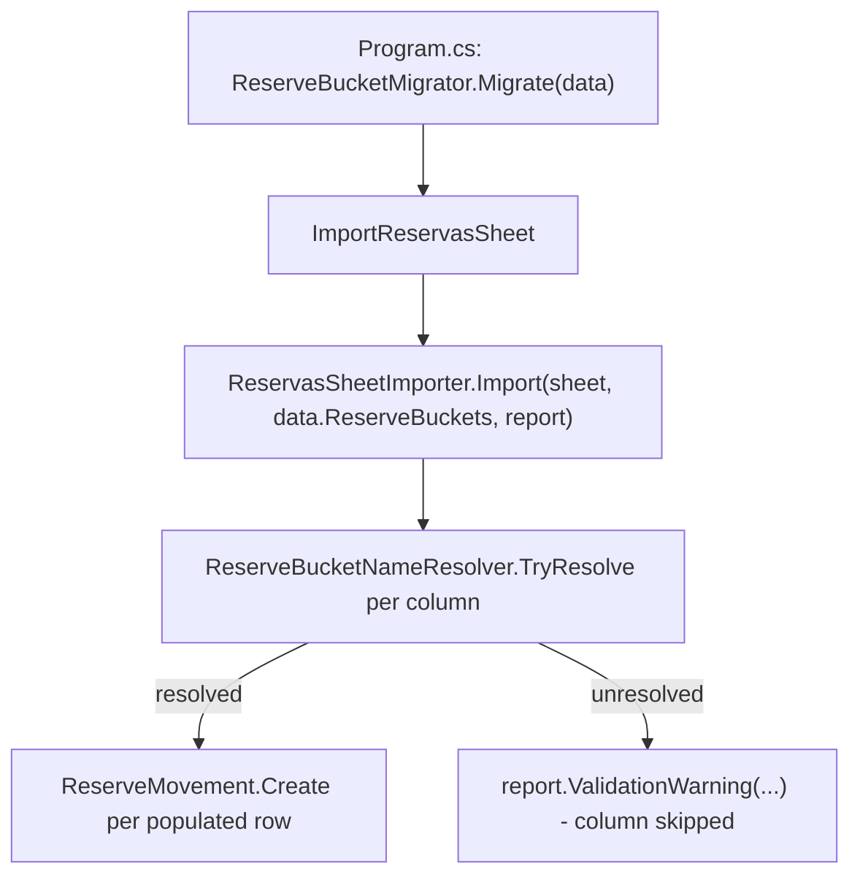

# F08. Spreadsheet Import Update for Reserve Buckets

## 1. Technical Overview

**What:** Change `ReservasSheetImporter`'s unresolved-bucket-column handling from a hard failure (`throw new InvalidOperationException`) to the soft-fail-and-audit pattern already used elsewhere in this tool — log the unresolved column in the shared `ImportReport` and skip its amounts, without failing the rest of the import.

**Why:** F02's minimal adaptation of `ReservasSheetImporter` (made just to keep the build compiling once `ReserveMovement.Bucket` became an entity reference) already resolves each of the 4 fixed bucket columns against the seeded `ReserveBucket` list via `ReserveBucketNameResolver`, and `Program.cs` already runs `ReserveBucketMigrator.Migrate(data)` both before `ImportReservasSheet` and again at the end for the audit summary — both matching this feature's PRD capabilities exactly. The one remaining gap: an unresolved column currently throws and aborts the whole import run, whereas every other unresolved-name case in this tool (categories, payment sources, income sources, banks) degrades to a per-row/per-column audit entry and continues.

**Scope:**
- Included: `ReservasSheetImporter.Import` gains an `ImportReport` parameter; unresolved bucket columns are logged via `report.ValidationWarning(...)` and excluded from the row-iteration loop instead of throwing. `Program.cs`'s single call site updated to pass `report`.
- Excluded: No change to the migrator wiring order (already correct per F02). No change to the fixed column layout (columns 6-9, column 4/Dizimo skipped) — still out of scope per the PRD.

## 2. Architecture Impact

**Affected components:**
- `Integrations/CashFlowSpreadsheetImport/SheetImporters/ReservasSheetImporter.cs` (modified)
- `Integrations/CashFlowSpreadsheetImport/Program.cs` (modified — one call site)
- Tests: `Tests/Financial.CashFlowSpreadsheetImport.Tests/SheetImporters/ReservasSheetImporterTests.cs` (modified)

## 3. Technical Decisions

| Decision | Chosen Approach | Alternative Considered | Trade-off |
|----------|-----------------|------------------------|-----------|
| Where to log an unresolved column | `report.ValidationWarning(...)`, once per unresolved column name (not per row) | `report.RowFlagged(...)` once per affected row/cell | An unresolved bucket name is a column-level condition (the same seeded-or-not answer applies to every row), not a per-row data problem like a malformed cell value — a single audit-summary line naming the column is clearer than one `RowFlagged` entry per populated cell in that column, and matches how `ValidationWarning` is already used for sheet-wide conditions (e.g. `Resumo` cross-check warnings) |
| Signature change | Add `ImportReport report` as a new parameter to `ReservasSheetImporter.Import`, positioned last, matching `MonthlyExpenseSheetImporter.Import(sheet, year, month, today, report, banks)`'s established parameter-ordering convention (report before the resolved-entity collection there; report last here since buckets is the primary existing parameter and report is newly added) | Return unresolved-column info from `Import` and have `Program.cs` log it | Every other sheet importer in this tool takes `ImportReport` directly and writes to it inline — keeping resolution and reporting together in one pass avoids a second return value/tuple the caller would have to unpack |

## 4. Component Overview

| File Path | New/Modified | Purpose | Key Responsibilities |
|-----------|--------------|---------|----------------------|
| `Integrations/CashFlowSpreadsheetImport/SheetImporters/ReservasSheetImporter.cs` | Modified | Import logic | `Import(sheet, buckets, report)`; `ResolveBucketColumns` returns only the columns that resolved, logging a `ValidationWarning` for each that didn't, instead of throwing |
| `Integrations/CashFlowSpreadsheetImport/Program.cs` | Modified | Orchestration | `ImportReservasSheet` passes its already-in-scope `report` through to `ReservasSheetImporter.Import` |

## 5. Business Rules

- Each of the 4 fixed bucket columns (6-9) is resolved independently against `data.ReserveBuckets` by name (case-insensitive, via the existing `ReserveBucketNameResolver`).
- A column whose expected name (`Investimento`/`HouseTreats`/`Ariana`/`Gleison`) isn't found among the seeded buckets contributes zero movements for the whole sheet and is recorded once in `ImportReport`'s validation warnings; every other resolved column continues to import normally for every row.
- No change to which rows produce movements or how amounts are read (`NumericCellReader`, blank-cell skip, date-validity skip) — untouched by this feature.

## 6. Testing Strategy

| Test File | Test Type | Target | Coverage Goal |
|-----------|-----------|--------|----------------|
| `Tests/Financial.CashFlowSpreadsheetImport.Tests/SheetImporters/ReservasSheetImporterTests.cs` | Unit (real in-memory `XLWorkbook`) | `ReservasSheetImporter.Import` | Replace the existing throw-based test with one asserting: an unresolved column produces no movements for that bucket, other columns still import normally, and the unresolved name is recorded in `report.ValidationWarnings` |

**Acceptance-criteria traceability (PRD Section 9, F08):**
- "A full spreadsheet import produces `ReserveMovement` records referencing seeded `ReserveBucket` entities with the same dates, amounts, and descriptions as the prior enum-based import for unchanged source data" → existing passing tests (`Import_RowWithAllFourBucketsPopulated_CreatesOneMovementPerBucket`, `Import_RowWithSingleBucketPopulated_CreatesOneWithdrawalMovement`) already cover this and are unaffected by this change
- "`ReserveBucketMigrator` runs before the Reservas sheet import within `Program.cs`'s orchestration, and again at the end for the audit summary" → already true (F02); no new test needed, verified by reading `Program.cs`
- "If an expected column's bucket name isn't found in the seeded list, the importer logs it as unresolved in the audit summary and skips that column's amounts without failing the whole import" → new `Import_WithACanonicalBucketNameNotSeeded_SkipsThatColumnAndLogsAWarning` test
