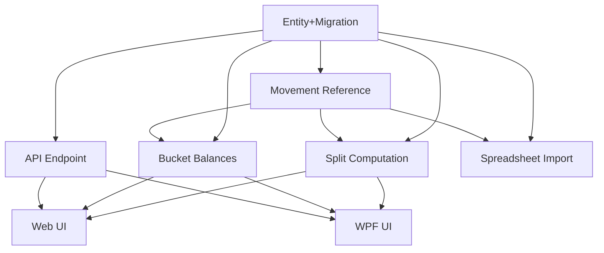

# Reserve Bucket Entity

## 1. Executive Summary

This feature converts how the Financial app models reserve/savings buckets in the "Reserva" (income-split) feature. Today, `ReserveBucket` is a hardcoded 4-member enum (`Investimento`, `HouseTreats`, `Ariana`, `Gleison`), and the percentage each bucket receives from a posted income split is a compiled-in fraction inside a static `ReserveSplitCalculator` (exact thirds and sixths), returned as a fixed-shape `ReserveSplitResult` record. This PRD replaces the enum with a real `ReserveBucket` domain entity — following the exact pattern already established by `Bank` and `IncomeSource` — that directly carries its own name, active status, and split percentage, and deletes `ReserveSplitCalculator`/`ReserveSplitResult` in favor of each bucket computing its own share.

The product is the same personal cash-flow tracker used to record incomes, expenses, transfers, and reserve movements (React web app + WPF desktop app, sharing one .NET backend and one JSON data file). The core value of this change is consistency, extensibility, and correctness: reserve buckets become first-class seeded data (like banks and income sources) instead of a compiled-in enum with a hardcoded split, a stored `SplitPercentage` per bucket replaces the implicit exact-fraction math, and a non-blocking warning surfaces whenever active buckets' percentages don't sum to 100% — directly addressing a real historical bug where the source spreadsheet's own split percentages didn't add up and had to be silently worked around in code.

At a high level: a one-time idempotent migration seeds four `ReserveBucket` records (mirroring the current enum's four values, each pre-assigned its historical implicit percentage); `ReserveMovement.Bucket` changes from an enum to a real entity reference resolved the same way `Income.Bank` already resolves against the seeded `Bank` list; income-split computation asks each active bucket for its own share of the posted amount instead of calling a separate calculator; the spreadsheet importer resolves bucket columns against the seeded list by name instead of an enum literal; and a new read-only API endpoint lets both web and desktop clients replace their hardcoded bucket-name lists with a live, dynamic picklist and split-result display.

## 2. Problem and Opportunity

**The Problem**

- **Split percentages are compiled-in, not stored data.** `ReserveSplitCalculator` hardcodes exact fractions (1/3, 1/3, 1/6, 1/6) rather than reading a stored, verifiable percentage. The original P11 spec documents *why*: the source spreadsheet's own split ("33%/33%/16.5%/16.5%") didn't sum to 100%, so the team hardcoded around it instead of trusting stored data — a real bug that has never been formally caught or surfaced since.
- **Hardcoded bucket list duplicated across 4+ places.** The same 4 bucket names are duplicated in the C# enum, `ReservasSheetImporter`'s column-to-enum map, the WPF Reserva view, and the React `RESERVE_BUCKETS` array plus its hardcoded 4-row split-result table. Adding, renaming, or retiring a bucket today requires a coordinated code change and redeploy across four surfaces.
- **Fixed-4-bucket assumption baked into core logic.** `GetBucketBalances()` uses `Enum.GetValues<ReserveBucket>()` to force exactly 4 output rows, and `IncomeSplitResultDTO` has 4 fixed named decimal fields (`Investimento`, `HouseTreats`, `Ariana`, `Gleison`) instead of a list — the split feature cannot support a different bucket count or name without a schema change.
- **Inconsistent modeling versus `Bank`/`IncomeSource`.** Both were already migrated from enums to seeded entities (`Bank` in P13, `IncomeSource` in P26), establishing the intended pattern for "reference data" in this codebase. `ReserveBucket` staying an enum means the domain has three different representations for conceptually identical kinds of data.

**The Opportunity**

- Storing `SplitPercentage` directly on each bucket and computing a bucket's own share from it (`bucket.CalculateSplitAmount(totalAmount)`) removes the compiled-in fraction math entirely and makes the split percentage a first-class, auditable value instead of hidden logic.
- A non-blocking warning when active buckets' percentages don't sum to ~100% turns the exact bug the P11 spec worked around into something the system actually detects and surfaces, without blocking legitimate in-between states (e.g. mid-rebalance).
- Seeding `ReserveBucket` through the existing `CashFlowSpreadsheetImport` migration tool reuses the same proven, idempotent pattern already used for `Bank` and `IncomeSource`, carrying the same low operational risk.
- Exposing buckets through a new read-only `GET /reserve-buckets` endpoint (mirroring `GET /banks` / `GET /income-sources`) lets both clients read the bucket list and split percentages from one source of truth, eliminating the 4+ duplicated hardcoded lists.

## 3. Target Audience

### Primary Users

**Household Finance Owner**
- Personal user (and their household) who posts income splits and reserve withdrawals in the Reserva feature on a regular basis.
- Uses the existing 4-bucket picklist (Investimento/HouseTreats/Ariana/Gleison) without needing to understand how buckets or their percentages are stored internally.
- Cares that the reserve balances and split amounts they've relied on for financial tracking remain trustworthy after this refactor — small rounding differences from moving off exact fractions to stored 2-decimal percentages are acceptable, but silent miscalculation is not.

*(This PRD is a single-persona internal refactor; the acting user is the same person who already uses the Reserva tab today. No new persona or behavioral profile is introduced.)*

## 4. Objectives

**Product Objectives**

- **Unify** reserve bucket representation under one seeded entity, eliminating the enum/calculator/result-record split.
- **Store** each bucket's split percentage as real data instead of compiled-in fractions, computed by the bucket itself.
- **Surface** a non-blocking warning whenever active buckets' percentages don't sum to 100%, closing the historical spreadsheet gap noted in the P11 spec.
- **Centralize** the bucket picklist and split-result display so both clients read them from the backend instead of hardcoding them.
- **Match** the established `Bank`/`IncomeSource` entity pattern for reference data (no CRUD, seeded via migration, read-only API).

**Success Metrics**

- 100% of existing `ReserveMovement` records resolve to a valid seeded bucket after migration (0 unresolved bucket names in the migration audit log).
- Income-split amounts computed via `bucket.CalculateSplitAmount()` match a manual recomputation of `amount * SplitPercentage / 100` (rounded to 2 decimals, away-from-zero) for a full regression suite of representative amounts, with any deviation from the old exact-fraction output documented as an accepted, bounded rounding difference (a few cents at most).
- 0 remaining references to the `ReserveBucket` enum, `ReserveSplitCalculator`, `ReserveSplitResult`, or `ReserveBucketParser` in the codebase after ship.
- Both web and WPF Reserva views populate their bucket dropdowns and split-result tables exclusively from `GET /reserve-buckets` and the dynamic split-result response (0 hardcoded bucket-name arrays remaining in either client).
- The split-percentage warning is shown in both clients whenever active buckets' percentages sum outside a 99.99%–100.01% tolerance band, verified against a fixture where percentages are deliberately unbalanced.

## 5. User Stories

### F01. ReserveBucket Domain Entity and Seed Migration
- As the system, I want to store reserve buckets as seeded entities with an id, name, active flag, and split percentage, so that bucket data is no longer compiled into an enum with hardcoded fractions
- As the system, I want a one-time idempotent migration to create the four existing buckets with their historical implicit percentages, so that historical reserve data keeps resolving correctly after the change
- As the system, I want the migration to warn (without failing) when active buckets' percentages don't sum to 100%, so that a misconfigured split is visible instead of silently wrong

### F02. ReserveMovement Reference to ReserveBucket
- As the system, I want `ReserveMovement.Bucket` to reference a real `ReserveBucket` entity instead of an enum value, so that movements resolve to the same seeded bucket data used everywhere else
- As a user, I want my withdrawal or edit request to be rejected with a clear error if I submit an unrecognized bucket name, so that bad data can't silently enter my reserve history

### F03. Income Split Computation via Bucket Percentages
- As a user, I want a posted income split to divide the amount across all active buckets using their stored percentages, so that the split reflects real, auditable data instead of hidden fractions
- As a user, I want an income split rejected with a clear error if no buckets are currently active, so that money is never silently lost to a misconfigured split
- As the system, I want each bucket to compute its own share of a posted amount, so that split logic lives on the entity that owns the data instead of a separate calculator class

### F04. Reserve Bucket Balances for All Buckets
- As a user, I want to see the balance of every bucket, including inactive ones, so that money already allocated to a retired bucket remains visible and withdrawable
- As a user, I want the balance list to reflect however many buckets are currently seeded, so that the view isn't hardcoded to exactly four rows

### F05. Reserve Buckets API Endpoint
- As a client application, I want to fetch the full list of reserve buckets with their active status and split percentage, so that I can build a picklist and a split-imbalance warning without hardcoding values

### F06. Web Dynamic Reserve Bucket UI
- As a user, I want the Reserva page's bucket dropdowns and split-result table to reflect the actual configured buckets, so that the UI never falls out of sync with the backend
- As a user, I want to see a warning on the Reserva page if active buckets' percentages don't sum to 100%, so that I notice a misconfiguration before it affects my split

### F07. WPF Dynamic Reserve Bucket UI
- As a user, I want the WPF Reserva view's bucket dropdowns and split-result display to reflect the actual configured buckets, so that the desktop app behaves consistently with the web app
- As a user, I want to see the same split-imbalance warning in the WPF app that I see on the web, so that either client alerts me to a misconfiguration

### F08. Spreadsheet Import Update for Reserve Buckets
- As the system, I want the Reservas sheet importer to resolve each column's bucket by name against the seeded `ReserveBucket` list, so that imported movements reference real bucket entities instead of an enum literal
- As the system, I want the reserve bucket migration to run before the Reservas sheet import, so that bucket names can be resolved during import

## 6. Functionalities

### F01. ReserveBucket Domain Entity and Seed Migration

**Provides:**
- Seeded `ReserveBucket` records — id, name, active flag, split percentage (used by F02, F03, F04, F05, F08)

**Capabilities:**
- `ReserveBucket` entity fields: `Id` (Guid, assigned on creation), `Name` (string, non-empty), `IsActive` (bool), `SplitPercentage` (decimal, 0–100 inclusive, 2 decimal places).
- No public mutators beyond the static `Create` factory — immutable after creation, matching the no-CRUD, seeded-only scope of `Bank`/`IncomeSource`.
- `CashFlowData` gains a `ReserveBuckets` collection (`IReadOnlyCollection<ReserveBucket>`) and an `AddReserveBucket(ReserveBucket)` method, mirroring `Banks`/`AddBank`.
- `ICashFlowRepository` gains `GetReserveBuckets(): IEnumerable<ReserveBucket>` (read-only, no add/delete on the interface — consistent with `GetBanks()`).
- New `ReserveBucketMigrator` (under `Integrations/CashFlowSpreadsheetImport/Migrations/ReserveBuckets/`) seeds exactly four records idempotently (skips a name that already exists, case-insensitive): `Investimento` → 33.33%, `HouseTreats` → 33.33%, `Ariana` → 16.67%, `Gleison` → 16.67%, all `IsActive = true`.
- `ReserveBucketMigrator` runs unconditionally as part of `Program.cs`'s migration sequence, before `ImportReservasSheet` (so bucket names can be resolved during import — see F08) and again at the end alongside `BankMigrator`/`IncomeSourceMigrator` for the final audit summary.
- `CashFlowTypeInfoResolver` registers `typeof(ReserveBucket)` in `ManagedTypes` for private-setter JSON (de)serialization, matching `Bank`/`IncomeSource`.
- `ReserveBuckets` is added to `CarryOverDataTheSpreadsheetDoesNotOwn`, so seeded bucket data (and any percentage drift a user may have manually corrected in the data file) persists across a full spreadsheet rebuild, matching `Banks`/`IncomeSources`.
- The `Financial.CashFlow.Domain.Enums.ReserveBucket` enum is deleted (the new entity takes its name and namespace).

**Experience:**
- Entirely a backend/data change — no direct UI. Running the migration tool once (`CashFlowSpreadsheetImport`) is the only manual step; subsequent runs are no-ops for already-seeded buckets.
- The migration's summary output (printed to console like every other migrator's `Render()`) reports how many buckets were newly seeded versus already present, flags any existing `ReserveMovement` bucket name that doesn't match a seeded bucket, and additionally reports — as a warning line, not a failure — when the sum of `IsActive = true` buckets' `SplitPercentage` falls outside 99.99%–100.01%.

**Error Handling:**
- If the data file cannot be backed up before the migration runs, the tool aborts before making any change (existing `MigrationBackup` behavior, reused as-is).
- If an existing `ReserveMovement`'s bucket name does not match any of the four seeded names, the migrator logs it in the audit summary as unresolved but does not fail the run or mutate the record — matching `BankMigrator`'s unresolved-value behavior.
- If active buckets' percentages don't sum to ~100%, the migration completes normally and reports a warning in the audit summary — this never blocks the run.
- Re-running the migration against an already-seeded data file is a safe no-op (idempotency check by case-insensitive name match, same as `BankMigrator`/`IncomeSourceMigrator`).

### F02. ReserveMovement Reference to ReserveBucket

**Consumes:**
- F01: seeded `ReserveBucket` records (id, name) for reference resolution

**Provides:**
- `ReserveMovement.Bucket` as a resolvable entity reference to a seeded `ReserveBucket` (used by F03, F04, F08)

**Capabilities:**
- `ReserveMovement.Bucket` changes from `ReserveBucket` (enum) to `ReserveBucket` (entity), with `Create`/`Update` accepting the entity instead of the enum value.
- `CashFlowDataConverter.Read` resolves `ReserveBuckets` alongside `Banks`/`IncomeSources`/`InvestmentAccounts` before any other collection, so `ReserveMovement.Bucket` deserializes to the same instance as the seeded bucket.
- New `ReserveBucketReferenceConverter` (thin subclass of the existing generic `ReferenceConverter<T>`, mirroring `BankReferenceConverter`/`IncomeSourceReferenceConverter`) with wire field name `"BucketId"`, registered in `CashFlowTypeInfoResolver.ReferenceProperties` for `ReserveMovement.Bucket`.
- New `ReserveBucketNameResolver` (Application/Validation layer, mirroring `BankNameResolver`/`IncomeSourceNameResolver`): `TryResolve(string? name, IReadOnlyCollection<ReserveBucket> buckets, out ReserveBucket? bucket)`, case-insensitive match — used wherever a movement is created or updated from a DTO-supplied bucket name (withdrawal, update-movement).
- `ReserveBucketParser` (the old enum-string parser) and its dedicated test file are deleted.
- API-facing DTOs (`ReserveMovementDTO.Bucket`, `WithdrawalRequestDTO.Bucket`, `UpdateReserveMovementDTO.Bucket`) remain plain strings (the bucket's name) — no client-facing contract change; only the internal domain representation moves from enum to entity reference. **Superseded:** this deferral was lifted in a later refactor — those DTOs now carry `BucketId` (plus `BucketName` on the read models), matching how every other referenced entity is identified.

**Experience:**
- No visible UI change on the success path — a user selecting a bucket by name (via F06/F07's dynamic picklist) always submits a valid, resolvable name.
- If a withdrawal or movement update is submitted with a bucket name that isn't seeded, the request is rejected with a validation error naming the invalid bucket, matching the wording style of the existing Bank-name validation error.

**Error Handling:**
- Withdrawal/update rejected with a validation error naming the invalid bucket, when the submitted bucket name does not match any seeded `ReserveBucket`.
- If the data file itself contains a `ReserveMovement` whose `BucketId` doesn't resolve to any seeded bucket (data corruption, not a normal user path), deserialization fails with a clear error — consistent with how other entity-reference converters treat an unresolved id as a structural integrity failure.

### F03. Income Split Computation via Bucket Percentages

**Consumes:**
- F01: seeded `ReserveBucket` records (active flag, split percentage) to compute each bucket's share
- F02: `ReserveMovement` creation against a bucket entity reference

**Provides:**
- Per-bucket split amounts and total for a posted income split (used by F06, F07)

**Capabilities:**
- `ReserveSplitCalculator` and `ReserveSplitResult` are deleted.
- `ReserveBucket` gains a domain method `CalculateSplitAmount(decimal totalAmount): decimal`, returning `Math.Round(totalAmount * SplitPercentage / 100m, 2, MidpointRounding.AwayFromZero)` — matches the existing rounding behavior (independent per-bucket rounding, no penny-reconciliation across buckets), now driven by stored data instead of a hardcoded fraction.
- `ReserveService.PostIncomeSplitAsync` iterates `_repository.GetReserveBuckets().Where(b => b.IsActive)`, creates one `ReserveMovement` per active bucket via `bucket.CalculateSplitAmount(request.Amount)`, and rejects the request (before creating any movement) if no bucket is currently active.
- `IncomeSplitResultDTO` changes from 4 fixed named decimal fields to a dynamic shape: a list of per-bucket entries (bucket name, amount) plus a `Total`.
- Inactive buckets receive no movement from an income split — `IsActive` gates split participation exactly as specified.

**Experience:**
- Posting an income split behaves the same from the user's perspective (enter amount, date, description) but the resulting breakdown now shows however many active buckets exist, each with its stored percentage's share, instead of a fixed 4-row breakdown.

**Error Handling:**
- Amount must be greater than zero (existing check, unchanged).
- Description is required (existing check, unchanged).
- If no bucket is currently active, the request is rejected with a clear error before any movement is created — the split is never silently skipped or partially applied.
- Save failure rolls back every movement created for the split (existing atomic-rollback behavior, reused as-is).

### F04. Reserve Bucket Balances for All Buckets

**Consumes:**
- F01: seeded `ReserveBucket` records, all statuses (for the full row list)
- F02: `ReserveMovement.Bucket` entity reference (for grouping movements by bucket)

**Provides:**
- Balance per bucket, covering both active and inactive buckets (used by F06, F07)

**Capabilities:**
- `GetBucketBalances()` iterates `_repository.GetReserveBuckets()` (all buckets, regardless of `IsActive`) instead of `Enum.GetValues<ReserveBucket>()`, grouping `ReserveMovement`s by their referenced bucket to compute each balance.
- `ReserveBucketBalanceDTO` shape (`Bucket: string`, `Balance: decimal`) is unchanged — `Bucket` is populated from the entity's `Name`.
- A bucket with `IsActive = false` still appears in the balance list if it has any movement history (or even with a zero balance) — inactive only means excluded from future income splits, not hidden from balance/withdrawal views.

**Experience:**
- The balance view shows one row per configured bucket (not hardcoded to 4), including any inactive bucket that still holds funds.

### F05. Reserve Buckets API Endpoint

**Consumes:**
- F01: seeded `ReserveBucket` records (id, name, active flag, split percentage)

**Provides:**
- Full reserve bucket list via API response — id, name, isActive, splitPercentage (used by F06, F07)

**Capabilities:**
- New `ReserveBucketDTO { Id, Name, IsActive, SplitPercentage }` (Application layer).
- New read-only endpoint `GET /reserve-buckets` (new `ReserveBucketsController`), returning the full unfiltered list of seeded buckets — mirrors `GET /banks`/`GET /income-sources` exactly: no query parameters, no filtering, no pagination.
- No `POST`/`PUT`/`DELETE` — read-only, consistent with `Bank`/`IncomeSource` having no CRUD endpoints.

**Experience:**
- No direct UI — this is the data contract consumed by F06 and F07.

### F06. Web Dynamic Reserve Bucket UI

**Consumes:**
- F03: per-bucket split amounts and total for a posted income split
- F04: balance per bucket (all buckets)
- F05: full reserve bucket list via `GET /reserve-buckets`

**Capabilities:**
- `financialApiClient.ts` gains `getReserveBuckets(): Promise<ReserveBucketDto[]>`; `types.ts` gains the corresponding `ReserveBucketDto` type.
- `useReserva.ts` replaces the hardcoded `RESERVE_BUCKETS` array with a fetched list; withdrawal/edit-movement dropdowns are populated from all fetched buckets (active and inactive, since a movement can still target an inactive bucket per F04); the split-result table renders one row per entry returned by the income-split response (F03) instead of 4 hardcoded rows.
- `ReservaPage.tsx` computes a client-side warning banner from the fetched bucket list: sum of `SplitPercentage` where `isActive === true`; shown whenever that sum falls outside 99.99–100.01.

**Experience:**
- The Reserva page's bucket dropdowns, balance table, and split-result table reflect however many buckets are currently seeded, sourced live from the backend instead of a compiled-in array.
- If active buckets' percentages don't sum to ~100%, a non-blocking warning banner appears near the split-result area (e.g. "Active bucket percentages sum to 98.50%, not 100%") — informational only, never blocks posting a split or withdrawal.
- If the bucket-list fetch fails, dropdowns render empty and the existing required-field validation blocks submission without a selected bucket, consistent with how other picklists in this app degrade.

### F07. WPF Dynamic Reserve Bucket UI

**Consumes:**
- F03: per-bucket split amounts and total for a posted income split
- F04: balance per bucket (all buckets)
- F05: full reserve bucket list via `GET /reserve-buckets`

**Capabilities:**
- `ReservaViewModel`'s bucket collection is populated from the API client's reserve-buckets call instead of a static list; withdrawal/edit-movement combo boxes list all fetched buckets (active and inactive); the split-result display renders dynamically from the income-split response instead of 4 fixed fields.
- The same client-side percentage-sum check as F06 (sum of `IsActive` buckets' `SplitPercentage`, warn outside 99.99–100.01) is computed in the view model and shown as warning text/banner.

**Experience:**
- Identical behavior to F06 from the user's perspective, now backed by the API call instead of a compiled-in list, keeping desktop and web consistent.
- If the fetch fails, combo boxes are empty and the existing required-field validation on the Reserva forms prevents submission without a selected bucket, matching F06's failure behavior.

### F08. Spreadsheet Import Update for Reserve Buckets

**Consumes:**
- F01: seeded `ReserveBucket` records (for name resolution)
- F02: `ReserveMovement` creation against a bucket entity reference

**Capabilities:**
- `ReservasSheetImporter` keeps its existing fixed column layout (columns 6–9 for the four buckets, column 4/Dizimo still explicitly skipped) but resolves each column's expected bucket name against the seeded `ReserveBucket` list via `ReserveBucketNameResolver` instead of constructing an enum literal, then calls `ReserveMovement.Create(bucket, amount, date, description)` with the resolved entity.
- `Program.cs` wires `ReserveBucketMigrator.Migrate(data)` before `ImportReservasSheet(...)` (so the importer has a seeded bucket list to resolve names against) and re-runs it again at the end alongside `BankMigrator`/`IncomeSourceMigrator` for the final audit summary — same two-pass wiring already used for banks and income sources.

**Experience:**
- No visible UI — this is a backend import-tool change. Running a full spreadsheet import produces the same `ReserveMovement` data as before (same dates, amounts, descriptions), now referencing real `ReserveBucket` entities instead of enum values.

**Error Handling:**
- If a column's expected bucket name isn't found in the seeded list (e.g. a bucket was renamed or removed from seed data), the importer logs it in the audit summary as unresolved and skips that column's amounts for the affected rows rather than failing the entire import — consistent with the unresolved-name handling already used for banks and income sources elsewhere in the tool.
- The existing pre-write backup behavior is reused as-is; if the backup fails, the tool aborts before any change.

## 7. Out of Scope

**Entity management**
- No create/edit/delete/activate-deactivate UI or API for `ReserveBucket` — it remains seeded-only, identical in scope to `Bank`/`IncomeSource`.
- No UI to edit `SplitPercentage` directly — percentages are seeded via the spreadsheet-import migration only; correcting them requires a data-file or spreadsheet change and a migration re-run.

**Validation strictness**
- The split-percentage-sums-to-100% check is a warning everywhere it appears (migration audit, web banner, WPF banner) — it never blocks posting an income split, a withdrawal, or a spreadsheet import.

**Data model changes beyond this refactor**
- No change to the Dizimo/tithe column or `TitheService`'s calculation — untouched by this PRD.
- No change to `ReserveMovement`'s other fields (`Amount`, `Date`, `Description`) or to the overdraft-confirmation withdrawal flow's logic.
- No change to how `Bank`, `IncomeSource`, or `InvestmentAccount` are referenced — this PRD only touches the reserve-bucket concept.

**Reporting**
- No new report or breakdown beyond the existing balance list and split-result view.

## 8. Dependency Graph

| # | Feature | Priority | Dependencies |
|---|---------|----------|--------------|
| F01 | ReserveBucket Domain Entity and Seed Migration | 1 | None |
| F02 | ReserveMovement Reference to ReserveBucket | 1 | F01 |
| F03 | Income Split Computation via Bucket Percentages | 1 | F01, F02 |
| F04 | Reserve Bucket Balances for All Buckets | 1 | F01, F02 |
| F05 | Reserve Buckets API Endpoint | 2 | F01 |
| F06 | Web Dynamic Reserve Bucket UI | 2 | F03, F04, F05 |
| F07 | WPF Dynamic Reserve Bucket UI | 2 | F03, F04, F05 |
| F08 | Spreadsheet Import Update for Reserve Buckets | 1 | F01, F02 |

### Execution Waves
Features within the same wave can be built in parallel. A wave starts only after every feature in earlier waves is complete.

- **Wave 1**: F01
- **Wave 2**: F02, F05
- **Wave 3**: F03, F04, F08
- **Wave 4**: F06, F07

### Priority levels
- **1** = Essential — product does not work without it
- **2** = Important — significant value addition

## 9. Acceptance Criteria

### F01. ReserveBucket Domain Entity and Seed Migration
- [x] Running the migration tool against a data file with no `ReserveBucket` records creates exactly four records: Investimento/33.33%, HouseTreats/33.33%, Ariana/16.67%, Gleison/16.67%, all `IsActive = true`
- [x] Running the migration tool a second time makes no additional changes (idempotent, verified by unchanged record count and unchanged IDs)
- [ ] A backup of the data file is created before any write occurs
- [x] The migration audit summary reports a warning (not a failure) when active buckets' percentages sum outside 99.99%–100.01%, and reports nothing when they sum within that band
- [x] `Financial.CashFlow.Domain.Enums.ReserveBucket` (the enum) no longer exists in the codebase
- [x] A `ReserveMovement` whose bucket name matches none of the seeded names is reported in the migration's audit summary without failing the migration run

### F02. ReserveMovement Reference to ReserveBucket
- [x] `ReserveMovement.Bucket` deserializes to the same `ReserveBucket` instance as the corresponding seeded record (reference equality, not just value equality)
- [x] Creating a withdrawal or updating a movement with a bucket name matching a seeded `ReserveBucket` (case-insensitive) succeeds
- [x] Creating a withdrawal or updating a movement with a bucket name that matches no seeded `ReserveBucket` is rejected with a validation error naming the invalid bucket
- [x] `ReserveBucketParser` and its dedicated test file no longer exist in the codebase

### F03. Income Split Computation via Bucket Percentages
- [x] Posting an income split creates exactly one `ReserveMovement` per bucket with `IsActive = true`, each amount equal to `Math.Round(totalAmount * SplitPercentage / 100, 2, AwayFromZero)`
- [x] No movement is created for any bucket with `IsActive = false`
- [x] Posting an income split when zero buckets are active is rejected with a clear error and creates no movements
- [x] `ReserveSplitCalculator` and `ReserveSplitResult` no longer exist in the codebase
- [x] `IncomeSplitResultDTO` returns a per-bucket list (name, amount) plus a total, sized to the number of active buckets rather than a fixed 4 fields
- [x] If the save fails after movements are created in memory, all movements from that split are rolled back (none persist)

### F04. Reserve Bucket Balances for All Buckets
- [x] `GetBucketBalances()` returns exactly one row per seeded `ReserveBucket`, regardless of `IsActive`
- [x] A bucket with `IsActive = false` and existing movement history shows its correct non-zero balance
- [x] The balance list is not hardcoded to 4 rows — adding a 5th seeded bucket (test fixture) results in 5 rows

### F05. Reserve Buckets API Endpoint
- [x] `GET /reserve-buckets` returns all seeded records with `id`, `name`, `isActive`, and `splitPercentage` populated
- [x] The endpoint requires no request parameters and returns the full, unfiltered list regardless of `isActive` value
- [x] No `POST`, `PUT`, or `DELETE` route exists for reserve buckets

### F06. Web Dynamic Reserve Bucket UI
- [x] The Reserva page's withdrawal/edit bucket dropdowns list every bucket returned by `GET /reserve-buckets`, including inactive ones
- [x] The split-result table renders one row per entry in the income-split response, matching however many buckets are active
- [x] A warning banner appears when active buckets' `splitPercentage` values sum outside 99.99–100.01, and does not appear when they sum within that band
- [x] If the bucket-list fetch fails, dropdowns render empty and the form's required-field validation blocks submission without a selected bucket

### F07. WPF Dynamic Reserve Bucket UI
- [x] The WPF Reserva view's withdrawal/edit bucket combo boxes list every bucket returned by `GET /reserve-buckets`, including inactive ones
- [x] The split-result display renders dynamically, matching however many buckets are active
- [x] A warning is shown when active buckets' `splitPercentage` values sum outside 99.99–100.01, and is not shown when they sum within that band
- [x] If the fetch fails, combo boxes are empty and the form's required-field validation blocks submission without a selected bucket

### F08. Spreadsheet Import Update for Reserve Buckets
- [x] A full spreadsheet import produces `ReserveMovement` records referencing seeded `ReserveBucket` entities with the same dates, amounts, and descriptions as the prior enum-based import for unchanged source data
- [x] `ReserveBucketMigrator` runs before the Reservas sheet import within `Program.cs`'s orchestration, and again at the end for the audit summary
- [x] If an expected column's bucket name isn't found in the seeded list, the importer logs it as unresolved in the audit summary and skips that column's amounts without failing the whole import

### Cross-Feature Integration
- [x] Seeded `ReserveBucket` records from the migration (F01) are correctly retrievable through `ICashFlowRepository.GetReserveBuckets()` and resolved by `ReserveBucketNameResolver` (F02) to accept/reject bucket names on withdrawal/update
- [x] Seeded `ReserveBucket` records (F01) are correctly consumed by the income-split computation (F03) to determine which buckets participate and at what percentage
- [x] `ReserveMovement.Bucket` entity references (F02) are correctly created by the income-split flow (F03) — one movement per active bucket, correctly referencing that bucket
- [x] Seeded `ReserveBucket` records (F01) and `ReserveMovement.Bucket` references (F02) are both correctly consumed by `GetBucketBalances()` (F04), producing one balance row per bucket including inactive ones
- [x] Seeded `ReserveBucket` records (F01) are correctly returned by `GET /reserve-buckets` (F05), including `id`, `name`, `isActive`, and `splitPercentage`
- [x] The split-result response (F03), bucket balances (F04), and bucket list (F05) are correctly fetched and rendered in both the web Reserva page (F06) and the WPF Reserva view (F07), including the percentage-sum warning computed from F05's data
- [x] Seeded `ReserveBucket` records (F01) are correctly resolved by name during spreadsheet import (F08), and the resulting `ReserveMovement`s correctly reference those bucket entities (F02)
