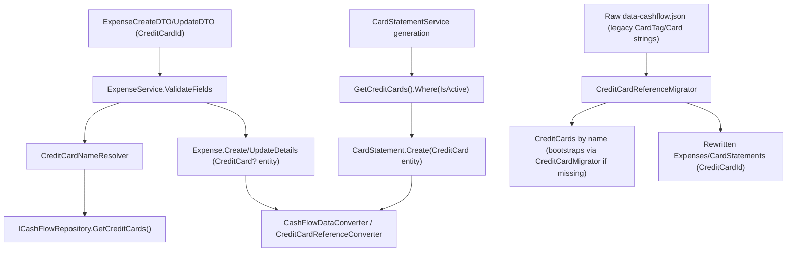

## 1. Technical Overview

**What:** `Expense.CardTag` (currently a nullable `Financial.CashFlow.Domain.Enums.CreditCard` enum) is renamed to `Expense.CreditCard` and its type changes to a nullable reference to the `Financial.CashFlow.Domain.Entities.CreditCard` entity seeded in F01. `CardStatement.Card` (currently a non-nullable enum) is renamed to `CardStatement.CreditCard` and becomes a non-nullable entity reference. Both are exposed at the API boundary as `CreditCardId` (`Guid?`/`Guid`), replacing the old `CardTag`/`Card` string fields on `ExpenseCreateDTO`/`ExpenseUpdateDTO`/`ExpenseDTO`/`CardStatementDTO`. A new `CreditCardNameResolver` (mirroring `BankNameResolver`/`IncomeSourceNameResolver`) resolves a card by Id against the seeded/active list and replaces `CreditCardParser` for the create/update expense flow. `CardStatementService`'s monthly auto-generation switches from iterating every enum value to querying only active `CreditCard` entities. A one-time raw-JSON migrator converts every existing `Expense.CardTag`/`CardStatement.Card` enum-string value to the matching seeded `CreditCard`'s Id.

**Why:** This is the reference-model rewire that F01's seeded entity exists to support. Until `Expense`/`CardStatement` actually point at `CreditCard` by Id, the entity is inert — nothing enforces the "only active cards are selectable" rule from the PRD's Objectives, and F03's API/F04's web UI/F05's WPF UI/F06's importer all have nothing to consume. Every call site that constructs or reads a card-tagged `Expense`/`CardStatement` today references the enum directly, so this change cannot land in isolation — every one of those call sites must compile and its tests must pass at the same commit, mirroring the exact same build-integrity constraint documented for `ReserveMovement.Bucket`'s equivalent transition in P28-F02.

**Scope:**
- Included: `Expense`/`CardStatement` domain property rename + type change; `ExpenseService`/`CardStatementService` validation and generation logic; DTO contract changes; persistence wiring (reference converter, resolution context, type resolver); the one-time raw-JSON reference migrator; the minimal adaptation needed to keep `MonthlyExpenseSheetImporter` and `ExpenseChargeDateMigrator` compiling against the new types.
- Excluded (deferred to later PRD features): `MonthlyExpenseSheetImporter`'s row-position-to-card resolution logic is *not* reworked to look up `CreditCard` by name in a general way — F06 owns that. Here it only gets the minimum change needed to keep building: resolving its already-computed legacy enum tag to the matching seeded entity by name. No new API endpoints (F03). No UI changes (F04/F05, and F04 is explicitly deferred by the user).

## 2. Architecture Impact

**Affected components:**
- `Financial.CashFlow.Domain/Entities/Expense.cs` — property rename + type change, signature updates on `Create`/`UpdateDetails`/`ValidatePaymentShape`/`MigrateLegacyDates`
- `Financial.CashFlow.Domain/Entities/CardStatement.cs` — property rename + type change, signature update on `Create`
- `Financial.CashFlow.Application/Validation/CreditCardNameResolver.cs` (new) — Id-based resolution, replaces `CreditCardParser.cs` (deleted)
- `Financial.CashFlow.Application/Services/ExpenseService.cs` — card resolution + active-card validation
- `Financial.CashFlow.Application/Services/CardStatementService.cs` — active-cards-only generation, statement/expense matching by Id
- `Financial.CashFlow.Application/DTOs/ExpenseCreateDTO.cs`, `ExpenseUpdateDTO.cs`, `ExpenseDTO.cs`, `CardStatementDTO.cs` — `CardTag`/`Card` → `CreditCardId` (+ `CreditCardName` read-model additions)
- `Financial.CashFlow.Infrastructure/Persistence/CreditCardReferenceConverter.cs` (new) — mirrors `BankReferenceConverter`/`ReserveBucketReferenceConverter`
- `Financial.CashFlow.Infrastructure/Persistence/ReferenceResolutionContext.cs` — add `CreditCards` lookup
- `Financial.CashFlow.Infrastructure/Persistence/CashFlowTypeInfoResolver.cs` — register `Expense.CreditCard`/`CardStatement.CreditCard` as `"CreditCardId"` reference properties
- `Financial.CashFlow.Infrastructure/Persistence/CashFlowDataConverter.cs` — resolve `CreditCards` in the same early pass as Banks/IncomeSources/InvestmentAccounts/ReserveBuckets, before Expenses/CardStatements are read
- `Integrations/CashFlowSpreadsheetImport/Migrations/CreditCardReferences/CreditCardReferenceMigrator.cs` + `CreditCardReferenceMigrationSummary.cs` (new) — one-time raw-JSON rewrite, wired into `Program.cs`
- `Integrations/CashFlowSpreadsheetImport/SheetImporters/MonthlyExpenseSheetImporter.cs` — minimal adaptation (see Decision 4)
- `Integrations/CashFlowSpreadsheetImport/Migrations/ExpenseChargeDate/ExpenseChargeDateMigrator.cs` — `CardTag`/`.Value` → `CreditCard`, dictionary key changes from enum to `Guid`
- `Integrations/CashFlowSpreadsheetImport/Program.cs` — wire the new migrator, pass `data.CreditCards` into `MonthlyExpenseSheetImporter.Import`



## 3. Technical Decisions

| Decision | Chosen Approach | Alternative Considered | Trade-off |
|----------|----------------|----------------------|-----------|
| Card resolution class | New `CreditCardNameResolver.TryResolve(Guid? id, IEnumerable<CreditCard>, out CreditCard?)`, mirroring `BankNameResolver`/`IncomeSourceNameResolver` exactly (Id-based lookup despite the "Name" suffix — the PRD explicitly names it this way to match the established resolver family) | Reuse/extend `CreditCardParser` (string-name based) | `CreditCardParser` resolved a raw string to an enum; the new flow resolves a `Guid` to an entity. Same shape as every other post-reference-migration resolver, so `CreditCardParser.cs` and its test file are deleted rather than adapted |
| One-time raw-JSON migrator structure | New, dedicated `CreditCardReferenceMigrator` in its own folder, mirroring `ReserveBucketReferenceMigrator`'s read-raw-JSON → detect-legacy-shape → backup → rewrite → save structure, as a separate class from `EntityReferenceMigrator` | Extend `EntityReferenceMigrator` (as the PRD's Capabilities section literally suggests) | `EntityReferenceMigrator`'s docstring scopes it to a specific prior PRD's Bank/IncomeSource/InvestmentAccount transition; `ReserveBucketReferenceMigrator` already established the precedent of a small, focused, separate migrator per reference-transition feature rather than growing a god-class. Followed here for consistency, overriding the PRD's literal wording in favor of the codebase's own precedent |
| Unresolved card name during the raw-JSON rewrite | **Abort the whole migration** with a clear error listing the unmatched enum value (not skip-and-flag) | Mirror `ReserveBucketReferenceMigrator`'s skip-and-flag-for-manual-review handling | The PRD's F02 Error Handling is explicit and different from the P28 precedent here: "migration aborts with a clear error listing the unmatched value, rather than silently dropping the reference." Followed literally since it's an unambiguous, explicit instruction |
| `MonthlyExpenseSheetImporter` adaptation scope | Keep `CardSectionStartRows`' existing row-position-to-*enum* logic untouched; add a final step that resolves the already-computed enum tag to the matching seeded `CreditCard` entity by name (`Enum.ToString()` vs `CreditCard.Name`), via a `creditCards` collection now passed into `Import` alongside `banks` | Fully rework row-position resolution to work by entity name directly | The PRD explicitly assigns "importer's output changes from enum to entity lookup" to F06, not F02 — reworking the mechanism now would duplicate F06's work and risk conflicting with its design. This feature only needs the importer to keep compiling and passing tests against `Expense.CreditCard`'s new type; F06 replaces this shim with the real by-name resolution |
| Card-statement generation source | `CardStatementService.GetStatementsForMonthAsync` queries `_repository.GetCreditCards().Where(c => c.IsActive)` fresh on every call (no cached static array) | Keep a static field, refreshed manually | Active status can change between calls (via F03's future `PUT`); a static `Enum.GetValues`-style field can't reflect that. Evaluating at generation time is required by the PRD Capabilities line for this exact reason |
| Surfacing "zero active cards" during generation | Inject `ILogger<CardStatementService>` (standard ASP.NET Core DI, zero new packages) and call `LogWarning` when the active-card query is empty for a requested month | Add a `Warning` string to the bulk list response, mirroring `MarkStatementPaidAsync`'s existing `Warning` field | `GetStatementsForMonthAsync` returns a list of statement DTOs, not a single result — there's no natural single slot for a list-level warning, and the existing `Warning` field is per-statement. `ILogger` is already provided free by the framework and used nowhere yet in this layer, so this introduces no new dependency, just the first use of an existing one |
| Active-card validation on expense update | Applies unconditionally to every create/update call that carries a `CreditCardId`, matching the PRD's Error Handling wording literally ("Creating/updating an expense with a `CardTag` matching an inactive `CreditCard` → reject") | Skip re-validation when the update doesn't change the card (to allow editing e.g. the description of an expense already tied to a since-deactivated card) | The PRD does not carve out this case, and `ExpenseService.ValidateFields` runs before the target expense is loaded, so it cannot yet know whether the card is actually changing. Documented here as a known limitation: once a card is deactivated, any further edit to an expense still tagged to it (even an unrelated field) is blocked unless the card is changed away first. Acceptable for a personal app; can be revisited if it proves annoying in practice |

## 4. Component Overview

**Domain:**

| File Path | New/Modified | Purpose | Key Responsibilities |
|-----------|--------------|---------|---------------------|
| `Financial.CashFlow.Domain/Entities/Expense.cs` | Modified | Card-tagged expense | `CardTag` → `CreditCard` (entity, nullable); update `Create`/`UpdateDetails`/`ValidatePaymentShape`/`MigrateLegacyDates` signatures |
| `Financial.CashFlow.Domain/Entities/CardStatement.cs` | Modified | Monthly per-card statement | `Card` → `CreditCard` (entity, non-nullable); update `Create` signature |

**Application:**

| File Path | New/Modified | Purpose | Key Responsibilities |
|-----------|--------------|---------|---------------------|
| `Financial.CashFlow.Application/Validation/CreditCardNameResolver.cs` | New | Id-based card lookup | `TryResolve(Guid? id, IEnumerable<CreditCard>, out CreditCard?)` |
| `Financial.CashFlow.Application/Validation/CreditCardParser.cs` | Deleted | Superseded | Replaced by `CreditCardNameResolver` |
| `Financial.CashFlow.Application/Services/ExpenseService.cs` | Modified | Expense CRUD | Resolve `CreditCardId` via `CreditCardNameResolver`; reject unknown/inactive card Ids; map `CreditCard`/`CreditCardName` on read |
| `Financial.CashFlow.Application/Services/CardStatementService.cs` | Modified | Statement generation/settlement | Generate statements only for active cards (queried per call); match expenses to statements by `CreditCard.Id`; log when zero active cards exist for a period |
| `Financial.CashFlow.Application/DTOs/ExpenseCreateDTO.cs` | Modified | Create request | `CardTag: string?` → `CreditCardId: Guid?` |
| `Financial.CashFlow.Application/DTOs/ExpenseUpdateDTO.cs` | Modified | Update request | `CardTag: string?` → `CreditCardId: Guid?` |
| `Financial.CashFlow.Application/DTOs/ExpenseDTO.cs` | Modified | Read model | `CardTag: string?` → `CreditCardId: Guid?` + new `CreditCardName: string?` |
| `Financial.CashFlow.Application/DTOs/CardStatementDTO.cs` | Modified | Read model | `Card: string` → `CreditCardId: Guid` + new `CreditCardName: string` |

**Infrastructure:**

| File Path | New/Modified | Purpose | Key Responsibilities |
|-----------|--------------|---------|---------------------|
| `Financial.CashFlow.Infrastructure/Persistence/CreditCardReferenceConverter.cs` | New | JSON reference (de)serialization | Mirrors `BankReferenceConverter`/`ReserveBucketReferenceConverter`; wire name `CreditCardId` |
| `Financial.CashFlow.Infrastructure/Persistence/ReferenceResolutionContext.cs` | Modified | Per-read lookup tables | Add `Dictionary<Guid, CreditCard> CreditCards` |
| `Financial.CashFlow.Infrastructure/Persistence/CashFlowTypeInfoResolver.cs` | Modified | Reference-property wiring | Register `(Expense, CreditCard)` and `(CardStatement, CreditCard)` → `"CreditCardId"`; add `CreditCard` branch to `CreateReferenceConverter` |
| `Financial.CashFlow.Infrastructure/Persistence/CashFlowDataConverter.cs` | Modified | Top-level (de)serializer | Move `CreditCards` deserialization into the early (Banks/IncomeSources/InvestmentAccounts/ReserveBuckets) resolution pass so `context.CreditCards` is populated before `Expenses`/`CardStatements` are read |

**Migration tooling:**

| File Path | New/Modified | Purpose | Key Responsibilities |
|-----------|--------------|---------|---------------------|
| `Integrations/CashFlowSpreadsheetImport/Migrations/CreditCardReferences/CreditCardReferenceMigrator.cs` | New | One-time raw-JSON rewrite | Detect legacy `CardTag`/`Card` string shape; bootstrap `CreditCards` via `CreditCardMigrator` if the array doesn't exist yet; resolve by name; abort with a clear error on an unmatched name; write the rewritten file |
| `Integrations/CashFlowSpreadsheetImport/Migrations/CreditCardReferences/CreditCardReferenceMigrationSummary.cs` | New | Migration outcome | Counts migrated; carries the abort error message when applicable |
| `Integrations/CashFlowSpreadsheetImport/SheetImporters/MonthlyExpenseSheetImporter.cs` | Modified | Monthly sheet parsing | Accept `IReadOnlyCollection<CreditCard> creditCards`; resolve the row-position enum tag to the matching entity by name before calling `Expense.Create` |
| `Integrations/CashFlowSpreadsheetImport/Migrations/ExpenseChargeDate/ExpenseChargeDateMigrator.cs` | Modified | Charge-date backfill | `expense.CardTag` → `expense.CreditCard`; dictionary key changes from `(CreditCard enum, int, int)` to `(Guid CreditCardId, int, int)` |
| `Integrations/CashFlowSpreadsheetImport/Program.cs` | Modified | Orchestration | Add `CreditCardReferenceMigrator.Migrate(outputPath)` alongside the existing `EntityReferenceMigrator`/`ReserveBucketReferenceMigrator` calls (same early, pre-typed-load stage); pass `data.CreditCards` into `MonthlyExpenseSheetImporter.Import` |

## 5. API Contracts

No new endpoints in this feature (F03 adds `/credit-cards`). The existing `POST /expenses`, `PUT /expenses/{id}`, and the `CardStatementsController` read endpoints keep their routes; only their request/response body shapes change.

**`ExpenseCreateDTO` / `ExpenseUpdateDTO` (request body change):**

| Field | Type | Required | Validation | Description |
|-------|------|----------|------------|--------------|
| `creditCardId` | `uuid \| null` | No | Must match a seeded `CreditCard`; must be `IsActive = true` | Replaces `cardTag` (string). Omit when paying directly from a bank |

**Request Example (create):**
```json
{
  "date": "2026-07-10",
  "description": "Groceries",
  "value": 42.50,
  "category": "Mercado",
  "creditCardId": "3fa85f64-5717-4562-b3fc-2c963f66afa6"
}
```

**`ExpenseDTO` (response body change):**

| Field | Type | Description |
|-------|------|--------------|
| `creditCardId` | `uuid \| null` | Replaces `cardTag` |
| `creditCardName` | `string \| null` | New — mirrors `paymentSourceBankName`; null unless `creditCardId` is set |

**`CardStatementDTO` (response body change):**

| Field | Type | Description |
|-------|------|--------------|
| `creditCardId` | `uuid` | Replaces `card` (string) |
| `creditCardName` | `string` | New — the card's display name |

**Error Codes (unchanged transport, new triggers):**

| Trigger | HTTP Status | Description |
|---------|-------------|--------------|
| `creditCardId` matches no seeded `CreditCard` | 400 | `"Credit card '{id}' is not recognized."` (via `ArgumentException`, same pattern as today's unrecognized `cardTag`) |
| `creditCardId` matches an inactive `CreditCard` | 400 | `"Credit card '{name}' is inactive and cannot be used for new entries."` per PRD Error Handling |

## 6. Data Model

No relational schema — this is the existing JSON-file persistence. Wire-format change only, on the existing `data-cashflow.json`:

**`Expenses[]` (per record):**

| Field | Before | After |
|-------|--------|-------|
| `CardTag` | `string?` (enum name, e.g. `"BarclaysPlatinumVisa8003"`) or absent | `CreditCardId: Guid?` (present, may be `null`) |

**`CardStatements[]` (per record):**

| Field | Before | After |
|-------|--------|-------|
| `Card` | `string` (enum name, required) | `CreditCardId: Guid` (required) |

**Migration:** `CreditCardReferenceMigrator` performs a one-time raw-JSON rewrite (same shape as `ReserveBucketReferenceMigrator`): detect any `Expenses[].CardTag` or `CardStatements[].Card` string field, back up the file (`MigrationBackup.Create`), resolve every legacy value against the seeded `CreditCards` (bootstrapping the 5 seeds via `CreditCardMigrator` first if the file predates F01), and rewrite the file with `CreditCardId` fields. Runs before `CashFlowLoader.LoadSync`, since the typed deserializer throws (per `CashFlowDataConverter`'s existing "still in the pre-migration string shape" error) on the legacy shape. A no-op on a second run once the file is already in the current shape.

## 7. Testing Strategy

**Test files:**

| Test File | Test Type | Target | Coverage Goal |
|-----------|-----------|--------|----------------|
| `Tests/Financial.CashFlow.Domain.Tests/Entities/ExpenseTests.cs` | Unit | `Expense` | Update existing `CardTag`-based tests for the entity type; cover `ValidatePaymentShape`/`UpdateDetails`/`MigrateLegacyDates` with `CreditCard` entity instances |
| `Tests/Financial.CashFlow.Domain.Tests/Entities/CardStatementTests.cs` | Unit | `CardStatement` | Update `Create` tests to pass a `CreditCard` entity |
| `Tests/Financial.CashFlow.Domain.Tests/Entities/CashFlowDataTests.cs` | Unit | `CashFlowData` | Update any `CardStatement`/`Expense` construction helper that previously took the enum |
| `Tests/Financial.CashFlow.Application.Tests/Validation/CreditCardNameResolverTests.cs` | Unit | `CreditCardNameResolver` (new file, replaces deleted `CreditCardParserTests.cs`) | Resolve by valid Id, unknown Id, null Id |
| `Tests/Financial.CashFlow.Application.Tests/Services/ExpenseServiceTests.cs` | Unit | `ExpenseService` | Create/update with active card succeeds; with inactive card rejected; with unknown Id rejected; `ExpenseDTO.CreditCardId`/`CreditCardName` mapping |
| `Tests/Financial.CashFlow.Application.Tests/Services/CardStatementServiceTests.cs` | Unit | `CardStatementService` | Generation includes only active cards; generation with zero active cards logs and creates none; expense-to-statement matching by `CreditCard.Id` still works after settle/unsettle |
| `Tests/Financial.CashFlow.Infrastructure.Tests/Persistence/CashFlowTypeInfoResolverTests.cs` | Unit | Reference wiring | `Expense.CreditCard`/`CardStatement.CreditCard` round-trip through the resolver with the `CreditCardId` wire name |
| `Tests/Financial.CashFlow.Infrastructure.Tests/Persistence/CashFlowSerializerAdapterTests.cs` | Unit | Round-trip serialization | An `Expense`/`CardStatement` referencing a `CreditCard` survives a full serialize/deserialize round-trip as the same instance |
| `Tests/Financial.CashFlow.Infrastructure.Tests/Repositories/CashFlowJsonRepositoryTests.cs` | Unit | Repository | `GetCreditCards()` continues to work alongside the new reference properties |
| `Tests/Financial.CashFlowSpreadsheetImport.Tests/Migrations/CreditCardReferences/CreditCardReferenceMigratorTests.cs` | Unit | `CreditCardReferenceMigrator` (new) | No-op on already-migrated file; rewrites a legacy file correctly; bootstraps `CreditCards` when absent; aborts with a clear error on an unresolvable name |
| `Tests/Financial.CashFlowSpreadsheetImport.Tests/SheetImporters/MonthlyExpenseSheetImporterTests.cs` | Unit | Importer | Update existing card-tag-producing tests to assert against the resolved `CreditCard` entity instead of the enum |
| `Tests/Financial.CashFlowSpreadsheetImport.Tests/Migrations/ExpenseChargeDate/ExpenseChargeDateMigratorTests.cs` | Unit | `ExpenseChargeDateMigrator` | Update `CardTag`/dictionary-key usages to the entity-based shape; behavior otherwise unchanged |
| `Tests/Financial.Api.Tests/ExpenseEndpointsTests.cs` | Integration | `/expenses` | Round-trip create/update through the controller with `creditCardId`; 400 on inactive/unknown card |

**Acceptance-criteria traceability (PRD Section 9, F02):**
- `CardTag`/`Card` renamed and exposed as `CreditCardId` with no remaining string fields → covered by DTO tests above
- Active card succeeds / inactive rejected / unknown rejected → `ExpenseServiceTests`
- Statement auto-generation only for active cards → `CardStatementServiceTests`
- Existing enum values migrated with no data loss → `CreditCardReferenceMigratorTests`
- Historical expenses referencing a later-deactivated card remain intact → `ExpenseServiceTests` (update path) + `CreditCardReferenceMigratorTests` (migration path)
