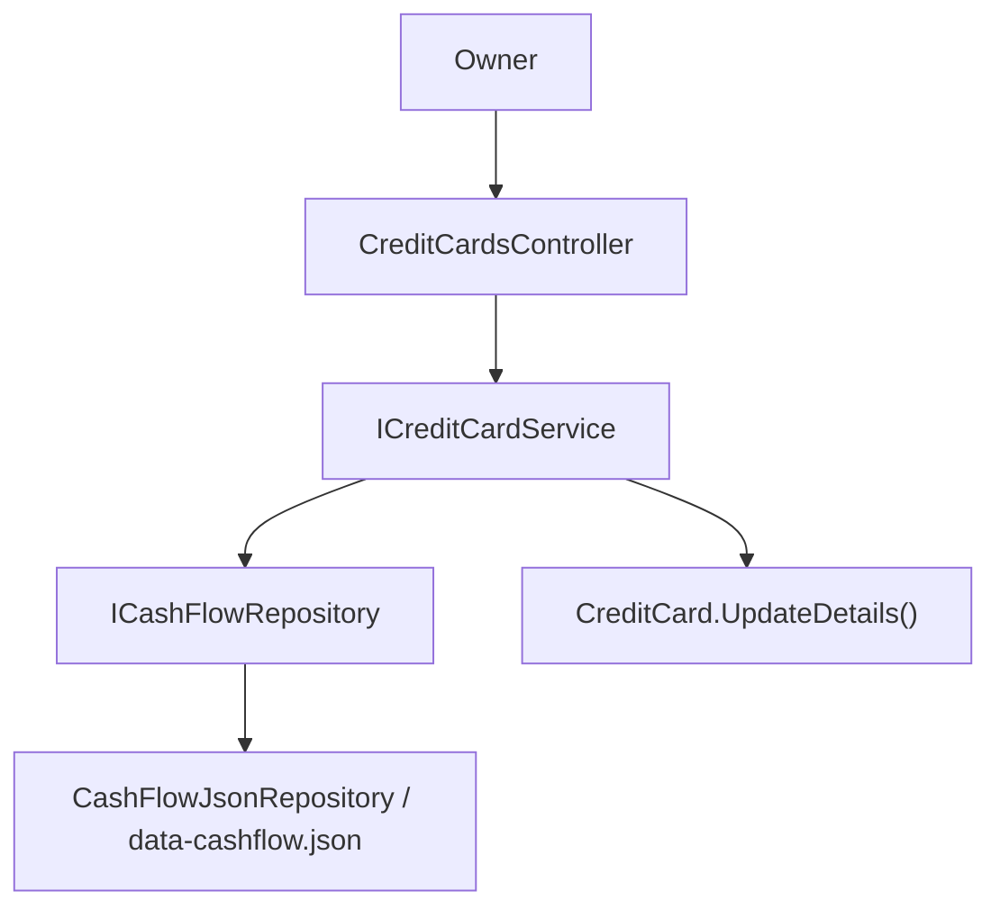

## 1. Technical Overview

**What:** Exposes the `CreditCard` entities seeded in F01 and referenced by `Expense`/`CardStatement` since F02 through two API endpoints: a read-only list (`GET /credit-cards`) and a targeted update (`PUT /credit-cards/{id}`) that lets the owner keep `NextInvoiceDueDate` and `IsActive` current.

**Why:** F02 already resolves credit cards by Id, but nothing in the system can change a card's mutable fields except editing the JSON data file by hand. This feature closes that gap with the smallest possible surface — no create, no delete, no rename — mirroring the read/update shape already proven by `BanksController`'s opening-balance endpoint and `IncomeSourcesController`/`ReserveBucketsController`'s read-only list endpoints.

**Scope:**
- Included: `GET /credit-cards` (all cards, active and inactive), `PUT /credit-cards/{id}` (full replace of `NextInvoiceDueDate` + `IsActive`), a new `CreditCard.UpdateDetails` domain method, `CreditCardUpdateDTO`, `ICreditCardService.UpdateCreditCardAsync`, `CreditCardsController`.
- Excluded (per PRD Section 7 - Out of Scope): create/delete endpoints, renaming a card's `Name` via any endpoint, calendar/reminder integration, automated recurring due-date computation.

## 2. Architecture Impact

**Affected components:**
- `Financial.Api/Controllers/CreditCardsController.cs` (new) — presentation
- `Financial.CashFlow.Application/Interfaces/ICreditCardService.cs` (modified) — add update method signature
- `Financial.CashFlow.Application/Services/CreditCardService.cs` (modified) — implement update, resolve-or-404
- `Financial.CashFlow.Application/DTOs/CreditCardUpdateDTO.cs` (new) — request contract
- `Financial.CashFlow.Domain/Entities/CreditCard.cs` (modified) — add `UpdateDetails` behavior method



## 3. Technical Decisions

| Decision | Chosen Approach | Alternative Considered | Trade-off |
|----------|----------------|----------------------|-----------|
| Card lookup for PUT | Reuse `CreditCardNameResolver.TryResolve` (Id-based, from F02) to find the card, 404 via `KeyNotFoundException` caught in the controller | A dedicated `GetById` on the repository | Matches `BankService.UpdateOpeningBalanceAsync`'s exact resolve-or-throw pattern; no new repository surface needed |
| Mutation shape | New `CreditCard.UpdateDetails(DateOnly? nextInvoiceDueDate, bool isActive)` domain method (private setters, no validation needed — both fields are unconstrained) | Public setters on the entity | Keeps the entity's invariant style consistent with every other Financial.CashFlow.Domain entity (`Bank.SetOpeningBalance`, etc.) even though there's currently nothing to validate |
| Invalid date format (400) | No custom handling — rely on ASP.NET Core's built-in behavior: `[ApiController]` returns a 400 `ValidationProblemDetails` automatically when the JSON body fails to bind (e.g., a non-ISO-8601 string into `DateOnly?`) | Manually parse the date as a string DTO field and validate in the service | Zero new code; identical to how `BankOpeningBalanceUpdateDTO.OpeningBalanceDate` (a `DateOnly`) already behaves — no precedent in the codebase for manual date-format validation |
| Route | `[Route("credit-cards")]`, `GET` (no id), `PUT("{id:guid}")` | Nesting under an existing controller | Matches `IncomeSourcesController`/`ReserveBucketsController`'s one-controller-per-resource convention |

## 4. Component Overview

**Backend:**

| File Path | New/Modified | Purpose | Key Responsibilities |
|-----------|--------------|---------|---------------------|
| `Financial.Api/Controllers/CreditCardsController.cs` | New | HTTP surface for credit cards | `GET /credit-cards` → 200; `PUT /credit-cards/{id}` → 200/400/404 |
| `Financial.CashFlow.Application/Interfaces/ICreditCardService.cs` | Modified | Contract | Add `Task<CreditCardDTO> UpdateCreditCardAsync(Guid id, CreditCardUpdateDTO request)` |
| `Financial.CashFlow.Application/Services/CreditCardService.cs` | Modified | Business logic | Resolve card by Id (404 if missing), apply update, persist, return DTO |
| `Financial.CashFlow.Application/DTOs/CreditCardUpdateDTO.cs` | New | Request contract | `NextInvoiceDueDate` (`DateOnly?`, required-but-nullable), `IsActive` (`bool`, required) |
| `Financial.CashFlow.Domain/Entities/CreditCard.cs` | Modified | Domain behavior | `UpdateDetails(DateOnly? nextInvoiceDueDate, bool isActive)` sets both private-setter fields |

**Database:** No schema/migration changes — `CreditCard` already persists as part of the `CashFlowData` JSON aggregate (F01); this feature only adds a write path to already-existing fields.

## 5. API Contracts

**Endpoint: List Credit Cards**
- **Method:** GET
- **Path:** `/credit-cards`
- **Authentication:** None (matches every other endpoint in this API)

**Response (Success - 200):**

| Field | Type | Description |
|-------|------|-------------|
| `id` | `uuid` | Credit card identifier |
| `name` | `string` | Card name (immutable) |
| `isActive` | `bool` | Whether the card accepts new expenses |
| `nextInvoiceDueDate` | `date \| null` | Next invoice due date, if set |

**Response Example:**
```json
[
  { "id": "3fa85f64-5717-4562-b3fc-2c963f66afa6", "name": "BaAmex", "isActive": true, "nextInvoiceDueDate": "2026-09-05" },
  { "id": "9c858901-8a57-4791-81fe-4c455b099bc9", "name": "PaypalCredit", "isActive": false, "nextInvoiceDueDate": null }
]
```

**Endpoint: Update Credit Card**
- **Method:** PUT
- **Path:** `/credit-cards/{id}`
- **Authentication:** None

**Request:**

| Field | Type | Required | Validation | Description |
|-------|------|----------|------------|--------------|
| `nextInvoiceDueDate` | `date \| null` | Yes (key must be present; value may be `null`) | Valid ISO-8601 date or `null` | New due date, or `null` to clear it |
| `isActive` | `bool` | Yes | - | New active flag |

**Request Example:**
```json
{ "nextInvoiceDueDate": "2026-09-05", "isActive": true }
```

**Response (Success - 200):** Same shape as the list endpoint's item (`CreditCardDTO`).

**Response Example:**
```json
{ "id": "3fa85f64-5717-4562-b3fc-2c963f66afa6", "name": "BaAmex", "isActive": true, "nextInvoiceDueDate": "2026-09-05" }
```

**Error Codes:**

| Code | HTTP Status | Description |
|------|-------------|--------------|
| N/A (ASP.NET auto binding failure) | 400 | Request body missing, malformed JSON, or `nextInvoiceDueDate`/`isActive` not parseable |
| N/A (`KeyNotFoundException` → `Problem`) | 404 | No `CreditCard` exists with the given `{id}` |

## 6. Data Model

No new tables, columns, or migrations. `CreditCard.NextInvoiceDueDate` and `CreditCard.IsActive` already exist (F01); this feature adds a write path via a new domain method, not a new field.

## 7. Testing Strategy

**Test File Structure:**

| Test File | Test Type | Target | Coverage Goal |
|-----------|-----------|--------|----------------|
| `Tests/Financial.CashFlow.Domain.Tests/Entities/CreditCardTests.cs` | Unit | `CreditCard.UpdateDetails` | New file if none exists yet, or add cases to it |
| `Tests/Financial.CashFlow.Application.Tests/Services/CreditCardServiceTests.cs` | Unit | `CreditCardService.UpdateCreditCardAsync` | New file |
| `Tests/Financial.Api.Tests/CreditCardsEndpointsTests.cs` | Integration | `CreditCardsController` | New file, mirrors `BanksEndpointsTests`/`ReserveEndpointsTests` structure |

**For each test file, list functions:**

| Test Function | Description | Assertions |
|---------------|--------------|------------|
| `UpdateDetails_SetsNextInvoiceDueDateAndIsActive` | Domain-level happy path | Both fields updated on the entity |
| `UpdateDetails_NullDueDate_ClearsIt` | Domain-level, clearing an existing due date | `NextInvoiceDueDate` becomes `null` |
| `UpdateCreditCardAsync_ExistingId_ReturnsUpdatedDtoAndPersists` | Service happy path | Returned DTO reflects new values; repository `SaveChangesAsync` invoked |
| `UpdateCreditCardAsync_UnknownId_ThrowsKeyNotFoundException` | Service error path | Exception thrown, no persistence side effect |
| `GetCreditCards_ReturnsOk_IncludesInactiveCards` | API-level list (acceptance: "GET /credit-cards returns all seeded cards including inactive ones") | 200, response includes at least one active and one inactive seeded card |
| `UpdateCreditCard_ExistingId_ReturnsOkWithUpdatedFields` | API-level update happy path (acceptance) | 200, body reflects new `nextInvoiceDueDate`/`isActive` |
| `UpdateCreditCard_UnknownId_ReturnsNotFound` | API-level (acceptance: "PUT with an unknown id returns 404") | 404 |
| `UpdateCreditCard_InvalidDueDateFormat_ReturnsBadRequestWithFieldLevelError` | API-level (acceptance: "PUT with an invalid due date format returns 400 with a field-level error") | 400, `ValidationProblemDetails` body |
| `UpdateCreditCard_TogglingIsActive_IsImmediatelyVisibleOnSubsequentGet` | Cross-feature integration (PRD: "an update via API is immediately visible in a subsequent GET") | `PUT` then `GET` shows the new value |

Existing `CreditCardServiceTests`/entity tests from F01/F02 (if any cover only `GetCreditCards`) are extended, not replaced.
