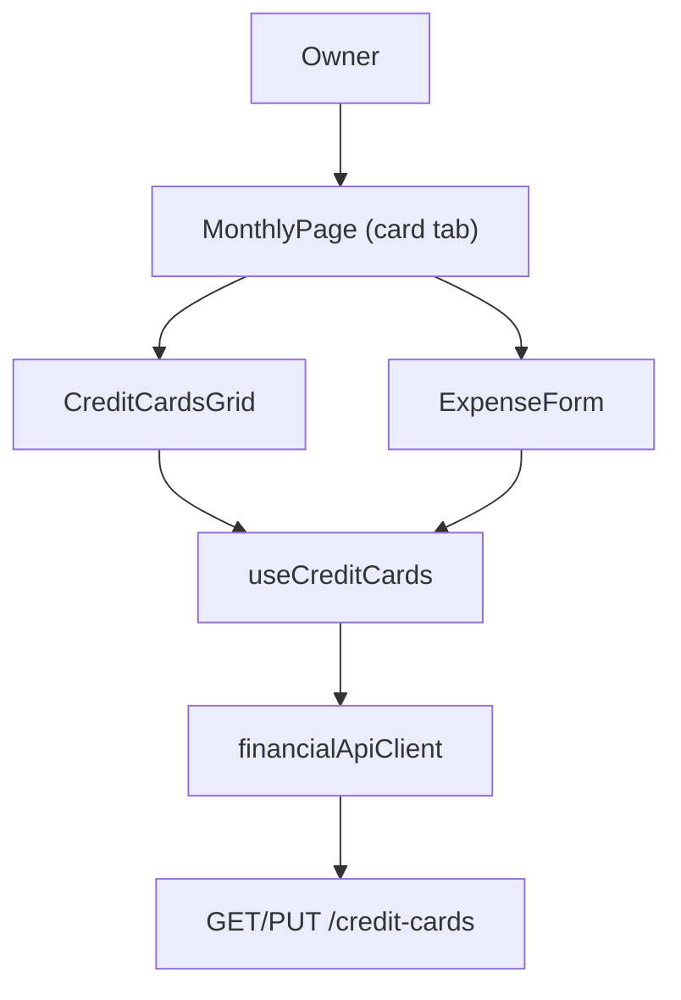

## 1. Technical Overview

**What:** Catches the React frontend up to the `CreditCardId`-based backend contract shipped in F02/F03 (currently the frontend still sends a legacy `cardTag` name string, which the backend no longer accepts), and adds the two pieces of new UI the PRD asks for: the Expense form's card dropdown fetches active cards live instead of using a hardcoded array, and the "Credit Card" tab gains an editable due-date + active-toggle row per card.

**Why:** F02 renamed `Expense.CardTag`/`CardStatement.Card` to `CreditCardId` on the wire (merged to `main`), but the frontend types/client were never updated in that PR by design — F04 is the wave-3 feature responsible for closing that gap, per the PRD's execution-wave ordering (Wave 2: F02/F03; Wave 3: F04/F05/F06). Until this ships, the deployed web app cannot create or edit a credit-card expense at all, since it still posts a `cardTag` string the API no longer recognizes.

**Scope:**
- Included: frontend type/DTO catch-up to the `CreditCardId` contract (`ExpenseDto`/`CreateExpenseDto`/`UpdateExpenseDto`/`CardStatementDto`), a new `CreditCardDto`/`UpdateCreditCardDto`, `getCreditCards`/`updateCreditCard` on the API client, a `useCreditCards` hook, `ExpenseForm`'s dropdown switching to live active cards, a new per-card due-date + active-toggle table in the Credit Card tab.
- Excluded (PRD Section 7): create/delete credit cards from the UI, renaming a card, any calendar/reminder integration.

## 2. Architecture Impact

**Affected components:**
- `Financial.Web/src/api/types.ts` (modified) — add `CreditCardDto`/`UpdateCreditCardDto`; rename `CardStatementDto.card`→`creditCardId`/`creditCardName`; rename `cardTag`→`creditCardId` (+ add `creditCardName`) on `ExpenseDto`/`CreateExpenseDto`/`UpdateExpenseDto`
- `Financial.Web/src/api/financialApiClient.ts` (modified) — add `getCreditCards`/`updateCreditCard`
- `Financial.Web/src/hooks/useCreditCards.ts` (new) — fetch list, expose per-row update
- `Financial.Web/src/components/ExpenseForm.tsx` (modified) — drop hardcoded `CARDS`, accept a `creditCards` prop, rename `cardTag` field to `creditCardId`
- `Financial.Web/src/components/CreditCardsGrid.tsx` (new) — one row per card: name, due-date input, active checkbox
- `Financial.Web/src/components/CardsGrid.tsx` (modified) — `s.card` → `s.creditCardName`
- `Financial.Web/src/components/ExpensesSection.tsx` (modified) — `expense.cardTag` → `expense.creditCardName`
- `Financial.Web/src/pages/MonthlyPage.tsx` (modified) — call `useCreditCards()`, render `CreditCardsGrid` in the `card` tab, pass active cards to `ExpenseForm`
- `Financial.Web/src/hooks/useMonthly.ts` (modified) — rename `createCardTag`/`editCardTag` state and request fields to `createCreditCardId`/`editCreditCardId`



## 3. Technical Decisions

| Decision | Chosen Approach | Alternative Considered | Trade-off |
|----------|----------------|----------------------|-----------|
| Editing UI shape | True inline `<input type="date">` + checkbox per row, firing the `PUT` directly `onChange` (no separate Save/Cancel panel) | The codebase's dominant "pencil icon opens a form panel" pattern (`InvestmentSnapshotsPage`) | The PRD's Experience text ("each card row shows... an editable due-date input... and an active/inactive toggle") describes an always-visible inline control, and `CardsGrid`'s existing bank-picker `<select>` already establishes a true-inline-`onChange` precedent in this exact tab — a panel would add a click and a component this feature doesn't need |
| Where cards are fetched | New standalone `useCreditCards()` hook (mirrors `useInvestmentSnapshots`/`useBrokerBreakdown`), called directly from `MonthlyPage.tsx` alongside `useMonthly()`/`useBankOperations()` | Folding `getCreditCards()` into `useMonthly.ts`'s existing `Promise.all` | Matches the codebase's existing separation — `useBankOperations` is already a sibling hook to `useMonthly` for the same tab, not folded in; one hook covers both `ExpenseForm`'s active-card list and the new edit grid |
| `ExpenseDto`/`CardStatementDto` renames | Do the full `cardTag`→`creditCardId` / `card`→`creditCardId`+`creditCardName` rename as part of this feature, not a separate cleanup | Leave the legacy names and just add new fields alongside | The backend no longer emits/accepts the old names at all (F02 removed them) — the frontend is currently broken against `main`'s API; there is no working "leave it" option |
| Due-date field type | Native `<input type="date">` bound to the DTO's ISO `nextInvoiceDueDate` (`string \| null`) | A date-picker library | No date-picker library exists elsewhere in this codebase; native input matches the project's plain-HTML-controls convention throughout (`CardsGrid`, `MensaisPage`, etc.) |
| Row-level save/error state | `useCreditCards` exposes `updatingCardId: string \| null` and `error: string \| null` (last error, cleared on next attempt), rendered as a small inline message under the offending row | A toast/notification system | No toast system exists in this codebase; every other hook (`useInvestmentSnapshots`, `useBankOperations`) surfaces errors as inline text, kept consistent here |

## 4. Component Overview

**Frontend:**

| File Path | New/Modified | Purpose | Key Responsibilities |
|-----------|--------------|---------|---------------------|
| `Financial.Web/src/api/types.ts` | Modified | Contracts | Add `CreditCardDto`, `UpdateCreditCardDto`; rename `cardTag`→`creditCardId` (+`creditCardName`) on Expense DTOs; rename `card`→`creditCardId`/`creditCardName` on `CardStatementDto` |
| `Financial.Web/src/api/financialApiClient.ts` | Modified | HTTP calls | `getCreditCards(): Promise<CreditCardDto[]>`; `updateCreditCard(id, body): Promise<CreditCardDto>` |
| `Financial.Web/src/hooks/useCreditCards.ts` | New | State + fetch/update | Fetch on mount; `updateCreditCard(id, request)` PUTs then re-fetches; exposes `creditCards`, `isLoading`, `error`, `updatingCardId`, `retry` |
| `Financial.Web/src/components/CreditCardsGrid.tsx` | New | Presentational table | One row per card: name (read-only), due-date `<input type="date">`, active `<input type="checkbox">`, both wired to `onUpdate(id, patch)` |
| `Financial.Web/src/components/ExpenseForm.tsx` | Modified | Card-mode dropdown | Accepts `creditCards: CreditCardDto[]` prop (already filtered to active by caller); renders `<option value={c.id}>{c.name}</option>`; field renamed `cardTag`→`creditCardId` |
| `Financial.Web/src/components/CardsGrid.tsx` | Modified | Statement table | `s.card` → `s.creditCardName` |
| `Financial.Web/src/components/ExpensesSection.tsx` | Modified | Expense list | `expense.cardTag` → `expense.creditCardName` |
| `Financial.Web/src/pages/MonthlyPage.tsx` | Modified | Tab composition | Calls `useCreditCards()`; renders `<CreditCardsGrid>` in the `card` tab above `CardsGrid`; passes `creditCards.filter(c => c.isActive)` to `ExpenseForm` |
| `Financial.Web/src/hooks/useMonthly.ts` | Modified | Create/edit state | `createCardTag`/`editCardTag` → `createCreditCardId`/`editCreditCardId`; request bodies send `creditCardId` |

## 5. API Contracts

Both endpoints already exist server-side (P29-F03); this section documents the frontend contract the client code must match exactly.

**Endpoint: List Credit Cards**
- **Method:** GET
- **Path:** `/credit-cards`

**Response Example:**
```json
[
  { "id": "3fa85f64-5717-4562-b3fc-2c963f66afa6", "name": "BaAmex", "isActive": true, "nextInvoiceDueDate": "2026-09-05" },
  { "id": "9c858901-8a57-4791-81fe-4c455b099bc9", "name": "PaypalCredit", "isActive": false, "nextInvoiceDueDate": null }
]
```

**Endpoint: Update Credit Card**
- **Method:** PUT
- **Path:** `/credit-cards/{id}`

**Request Example:**
```json
{ "nextInvoiceDueDate": "2026-09-05", "isActive": true }
```

**Response (Success - 200):** `CreditCardDto` (same shape as the list item).

**Error Codes:**

| Code | HTTP Status | Description |
|------|-------------|--------------|
| N/A | 404 | Unknown `{id}` — surfaced as the hook's `error` string |
| N/A | 400 | Malformed request body — surfaced as the hook's `error` string |

## 6. Data Model

No new tables/columns — this feature is presentation-only, consuming the F01/F03 `CreditCard` contract as-is.

## 7. Testing Strategy

**Test File Structure:**

| Test File | Test Type | Target | Coverage Goal |
|-----------|-----------|--------|----------------|
| `Financial.Web/src/api/financialApiClient.test.ts` | Unit | `getCreditCards`/`updateCreditCard` | Extend existing file |
| `Financial.Web/src/hooks/useCreditCards.test.ts` | Hook | `useCreditCards` | New file, mirrors `useInvestmentSnapshots.test.ts` |
| `Financial.Web/src/components/__tests__/CreditCardsGrid.test.tsx` | Component | `CreditCardsGrid` | New file, mirrors `CardsGrid.test.tsx` |
| `Financial.Web/src/components/__tests__/ExpenseForm.test.tsx` | Component | Card dropdown | Extend existing file if present, else new |
| `Financial.Web/src/components/__tests__/CardsGrid.test.tsx` | Component | Statement rendering | Update existing assertions for `s.creditCardName` |
| `Financial.Web/src/hooks/useMonthly.test.ts` | Hook | Create/edit submit payload | Update existing assertions for `creditCardId` |

**For each test file, list functions:**

| Test Function | Description | Assertions |
|---------------|--------------|------------|
| `getCreditCards_fetchesCreditCardsList` | API client GET | Correct URL, response shape parsed |
| `updateCreditCard_putsUpdateRequest` | API client PUT | URL includes id, body matches `UpdateCreditCardDto`, method PUT |
| `useCreditCards_fetchesOnMount` | Hook happy path | `creditCards` populated after load |
| `useCreditCards_updateCreditCard_success_refetches` | Hook update path | `updateCreditCard` calls PUT then GET again (mirrors `useInvestmentSnapshots`' re-fetch-after-save test) |
| `useCreditCards_updateCreditCard_failure_setsError` | Hook error path | `error` populated, `updatingCardId` cleared |
| `CreditCardsGrid_rendersOneRowPerCard` | Component render | Name, due date, active checkbox state per card |
| `CreditCardsGrid_changingDueDate_callsOnUpdate` | Component interaction | `fireEvent.change` on date input calls `onUpdate(id, { nextInvoiceDueDate, isActive })` |
| `CreditCardsGrid_togglingActive_callsOnUpdate` | Component interaction | `fireEvent.click` on checkbox calls `onUpdate` with flipped `isActive` |
| `ExpenseForm_cardDropdown_rendersOnlyActiveCardsPassedIn` | Component render (acceptance: "Expense form card dropdown shows only active cards fetched from the API") | Options match the `creditCards` prop (caller already filters to active) |
| `ExpenseForm_selectingCard_submitsCreditCardId` | Component interaction | Selected option's `id` (not name) is what's passed up |

Cross-feature integration test (acceptance: "Deactivating a card via the UI removes it from the expense form dropdown after refresh") is covered at the `MonthlyPage`/hook-integration level if such a test file exists for that page, or documented as manually verified via the dev-server smoke check if it doesn't (`MonthlyPage.tsx` has no existing full-page test file as of this writing — confirm during implementation and follow existing convention for that file).
