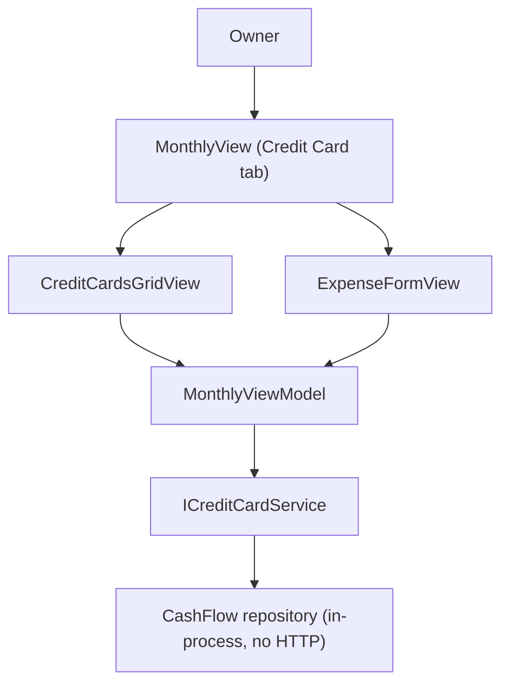

## 1. Technical Overview

**What:** Catches the WPF desktop client up to the `CreditCardId`-based contract F02/F03 already shipped (the WPF app still resolves cards by a hardcoded name list and has two stale `CardTag`/`Card` XAML bindings left over from before F02's rename), and adds the two pieces of new UI the PRD asks for: the expense-entry card dropdown fetches active cards live instead of using a hardcoded array, and the Credit Card tab gains a due-date + active-toggle grid per card.

**Why:** Same root cause as the web sibling feature (F04): F02 renamed `Expense.CardTag`/`CardStatement.Card` to `CreditCardId` server-side, but `MonthlyViewModel` was only given a minimal read-only `ICreditCardService` shim so the app would keep compiling — it still resolves the selected card by matching a hardcoded name string against `GetCreditCards()`'s result. `ICreditCardService.UpdateCreditCardAsync` already exists (added in F03, application-layer, shared by the API); this feature is UI wiring only, no backend/Application-layer change needed.

**Scope:**
- Included: `MonthlyViewModel.Cards`/`CardOptions` replaced with an `ObservableCollection<CreditCardDTO>` (`CreditCards`) fetched via `ICreditCardService.GetCreditCards()`, filtered to active for the expense-entry picker; a new `CreditCardsGridView` listing every card with an editable due-date `DatePicker` and active `CheckBox` per row, saving immediately on change via `ICreditCardService.UpdateCreditCardAsync`; fixing the two stale `CardTag`/`Card` XAML bindings (`CreditCardExpensesView.xaml`, `CardsGridView.xaml`) left over from F02.
- Excluded (PRD Section 7): create/delete credit cards, renaming a card, calendar/reminder integration.

**Deviation from PRD text:** The PRD's Experience note ("matches how Bank opening balance is edited in `BanksGridView`") describes UI that does not exist — `BanksGridView` is read-only, and `IBankService.UpdateOpeningBalanceAsync` has no WPF caller anywhere in this codebase (confirmed via `git log` and the `NotSupportedException` left in its test stub). This spec instead follows `CardsGridView`'s actual, working "immediate action on a per-row control's change event, calling straight into a ViewModel method" pattern (see its `OnBankComboBoxSelectionChanged` → `MonthlyViewModel.SetMarkPaidSource`), which is the closest real precedent for a true per-row inline edit in this codebase and matches the sibling web feature's (F04) chosen UX shape.

## 2. Architecture Impact

**Affected components:**
- `Financial.App/ViewModels/CashFlow/MonthlyViewModel.cs` (modified) — replace `Cards`/`CardOptions`; add `CreditCards`/`ActiveCreditCards`, `CreditCardUpdateError`, `UpdatingCreditCardId`, `UpdateCreditCardAsync`; rewire `ExpenseFormCardTag`(string) → `ExpenseFormCreditCardId`(`Guid?`)
- `Financial.App/ViewModels/CashFlow/ExpenseFormValidation.cs` (modified) — `cardTag: string` param → `creditCardId: Guid?`
- `Financial.App/Views/CashFlow/ExpenseFormView.xaml` (modified) — card `ComboBox` switches from `ItemsSource=CardOptions`/`SelectedItem` to `ItemsSource=ActiveCreditCards`/`DisplayMemberPath=Name`/`SelectedValuePath=Id`/`SelectedValue`, mirroring the existing Payment Source `ComboBox` immediately below it
- `Financial.App/Views/CashFlow/CreditCardsGridView.xaml` + `.xaml.cs` (new) — one row per card: name, due-date `DatePicker`, active `CheckBox`
- `Financial.App/Views/CashFlow/CreditCardExpensesView.xaml` (modified) — add `<local:CreditCardsGridView>` above the existing unpaid-charges grid; fix stale `CardTag` binding → `CreditCardName`
- `Financial.App/Views/CashFlow/CardsGridView.xaml` (modified) — fix stale `Card` binding → `CreditCardName`
- `Financial.App/Converters/DateOnlyToDateTimeConverter.cs` (new) — `DateOnly? <-> DateTime?` for the due-date `DatePicker` (no existing converter does this; every other `DateOnly` field in this codebase is staged through a `DateTime?` form property instead, which doesn't fit a DTO-bound grid row)
- `Financial.App/App.xaml` (modified) — register `DateOnlyToDateTimeConverter`
- `Tests/Financial.Presentation.Tests/ViewModels/CashFlow/TestStubs.cs` (modified) — `StubCreditCardService` gains `LastUpdateRequest`/`ThrowOnUpdate` tracking (currently throws `NotImplementedException`)



## 3. Technical Decisions

| Decision | Chosen Approach | Alternative Considered | Trade-off |
|----------|----------------|----------------------|-----------|
| Per-row edit mechanism | `DatePicker`/`CheckBox` bound one-way to the `CreditCardDTO` row (immutable, not `INotifyPropertyChanged`), with a code-behind event handler (`SelectedDateChanged`/`Checked`+`Unchecked`) reading `DataContext` and calling `MonthlyViewModel.UpdateCreditCardAsync` directly — no `ICommand` indirection | A `RelayCommand<T>` bound via `CommandParameter` | Mirrors `CardsGridView.xaml.cs`'s exact existing convention (`OnBankComboBoxSelectionChanged` calling `viewModel.SetMarkPaidSource` directly) for a per-row control whose event carries data (`SelectedItem`/`IsChecked`) an `ICommand`'s single parameter can't cleanly carry alongside the row itself |
| Date conversion | New `DateOnlyToDateTimeConverter` (`DateOnly? <-> DateTime?`) for the `DatePicker`'s one-way display binding; the code-behind handler converts `DatePicker.SelectedDate` back to `DateOnly?` manually when calling `UpdateCreditCardAsync` | Stage the value through a `DateTime?` ViewModel form property like every other date field | No existing pattern binds a `DatePicker` directly to a read-model collection's row (every other date-editing field in this app is a scalar form property, not a grid-row field); a converter is the minimal fix for this one new binding shape |
| Active-only filtering for the expense picker | `ActiveCreditCards => CreditCards.Where(c => c.IsActive)` computed property, refreshed via `OnPropertyChanged(nameof(ActiveCreditCards))` whenever `CreditCards` changes | Filter in XAML with a `CollectionViewSource` | Matches the existing `CardOptions`/`Categories` "instance-level accessor" pattern already used in this exact class for static-ish option lists |
| Resolving the selected card on save | `ExpenseFormCreditCardId` becomes `Guid?` set directly by the `ComboBox`'s `SelectedValue` (no more name-lookup against `GetCreditCards()` in `SaveExpenseAsync`) | Keep the string name and resolve to Guid at save time (current behavior) | Removes a whole class of bug (ambiguous/renamed names) and matches how `ExpenseFormPaymentSource` (bank) already works one `ComboBox` below it |

## 4. Component Overview

**Backend (presentation layer, no Application/Domain changes):**

| File Path | New/Modified | Purpose | Key Responsibilities |
|-----------|--------------|---------|---------------------|
| `Financial.App/ViewModels/CashFlow/MonthlyViewModel.cs` | Modified | ViewModel | `CreditCards` collection + `ActiveCreditCards`; `ExpenseFormCreditCardId : Guid?`; `UpdateCreditCardAsync(CreditCardDTO, DateOnly?, bool)`; `CreditCardUpdateError`, `UpdatingCreditCardId` |
| `Financial.App/ViewModels/CashFlow/ExpenseFormValidation.cs` | Modified | Validation | `creditCardId is null` check replaces the blank-string check |
| `Financial.App/Views/CashFlow/ExpenseFormView.xaml` | Modified | Card picker | `ComboBox` bound to `ActiveCreditCards`/`ExpenseFormCreditCardId` by Id |
| `Financial.App/Views/CashFlow/CreditCardsGridView.xaml` / `.xaml.cs` | New | Card entity grid | Name (read-only), due-date `DatePicker`, active `CheckBox`, both wired to `UpdateCreditCardAsync` |
| `Financial.App/Views/CashFlow/CreditCardExpensesView.xaml` | Modified | Credit Card tab composition | Adds `CreditCardsGridView`; fixes stale `CardTag` → `CreditCardName` |
| `Financial.App/Views/CashFlow/CardsGridView.xaml` | Modified | Card statements grid | Fixes stale `Card` → `CreditCardName` |
| `Financial.App/Converters/DateOnlyToDateTimeConverter.cs` | New | Converter | `DateOnly? -> DateTime?` (`Convert`), `DateTime? -> DateOnly?` (`ConvertBack`) |
| `Financial.App/App.xaml` | Modified | Resource registration | Registers the new converter |

**Database:** None — presentation-only, consuming the F01/F03 `CreditCard` contract as-is.

## 5. API Contracts

No new contracts — consumes the existing in-process `ICreditCardService`:
```csharp
IReadOnlyList<CreditCardDTO> GetCreditCards();
Task<CreditCardDTO> UpdateCreditCardAsync(Guid id, CreditCardUpdateDTO request);
```

## 6. Data Model

None.

## 7. Testing Strategy

**Test File Structure:**

| Test File | Test Type | Target | Coverage Goal |
|-----------|-----------|--------|----------------|
| `Tests/Financial.Presentation.Tests/ViewModels/CashFlow/TestStubs.cs` | N/A (test infra) | `StubCreditCardService` | Add `LastUpdateRequest`/`ThrowOnUpdate` |
| `Tests/Financial.Presentation.Tests/ViewModels/CashFlow/MonthlyViewModelCreditCardsTests.cs` | Unit | `MonthlyViewModel` credit-card behavior | New file, mirrors `MonthlyViewModelBanksCardsTests.cs` |
| `Tests/Financial.Presentation.Tests/ViewModels/CashFlow/MonthlyViewModelTests.cs` / `TestStubs.cs` | Unit | Existing expense create/edit tests referencing the old `Cards`/card-tag shape | Update assertions to the Id-based contract |
| `Tests/Financial.Presentation.Tests/ViewModels/CashFlow/ExpenseFormValidationTests.cs` (if present) | Unit | `ExpenseFormValidation.BuildValidationMessage` | Update the card-mode-without-a-card case to pass `null` instead of an empty string |

**For each test file, list functions:**

| Test Function | Description | Assertions |
|---------------|--------------|------------|
| `RefreshAsync_PopulatesCreditCards` | Load happy path | `CreditCards` populated from the stub |
| `ActiveCreditCards_ExcludesInactiveCards` | Filter (acceptance: "WPF expense entry card dropdown shows only active cards fetched from the API") | Inactive card excluded from `ActiveCreditCards`, present in `CreditCards` |
| `UpdateCreditCardAsync_SendsIdAndNewFields_ThenRefreshes` | Update happy path (acceptance: "WPF Credit Card tab allows editing due date and active flag per card") | `stub.LastUpdateRequest` has the right id/`NextInvoiceDueDate`/`IsActive`; `GetCreditCards` re-invoked after |
| `UpdateCreditCardAsync_ServiceThrows_SetsCreditCardUpdateError` | Update error path | `CreditCardUpdateError` populated, no crash |
| `SaveExpenseAsync_CardMode_SendsSelectedCreditCardId` | Create/edit happy path | `AddExpenseAsync`/`UpdateExpenseAsync` called with the `ComboBox`-selected `CreditCardId`, no more name lookup |
| `DeactivatingACard_RemovesItFromActiveCreditCards_OnNextRefresh` | Cross-feature integration (acceptance: "Deactivating a card via WPF removes it from the expense entry dropdown after refresh") | After `UpdateCreditCardAsync` + its internal `RefreshAsync`, `ActiveCreditCards` no longer contains the deactivated card |

Existing tests in `MonthlyViewModelTests.cs`/`MonthlyViewModelBanksCardsTests.cs`/`TestStubs.cs` that construct an `ExpenseDTO`/call `ShowCreateExpenseForm("card")`/assert on `CardOptions` are updated in place, not duplicated.
