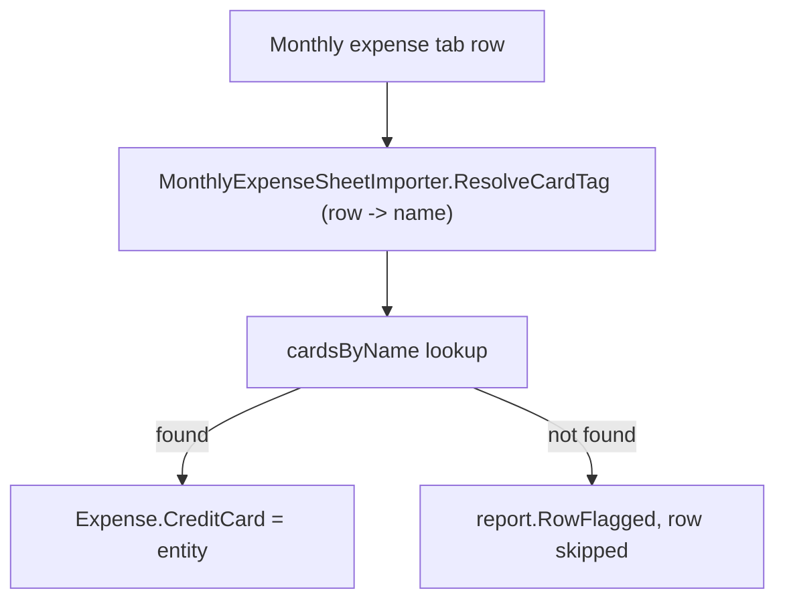

## 1. Technical Overview

**What:** Removes the last two functional dependencies on the legacy `CashFlow.Domain.Enums.CreditCard` enum (`MonthlyExpenseSheetImporter`'s row-position-to-card resolution and `EntityReferenceMigrator`'s legacy `CardTag` read), replacing both with a name-based lookup against the seeded `CreditCard` entities — mirroring `EntityReferenceMigrator`'s existing `banksByName` dictionary pattern for `PaymentSource`/`SourceBank`. Both call sites already had an inline comment marking them as the explicit F06 follow-up left by F02.

**Why:** F02's spec explicitly deferred this: "Adapt the monthly expense sheet importer and the charge-date backfill migrator to build and pass against the new entity-reference type, without reworking the importer's row-position resolution mechanism (left for a later feature)." Today, an inferred row-position card name that has no matching seeded `CreditCard` entity is silently dropped (the expense imports as an unsettled, cardless bank movement) instead of being flagged — the exact "silent corruption" risk PRD Section 2 calls out as the motivating problem for this PRD.

**Scope:**
- Included: `MonthlyExpenseSheetImporter.CardSectionStartRows` changes from `(int, CreditCard enum)[]` to `(int, string CardName)[]`; row resolution looks the name up in a `cardsByName` dictionary built once per `Import` call, flagging and skipping the row (not importing a null/incorrect reference) on a miss; `EntityReferenceMigrator`'s `ReadNullableEnum<CreditCard>(item, "CardTag")` call is replaced with `ReadNullableString(item, "CardTag")`, since the entity lookup that follows already does the real validation.
- Excluded (PRD Section 7 / F06 capabilities): the row-position mechanism itself (`CardSectionStartRows`' row-range logic) is unchanged; no change to `CreditCardMigrator` (its enum-derived `SeededCardNames` is the migration's own seed data, explicitly out of scope per the PRD's "no literal card-name array remains outside the migration's seed data" objective).

## 2. Architecture Impact

**Affected components:**
- `Integrations/CashFlowSpreadsheetImport/SheetImporters/MonthlyExpenseSheetImporter.cs` (modified)
- `Integrations/CashFlowSpreadsheetImport/Migrations/EntityReferences/EntityReferenceMigrator.cs` (modified)

## 3. Technical Decisions

| Decision | Chosen Approach | Alternative Considered | Trade-off |
|----------|----------------|----------------------|-----------|
| Unresolved card name handling | Flag the row via `report.RowFlagged` and skip creating that row's expense (`continue`) | Throw, aborting the entire multi-tab import run | Every other row-level problem in this exact function (bad value, unrecognized category) already uses flag-and-skip; one bad row in a hundred-row sheet shouldn't block the rest. This differs from `CreditCardReferenceMigrator`'s abort-on-unresolved (F02), which is a one-time historical-data upgrade where partial success is unacceptable — a live recurring spreadsheet import is a different risk profile |
| `CardSectionStartRows` value type | Plain `string` literal per row range | Keep deriving from the enum's `nameof(...)` | The PRD explicitly wants the importer's *output* to stop being an enum value; a `nameof` reference would still couple this file to the enum's existence even though it no longer needs enum semantics (no switch/comparison logic, just an opaque lookup key) |
