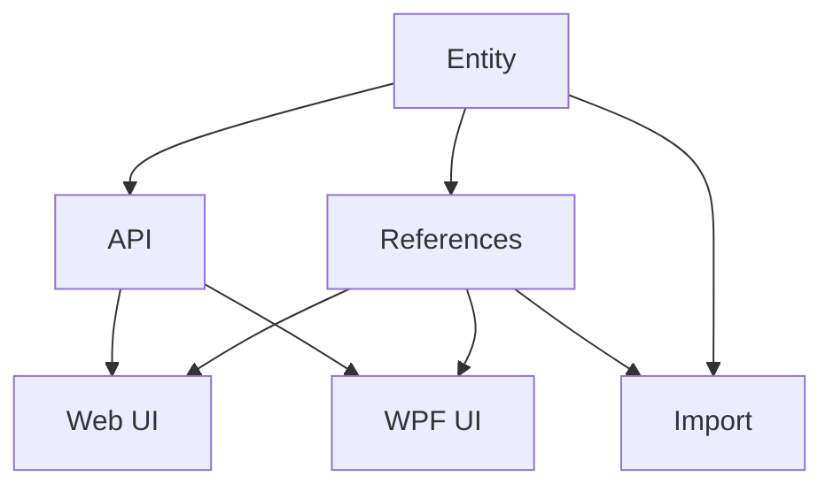

# Credit Card Entity

## 1. Executive Summary

Credit Card Entity introduces a first-class `CreditCard` domain entity into the Financial app, a personal finance tool used by its owner to track income, expenses, and investments across UK and Brazil accounts. Today, valid credit cards are defined as a hardcoded C# enum duplicated across three places in the codebase (the domain layer, the WPF desktop app, and the React web app), with no way to track whether a card is still active or when its next invoice payment is due. This feature replaces that enum with a seeded, referenceable entity — following the exact pattern already established for `Bank` and `IncomeSource` — giving the app a single source of truth for known cards, a lifecycle flag that blocks new entries against retired cards, and a due-date field that lays the groundwork for future payment reminders.

At a high level, the entity is seeded once via a migration tool (five existing cards, carried over by name), then referenced by `Expense` and `CardStatement` records instead of the old enum. A small read-and-update API exposes the card list and lets the owner keep `NextInvoiceDueDate` and `IsActive` current. Both the web and WPF expense-entry forms switch from hardcoded dropdowns to fetching this list live, and the spreadsheet importer is updated to resolve cards by name against the seeded entities instead of parsing enum literals.

## 2. Problem and Opportunity

**The Problem**

- **Duplicated, hardcoded card lists**
  - The same 5 card names are hardcoded in 3 separate places: the domain enum, the WPF `MonthlyViewModel`, and the React `ExpenseForm` — any card change means editing and redeploying 3 codebases in lockstep.
  - No API ever exposes the valid card list, so the two UI clients can silently drift out of sync if one is updated and the other isn't.

- **No card lifecycle tracking**
  - There is no active/inactive flag, so a cancelled or replaced card remains selectable in every expense-entry dropdown forever.
  - Nothing in the domain model prevents a new expense from being tagged to a card that's no longer in use.

- **No due-date visibility**
  - The domain has no field for when a card's invoice is due, so there is no way to build payment reminders without tracking dates manually outside the app.
  - Missed or late credit card payments carry real financial cost (late fees, interest), and today the app offers zero support for tracking due dates.

- **Fragile spreadsheet import**
  - Card assignment during import depends entirely on hardcoded row-position ranges (`CardSectionStartRows`) tied 1:1 to enum literals — any spreadsheet layout change silently breaks or misassigns cards.
  - There is no validation step confirming an inferred card name actually corresponds to a real, known card.

**The Opportunity**

Converting `CreditCard` into a seeded entity (F01) gives the app one source of truth, closing the 3-way duplication problem once the web and WPF pickers switch to fetching it live (F04, F05). Adding an `IsActive` flag enforced at the point of new-expense creation (F02) closes the lifecycle gap — retired cards simply stop appearing as options while their history stays intact. Adding `NextInvoiceDueDate` as a real, editable field (F01, F03) closes the due-date gap and is the concrete foundation a future reminder/calendar epic can build on. Finally, having the importer resolve cards by name against real entities with explicit failure on unmatched names (F06) turns a silent-corruption risk into a fail-fast validation.

## 3. Target Audience

### Primary Users

**The App Owner**
- Personal user of the Financial app who enters and reviews their own credit card expenses monthly
- Wants an accurate, current list of their real cards when tagging expenses — not a stale hardcoded list that still shows a cancelled card
- Wants to track when each card's invoice is due so they can avoid late payments, even without automated reminders yet

## 4. Objectives

- **Eliminate** duplicate hardcoded card lists across WPF, React, and the domain enum by sourcing all pickers from one seeded entity list. Metric: hardcoded card-name arrays go from 3 to 0, verified by confirming no literal card-name array remains outside the migration's seed data.
- **Prevent** new entries against inactive cards. Metric: 100% of new-expense and new-statement pickers exclude inactive cards, verified by deactivating a seeded card and confirming it no longer appears in either UI's dropdown.
- **Capture** a next invoice due date per card. Metric: `NextInvoiceDueDate` is present and editable for all 5 seeded cards, verified via a round-trip update through the API.
- **Preserve** historical accuracy after a card is deactivated. Metric: 100% of existing `Expense`/`CardStatement` records referencing a since-deactivated card remain visible, unchanged, in historical views.

## 5. User Stories

### F01. CreditCard Domain Entity & Seed Migration
- As the system, I want to persist a list of CreditCard entities so that card data has a single source of truth
- As the system, I want to seed the 5 existing cards (Barclays Platinum Visa 8003, Barclays Platinum Visa 6007, Chase Master 4023, BA Amex, PayPal Credit) as active entities with no due date so existing data keeps working after migration
- As the system, I want to migrate legacy enum-only records so that no manual data cleanup is required after deployment

### F02. Migrate Expense & CardStatement to CreditCard References
- As a user, I want new expenses to reference a real CreditCard entity so the app can validate the card is active before letting me tag an expense to it
- As a user, I want to be blocked from tagging a new expense to an inactive card so I can't accidentally post to a cancelled card
- As the system, I want CardStatement generation to only create statements for active cards so cancelled cards stop accumulating monthly statements
- As the system, I want existing Expense.CardTag and CardStatement.Card enum values migrated to entity references so historical records remain intact and queryable

### F03. Read & Update API Endpoints
- As a user, I want to fetch the list of credit cards via API so that both web and WPF clients can build dynamic picklists
- As a user, I want to update a card's next invoice due date via API so I can keep the reminder date current after each payment
- As a user, I want to update a card's active flag via API so I can deactivate a cancelled card without editing the JSON data file directly

### F04. Web: Dynamic Picklist & Due-Date Editing
- As a user, I want the expense form's card dropdown to show only active cards fetched from the API so I never see stale or invalid options
- As a user, I want to edit a card's next invoice due date and active flag from the Credit Card tab so I can keep card details current without leaving the browser

### F05. WPF: Dynamic Picklist & Due-Date Editing
- As a user, I want the WPF expense entry card dropdown to show only active cards fetched from the API so it matches the web app's behavior
- As a user, I want to edit a card's next invoice due date and active flag from the WPF Credit Card tab so I can manage cards from the desktop app

### F06. Spreadsheet Import Card Resolution
- As the system, I want the spreadsheet importer to resolve cards by name against seeded CreditCard entities instead of parsing enum literals so imported expenses reference the correct entity
- As the system, I want the importer to fail clearly if a row's inferred card name has no matching seeded entity so import errors are caught early rather than silently corrupting data

## 6. Functionalities

### F01. CreditCard Domain Entity & Seed Migration

**Provides:**
- CreditCard entities (Id, Name, IsActive, NextInvoiceDueDate) (used by F02, F03, F06)

**Capabilities:**
- Fields: `Id` (Guid, generated), `Name` (string, required, unique, max 100 chars), `IsActive` (bool, default true), `NextInvoiceDueDate` (nullable date, no default)
- Entity created via a static factory (`CreditCard.Create(name, isActive)`), private setters, no public parameterless constructor — mirrors `Bank`/`IncomeSource`
- Persisted as part of the `CashFlowData` aggregate (`List<CreditCard>`, `AddCreditCard`), no remove operation — cards are permanent reference data, matching Bank/IncomeSource
- Registered in `CashFlowTypeInfoResolver`'s `ManagedTypes` with a `CreditCardReferenceConverter` (wire name `"CreditCardId"`), following `BankReferenceConverter`/`IncomeSourceReferenceConverter` exactly
- Migration seeds exactly 5 cards with today's existing enum names: `BarclaysPlatinumVisa8003`, `BarclaysPlatinumVisa6007`, `ChaseMaster4023`, `BaAmex`, `PaypalCredit` — all `IsActive=true`, `NextInvoiceDueDate=null`
- Migration is idempotent — running it twice does not create duplicate cards (matches `BankMigrator`/`IncomeSourceMigrator` name-based dedup pattern)

**Experience:**
- No direct UI in this feature — purely domain, infrastructure, and a one-time migration tool
- Migration runs once via the existing `CashFlowSpreadsheetImport` console entry point, logging each card created or skipped

### F02. Migrate Expense & CardStatement to CreditCard References

**Consumes:**
- F01: CreditCard entities (Id, Name, IsActive) for reference resolution

**Provides:**
- Expense records referencing CreditCard by Id — the domain property `Expense.CardTag` is renamed to `Expense.CreditCard`, and `ExpenseCreateDTO`/`ExpenseUpdateDTO`/`ExpenseDTO` expose it as `CreditCardId` (`Guid?`), replacing the old `CardTag` string field, matching how `PaymentSourceBank` already uses `BankId` (used by F04, F05, F06)
- CardStatement records referencing CreditCard by Id — the domain property `CardStatement.Card` is renamed to `CardStatement.CreditCard`, and `CardStatementDTO` exposes it as `CreditCardId` (`Guid`), replacing the old `Card` enum-name field (used by F04, F05)

**Capabilities:**
- `Expense.CardTag` is renamed to `Expense.CreditCard` and changes from `CreditCard?` (enum) to a nullable reference to the `CreditCard` entity, using the same reference-converter pattern as `PaymentSourceBank` (wire name `"CreditCardId"`, consistent with F01)
- `CardStatement.Card` is renamed to `CardStatement.CreditCard` and changes from `CreditCard` (enum, non-nullable) to a non-nullable reference to the `CreditCard` entity (wire name `"CreditCardId"`)
- New or updated expenses may only reference an active `CreditCard`; attempting to create or update an expense with an inactive card's Id is rejected
- `CardStatementService`'s monthly auto-generation (previously iterating `AllCards`) is replaced with a query for active cards only, evaluated at generation time
- A data migration step (extending `EntityReferenceMigrator`, mirroring its existing `ReadLegacyBanks`/`banksByName` pattern) converts every existing `Expense.CardTag` and `CardStatement.Card` enum value to the matching seeded `CreditCard`'s Id, matched by name
- `CreditCardNameResolver` (mirroring `BankNameResolver`/`IncomeSourceNameResolver`) replaces `CreditCardParser` for resolving a card by Id against the seeded list

**Experience:**
- No new UI in this feature — this is the reference-model rewire underneath; F04/F05 build the picklists on top of it

**Error Handling:**
- Creating/updating an expense with a `CardTag` that doesn't match any seeded CreditCard → reject with "Unknown credit card" validation error
- Creating/updating an expense with a `CardTag` matching an inactive CreditCard → reject with "Credit card '{name}' is inactive and cannot be used for new entries"
- Data migration encountering an enum value with no matching seeded CreditCard name → migration aborts with a clear error listing the unmatched value, rather than silently dropping the reference
- CardStatement auto-generation finding zero active cards for a period → logs a warning and creates no statements (not treated as a hard error, but surfaced for visibility)

### F03. Read & Update API Endpoints

**Consumes:**
- F01: CreditCard entities (Id, Name, IsActive, NextInvoiceDueDate)

**Provides:**
- CreditCard list (Id, Name, IsActive, NextInvoiceDueDate) (used by F04, F05)
- CreditCard update capability (used by F04, F05)

**Capabilities:**
- `GET /credit-cards` — returns all seeded cards, active and inactive, mirroring `GET /income-sources`'s shape
- `PUT /credit-cards/{id}` — updates `NextInvoiceDueDate` and `IsActive` on an existing card; `Name` is immutable via this endpoint (no rename support, consistent with "no CRUD" scope)
- Request body: `{ nextInvoiceDueDate: date | null, isActive: bool }` — both fields required in the request (full replace of the two mutable fields, not a partial patch), mirroring the simplicity of Bank's opening-balance PUT

**Experience:**
- `GET /credit-cards` requires no parameters and returns immediately from the seeded/migrated list
- `PUT /credit-cards/{id}` returns the updated `CreditCardDTO` on success

**Error Handling:**
- `PUT` with an unknown `{id}` → 404 Not Found
- `PUT` with a due date in an invalid format → 400 Bad Request with a field-level validation message
- `PUT` setting `isActive: false` on a card with pending (unpaid) `CardStatement` records → allowed; deactivation doesn't retroactively affect past/pending statements, it only blocks new entries per F02

### F04. Web: Dynamic Picklist & Due-Date Editing

**Consumes:**
- F02: Expense `CreditCardId` contract (Guid reference, replacing the old `CardTag` string field)
- F03: CreditCard list and update endpoint

**Capabilities:**
- Expense form's card dropdown (`ExpenseForm.tsx`) replaces the hardcoded `CARDS` array with cards fetched from `GET /credit-cards`, filtered to `isActive === true`, submitting the selected card's Id as `creditCardId` instead of a card-name string
- Credit Card tab gains an inline-editable due-date field and active toggle per card, calling `PUT /credit-cards/{id}` on change (same interaction pattern as existing Bank opening-balance editing)

**Experience:**
- On the Credit Card tab, each card row shows its name, an editable due-date input (date picker, blank if null), and an active/inactive toggle
- Saving a due-date edit or toggling active shows the same inline success/error feedback pattern already used for Bank balance edits
- Deactivating a card immediately removes it from the expense form's dropdown on next fetch/reload

### F05. WPF: Dynamic Picklist & Due-Date Editing

**Consumes:**
- F02: Expense `CreditCardId` contract (Guid reference, replacing the old `CardTag` string field)
- F03: CreditCard list and update endpoint

**Capabilities:**
- `MonthlyViewModel.Cards`/`CardOptions` hardcoded list replaced with an `ObservableCollection<CreditCardDTO>` fetched from `GET /credit-cards`, filtered to active cards for new-entry pickers, submitting the selected card's Id as `CreditCardId` instead of a card-name string
- Credit Card tab (`CreditCardExpensesView.xaml`) gains an editable due-date field and active checkbox per card, calling the update endpoint on change

**Experience:**
- Same interaction shape as F04, adapted to WPF's existing editable-grid pattern (matches how Bank opening balance is edited in `BanksGridView`)

### F06. Spreadsheet Import Card Resolution

**Consumes:**
- F01: CreditCard entities (Id, Name) for row-position-to-card resolution
- F02: Expense `CreditCardId` contract (Guid reference, replacing the old `CardTag` string field) for writing imported expense records

**Capabilities:**
- `MonthlyExpenseSheetImporter`'s existing row-position-to-card mapping (`CardSectionStartRows`) is unchanged in mechanism, but its output changes from a `CreditCard` enum value to a lookup against seeded `CreditCard` entities by name (mirrors `BankMigrator`'s `banksByName` dictionary pattern)
- `EntityReferenceMigrator`'s `ReadNullableEnum<CreditCard>` helper for legacy `CardTag` reads is replaced with a name-based entity lookup that populates `Expense.CreditCard`/`CardStatement.CreditCard`, consistent with its existing `banksByName` resolution for `Bank`

**Experience:**
- No end-user-facing UI — this is import-time behavior
- Import log output includes the resolved card name per row, at the same visibility level as today

**Error Handling:**
- A row's inferred card name has no matching seeded CreditCard entity → import fails fast for that row with an error identifying the row number and inferred card name, rather than importing a null or incorrect card reference

## 7. Out of Scope

- Full CRUD (create/delete) for credit cards via UI or API — cards are seeded once by migration; only `IsActive` and `NextInvoiceDueDate` are mutable, `Name` is fixed forever
- Google Calendar or other calendar/reminder integration — this PRD only stores `NextInvoiceDueDate`; automated reminders are future work
- Automated recurring due-date computation (e.g., "always due on the 15th") — due dates are absolute dates manually advanced by the owner
- Renaming an existing credit card via the update endpoint
- Notifications, push messages, or email reminders of any kind
- Any change to how credit card statements are paid/settled (already covered by prior P12/P25 work) — this PRD only changes what `CreditCard` references look like structurally

## 8. Dependency Graph

| # | Feature | Priority | Dependencies |
|---|---------|----------|--------------|
| F01 | CreditCard Domain Entity & Seed Migration | 1 | None |
| F02 | Migrate Expense & CardStatement to CreditCard References | 1 | F01 |
| F03 | Read & Update API Endpoints | 1 | F01 |
| F04 | Web: Dynamic Picklist & Due-Date Editing | 2 | F02, F03 |
| F05 | WPF: Dynamic Picklist & Due-Date Editing | 2 | F02, F03 |
| F06 | Spreadsheet Import Card Resolution | 1 | F01, F02 |

### Execution Waves
Features within the same wave can be built in parallel. A wave starts only after every feature in earlier waves is complete.

- **Wave 1**: F01
- **Wave 2**: F02, F03
- **Wave 3**: F06, F04, F05

### Priority levels
- **1** = Essential — product does not work without it
- **2** = Important — significant value addition
- **3** = Desirable — incremental improvement

## 9. Acceptance Criteria

### F01. CreditCard Domain Entity & Seed Migration
- [x] CreditCard entity exists with Id, Name, IsActive, NextInvoiceDueDate fields
- [x] Migration seeds exactly 5 cards (Barclays Platinum Visa 8003, Barclays Platinum Visa 6007, Chase Master 4023, BA Amex, PayPal Credit), all active, due date null
- [x] Running the migration twice does not create duplicate cards
- [x] CreditCard is persisted via a reference converter (`CreditCardId` wire format), consistent with Bank/IncomeSource — deferred to F02, which is when a property first references CreditCard by Id (mirrors ReserveBucketReferenceConverter landing in P28-F02, not P28-F01); will be checked off there

### F02. Migrate Expense & CardStatement to CreditCard References
- [x] `Expense.CardTag` is renamed to `Expense.CreditCard` and `CardStatement.Card` is renamed to `CardStatement.CreditCard`; both are exposed at the API boundary as `CreditCardId`, with no remaining `CardTag`/`Card` string fields on these DTOs
- [x] Creating a new expense with an active card's Id succeeds and stores the reference correctly
- [x] Creating a new expense with an inactive card's Id is rejected with a clear error
- [x] Creating a new expense with an unknown card Id is rejected with a clear error
- [x] CardStatement auto-generation creates statements only for active cards
- [x] Existing Expense.CardTag and CardStatement.Card values are migrated from enum to CreditCard Id references with no data loss
- [x] Historical expenses referencing a card later deactivated remain intact and correctly linked

### F03. Read & Update API Endpoints
- [x] GET /credit-cards returns all seeded cards including inactive ones
- [x] PUT /credit-cards/{id} updates NextInvoiceDueDate and IsActive and returns the updated card
- [x] PUT /credit-cards/{id} with an unknown id returns 404
- [x] PUT /credit-cards/{id} with an invalid due date format returns 400 with a field-level error

### F04. Web: Dynamic Picklist & Due-Date Editing
- [x] Expense form card dropdown shows only active cards fetched from the API
- [x] Credit Card tab allows editing due date and active flag per card
- [x] Deactivating a card via the UI removes it from the expense form dropdown after refresh

### F05. WPF: Dynamic Picklist & Due-Date Editing
- [x] WPF expense entry card dropdown shows only active cards fetched from the API
- [x] WPF Credit Card tab allows editing due date and active flag per card
- [x] Deactivating a card via WPF removes it from the expense entry dropdown after refresh

### F06. Spreadsheet Import Card Resolution
- [x] Spreadsheet import resolves each row's card by name against seeded CreditCard entities using existing row-position logic
- [x] A row whose inferred card name has no matching seeded entity fails the import with a clear row-level error
- [x] Imported expenses store the correct CreditCard Id reference, matching the entity resolved by name

### Cross-Feature Integration
- [x] CreditCard entities seeded in F01 are correctly resolved and referenced by Expense/CardStatement records after F02's migration
- [x] CreditCard list and update endpoints in F03 correctly reflect changes made to entities from F01/F02 (e.g., an update via API is immediately visible in a subsequent GET)
- [x] Web UI (F04) correctly consumes F02's Expense CardTag contract and F03's API to build its picklist and editing controls
- [x] WPF UI (F05) correctly consumes F02's Expense CardTag contract and F03's API to build its picklist and editing controls
- [x] Spreadsheet import (F06) correctly resolves cards using F01's seeded entities and stores references consistent with F02's entity-reference model
