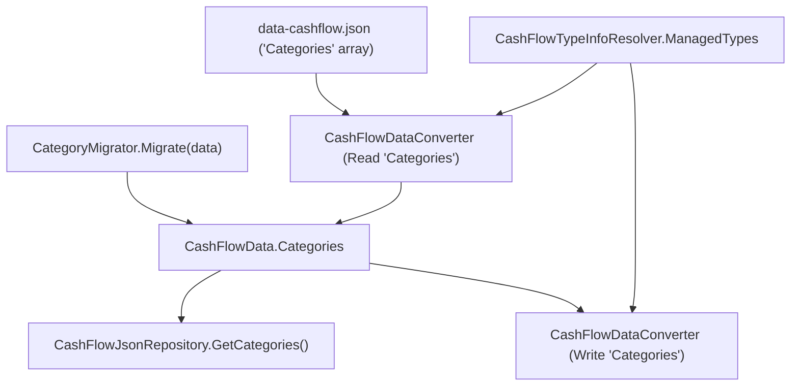

## 1. Technical Overview

**What:** A new `Financial.CashFlow.Domain.Entities.Category` entity is introduced alongside the existing `Financial.CashFlow.Domain.Enums.Category` enum (both coexist during the migration; the enum is removed only once F02–F06 have moved every consumer off it). The entity carries `Id`, `Name`, `Active`, `IsInvestment`, and `IsTithe`, is fully immutable after construction (no update methods at all, per the PRD), and is persisted as a new top-level `Categories` collection on `CashFlowData`. A new `CategoryMigrator` idempotently seeds the 14 existing category names into this collection, setting `IsInvestment=true` only for "Investimento" and `IsTithe=true` only for "Dizimo". The entity round-trips through the JSON store via the same reflection-based, private-constructor-aware serialization already used for `Bank`/`CreditCard`.

**Why:** This is the foundational entity every later feature in this PRD depends on — F02 (Expense reference migration and domain logic), F03 (read API), F04/F05 (web/WPF picklists), and F06 (import resolution) all need a seeded, referenceable `Category` list to exist first. Mirroring `CreditCard`'s own F01 exactly (entity + `ManagedTypes` registration + a dedicated top-level collection + an idempotent name-based seed migrator, with the reference-converter wiring deferred to F02) keeps this feature's blast radius minimal: nothing yet points at `Category` by Id, so nothing else in the codebase needs to change.

**Scope:**
- Included: the `Category` domain entity; its registration in `CashFlowData` as a new collection; its round-trip (de)serialization via `CashFlowDataConverter`/`CashFlowTypeInfoResolver`; `ICashFlowRepository.GetCategories()` and its `CashFlowJsonRepository` implementation; the `CategoryMigrator` seed tool and its wiring into `Program.cs`.
- Excluded (deferred to later PRD features): a reference converter for `Category` and any `*Id`-wire-format property (F02, once `Expense.Category` first references the entity — mirrors `CreditCardReferenceConverter` landing in P29-F02, not P29-F01); removal of the `Category` enum and `CategoryClassifier` (deferred until every consumer is migrated, per F02); any API endpoint (F03); any UI (F04/F05); spreadsheet import resolution (F06).

## 2. Architecture Impact

**Affected components:**
- `Financial.CashFlow.Domain/Entities/Category.cs` (new) — the entity itself
- `Financial.CashFlow.Domain/Entities/CashFlowData.cs` — new `_categories` backing list, `Categories` read-only property, `AddCategory` method
- `Financial.CashFlow.Infrastructure/Persistence/CashFlowTypeInfoResolver.cs` — register `typeof(Category)` in `ManagedTypes` so the reflection-based serializer can construct it despite the private constructor/setters (no `ReferenceProperties` entry yet — nothing references it)
- `Financial.CashFlow.Infrastructure/Persistence/CashFlowDataConverter.cs` — read/write the new `"Categories"` collection under the existing `resolvedOptions` pass (same treatment `CreditCards` got in its own F01), not the early cross-referenced pass
- `Financial.CashFlow.Application/Interfaces/ICashFlowRepository.cs` — new `GetCategories()` method
- `Financial.CashFlow.Infrastructure/Repositories/CashFlowJsonRepository.cs` — `GetCategories() => _data.Categories`
- `Integrations/CashFlowSpreadsheetImport/Migrations/Categories/CategoryMigrator.cs` (new) — idempotent name-based seed, mirroring `CreditCardMigrator`
- `Integrations/CashFlowSpreadsheetImport/Migrations/Categories/CategoryMigrationSummary.cs` (new) — seeded/already-present counts, mirroring `CreditCardMigrationSummary`
- `Integrations/CashFlowSpreadsheetImport/Program.cs` — wire `CategoryMigrator.Migrate(data)` into the existing "always run, idempotent" migration block, and render its summary

## 3. Technical Decisions

| Decision | Chosen Approach | Alternative Considered | Trade-off |
|----------|----------------|----------------------|-----------|
| Entity mutability | No update methods at all — `Active`, `IsInvestment`, `IsTithe` are set only in the private constructor via `Create`, with no `UpdateDetails`-style method (unlike `CreditCard`) | Add an `UpdateDetails`/`Deactivate` method now, even with no caller yet | The PRD is explicit: "no field is editable through any application-level mutator" for this entity, and F03 deliberately has no `PUT` endpoint. Adding a mutator with no caller would be dead code the codebase's "no over-engineering" guidance (CLAUDE.md) rules out |
| `Category` entity vs. reusing the enum's namespace | New type in `Financial.CashFlow.Domain.Entities.Category`, coexisting with `Financial.CashFlow.Domain.Enums.Category` until F02 deletes the enum | Rename the enum's namespace reference at call sites immediately | Every other entity migration in this codebase (`Bank`, `IncomeSource`, `ReserveBucket`, `CreditCard`) followed this same "new entity type alongside the old enum, delete the enum only once every consumer moved" sequence; changing that now would break the established pattern this PRD explicitly mirrors |
| `ManagedTypes` registration timing | Register `typeof(Category)` in F01, same commit as the entity itself | Defer registration to F02 | Without this, `CashFlowTypeInfoResolver` cannot construct `Category` at all (private constructor, private setters) — the top-level `Categories` collection would fail to serialize/deserialize. This exactly matches how `CreditCard` was registered in its own F01 commit (`6a8c4a5`), before any reference property existed |
| `CashFlowDataConverter` placement | Add `"Categories"` to the same block as `CreditCards`, deserialized with `resolvedOptions` (not moved into the early `unresolvedOptions`/`ReferenceResolutionContext` pass) | Add `Category` to the early cross-referenced pass immediately, anticipating F02 | Nothing references `Category` by Id yet in F01, so there is nothing to resolve early against. `CreditCard` followed the identical two-step sequence: plain `resolvedOptions` read/write in F01, then moved into the early pass only in F02 once `Expense.CreditCard` needed to resolve against it before `Expenses` was read |
| Seed names | Reuse the enum's 14 existing literal names verbatim (`Ariana`, `Carro`, ..., `Investimento`, `Reserva`) — no rename | Rename to more "human-readable" display names, mirroring `CreditCardMigrator`'s later rename (`d58b9c9`) | `CreditCard`'s rename fixed genuinely enum-style names (`BarclaysPlatinumVisa8003`). The `Category` enum's names are already plain, human-readable words (first names, household categories) — there is nothing to improve, and the PRD does not ask for a rename |
| `CategoryMigrator` invocation point in `Program.cs` | Add it to the existing "always run, idempotent" block alongside `BankMigrator`/`CreditCardMigrator`/`IncomeSourceMigrator` (after sheet import, both modes) | Add it to the earlier "must run before sheet import" block (like `BankMigrator`'s first call) | Nothing in F01 consumes the seeded list during import — `MonthlyExpenseSheetImporter`'s `CategoryResolver` still resolves to the enum until F06. There is no ordering dependency yet, so the simpler single-call placement (matching where `IncomeSourceMigrator` and the second `CreditCardMigrator` call sit) is sufficient |

## 4. Component Overview

**Domain:**

| File Path | New/Modified | Purpose | Key Responsibilities |
|-----------|--------------|---------|---------------------|
| `Financial.CashFlow.Domain/Entities/Category.cs` | New | Seeded category reference data | `Id`, `Name`, `Active`, `IsInvestment`, `IsTithe`; private constructor; static `Create(name, isInvestment, isTithe, isActive = true)` factory validating a non-blank name; no update methods |
| `Financial.CashFlow.Domain/Entities/CashFlowData.cs` | Modified | Aggregate root | New `_categories` list, `Categories` read-only property, `AddCategory(Category)` — mirrors `_creditCards`/`AddCreditCard` exactly |

**Application:**

| File Path | New/Modified | Purpose | Key Responsibilities |
|-----------|--------------|---------|---------------------|
| `Financial.CashFlow.Application/Interfaces/ICashFlowRepository.cs` | Modified | Repository contract | Add `IEnumerable<Category> GetCategories();` |

**Infrastructure:**

| File Path | New/Modified | Purpose | Key Responsibilities |
|-----------|--------------|---------|---------------------|
| `Financial.CashFlow.Infrastructure/Repositories/CashFlowJsonRepository.cs` | Modified | Repository implementation | `GetCategories() => _data.Categories` |
| `Financial.CashFlow.Infrastructure/Persistence/CashFlowTypeInfoResolver.cs` | Modified | Serialization metadata | Add `typeof(Category)` to `ManagedTypes` (private-constructor/setter wiring only; no `ReferenceProperties` entry) |
| `Financial.CashFlow.Infrastructure/Persistence/CashFlowDataConverter.cs` | Modified | Top-level (de)serializer | Read `"Categories"` via `DeserializeCollection<Category>(root, "Categories", resolvedOptions)` into `data.AddCategory(...)`, alongside the existing `CreditCards` line; write `"Categories"` via `WriteCollection` alongside `"CreditCards"` |

**Migration tooling:**

| File Path | New/Modified | Purpose | Key Responsibilities |
|-----------|--------------|---------|---------------------|
| `Integrations/CashFlowSpreadsheetImport/Migrations/Categories/CategoryMigrator.cs` | New | Idempotent seed | Static `Migrate(CashFlowData data)`; seeds the 14 names with the correct `IsInvestment`/`IsTithe` flags, skipping any name already present (case-insensitive match), mirroring `CreditCardMigrator` |
| `Integrations/CashFlowSpreadsheetImport/Migrations/Categories/CategoryMigrationSummary.cs` | New | Migration outcome | `CategoriesSeededCount`, `CategoriesAlreadyPresentCount`, `Render()` — mirrors `CreditCardMigrationSummary` |
| `Integrations/CashFlowSpreadsheetImport/Program.cs` | Modified | Orchestration | Call `CategoryMigrator.Migrate(data)` in the existing always-run idempotent block; print its summary alongside the others |

## 5. API Contracts

None — no endpoint is added in this feature (F03 adds `GET /categories`).

## 6. Data Model

No relational schema — this is the existing JSON-file persistence (`data/data-cashflow.json`). New top-level array:

**`Categories[]` (new collection):**

| Field | Type | Nullable | Default | Description |
|-------|------|----------|---------|-------------|
| `Id` | `Guid` | No | generated | Primary identifier, generated by `Create` |
| `Name` | `string` | No | - | Seeded category name (e.g. `"Mercado"`, `"Investimento"`) |
| `Active` | `bool` | No | `true` | Whether the category may be selected for new entries (enforced starting F02) |
| `IsInvestment` | `bool` | No | `false` | `true` only for the seeded "Investimento" category |
| `IsTithe` | `bool` | No | `false` | `true` only for the seeded "Dizimo" category |

No indexes/constraints beyond what the JSON format itself implies (uniqueness of `Name` is enforced by `CategoryMigrator`'s case-insensitive dedup check, not by a schema constraint).

**Migration:** `CategoryMigrator.Migrate(data)` runs against the already-typed, in-memory `CashFlowData` (not a raw-JSON rewrite, since nothing else in the file needs to change shape yet) — it checks `data.Categories.Any(c => string.Equals(c.Name, name, StringComparison.OrdinalIgnoreCase))` per seed name and adds only what's missing, exactly like `CreditCardMigrator`. Running it against a file that predates F01 (no `"Categories"` key at all) works unchanged, since `CashFlowDataConverter.DeserializeCollection` already returns an empty list when a property is absent.

## 7. Testing Strategy

**Test files:**

| Test File | Test Type | Target | Coverage Goal |
|-----------|-----------|--------|----------------|
| `Tests/Financial.CashFlow.Domain.Tests/Entities/CategoryTests.cs` | Unit | `Category` | `Create` sets all properties; two `Create` calls produce different Ids; `IsInvestment`/`IsTithe` default to false when omitted; blank/null/whitespace name throws `ArgumentException` |
| `Tests/Financial.CashFlow.Domain.Tests/Entities/CashFlowDataTests.cs` | Unit | `CashFlowData` | `AddCategory` appends to `Categories`; `Categories` starts empty on `Create()` (mirrors existing `AddCreditCard`/`CreditCards` coverage, if present) |
| `Tests/Financial.CashFlow.Infrastructure.Tests/Persistence/CashFlowSerializerAdapterTests.cs` | Unit | Round-trip serialization | Extend the existing all-collections round-trip test: add a seeded `Category` (with `IsInvestment`/`IsTithe` both true and false cases) to `original`, assert it survives serialize→deserialize with all fields intact |
| `Tests/Financial.CashFlow.Infrastructure.Tests/Repositories/CashFlowJsonRepositoryTests.cs` | Unit | Repository | `GetCategories_ReturnsCategoriesFromTheUnderlyingData` — mirrors `GetCreditCards_ReturnsCreditCardsFromTheUnderlyingData` |
| `Tests/Financial.CashFlowSpreadsheetImport.Tests/Migrations/Categories/CategoryMigratorTests.cs` | Unit | `CategoryMigrator` (new) | Seeds all 14 on empty data; only "Investimento" has `IsInvestment=true`; only "Dizimo" has `IsTithe=true`; calling twice seeds nothing new and keeps the same Ids; partially-seeded data only seeds the missing names; null data throws `ArgumentNullException` |

**Acceptance-criteria traceability (PRD Section 9, F01):**
- Category entity exists with Id, Name, Active, IsInvestment, IsTithe fields, no update method → `CategoryTests`
- Migration seeds exactly 14 categories, all Active=true → `CategoryMigratorTests`
- Only "Investimento" has IsInvestment=true; only "Dizimo" has IsTithe=true → `CategoryMigratorTests`
- Running the migration twice does not create duplicates → `CategoryMigratorTests`
- Category persisted via reference converter — explicitly deferred to F02 per the PRD's own AC note; not covered here
