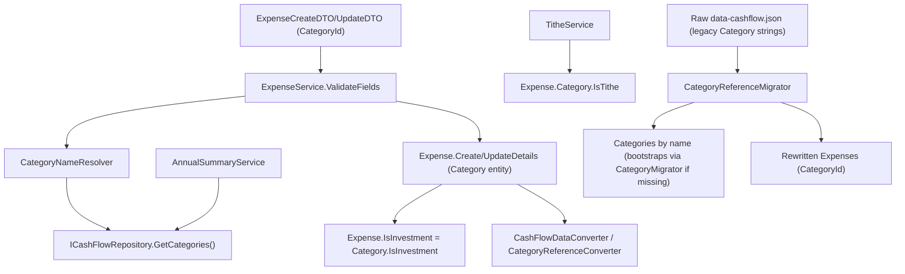

## 1. Technical Overview

**What:** `Expense.Category` (currently a non-nullable `Financial.CashFlow.Domain.Enums.Category` enum) is renamed in type only — the property name stays `Category`, but its type changes to a non-nullable reference to the `Financial.CashFlow.Domain.Entities.Category` entity seeded in F01. It is exposed at the API boundary as `CategoryId` (`Guid`), replacing the old plain-string `Category` field on `ExpenseCreateDTO`/`ExpenseUpdateDTO`/`ExpenseDTO`. A new `CategoryNameResolver` (mirroring `BankNameResolver`/`CreditCardNameResolver`) resolves a category by Id against the seeded/active list for the create/update expense flow. `Expense.IsInvestment` is derived directly from `Category.IsInvestment`, replacing the deleted `CategoryClassifier`. `TitheService` switches from a hardcoded `Category.Dizimo` enum comparison to `Category.IsTithe`. `AnnualSummaryService`'s category-total/average machinery — the heaviest enum-coupled code in the codebase — is reworked to iterate the seeded category list instead of `Enum.GetValues<Category>()`. A dedicated one-time raw-JSON migrator (`CategoryReferenceMigrator`) converts every existing `Expense.Category` string value to the matching seeded `Category`'s Id; the older, pre-F01-era `EntityReferenceMigrator` gets the equivalent fix for files that predate even the Category seed migration.

**Why:** This is the reference-model rewire F01's seeded entity exists to support. Until `Expense` actually points at `Category` by Id, the entity is inert — nothing enforces "only active categories are selectable" from the PRD's Objectives, the `CategoryClassifier`/hardcoded-`Dizimo` special cases the user explicitly asked to remove are still enum-coupled, and F03's API/F04's web UI/F05's WPF UI/F06's importer all have nothing to consume. Every call site that constructs or reads a category-tagged `Expense` today references the enum directly, so this change cannot land in isolation — every one of those call sites must compile and its tests must pass at the same commit, mirroring the exact build-integrity constraint F02 already established for `CreditCard` in P29.

**Scope:**
- Included: `Expense.Category` type change; `ExpenseService` validation and read-model mapping; `AnnualSummaryService`'s full category-iteration rework; `TitheService`'s tithe-total calculation; `CategoryClassifier` and its test file, deleted; DTO contract changes; persistence wiring (reference converter, resolution context, type resolver, moving `Categories` into the early cross-referenced deserialization pass); the new one-time `CategoryReferenceMigrator`; `EntityReferenceMigrator`'s pre-existing (now broken) `Category` handling, fixed to resolve by name instead of `Enum.Parse`; the minimal adaptation needed to keep `MonthlyExpenseSheetImporter` compiling against the new type.
- Excluded (deferred to later PRD features): `MonthlyExpenseSheetImporter`'s `CategoryResolver` is *not* reworked to look up `Category` by name in a general way — F06 owns that; here it only gets the minimum change needed to keep building, resolving its already-computed legacy enum value to the matching seeded entity by name. `CategoryParser.cs` is **not** deleted (unlike `CreditCardParser` in P29-F02) — `CategoryResolver` still calls it for the recurring spreadsheet import until F06 reworks that resolution mechanism; deleting it now would break the one caller F06 hasn't touched yet. The `Category` enum itself and `CategoryParser.cs` are deleted in a final cleanup step after F06, mirroring how the `CreditCard` enum's removal (`d58b9c9`) was its own commit after every consumer had moved off it. No new API endpoints (F03). No UI changes (F04/F05).

## 2. Architecture Impact

**Affected components:**
- `Financial.CashFlow.Domain/Entities/Expense.cs` — `Category` property type change (enum → entity), signature updates on `Create`/`UpdateDetails`
- `Financial.CashFlow.Domain/Rules/CategoryClassifier.cs` (deleted) — superseded by `Category.IsInvestment`
- `Financial.CashFlow.Application/Validation/CategoryNameResolver.cs` (new) — Id-based resolution, used by `ExpenseService` instead of `CategoryParser`
- `Financial.CashFlow.Application/Services/ExpenseService.cs` — category resolution + active-category validation + read-model mapping
- `Financial.CashFlow.Application/Services/TitheService.cs` — `Category.Dizimo` comparison → `Category.IsTithe`
- `Financial.CashFlow.Application/Services/AnnualSummaryService.cs` — `Enum.GetValues<Category>()` (2 call sites), `Enum.Parse<Category>`, and `nameof(Category.Investimento)` all replaced with seeded-list-driven equivalents
- `Financial.CashFlow.Application/DTOs/ExpenseCreateDTO.cs`, `ExpenseUpdateDTO.cs`, `ExpenseDTO.cs` — `Category: string` → `CategoryId: Guid` (+ `CategoryName` read-model addition on `ExpenseDTO`)
- `Financial.CashFlow.Infrastructure/Persistence/CategoryReferenceConverter.cs` (new) — mirrors `CreditCardReferenceConverter`/`BankReferenceConverter`
- `Financial.CashFlow.Infrastructure/Persistence/ReferenceResolutionContext.cs` — add `Categories` lookup
- `Financial.CashFlow.Infrastructure/Persistence/CashFlowTypeInfoResolver.cs` — register `(Expense, Category)` → `"CategoryId"` reference property, add `Category` branch to `CreateReferenceConverter`
- `Financial.CashFlow.Infrastructure/Persistence/CashFlowDataConverter.cs` — move `Categories` deserialization into the early (Banks/IncomeSources/InvestmentAccounts/ReserveBuckets/CreditCards) resolution pass, before `Expenses` is read
- `Integrations/CashFlowSpreadsheetImport/Migrations/CategoryReferences/CategoryReferenceMigrator.cs` + `CategoryReferenceMigrationSummary.cs` (new) — one-time raw-JSON rewrite, wired into `Program.cs`
- `Integrations/CashFlowSpreadsheetImport/Migrations/EntityReferences/EntityReferenceMigrator.cs` — fix its own pre-existing `Category` handling (bootstrap + resolve-by-name + flag-and-skip, mirroring its existing Bank/CreditCard pattern in the same method), since `Enum.Parse<Category>` no longer compiles against the new `Expense.Create` signature
- `Integrations/CashFlowSpreadsheetImport/SheetImporters/MonthlyExpenseSheetImporter.cs` — minimal adaptation (see Decision 4)
- `Integrations/CashFlowSpreadsheetImport/Program.cs` — wire the new migrator, pass `data.Categories` into `MonthlyExpenseSheetImporter.Import`



## 3. Technical Decisions

| Decision | Chosen Approach | Alternative Considered | Trade-off |
|----------|----------------|----------------------|-----------|
| Category resolution class for `ExpenseService` | New `CategoryNameResolver.TryResolve(Guid? id, IEnumerable<Category>, out Category?)`, mirroring `BankNameResolver`/`CreditCardNameResolver` exactly (Id-based lookup) | Extend `CategoryParser` to also accept a Guid | `CategoryParser` resolves a raw *string* to an enum; the new flow resolves a `Guid` to an entity — same shape as every other post-reference-migration resolver in this codebase |
| `CategoryParser.cs` deletion | **Not deleted** — kept as-is, now called only by `CategoryResolver` (spreadsheet import) | Delete it now, mirroring `CreditCardParser`'s deletion in P29-F02 | Unlike `CreditCardParser` (which had exactly one caller, `ExpenseService`, removed cleanly in one step), `CategoryParser` has a second caller — `CategoryResolver`'s recurring spreadsheet-label resolution — that F02 does not touch (F06 owns it). Deleting the file now would break that caller and force F02 to absorb F06's scope. It becomes dead code only once F06 lands, and is removed in the post-F06 enum-cleanup step |
| One-time raw-JSON migrator structure | New, dedicated `CategoryReferenceMigrator` in its own folder, mirroring `CreditCardReferenceMigrator`'s read-raw-JSON → detect-legacy-shape → backup → rewrite → save structure | Extend `EntityReferenceMigrator` | Same precedent `CreditCardReferenceMigrator` established over the PRD's literal wording: a small, focused, separate migrator per reference-transition feature avoids growing a god-class. `EntityReferenceMigrator` is fixed separately (see next row) only because it already has a live, broken `Category` call site of its own — not because this feature's primary rewrite lives there |
| `EntityReferenceMigrator`'s existing `Category` handling | Fixed in place: bootstrap `Category` entities (via `CategoryMigrator`) if the file predates F01, resolve the legacy `Category` string against them by name, and **flag-and-skip** (via `summary.FlagUnresolvedExpense`) on no match — mirroring this method's own existing `PaymentSource`/`CardTag` handling in the same loop | Abort the whole migration on an unresolved category, mirroring `CategoryReferenceMigrator`'s stricter policy | This method already treats every one of its resolutions (Bank, CreditCard) as flag-and-skip, not abort — for a file this old (predating even Bank Ids), consistency with its own established convention matters more than matching the newer dedicated migrator's stricter policy. `CategoryReferenceMigrator` (the F01→F02 gap migrator) keeps the PRD's literal abort-on-unresolved requirement for its own, narrower scope |
| Unresolved category name during `CategoryReferenceMigrator`'s rewrite | **Abort the whole migration** with a clear error listing the unmatched value | Flag-and-skip, mirroring `EntityReferenceMigrator` | The PRD's F02 Error Handling is explicit: "migration aborts with a clear error listing the unmatched value, rather than silently dropping the reference" — followed literally, matching `CreditCardReferenceMigrator`'s identical precedent |
| `MonthlyExpenseSheetImporter` adaptation scope | Keep `CategoryResolver`'s existing raw-label-to-*enum* logic untouched; add a final step that resolves the already-computed enum value to the matching seeded `Category` entity by name (`category.ToString()` vs `Category.Name`), via a `categories` collection now passed into `Import` alongside `banks`/`creditCards` | Fully rework `CategoryResolver` to resolve by entity name directly | The PRD explicitly assigns "importer's output changes from enum to entity lookup" to F06, not F02 — reworking the mechanism now would duplicate F06's work. This feature only needs the importer to keep compiling and passing tests against `Expense.Category`'s new type |
| `AnnualSummaryService` iteration source | Every `Enum.GetValues<Category>()` call site replaced with `_repository.GetCategories()` (the full seeded list, active **and** inactive — per the PRD's explicit historical-completeness decision) | Filter to active categories only | The PRD's "Historical data" decision is explicit: deactivating a category must not make its historical spending vanish from annual summaries. Only F04/F05's new-expense pickers filter to active; reporting never does |
| `AnnualSummaryService` list ordering (`AddMissingCategories`) | Order by the seeded list's natural index (a `Dictionary<string,int>` built from `_repository.GetCategories()`'s enumeration order), replacing `Enum.Parse<Category>`-based ordinal sort | Alphabetical sort | `CategoryMigrator` seeds the 14 categories in exactly the enum's old declaration order, so ordering by seeded-list index reproduces today's output byte-for-byte with zero risk of an unnoticed ordering regression |
| `AnnualSummaryService`'s investment-total lookup (`AddCategoryTotal`) | Resolve the investment category's name once via `_repository.GetCategories().First(c => c.IsInvestment).Name`, then look it up in the already-built averages list by that name | Keep `nameof(Category.Investimento)` as a hardcoded string | Using the `IsInvestment` flag is the entire point of F01's entity — a hardcoded name here would be exactly the enum-coupling this PRD sets out to remove, even though it happens to still say "Investimento" today |
| Grouping/dictionary keys inside `AnnualSummaryService` | Group and key dictionaries by `Category.Id` (`Guid`), not by the `Category` entity reference itself | Group by the entity reference (relies on every expense sharing the exact same seeded instance) | `Guid` keys are simpler to reason about and equally correct here (every `Expense.Category` is guaranteed the same shared instance by the reference converter), but avoids any subtlety around record/entity equality semantics if that ever changes |
| Active-category validation on expense create/update | Applies unconditionally to every create/update call that carries a `CategoryId`, matching `CreditCard`'s identical precedent from P29-F02 | Skip re-validation when the update doesn't change the category | Matches the documented, accepted limitation from P29-F02 exactly: once a category is deactivated, any further edit to an expense still tagged to it is blocked unless the category is changed away first. Acceptable for a personal app |

## 4. Component Overview

**Domain:**

| File Path | New/Modified | Purpose | Key Responsibilities |
|-----------|--------------|---------|---------------------|
| `Financial.CashFlow.Domain/Entities/Expense.cs` | Modified | Category-tagged expense | `Category` property type: enum → non-nullable entity reference; update `Create`/`UpdateDetails` signatures; `IsInvestment` computed from `Category.IsInvestment` |
| `Financial.CashFlow.Domain/Rules/CategoryClassifier.cs` | Deleted | Superseded | Replaced by `Category.IsInvestment` |

**Application:**

| File Path | New/Modified | Purpose | Key Responsibilities |
|-----------|--------------|---------|---------------------|
| `Financial.CashFlow.Application/Validation/CategoryNameResolver.cs` | New | Id-based category lookup | `TryResolve(Guid? id, IEnumerable<Category>, out Category?)` |
| `Financial.CashFlow.Application/Services/ExpenseService.cs` | Modified | Expense CRUD | Resolve `CategoryId` via `CategoryNameResolver`; reject unknown/inactive category Ids; map `CategoryId`/`CategoryName` on read; `GetCategoryTotalsByMonth` groups by `Category.Name` instead of the enum |
| `Financial.CashFlow.Application/Services/AnnualSummaryService.cs` | Modified | Annual/historic reporting | Replace both `Enum.GetValues<Category>()` call sites with `_repository.GetCategories()`; replace `Enum.Parse<Category>` ordering with seeded-list-index ordering; replace `nameof(Category.Investimento)` with an `IsInvestment`-flag lookup; group/key by `Category.Id`; display via `Category.Name` |
| `Financial.CashFlow.Application/Services/TitheService.cs` | Modified | Tithe calculation | `e.Category == Category.Dizimo` → `e.Category.IsTithe` |
| `Financial.CashFlow.Application/DTOs/ExpenseCreateDTO.cs` | Modified | Create request | `Category: string` → `CategoryId: Guid` |
| `Financial.CashFlow.Application/DTOs/ExpenseUpdateDTO.cs` | Modified | Update request | `Category: string` → `CategoryId: Guid` |
| `Financial.CashFlow.Application/DTOs/ExpenseDTO.cs` | Modified | Read model | `Category: string` → `CategoryId: Guid` + new `CategoryName: string` |

**Infrastructure:**

| File Path | New/Modified | Purpose | Key Responsibilities |
|-----------|--------------|---------|---------------------|
| `Financial.CashFlow.Infrastructure/Persistence/CategoryReferenceConverter.cs` | New | JSON reference (de)serialization | Mirrors `CreditCardReferenceConverter`/`BankReferenceConverter`; wire name `CategoryId` |
| `Financial.CashFlow.Infrastructure/Persistence/ReferenceResolutionContext.cs` | Modified | Per-read lookup tables | Add `Dictionary<Guid, Category> Categories` |
| `Financial.CashFlow.Infrastructure/Persistence/CashFlowTypeInfoResolver.cs` | Modified | Reference-property wiring | Register `(Expense, Category)` → `"CategoryId"`; add `Category` branch to `CreateReferenceConverter` |
| `Financial.CashFlow.Infrastructure/Persistence/CashFlowDataConverter.cs` | Modified | Top-level (de)serializer | Move `Categories` deserialization into the early (Banks/IncomeSources/InvestmentAccounts/ReserveBuckets/CreditCards) resolution pass so `context.Categories` is populated before `Expenses` is read |

**Migration tooling:**

| File Path | New/Modified | Purpose | Key Responsibilities |
|-----------|--------------|---------|---------------------|
| `Integrations/CashFlowSpreadsheetImport/Migrations/CategoryReferences/CategoryReferenceMigrator.cs` | New | One-time raw-JSON rewrite | Detect legacy `Category` string shape on `Expenses`; bootstrap `Categories` via `CategoryMigrator` if the array doesn't exist yet; resolve by name; abort with a clear error on an unmatched name; write the rewritten file |
| `Integrations/CashFlowSpreadsheetImport/Migrations/CategoryReferences/CategoryReferenceMigrationSummary.cs` | New | Migration outcome | Counts migrated; carries the abort error message when applicable |
| `Integrations/CashFlowSpreadsheetImport/Migrations/EntityReferences/EntityReferenceMigrator.cs` | Modified | Super-legacy raw-JSON rewrite | Add `ResolveCategories` (bootstrap-if-missing, mirroring its own `ResolveCreditCards`); replace `Enum.Parse<Category>` in `MigrateExpenses` with a `categoriesByName` lookup, flagging (not aborting) on no match |
| `Integrations/CashFlowSpreadsheetImport/SheetImporters/MonthlyExpenseSheetImporter.cs` | Modified | Monthly sheet parsing | Accept `IReadOnlyCollection<Category> categories`; resolve the already-computed enum value to the matching seeded entity by name before calling `Expense.Create` |
| `Integrations/CashFlowSpreadsheetImport/Program.cs` | Modified | Orchestration | Add `CategoryReferenceMigrator.Migrate(outputPath)` alongside the existing `EntityReferenceMigrator`/`CreditCardReferenceMigrator` calls (same early, pre-typed-load stage); pass `data.Categories` into `MonthlyExpenseSheetImporter.Import` |

## 5. API Contracts

No new endpoints in this feature (F03 adds `/categories`). The existing `POST /expenses`, `PUT /expenses/{id}`, and category-total-reporting endpoints keep their routes; only their request/response body shapes and internal computation change.

**`ExpenseCreateDTO` / `ExpenseUpdateDTO` (request body change):**

| Field | Type | Required | Validation | Description |
|-------|------|----------|------------|--------------|
| `categoryId` | `uuid` | Yes | Must match a seeded `Category`; must be `Active = true` | Replaces `category` (string) |

**Request Example (create):**
```json
{
  "date": "2026-07-10",
  "description": "Groceries",
  "value": 42.50,
  "categoryId": "3fa85f64-5717-4562-b3fc-2c963f66afa6",
  "paymentSourceBankId": "660e8400-e29b-41d4-a716-446655440001"
}
```

**`ExpenseDTO` (response body change):**

| Field | Type | Description |
|-------|------|--------------|
| `categoryId` | `uuid` | Replaces `category` |
| `categoryName` | `string` | New — mirrors `paymentSourceBankName`/`creditCardName`; always non-null since a category is always required |

**Error Codes (unchanged transport, new triggers):**

| Trigger | HTTP Status | Description |
|---------|-------------|--------------|
| `categoryId` matches no seeded `Category` | 400 | `"Category '{id}' is not recognized."` (via `ArgumentException`, same pattern as today's unrecognized category name) |
| `categoryId` matches an inactive `Category` | 400 | `"Category '{name}' is inactive and cannot be used for new entries."` per PRD Error Handling |

## 6. Data Model

No relational schema — this is the existing JSON-file persistence. Wire-format change only, on the existing `data-cashflow.json`:

**`Expenses[]` (per record):**

| Field | Before | After |
|-------|--------|-------|
| `Category` | `string` (enum name, e.g. `"Mercado"`, required) | `CategoryId: Guid` (required) |

**Migration:** `CategoryReferenceMigrator` performs a one-time raw-JSON rewrite (same shape as `CreditCardReferenceMigrator`): detects any `Expenses[].Category` string field, backs up the file (`MigrationBackup.Create`), resolves every legacy value against the seeded `Categories` (bootstrapping the 14 seeds via `CategoryMigrator` first if the file predates F01), and rewrites the file with `CategoryId` fields. Runs before `CashFlowLoader.LoadSync`, since the typed deserializer throws (per `CashFlowDataConverter`'s existing "still in the pre-migration string shape" error) on the legacy shape. A no-op on a second run once the file is already in the current shape.

## 7. Testing Strategy

**Test files:**

| Test File | Test Type | Target | Coverage Goal |
|-----------|-----------|--------|----------------|
| `Tests/Financial.CashFlow.Domain.Tests/Entities/ExpenseTests.cs` | Unit | `Expense` | Update existing `Category`-enum-based tests to construct/assert against a `Category` entity instance; cover `IsInvestment` derived from `Category.IsInvestment` for both true/false cases |
| `Tests/Financial.CashFlow.Domain.Tests/Entities/CashFlowDataTests.cs` | Unit | `CashFlowData` | Update `CreateExpense()` test helper to build a `Category` entity instead of an enum literal |
| `Tests/Financial.CashFlow.Domain.Tests/Rules/CategoryClassifierTests.cs` | Deleted | — | `CategoryClassifier` no longer exists |
| `Tests/Financial.CashFlow.Application.Tests/Validation/CategoryNameResolverTests.cs` | Unit | `CategoryNameResolver` (new) | Resolve by valid Id, unknown Id, null Id |
| `Tests/Financial.CashFlow.Application.Tests/Services/ExpenseServiceTests.cs` | Unit | `ExpenseService` | Create/update with active category succeeds; with inactive category rejected; with unknown Id rejected; `ExpenseDTO.CategoryId`/`CategoryName` mapping; `GetCategoryTotalsByMonth` groups by name correctly |
| `Tests/Financial.CashFlow.Application.Tests/Services/AnnualSummaryServiceTests.cs` | Unit | `AnnualSummaryService` | Category totals/averages include every seeded category (active and inactive); investment total resolves via `IsInvestment` flag regardless of category name; historic-average ordering matches seeded-list order |
| `Tests/Financial.CashFlow.Application.Tests/Services/TitheServiceTests.cs` | Unit | `TitheService` | Tithe total computed via `IsTithe` flag |
| `Tests/Financial.CashFlow.Infrastructure.Tests/Persistence/CashFlowTypeInfoResolverTests.cs` | Unit | Reference wiring | `Expense.Category` round-trips through the resolver with the `CategoryId` wire name |
| `Tests/Financial.CashFlow.Infrastructure.Tests/Persistence/CashFlowSerializerAdapterTests.cs` | Unit | Round-trip serialization | An `Expense` referencing a `Category` survives a full serialize/deserialize round-trip as the same instance |
| `Tests/Financial.CashFlowSpreadsheetImport.Tests/Migrations/CategoryReferences/CategoryReferenceMigratorTests.cs` | Unit | `CategoryReferenceMigrator` (new) | No-op on already-migrated file; rewrites a legacy file correctly; bootstraps `Categories` when absent; aborts with a clear error on an unresolvable name |
| `Tests/Financial.CashFlowSpreadsheetImport.Tests/Migrations/EntityReferences/EntityReferenceMigratorTests.cs` | Unit | `EntityReferenceMigrator` | Update existing `Category` handling to flag-and-skip on an unresolved legacy value instead of throwing from `Enum.Parse` |
| `Tests/Financial.CashFlowSpreadsheetImport.Tests/SheetImporters/MonthlyExpenseSheetImporterTests.cs` | Unit | Importer | Update existing category-producing tests to assert against the resolved `Category` entity instead of the enum |
| `Tests/Financial.Api.Tests/ExpenseEndpointsTests.cs` | Integration | `/expenses` | Round-trip create/update through the controller with `categoryId`; 400 on inactive/unknown category |
| `Tests/Financial.Api.Tests/AnnualSummaryEndpointsTests.cs`, `TitheEndpointsTests.cs` | Integration | `/annual-summary`, `/tithe` | Existing JSON-contract tests continue to pass against the reworked service internals |

**Acceptance-criteria traceability (PRD Section 9, F02):**
- `Expense.Category` changes to entity reference, exposed as `CategoryId` + `CategoryName`, no remaining plain string field → covered by DTO tests above
- Active category succeeds / inactive rejected / unknown rejected → `ExpenseServiceTests`
- `Expense.IsInvestment` reflects `Category.IsInvestment`, no `CategoryClassifier` remaining → `ExpenseTests` + file deletion
- `TitheService` uses `Category.IsTithe`, no `Category.Dizimo` comparison remaining → `TitheServiceTests`
- `AnnualSummaryService` includes every seeded category (active + inactive), no `Enum.GetValues<Category>()` remaining → `AnnualSummaryServiceTests`
- Existing enum values migrated with no data loss → `CategoryReferenceMigratorTests`
- Historical expenses referencing a later-deactivated category remain intact → `ExpenseServiceTests` (update path) + `CategoryReferenceMigratorTests` (migration path)
