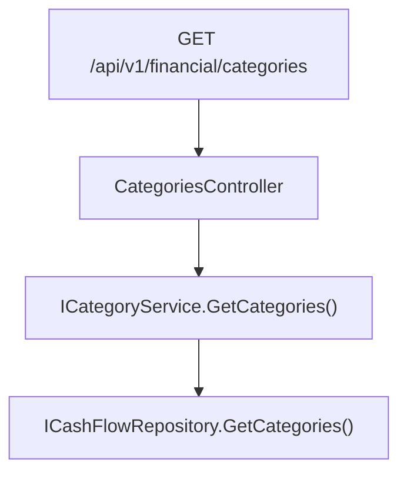

## 1. Technical Overview

**What:** A new `CategoriesController` exposes `GET /categories` (resolved as `/api/v1/financial/categories` under the API's route group), returning the full seeded category list — active and inactive — as `CategoryDTO[]`. No other HTTP verb is added: `Category` has no field editable through the API at all (per F01's design), so there is no `PUT`/`POST`/`DELETE`, unlike `CreditCard`'s equivalent controller.

**Why:** F01 seeded the entity and F02 wired `Expense` to reference it, but nothing outside the WPF app (which got a minimal in-process `ICategoryService` pulled forward in F02, purely to keep its hardcoded picklist compiling) can read the category list over HTTP yet. F04's web picklist and F06's spreadsheet-import reporting both need this endpoint. Since `ICategoryService`/`CategoryService` already exist (added in F02), this feature is almost entirely a thin controller wrapping an already-tested service — mirroring `CreditCardsController`'s `GET` action exactly, minus its `PUT`.

**Scope:**
- Included: `CategoriesController` with a single `GET /categories` action; its constructor null-guard unit test in the existing shared `ControllerGuardClauseTests`.
- Excluded: any update endpoint (no PRD capability requires one); any change to `ICategoryService`/`CategoryService` (already complete from F02); any UI changes (F04/F05).

## 2. Architecture Impact

**Affected components:**
- `Financial.Api/Controllers/CategoriesController.cs` (new) — `GET /categories`, delegates to the existing `ICategoryService.GetCategories()`



## 3. Technical Decisions

| Decision | Chosen Approach | Alternative Considered | Trade-off |
|----------|----------------|----------------------|-----------|
| Controller shape | Single `GET` action only, mirroring `CreditCardsController`'s read side but omitting its `PUT` entirely | Add a `PUT` now for parity with `CreditCard`/`Bank` controllers | The PRD is explicit: no field on `Category` is editable via any application-level mutator, and `ICategoryService` (added in F02) has no update method to call. Adding a `PUT` here would need a service method that doesn't exist and isn't requested — over-engineering for this personal app |
| Service layer | Reuse `ICategoryService`/`CategoryService` as-is (added in F02) | Add a new service specific to this controller | The F02 minimal service already does exactly what this endpoint needs (`GetCategories() => CategoryDTO[]`); duplicating it would violate DRY for no benefit |

## 4. Component Overview

**Backend:**

| File Path | New/Modified | Purpose | Key Responsibilities |
|-----------|--------------|---------|---------------------|
| `Financial.Api/Controllers/CategoriesController.cs` | New | Category read endpoint | `GET /categories` → `Ok(_categoryService.GetCategories())` |

**Tests:**

| File Path | New/Modified | Purpose | Key Responsibilities |
|-----------|--------------|---------|---------------------|
| `Tests/Financial.Api.Tests/Controllers/ControllerGuardClauseTests.cs` | Modified | Constructor null-guard coverage | Add `CategoriesController_NullService_Throws`, mirroring `CreditCardsController_NullService_Throws` |

## 5. API Contracts

**Endpoint: List Categories**
- **Method:** GET
- **Path:** `/api/v1/financial/categories`
- **Authentication:** None (matches every other endpoint in this personal-use API)

**Request:** No parameters.

**Response (Success - 200):**

| Field | Type | Description |
|-------|------|--------------|
| `id` | `uuid` | Category identifier |
| `name` | `string` | Category name |
| `active` | `bool` | Whether the category accepts new expenses |
| `isInvestment` | `bool` | Whether this is the investment classification |
| `isTithe` | `bool` | Whether this is the tithe classification |

**Response Example:**
```json
[
  { "id": "8f3b1c1a-2e3a-4b1a-9a7f-600000000008", "name": "Mercado", "active": true, "isInvestment": false, "isTithe": false },
  { "id": "8f3b1c1a-2e3a-4b1a-9a7f-600000000013", "name": "Investimento", "active": true, "isInvestment": true, "isTithe": false }
]
```

Returns all seeded categories, active and inactive alike (matching `GET /credit-cards`'s shape) — filtering to active-only is a client-side concern (F04/F05's picklists).

**Error Codes:** None beyond the framework default (this action cannot fail under normal operation — no input to validate, no missing-entity case).

## 6. Data Model

No change. Reads the same `Categories` collection already persisted by F01/F02.

## 7. Testing Strategy

**Test files:**

| Test File | Test Type | Target | Coverage Goal |
|-----------|-----------|--------|----------------|
| `Tests/Financial.Api.Tests/Controllers/ControllerGuardClauseTests.cs` | Unit | `CategoriesController` | Constructor throws `ArgumentNullException` when `ICategoryService` is null (per this codebase's convention: controllers are otherwise only covered by E2E, not unit tests, per `artifacts/controllers.md`) |
| `Tests/Financial.Api.Tests/CategoriesEndpointsTests.cs` | Integration (E2E via `ApiTestFactory`) | `GET /categories` | Returns all 14 seeded categories with correct `id`/`name`/`active`/`isInvestment`/`isTithe` values, including the seeded inactive/investment/tithe flags |

**Acceptance-criteria traceability (PRD Section 9, F03):**
- `GET /categories` returns all seeded categories including inactive ones → `CategoriesEndpointsTests`
- No POST/PUT/DELETE endpoint exists for categories → satisfied by construction (no such action exists on `CategoriesController`); no test needed beyond the above proving only `GET` is registered
