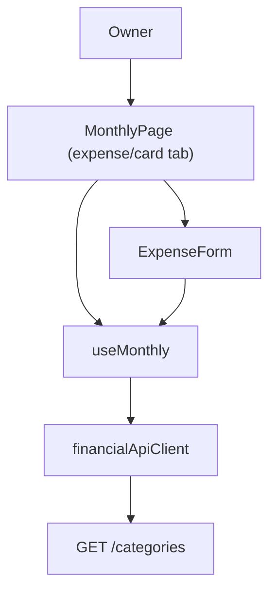

## 1. Technical Overview

**What:** Replaces `ExpenseForm.tsx`'s hardcoded 14-entry `CATEGORIES` array with categories fetched live from `GET /categories` (shipped in F03), filtered to `active === true`, and rewires the expense create/edit flow (`useMonthly.ts`, `MonthlyPage.tsx`) to submit the selected category's `Id` instead of its name — matching the `CategoryId`-based backend contract F02 already shipped.

**Why:** F02 renamed `Expense.Category` from an enum to an entity reference and `ExpenseCreateDTO`/`ExpenseUpdateDTO` now require `categoryId` (a `Guid`), not the old `category` name string. The frontend was never updated in that PR by design — F04 is the wave-3 feature responsible for closing that gap, per the PRD's execution-wave ordering (Wave 2: F01/F02/F03; Wave 3: F04/F05/F06). Until this ships, the deployed web app cannot create or edit an expense at all, since it still posts a `category` name string the API no longer accepts.

**Scope:**
- Included: `ExpenseDto`/`CreateExpenseDto`/`UpdateExpenseDto` catch-up to the `categoryId`/`categoryName` contract, a new `CategoryDto`, `getCategories()` on the API client, folding the category fetch into `useMonthly.ts`'s existing `Promise.all`, `ExpenseForm`'s dropdown switching to live active categories, `ExpensesSection.tsx`'s category column switching to the name field.
- Excluded (PRD Section 7 / F04's own scope): any Categories management UI (no grid, no create/edit/toggle) — `Active`/`IsInvestment`/`IsTithe` are set at seed time only; `CategoryTotalsGrid.tsx`/`AnnualSummaryPage.tsx` are explicitly unaffected — they keep consuming the existing name-based aggregate DTOs from F02.

## 2. Architecture Impact

**Affected components:**
- `Financial.Web/src/api/types.ts` (modified) — add `CategoryDto`; rename `ExpenseDto.category` → `categoryId`+`categoryName`; rename `CreateExpenseDto.category`/`UpdateExpenseDto.category` → `categoryId`
- `Financial.Web/src/api/financialApiClient.ts` (modified) — add `getCategories()`
- `Financial.Web/src/hooks/useMonthly.ts` (modified) — fetch categories inside the existing `Promise.all` (alongside `banks`/`incomeSources`, not a separate hook — see Decisions); rename `createCategory`/`editCategory` state and request fields to `createCategoryId`/`editCategoryId`; default `createCategoryId` to the first active category once fetched, mirroring the `createPaymentSource` default-bank pattern
- `Financial.Web/src/components/ExpenseForm.tsx` (modified) — drop hardcoded `CATEGORIES`, accept a `categories: CategoryDto[]` prop, rename `category` field to `categoryId`
- `Financial.Web/src/components/ExpensesSection.tsx` (modified) — `expense.category` → `expense.categoryName`
- `Financial.Web/src/pages/MonthlyPage.tsx` (modified) — derive `activeCategories = categories.filter(c => c.active)`, pass to `ExpenseForm`



## 3. Technical Decisions

| Decision | Chosen Approach | Alternative Considered | Trade-off |
|----------|----------------|----------------------|-----------|
| Where categories are fetched | Fold `getCategories()` into `useMonthly.ts`'s existing `Promise.all`, alongside `banks`/`incomeSources` | A new standalone `useCategories()` hook, mirroring `useCreditCards` | `Category` has zero update/mutation capability (no PUT endpoint exists, per F03) — the only reason `useCreditCards` is a separate hook is to hold its own update/error/`updatingCardId` state, which `Category` will never need. `Banks`/`IncomeSources` are the closer precedent: read-only reference data already fetched inline in `useMonthly`'s own `Promise.all` |
| Category dropdown ordering | No display-order override; render categories in the order the API returns them | An `INCOME_SOURCE_DISPLAY_ORDER`-style hardcoded reorder | F01's seed migration inserts categories in the exact order the PRD's Experience text says the dropdown should preserve (`Ariana, Carro, Casa, Estudo, Extras, Familia, Gleison, Mercado, Samuel, Saude, Viagem, Dizimo, Investimento, Reserva`), and F02's `AnnualSummaryService` already relies on `GetCategories()` preserving seed order — no reordering logic is needed on the frontend |
| Active filtering | Caller (`MonthlyPage.tsx`) filters to `active === true` before passing to `ExpenseForm`, exactly like `activeCreditCards` | Filter inside `ExpenseForm` itself | Matches the established convention in this exact component: `creditCards` is already filtered by the caller, not internally, keeping `ExpenseForm` a pure presentational component |
| `ExpenseDto`/`CreateExpenseDto`/`UpdateExpenseDto` renames | Full `category`→`categoryId`(+`categoryName` on the read DTO) rename as part of this feature, not a separate cleanup | Leave the legacy `category` name field and add `categoryId` alongside | The backend no longer emits/accepts a `category` string at all (F02 removed it) — the frontend is currently broken against `main`'s API; there is no working "leave it" option |
| Default category on new-expense form | Mirror the existing `defaultBankStillUnset` pattern in `FETCH_SUCCESS`: `createCategoryId` defaults to the first fetched active category's Id only while still unset | Hardcode a default category name/Id | Matches the exact precedent already in `useMonthly.ts` for `createPaymentSource`/`createIncomeSource` — no new pattern introduced |

## 4. Component Overview

**Frontend:**

| File Path | New/Modified | Purpose | Key Responsibilities |
|-----------|--------------|---------|---------------------|
| `Financial.Web/src/api/types.ts` | Modified | Contracts | Add `CategoryDto { id, name, active, isInvestment, isTithe }`; rename `category`→`categoryId`+`categoryName` on `ExpenseDto`; rename `category`→`categoryId` on `CreateExpenseDto`/`UpdateExpenseDto` |
| `Financial.Web/src/api/financialApiClient.ts` | Modified | HTTP calls | `getCategories(): Promise<CategoryDto[]>` |
| `Financial.Web/src/hooks/useMonthly.ts` | Modified | State + fetch | Add `categories: CategoryDto[]` to state/`Promise.all`/`FETCH_SUCCESS`; rename `createCategory`/`editCategory` → `createCategoryId`/`editCategoryId` throughout state, reducer, `BLANK_CREATE_FORM`, `submitCreate`/`saveEdit` request bodies; default `createCategoryId` on fetch success while unset |
| `Financial.Web/src/components/ExpenseForm.tsx` | Modified | Category dropdown | Drop hardcoded `CATEGORIES`; accept `categories: CategoryDto[]` prop (already filtered to active by caller); render `<option value={c.id}>{c.name}</option>`; field renamed `category`→`categoryId` |
| `Financial.Web/src/components/ExpensesSection.tsx` | Modified | Expense list | `expense.category` → `expense.categoryName` |
| `Financial.Web/src/pages/MonthlyPage.tsx` | Modified | Tab composition | Derive `activeCategories = categories.filter(c => c.active)`; pass to `ExpenseForm`; update `CREATE_FIELD_BY_FORM_FIELD`/`EDIT_FIELD_BY_FORM_FIELD` maps for the renamed field |

## 5. API Contracts

Endpoint already exists server-side (F03); this section documents the frontend contract the client code must match exactly.

**Endpoint: List Categories**
- **Method:** GET
- **Path:** `/categories`

**Response Example:**
```json
[
  { "id": "8f3b1c1a-2e3a-4b1a-9a7f-600000000008", "name": "Mercado", "active": true, "isInvestment": false, "isTithe": false },
  { "id": "8f3b1c1a-2e3a-4b1a-9a7f-600000000013", "name": "Investimento", "active": true, "isInvestment": true, "isTithe": false }
]
```

**Error Codes:** None beyond the framework default — this endpoint has no input to fail on.

## 6. Data Model

No new tables/columns — this feature is presentation-only, consuming the F01/F03 `Category` contract as-is.

## 7. Testing Strategy

**Test File Structure:**

| Test File | Test Type | Target | Coverage Goal |
|-----------|-----------|--------|----------------|
| `Financial.Web/src/api/financialApiClient.test.ts` | Unit | `getCategories` | Extend existing file |
| `Financial.Web/src/hooks/useMonthly.test.ts` | Hook | Fetch + create/edit submit payload | Update existing assertions: `categories` populated from fetch, `createCategoryId` defaults to first active category, `submitCreate`/`saveEdit` send `categoryId` not `category` |
| `Financial.Web/src/components/__tests__/ExpenseForm.test.tsx` | Component | Category dropdown | Update existing tests for the `categories` prop / `categoryId` field |
| `Financial.Web/src/components/__tests__/ExpensesSection.test.tsx` | Component | Expense list rendering | Update existing assertions for `categoryName` |
| `Financial.Web/src/pages/__tests__/MonthlyPage.test.tsx` | Page | Active-filtering integration | Update/extend existing assertions to cover `activeCategories` passed to `ExpenseForm`, mirroring the existing active-credit-card-filtering test |

**For each test file, list functions:**

| Test Function | Description | Assertions |
|---------------|--------------|------------|
| `getCategories_fetchesCategoriesList` | API client GET | Correct URL (`/categories`), response shape parsed |
| `useMonthly_fetchSuccess_populatesCategories` | Hook fetch | `categories` state populated from `getCategories()` response |
| `useMonthly_fetchSuccess_defaultsCreateCategoryIdToFirstActiveCategory` | Hook default-selection | Mirrors the existing default-bank test; only applies while `createCategoryId` is still unset |
| `useMonthly_submitCreate_sendsCategoryId` | Hook submit payload | `createExpense` called with `categoryId`, not `category` |
| `useMonthly_saveEdit_sendsCategoryId` | Hook submit payload | `updateExpense` called with `categoryId`, not `category` |
| `ExpenseForm_categoryDropdown_rendersOnlyActiveCategoriesPassedIn` (acceptance: "Expense form category dropdown shows only active categories fetched from the API") | Component render | Options match the `categories` prop (caller already filters to active) |
| `ExpenseForm_selectingCategory_submitsCategoryId` (acceptance: "Selecting a category submits its Id, not its name") | Component interaction | Selected option's `id` (not name) is what's passed up via `onFieldChange` |
| `ExpensesSection_rendersCategoryName` | Component render | Grid cell shows `categoryName`, not a raw Id |
| `MonthlyPage_expenseForm_receivesOnlyActiveCategories` | Page integration | `activeCategories` (filtered from the fetched `categories` list) is what reaches `ExpenseForm`, mirroring the existing active-credit-card assertion |

Acceptance criterion "Category totals/annual summary views continue to render correctly using name-based data, unaffected by the dropdown change" requires no new test — `CategoryTotalsGrid.tsx`/`AnnualSummaryPage.tsx` are untouched by this feature and their existing test suites are left as-is; satisfied by construction (no changes to those files).
