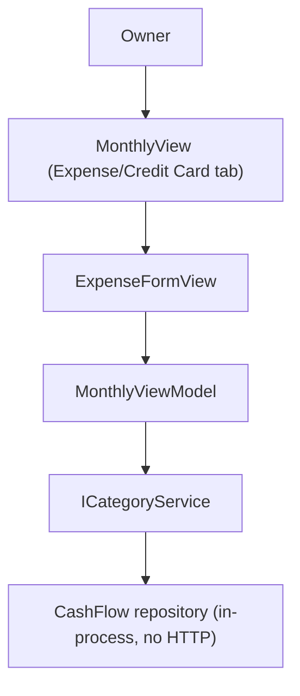

## 1. Technical Overview

**What:** Catches the WPF desktop client's category picklist up to the `CategoryId`-based contract F02/F03 already shipped. `MonthlyViewModel` currently exposes a hardcoded static `Categories` string list (`CategoryOptions`) and resolves the selected name to an Id at save time by scanning `ICategoryService.GetCategories()` — a compile-compat shim added in F02 purely so the app kept building. This feature replaces that shim with a real `ObservableCollection<CategoryDTO>` fetched during the existing `RefreshAsync`, filtered to active for the expense-entry picker, and rewires the form to carry a `Guid?` Id end to end instead of a name string.

**Why:** Same shape as the web sibling feature (F04), and the same root cause as P29-F05 (WPF credit cards): the Application/API layer already exposes everything needed (`ICategoryService.GetCategories()`, added in F02), so this is UI wiring only — no backend/Application/Domain change. Unlike Credit Card, `Category` has no update capability at all (per F01's design — no PUT endpoint, no update method anywhere), so there is no new grid, no due-date/active-toggle editing, and no new service method to add.

**Scope:**
- Included: `MonthlyViewModel.Categories`/`CategoryOptions` (static hardcoded list) replaced with an `ObservableCollection<CategoryDTO> Categories` fetched via `ICategoryService.GetCategories()` inside the existing `RefreshAsync`, and an `ActiveCategories` computed property (mirrors `ActiveCreditCards`) for the expense-entry picker; `ExpenseFormCategory` (`string`) renamed to `ExpenseFormCategoryId` (`Guid?`); `ExpenseFormValidation.BuildValidationMessage`'s `category` param becomes `categoryId: Guid?`; `SaveExpenseAsync`'s name-lookup-or-throw removed in favor of the already-validated Id.
- Excluded (per F01's design, mirrored from the PRD's F05 scope): any Categories management grid, any due-date/active-toggle UI — Category has no editable fields via any application-level mutator; the two credit-card `CardTag`/`Card` XAML fixes from P29-F05 are unrelated to this feature and already shipped.

## 2. Architecture Impact

**Affected components:**
- `Financial.App/ViewModels/CashFlow/MonthlyViewModel.cs` (modified) — replace the static `Categories`/`CategoryOptions` pair with an instance `ObservableCollection<CategoryDTO> Categories` populated in `RefreshAsync`; add `ActiveCategories`; rename `ExpenseFormCategory`(`string`) → `ExpenseFormCategoryId`(`Guid?`); `ShowCreateExpenseForm` defaults it to the first active category; `ShowEditExpenseForm` sets it from `expense.CategoryId`; `SaveExpenseAsync` uses it directly instead of the name lookup
- `Financial.App/ViewModels/CashFlow/ExpenseFormValidation.cs` (modified) — `category: string` param → `categoryId: Guid?`
- `Financial.App/Views/CashFlow/ExpenseFormView.xaml` (modified) — Category `ComboBox` switches from `ItemsSource=CategoryOptions`/`SelectedItem` to `ItemsSource=ActiveCategories`/`DisplayMemberPath=Name`/`SelectedValuePath=Id`/`SelectedValue`, mirroring the Card `ComboBox` immediately below it



## 3. Technical Decisions

| Decision | Chosen Approach | Alternative Considered | Trade-off |
|----------|----------------|----------------------|-----------|
| Where categories are fetched | Fold into the existing `RefreshAsync`'s `Task.WhenAll`, alongside `Banks`/`IncomeSources` (an `ObservableCollection<CategoryDTO> Categories`) | A dedicated per-tab fetch like `CreditCards` | `Category` has zero update capability — the only reason `CreditCards` needed its own tracked collection with update plumbing was `UpdateCreditCardAsync`. `Banks`/`IncomeSources` are the closer precedent: read-only reference data already loaded in the same `RefreshAsync`. Matches the web sibling feature's (F04) identical decision |
| Active filtering | `ActiveCategories => Categories.Where(c => c.Active)` computed property, mirroring `ActiveCreditCards => CreditCards.Where(c => c.IsActive)` exactly | A `CollectionViewSource` filter in XAML | Matches the established in-class pattern for this exact kind of derived, always-fresh filtered view |
| Default category on new-expense form | `ShowCreateExpenseForm` sets `ExpenseFormCategoryId = ActiveCategories.FirstOrDefault()?.Id`, mirroring `ExpenseFormPaymentSource`'s `Banks.Count > 0 ? Banks[0].Id : null` default | Leave it null until the user picks one | Matches the existing precedent for the Payment Source picker one field below it; the ComboBox always has a visible selection on open |
| Resolving the selected category on save | `SaveExpenseAsync` uses `ExpenseFormCategoryId` (already required by validation) directly — no more name lookup against `GetCategories()` | Keep the string name and resolve to Guid at save time (current F02 shim behavior) | Removes the exact class of bug F02's shim was always meant to be temporary about (ambiguous/renamed names); matches how `ExpenseFormCreditCardId` already works |

## 4. Component Overview

**Frontend (presentation layer, no Application/Domain changes):**

| File Path | New/Modified | Purpose | Key Responsibilities |
|-----------|--------------|---------|---------------------|
| `Financial.App/ViewModels/CashFlow/MonthlyViewModel.cs` | Modified | ViewModel | `Categories` (`ObservableCollection<CategoryDTO>`) + `ActiveCategories`; `ExpenseFormCategoryId : Guid?`; `RefreshAsync` fetches and populates `Categories`; `ShowCreateExpenseForm`/`ShowEditExpenseForm`/`SaveExpenseAsync` updated for the Id-based field |
| `Financial.App/ViewModels/CashFlow/ExpenseFormValidation.cs` | Modified | Validation | `categoryId is null` check replaces the blank-string check |
| `Financial.App/Views/CashFlow/ExpenseFormView.xaml` | Modified | Category picker | `ComboBox` bound to `ActiveCategories`/`ExpenseFormCategoryId` by Id |

**Database:** None — presentation-only, consuming the F01/F02/F03 `Category` contract as-is.

## 5. API Contracts

No new contracts — consumes the existing in-process `ICategoryService`:
```csharp
IReadOnlyList<CategoryDTO> GetCategories();
```

## 6. Data Model

None.

## 7. Testing Strategy

**Test File Structure:**

| Test File | Test Type | Target | Coverage Goal |
|-----------|-----------|--------|----------------|
| `Tests/Financial.Presentation.Tests/ViewModels/CashFlow/MonthlyViewModelCategoriesTests.cs` | Unit | `MonthlyViewModel` category behavior | New file, mirrors `MonthlyViewModelCreditCardsTests.cs`'s first two tests (no update tests — Category has no update method) |
| `Tests/Financial.Presentation.Tests/ViewModels/CashFlow/MonthlyViewModelTests.cs` | Unit | Existing expense create/edit tests referencing `ExpenseFormCategory`/`CategoryOptions` | Update in place to the Id-based contract; remove `CategoryOptions_ExposesStaticListAsInstanceMember` (the static list it tests no longer exists) |
| `Tests/Financial.Presentation.Tests/ViewModels/CashFlow/ExpenseFormValidationTests.cs` | Unit | `ExpenseFormValidation.BuildValidationMessage` | Update the missing-category case to pass `null` instead of an empty string |

**For each test file, list functions:**

| Test Function | Description | Assertions |
|---------------|--------------|------------|
| `RefreshAsync_PopulatesCategories` | Load happy path | `Categories` populated from the stub |
| `ActiveCategories_ExcludesInactiveCategories` (acceptance: "WPF expense entry category dropdown shows only active categories fetched from the API") | Filter | Inactive category excluded from `ActiveCategories`, present in `Categories` |
| `SaveExpenseAsync_SendsSelectedCategoryId` (acceptance: "Selecting a category submits its Id, not its name") | Create/edit happy path | `AddExpenseAsync`/`UpdateExpenseAsync` called with the `ComboBox`-selected `CategoryId`, no more name lookup |
| `MissingCategoryId_ReturnsError` | Validation | `ExpenseFormValidation.BuildValidationMessage` with `categoryId: null` returns "Category is required." |

Existing tests in `MonthlyViewModelTests.cs` that set `ExpenseFormCategory` or assert on `CategoryOptions` are updated in place, not duplicated.
