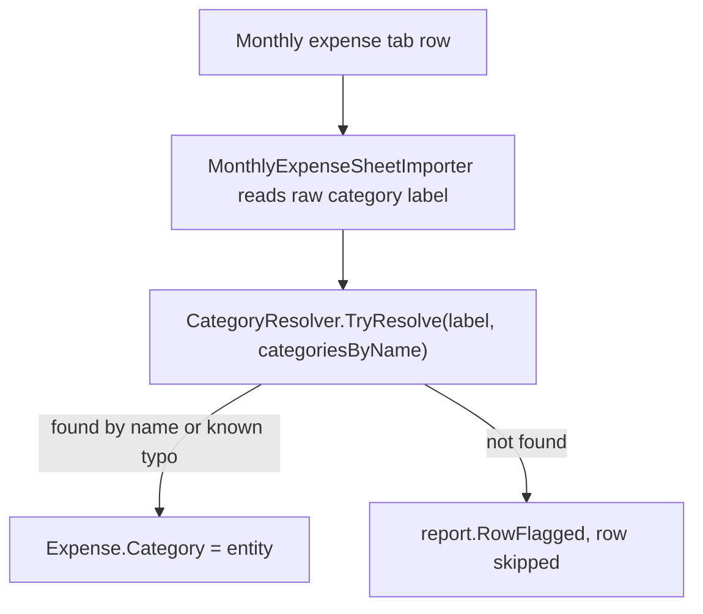

## 1. Technical Overview

**What:** Removes the last functional dependency on the legacy `CashFlow.Domain.Enums.Category` enum from `MonthlyExpenseSheetImporter`'s live import path. `CategoryResolver.TryResolve` changes from resolving a raw spreadsheet label to a `Category` enum value (via `CategoryParser`'s enum parse) to resolving directly against the seeded `Category` entities by name — mirroring `MonthlyExpenseSheetImporter`'s existing `cardsByName` dictionary pattern for `CreditCard` (shipped in P29-F06). The importer's call site drops its enum-to-entity round-trip (`categoriesByName.TryGetValue(legacyCategory.ToString(), ...)`), which was F02's explicit compat shim for this exact follow-up.

**Why:** F02's spec deferred this on purpose (mirrors F02's `MonthlyExpenseSheetImporter` comment: "Row-position-to-card resolution still happens by legacy enum name here; F06 replaces this lookup mechanism with a direct by-name entity resolution" — the same sentence pattern applies to `CategoryResolver`). Today the importer still round-trips every resolved category through the enum before the entity lookup; removing that round-trip closes the PRD's "no part of the application should depend on the Category enum... including migration and import/export tools" objective for the one remaining call site.

**Scope:**
- Included: `CategoryResolver.TryResolve` signature changes from `(string? rawLabel, out Category category)` to `(string? rawLabel, IReadOnlyDictionary<string, Category> categoriesByName, out Category? category)` — same typo-tolerance mechanism (the `"Casas"` → `"Casa"` mapping), but resolving directly to the entity; `MonthlyExpenseSheetImporter.Import` drops the `legacyCategory.ToString()` round-trip and passes its existing `categoriesByName` dictionary straight through.
- Excluded: `EntityReferenceMigrator.cs` — see **Deviation from PRD text** below, no change needed; `ColumnResolver.IsCategoryColumn`'s use of the enum-based `CategoryParser` as a column-detection heuristic — unrelated to Expense creation, out of scope per the PRD's Capabilities text (which names only `CategoryResolver`); removing the `Category` enum itself entirely (a follow-up chore once F06 ships, mirroring P29's separate `d58b9c9` enum-removal commit after its own F06).

**Deviation from PRD text:** The PRD's Capabilities bullet says *"`EntityReferenceMigrator`'s `Enum.Parse<Category>` call for legacy `Expense.Category` reads is replaced with a name-based entity lookup... and aborts the one-time migration run on any unresolved name."* This describes a state that predates F02's actual implementation: `EntityReferenceMigrator.MigrateExpenses` already reads the legacy `Category` property as a raw string (`item.GetProperty("Category").GetString()!`, no `Enum.Parse` anywhere in the file) and resolves it against a `categoriesByName` dictionary, **flagging and skipping** an unresolved row via `summary.FlagUnresolvedExpense` — not aborting. This flag-and-skip policy was a deliberate F02 decision (consistent with how the same migrator treats an unresolved `PaymentSource`/`CardTag`), not an oversight, and changing it to abort now would be a regression, not a fix. No `EntityReferenceMigrator` change is included in this feature.

## 2. Architecture Impact

**Affected components:**
- `Integrations/CashFlowSpreadsheetImport/Parsing/CategoryResolver.cs` (modified)
- `Integrations/CashFlowSpreadsheetImport/SheetImporters/MonthlyExpenseSheetImporter.cs` (modified)

## 3. Technical Decisions

| Decision | Chosen Approach | Alternative Considered | Trade-off |
|----------|----------------|----------------------|-----------|
| Unresolved category handling | Unchanged — flag the row via `report.RowFlagged` and skip creating that row's expense (`continue`) | Any new abort/throw behavior | This is purely a mechanism swap inside an already-correct flag-and-skip code path (per F02's Error Handling and this PRD's own Error Handling section); no behavior change is in scope |
| `CategoryResolver`'s typo dictionary value type | `Dictionary<string, string>` (typo label → correct name), looked up against `categoriesByName` afterward | Keep a `Dictionary<string, Category>` (enum) and convert at the end | The whole point of this feature is removing the enum from this file; a typo dictionary keyed by corrected *name* composes cleanly with the by-name entity lookup already needed for the non-typo path |
| `EntityReferenceMigrator.cs` | No change (see Deviation above) | Rewrite its flag-and-skip to abort, per the PRD's literal text | Verified via `grep` that no `Enum.Parse<Category>` exists in this file — the PRD bullet describes pre-F02 code that was already superseded; keeping the tested, shipped flag-and-skip behavior is correct, not a shortcut |

## 4. Component Overview

**Backend:**

| File Path | New/Modified | Purpose | Key Responsibilities |
|-----------|--------------|---------|---------------------|
| `Integrations/CashFlowSpreadsheetImport/Parsing/CategoryResolver.cs` | Modified | Label resolution | `TryResolve(rawLabel, categoriesByName, out category)` — direct name lookup + typo-tolerance, no enum |
| `Integrations/CashFlowSpreadsheetImport/SheetImporters/MonthlyExpenseSheetImporter.cs` | Modified | Row import | Calls `CategoryResolver.TryResolve` with its existing `categoriesByName` dictionary directly; drops the enum round-trip |

**Tests:**

| File Path | New/Modified | Purpose | Key Responsibilities |
|-----------|--------------|---------|---------------------|
| `Tests/Financial.CashFlowSpreadsheetImport.Tests/Parsing/CategoryResolverTests.cs` | Modified | Unit coverage | Update all 4 existing tests for the new `categoriesByName`-based signature; assertions switch from enum equality to entity reference equality |
| `Tests/Financial.CashFlowSpreadsheetImport.Tests/SheetImporters/MonthlyExpenseSheetImporterTests.cs` | Unmodified | Regression coverage | Existing `Import_UnrecognizedCategory_SkipsExpenseAndFlagsRow`/`Import_KnownTypoCasas_ResolvesToCasaCategory` already assert against the entity-based `Category.Name` — confirmed to still pass unchanged, proving the mechanism swap is behavior-preserving |

## 5. API Contracts

None — this feature has no HTTP surface.

## 6. Data Model

None.

## 7. Testing Strategy

**Test files:**

| Test File | Test Type | Target | Coverage Goal |
|-----------|-----------|--------|----------------|
| `Tests/Financial.CashFlowSpreadsheetImport.Tests/Parsing/CategoryResolverTests.cs` | Unit | `CategoryResolver.TryResolve` | Known name resolves; known typo resolves; unknown label fails; blank label fails — all against a `categoriesByName` fixture instead of the enum |
| `Tests/Financial.CashFlowSpreadsheetImport.Tests/SheetImporters/MonthlyExpenseSheetImporterTests.cs` | Regression (unchanged) | `MonthlyExpenseSheetImporter.Import` | Re-run as-is to confirm no behavior change: unrecognized category still flags and skips the row; the historical `"Casas"` typo still resolves to `Casa` |

**Acceptance-criteria traceability (PRD Section 9, F06):**
- "Spreadsheet import resolves each row's category label by name against seeded Category entities, including existing typo-tolerance mappings" → `CategoryResolverTests` + `MonthlyExpenseSheetImporterTests.Import_KnownTypoCasas_ResolvesToCasaCategory`
- "A row whose inferred category label has no matching seeded entity is flagged and skipped, consistent with today's behavior" → `MonthlyExpenseSheetImporterTests.Import_UnrecognizedCategory_SkipsExpenseAndFlagsRow`
- "Imported expenses store the correct Category Id reference matching the entity resolved by name" → satisfied by construction (`Expense.Create` already takes the resolved `Category` entity; existing importer tests assert `expense.Category.Name`)
- "The one-time `EntityReferenceMigrator` aborts with a clear error if a legacy `Expense.Category` enum value has no matching seeded Category name" → not applicable; see Deviation from PRD text above — `EntityReferenceMigratorTests` already covers its actual (flag-and-skip) behavior and is unchanged by this feature
