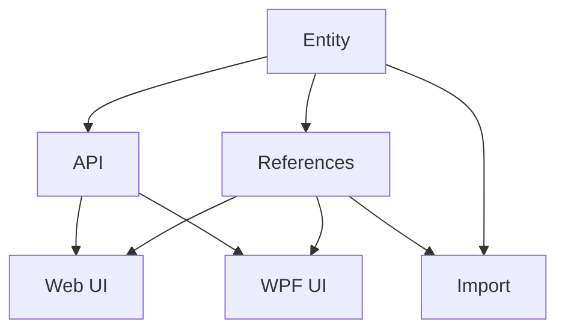

# Category Entity

## 1. Executive Summary

Category Entity introduces a first-class `Category` domain entity into the Financial app, a personal finance tool used by its owner to track income, expenses, and investments across UK and Brazil accounts. Today, valid expense categories are defined as a hardcoded C# enum duplicated across three places in the codebase (the domain layer, the WPF desktop app, and the React web app), with no way to track whether a category is still active, and with two special-case categories ("Investimento" and "Dizimo") hardcoded by name in scattered pieces of business logic. This feature replaces that enum with a seeded, referenceable entity — following the exact pattern already established for `Bank` and `CreditCard` — giving the app a single source of truth for known categories, a lifecycle flag that blocks new entries against retired categories, and two classification flags (`IsInvestment`, `IsTithe`) that make the investment and tithe special cases explicit entity data instead of enum literal comparisons.

At a high level, the entity is seeded once via a migration tool (the 14 existing categories, carried over by name, with `IsInvestment` set only on "Investimento" and `IsTithe` set only on "Dizimo"), then referenced by `Expense` records instead of the old enum. A read-only API exposes the category list so both the web and WPF expense-entry forms can switch from hardcoded dropdowns to fetching it live, filtered to active categories. The spreadsheet importer is updated to resolve categories by name against the seeded entities instead of parsing enum literals. Unlike `CreditCard`, no field on `Category` is editable after seeding — there is no update endpoint or management UI in this PRD; changing a category's `Active`, `IsInvestment`, or `IsTithe` flag after migration requires a direct edit to the underlying JSON data file.

## 2. Problem and Opportunity

**The Problem**

- **Duplicated, hardcoded category lists**
  - The same 14 category names are hardcoded in 3 separate places: the domain enum, the WPF `MonthlyViewModel`, and the React `ExpenseForm` — any category change means editing and redeploying 3 codebases in lockstep.
  - No API ever exposes the valid category list, so the two UI clients can silently drift out of sync if one is updated and the other isn't.

- **No category lifecycle tracking**
  - There is no active/inactive flag, so a retired category remains selectable in every expense-entry dropdown forever.
  - Nothing in the domain model prevents a new expense from being tagged to a category that's no longer in use.

- **Special-case classification logic scattered and enum-coupled**
  - `CategoryClassifier.IsInvestment(this Category)` and `TitheService`'s `e.Category == Category.Dizimo` check both hardcode a single enum literal to decide whether an expense counts toward investment or tithe totals — fragile, and impossible to keep once the enum is gone.
  - `AnnualSummaryService` iterates `Enum.GetValues<Category>()` twice to build category series/averages, tightly coupling annual reporting to the enum's exact member list.

- **Fragile spreadsheet import**
  - `CategoryResolver` depends entirely on `CategoryParser.TryParse` (an enum parse) plus a hardcoded single-entry typo dictionary (`"Casas"` → `Casa`) — any category rename silently breaks import.
  - There is no seeded, referenceable source of truth an import label can be validated against — only the enum's literal names.

**The Opportunity**

Converting `Category` into a seeded entity (F01) gives the app one source of truth, closing the 3-way duplication problem once the web and WPF pickers switch to fetching it live (F04, F05). Adding an `Active` flag enforced at the point of new-expense creation (F02) closes the lifecycle gap — retired categories simply stop appearing as options while their history stays intact. Adding `IsInvestment` and `IsTithe` as real entity fields (F01, F02) closes the classification gap: `CategoryClassifier` and the hardcoded `Category.Dizimo` comparison are deleted entirely, replaced by direct flag checks on the referenced entity, and `AnnualSummaryService` iterates the seeded category list instead of enum values. Finally, having the importer resolve categories by name against real entities (F06) keeps today's import behavior working without any dependency on the enum.

## 3. Target Audience

### Primary Users

**The App Owner**
- Personal user of the Financial app who enters and reviews their own expenses monthly
- Wants an accurate, current list of their real categories when tagging expenses — not a stale hardcoded list that still shows a retired category
- Is comfortable editing the underlying JSON data file directly on the rare occasion a category needs to be deactivated or reclassified, since this is a personal single-user tool with no need for a dedicated management screen

## 4. Objectives

- **Eliminate** duplicate hardcoded category lists across WPF, React, and the domain enum by sourcing all pickers from one seeded entity list. Metric: hardcoded category-name arrays go from 3 to 0, verified by confirming no literal category-name array remains outside the migration's seed data.
- **Prevent** new entries against inactive categories. Metric: 100% of new-expense pickers exclude inactive categories, verified by deactivating a seeded category via a direct data-file edit and confirming it no longer appears in either UI's dropdown.
- **Replace** enum-coupled classification logic with entity-based flags. Metric: zero references to `CategoryClassifier` or the `Category` enum remain anywhere in the solution (including migration and import/export tools), verified by a full-solution search returning no matches.
- **Preserve** historical accuracy after a category is deactivated. Metric: 100% of existing `Expense` records referencing a since-deactivated category remain visible, unchanged, in historical and annual summary views.

## 5. User Stories

### F01. Category Domain Entity & Seed Migration
- As the system, I want to persist a list of Category entities so that category data has a single source of truth
- As the system, I want to seed the 14 existing categories (Ariana, Carro, Casa, Estudo, Extras, Familia, Gleison, Mercado, Samuel, Saude, Viagem, Dizimo, Investimento, Reserva) as active entities, with `IsInvestment` set only on Investimento and `IsTithe` set only on Dizimo, so existing data keeps working after migration
- As the system, I want to migrate legacy enum-only records so that no manual data cleanup is required after deployment

### F02. Migrate Expense & Domain Logic to Category References
- As a user, I want new expenses to reference a real Category entity so the app can validate the category is active before letting me tag an expense to it
- As a user, I want to be blocked from tagging a new expense to an inactive category so I can't accidentally post to a retired category
- As the system, I want an expense's investment status derived from its Category's `IsInvestment` flag instead of the deleted `CategoryClassifier`
- As the system, I want the tithe calculation to use a Category's `IsTithe` flag instead of a hardcoded enum comparison
- As the system, I want annual summary totals built from the full seeded category list instead of enumerating the deleted enum's values
- As the system, I want existing Expense.Category enum values migrated to entity references so historical records remain intact and queryable

### F03. Read API Endpoint
- As a user, I want to fetch the list of categories via API so that both web and WPF clients can build dynamic picklists

### F04. Web: Dynamic Picklist
- As a user, I want the expense form's category dropdown to show only active categories fetched from the API so I never see stale or retired options

### F05. WPF: Dynamic Picklist
- As a user, I want the WPF expense entry category dropdown to show only active categories fetched from the API so it matches the web app's behavior

### F06. Spreadsheet Import Category Resolution
- As the system, I want the spreadsheet importer to resolve category labels by name against seeded Category entities instead of parsing enum literals so imported expenses reference the correct entity
- As the system, I want an unresolved category label to be flagged and skipped, consistent with today's behavior, so a single bad label doesn't abort an otherwise valid import

## 6. Functionalities

### F01. Category Domain Entity & Seed Migration

**Provides:**
- Category entities (Id, Name, Active, IsInvestment, IsTithe) (used by F02, F03, F06)

**Capabilities:**
- Fields: `Id` (Guid, generated), `Name` (string, required, unique, max 100 chars), `Active` (bool, default true), `IsInvestment` (bool, default false), `IsTithe` (bool, default false)
- Entity created via a static factory (`Category.Create(name, isInvestment, isTithe, isActive)`), private setters, no public parameterless constructor — mirrors `Bank`/`CreditCard`
- No update methods of any kind — `Active`, `IsInvestment`, and `IsTithe` are fixed at creation; there is no domain, application, or API-level way to change them post-seed, only a direct edit to the underlying JSON data file
- Persisted as part of the `CashFlowData` aggregate (`List<Category>`, `AddCategory`), no remove operation — categories are permanent reference data, matching Bank/CreditCard
- Registered in `CashFlowTypeInfoResolver`'s `ManagedTypes` with a `CategoryReferenceConverter` (wire name `"CategoryId"`), following `BankReferenceConverter`/`CreditCardReferenceConverter` exactly
- Migration seeds exactly 14 categories with today's existing enum names: `Ariana`, `Carro`, `Casa`, `Estudo`, `Extras`, `Familia`, `Gleison`, `Mercado`, `Samuel`, `Saude`, `Viagem`, `Dizimo`, `Investimento`, `Reserva` — all `Active=true`; `IsInvestment=true` only for `Investimento`; `IsTithe=true` only for `Dizimo`; all other flags false for the remaining 12
- Migration is idempotent — running it twice does not create duplicate categories (matches `BankMigrator`/`CreditCardMigrator` name-based dedup pattern)

**Experience:**
- No direct UI in this feature — purely domain, infrastructure, and a one-time migration tool
- Migration runs once via the existing `CashFlowSpreadsheetImport` console entry point, logging each category created or skipped

### F02. Migrate Expense & Domain Logic to Category References

**Consumes:**
- F01: Category entities (Id, Name, Active, IsInvestment, IsTithe) for reference resolution and classification

**Provides:**
- Expense records referencing Category by Id — `Expense.Category` changes from the enum to a non-nullable reference to the `Category` entity, and `ExpenseCreateDTO`/`ExpenseUpdateDTO` expose it as `CategoryId` (`Guid`, required), replacing the old `Category` string field; `ExpenseDTO` exposes both `CategoryId` (`Guid`) and `CategoryName` (`string`), matching the existing `PaymentSourceBankName`/`CreditCardName` pattern (used by F04, F05, F06)

**Capabilities:**
- `Expense.Category` changes from `Category` (enum, non-nullable) to a non-nullable reference to the `Category` entity, using the same reference-converter pattern as `PaymentSourceBank`/`CreditCard` (wire name `"CategoryId"`, consistent with F01)
- New or updated expenses may only reference an active `Category`; attempting to create or update an expense with an inactive category's Id is rejected
- `Expense.IsInvestment` is derived directly from `Expense.Category.IsInvestment`, replacing the `CategoryClassifier.IsInvestment(this Category)` extension method, which is deleted along with its file
- `TitheService.GetTitheSummary` computes `dizimoTotal` by filtering expenses where `Expense.Category.IsTithe` is true, replacing the hardcoded `e.Category == Category.Dizimo` comparison
- `AnnualSummaryService`'s two `Enum.GetValues<Category>()` call sites are replaced with a query over the full seeded category list (including inactive categories, so historical totals for a since-deactivated category remain complete); its Investimento-specific branch is replaced with a query filtered by `IsInvestment`
- `CategoryTotalDTO`, `CategoryAnnualTotalDTO`, `CategoryGroupValueDTO`, `CategoryAnnualGroupValueDTO`, `CategoryTotalsAnnualDTO` continue to expose category by name (`string`) for display — unchanged shape, since these are read-only aggregate views, not entity references
- A data migration step (extending `EntityReferenceMigrator`, mirroring its existing `ReadLegacyBanks`/`banksByName` pattern) converts every existing `Expense.Category` enum value to the matching seeded `Category`'s Id, matched by name
- `CategoryNameResolver` (mirroring `BankNameResolver`/`CreditCardNameResolver`) replaces `CategoryParser` for resolving a category by Id against the seeded list

**Experience:**
- No new UI in this feature — this is the reference-model rewire underneath; F04/F05 build the picklists on top of it

**Error Handling:**
- Creating/updating an expense with a `CategoryId` that doesn't match any seeded Category → reject with "Unknown category" validation error
- Creating/updating an expense with a `CategoryId` matching an inactive Category → reject with "Category '{name}' is inactive and cannot be used for new entries"
- Data migration encountering an enum value with no matching seeded Category name → migration aborts with a clear error listing the unmatched value, rather than silently dropping the reference

### F03. Read API Endpoint

**Consumes:**
- F01: Category entities (Id, Name, Active, IsInvestment, IsTithe)

**Provides:**
- Category list (Id, Name, Active, IsInvestment, IsTithe) (used by F04, F05)

**Capabilities:**
- `GET /categories` — returns all seeded categories, active and inactive, mirroring `GET /credit-cards`'s shape
- No POST/PUT/DELETE — categories are seed-only and fully immutable at the API level, consistent with F01's "no mutator exists" rule

**Experience:**
- `GET /categories` requires no parameters and returns immediately from the seeded/migrated list

### F04. Web: Dynamic Picklist

**Consumes:**
- F02: Expense `CategoryId` contract (Guid reference, replacing the old `Category` string field)
- F03: Category list (Id, Name, Active, IsInvestment, IsTithe)

**Capabilities:**
- Expense form's category dropdown (`ExpenseForm.tsx`) replaces the hardcoded `CATEGORIES` array with categories fetched from `GET /categories`, filtered to `active === true`, submitting the selected category's Id as `categoryId` instead of a category-name string
- Category totals/annual summary views (`CategoryTotalsGrid.tsx`, `AnnualSummaryPage.tsx`) are unaffected — they continue to consume the existing name-based DTOs from F02, unchanged

**Experience:**
- Expense form's category dropdown lists only active categories, in the same order as today's hardcoded array, fetched on form load
- No other screen changes — there is no Categories management grid in this PRD; `Active`/`IsInvestment`/`IsTithe` are set at seed time and changed only via the data file

### F05. WPF: Dynamic Picklist

**Consumes:**
- F02: Expense `CategoryId` contract (Guid reference, replacing the old `Category` string field)
- F03: Category list (Id, Name, Active, IsInvestment, IsTithe)

**Capabilities:**
- `MonthlyViewModel.Categories`/`CategoryOptions` hardcoded list replaced with an `ObservableCollection<CategoryDTO>` fetched from `GET /categories`, filtered to active categories for the expense-entry picker, submitting the selected category's Id as `CategoryId` instead of a category-name string

**Experience:**
- Same interaction shape as F04 — `ExpenseFormView`'s `ComboBox` binds to the fetched, active-filtered list instead of the static array
- No other screen changes — no WPF Categories management grid in this PRD

### F06. Spreadsheet Import Category Resolution

**Consumes:**
- F01: Category entities (Id, Name) for row-label-to-category resolution
- F02: Expense `CategoryId` contract (Guid reference, replacing the old `Category` string field) for writing imported expense records

**Capabilities:**
- `CategoryResolver`'s existing raw-label resolution (including its typo-tolerance mapping, e.g. `"Casas"` → `"Casa"`) is unchanged in mechanism, but its output changes from a `Category` enum value to a lookup against seeded `Category` entities by name (mirrors `BankMigrator`'s `banksByName` dictionary pattern)
- `MonthlyExpenseSheetImporter` keeps its existing soft-fail behavior unchanged: a row whose label has no matching seeded Category is flagged and skipped (not imported), not an aborted run — only the lookup source changes, from enum parse to entity lookup
- `EntityReferenceMigrator`'s `Enum.Parse<Category>` call for legacy `Expense.Category` reads is replaced with a name-based entity lookup that populates `Expense.Category`, consistent with its existing `banksByName` resolution for `Bank`, and aborts the one-time migration run on any unresolved name (see F02's Error Handling)

**Experience:**
- No end-user-facing UI — this is import-time behavior
- Import log output includes the resolved category name per row, at the same visibility level as today

**Error Handling:**
- A row's inferred category label has no matching seeded Category entity → the row is flagged and skipped, consistent with today's `CategoryResolver` behavior (not a hard import failure)

## 7. Out of Scope

- Full CRUD (create/rename/delete) for categories via UI or API — categories are seeded once by migration; no field is editable through any application-level mutator; the only way to change `Active`, `IsInvestment`, or `IsTithe` is a direct edit to the underlying JSON data file
- A Categories management grid/tab in Web or WPF — unlike `Bank`/`CreditCard`, this PRD adds no editable-grid UI for categories
- Additional classification flags beyond `IsInvestment`/`IsTithe` (e.g., budget targets, spending limits, colors or icons for UI)
- Changing how `CategoryTotalDTO`/`CategoryAnnualTotalDTO`/etc. expose category data — they remain name-based (`string`) read-only aggregate views, not entity references
- Any change to how tithe or investment amounts are calculated numerically — this PRD only changes how "is this the tithe/investment category" is determined, not the calculation logic itself
- Notifications, budgeting alerts, or category-based spending limits

## 8. Dependency Graph

| # | Feature | Priority | Dependencies |
|---|---------|----------|--------------|
| F01 | Category Domain Entity & Seed Migration | 1 | None |
| F02 | Migrate Expense & Domain Logic to Category References | 1 | F01 |
| F03 | Read API Endpoint | 1 | F01 |
| F04 | Web: Dynamic Picklist | 2 | F02, F03 |
| F05 | WPF: Dynamic Picklist | 2 | F02, F03 |
| F06 | Spreadsheet Import Category Resolution | 1 | F01, F02 |

### Execution Waves
Features within the same wave can be built in parallel. A wave starts only after every feature in earlier waves is complete.

- **Wave 1**: F01
- **Wave 2**: F02, F03
- **Wave 3**: F06, F04, F05

### Priority levels
- **1** = Essential — product does not work without it
- **2** = Important — significant value addition
- **3** = Desirable — incremental improvement

## 9. Acceptance Criteria

### F01. Category Domain Entity & Seed Migration
- [x] Category entity exists with Id, Name, Active, IsInvestment, IsTithe fields, and no update method exists for any field
- [x] Migration seeds exactly 14 categories (Ariana, Carro, Casa, Estudo, Extras, Familia, Gleison, Mercado, Samuel, Saude, Viagem, Dizimo, Investimento, Reserva), all Active=true
- [x] Only "Investimento" is seeded with IsInvestment=true; only "Dizimo" is seeded with IsTithe=true; all other categories have both flags false
- [x] Running the migration twice does not create duplicate categories
- [x] Category is persisted via a reference converter (`CategoryId` wire format), consistent with Bank/CreditCard — deferred to F02, which is when a property first references Category by Id (mirrors CreditCardReferenceConverter landing in P29-F02, not P29-F01); will be checked off there

### F02. Migrate Expense & Domain Logic to Category References
- [x] `Expense.Category` changes from enum to a Category entity reference; exposed at the API boundary as `CategoryId` (Guid, required) plus a read-only `CategoryName`, with no remaining plain `Category` string field on create/update DTOs
- [x] Creating a new expense with an active category's Id succeeds and stores the reference correctly
- [x] Creating a new expense with an inactive category's Id is rejected with a clear error
- [x] Creating a new expense with an unknown category Id is rejected with a clear error
- [x] `Expense.IsInvestment` reflects `Category.IsInvestment` with no `CategoryClassifier` class remaining anywhere in the solution
- [x] `TitheService`'s tithe total is computed using `Category.IsTithe` with no `Category.Dizimo` enum comparison remaining
- [x] `AnnualSummaryService`'s category totals/averages include every seeded category (active and inactive) with no `Enum.GetValues<Category>()` call remaining
- [x] Existing `Expense.Category` enum values are migrated to Category Id references with no data loss
- [x] Historical expenses referencing a category later deactivated remain intact and correctly linked

### F03. Read API Endpoint
- [x] `GET /categories` returns all seeded categories including inactive ones, with Id, Name, Active, IsInvestment, IsTithe
- [x] No POST/PUT/DELETE endpoint exists for categories

### F04. Web: Dynamic Picklist
- [x] Expense form category dropdown shows only active categories fetched from the API
- [x] Selecting a category submits its Id, not its name
- [x] Category totals/annual summary views continue to render correctly using name-based data, unaffected by the dropdown change

### F05. WPF: Dynamic Picklist
- [x] WPF expense entry category dropdown shows only active categories fetched from the API
- [x] Selecting a category submits its Id, not its name

### F06. Spreadsheet Import Category Resolution
- [ ] Spreadsheet import resolves each row's category label by name against seeded Category entities, including existing typo-tolerance mappings
- [ ] A row whose inferred category label has no matching seeded entity is flagged and skipped, consistent with today's behavior
- [ ] Imported expenses store the correct Category Id reference matching the entity resolved by name
- [ ] The one-time `EntityReferenceMigrator` aborts with a clear error if a legacy `Expense.Category` enum value has no matching seeded Category name

### Cross-Feature Integration
- [x] Category entities seeded in F01 are correctly resolved and referenced by Expense records after F02's migration
- [x] Category list endpoint in F03 correctly reflects the entities seeded in F01, including their Active/IsInvestment/IsTithe flags
- [x] Web UI (F04) correctly consumes F02's Expense CategoryId contract and F03's API to build its active-only picklist
- [x] WPF UI (F05) correctly consumes F02's Expense CategoryId contract and F03's API to build its active-only picklist
- [ ] Spreadsheet import (F06) correctly resolves categories using F01's seeded entities and stores references consistent with F02's entity-reference model
