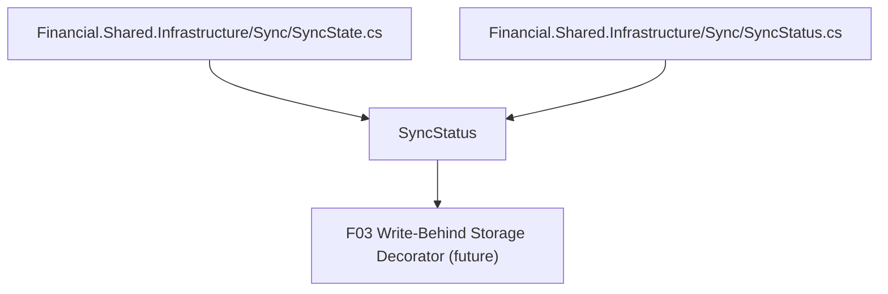

# Spec: F01. Sync Status Data Shape

## 1. Technical Overview

**What:** Introduce a small, immutable data contract representing the persistence state of a bounded context's background save mechanism: a `SyncState` enum (`Idle`, `Pending`, `Saving`, `Failed`) and a `SyncStatus` value (state, nullable last error message, nullable last successful save UTC timestamp). Both types live in `Financial.Shared.Infrastructure`.

**Why:** Every later feature in this PRD — the write-behind decorator (F03), per-context wiring (F04/F05), the status API endpoint (F08), and both front ends' polling/indicator UI (F09–F12) — needs to produce or consume the same shape for "is this context's data safely persisted right now." Defining it once, first, and with zero dependencies avoids each consumer inventing its own ad hoc representation.

**Scope:**
- Included: `SyncState` enum, `SyncStatus` immutable value type, placed in `Financial.Shared.Infrastructure` with no dependency on `Financial.CashFlow.*` or `Financial.Investment.*`.
- Excluded: any behavior that produces or mutates a `SyncStatus` (that's F03). No serialization contract is defined here beyond the type shape itself — the JSON shape used by the F08 API response is F08's concern.

## 2. Architecture Impact

**Affected components:**
- `Financial.Shared.Infrastructure/Sync/SyncState.cs` (new)
- `Financial.Shared.Infrastructure/Sync/SyncStatus.cs` (new)

## 3. Technical Decisions

| Decision | Chosen Approach | Alternative Considered | Trade-off |
|----------|----------------|----------------------|-----------|
| Folder placement | New `Sync/` folder under `Financial.Shared.Infrastructure`, sibling to the existing `Persistence/` folder | Put it inside `Persistence/` next to `IJsonStorage` | `SyncStatus` is consumed well beyond JSON storage (API layer, WPF UI) even though it originates from a storage decorator; a dedicated folder keeps `Persistence/` scoped to storage abstractions and signals `Sync/` as the shared cross-cutting concern for this PRD |
| Type shape | `SyncState` as a plain C# `enum`; `SyncStatus` as a `sealed record` with an init-only constructor-style factory | Class with private setters | Records give free immutability and value equality, matching the "immutable value" wording in the PRD and requiring no hand-written equality/copy code |
| Construction | `SyncStatus` constructor takes all three fields directly (state, error, last successful save); no static factory methods (`Idle()`, `Failed()`, etc.) | Static factory helpers per state | F01 is a pure data contract per the PRD ("No behavior — pure data contract"); adding factory methods would be behavior that belongs to F03, which is the first actual producer of `SyncStatus` instances |

## 4. Component Overview

**Backend (Financial.Shared.Infrastructure):**

| File Path | New/Modified | Purpose | Key Responsibilities |
|-----------|--------------|---------|---------------------|
| `Financial.Shared.Infrastructure/Sync/SyncState.cs` | New | Enumerates the possible persistence states of a write-behind instance | Defines exactly `Idle`, `Pending`, `Saving`, `Failed` |
| `Financial.Shared.Infrastructure/Sync/SyncStatus.cs` | New | Immutable snapshot of a context's sync state | Holds `State`, nullable `LastError`, nullable `LastSuccessfulSaveUtc`; no logic beyond data holding |

No API, database, or frontend changes in this feature.

## 5. API Contracts

Not applicable — F01 has no API surface. The HTTP contract that serializes `SyncStatus` is defined by F08.

## 6. Data Model

Not applicable — F01 is an in-memory type, not persisted.

## 7. Testing Strategy

**Test File Structure:**

| Test File | Test Type | Target | Coverage Goal |
|-----------|-----------|--------|---------------|
| `Tests/Financial.Shared.Infrastructure.Tests/Sync/SyncStatusTests.cs` | Unit | `SyncStatus`, `SyncState` | 100% (trivial data type) |

**Test Functions:**

| Test Function | Description | Assertions |
|---------------|-------------|------------|
| `SyncState_Should_Have_Exactly_Four_Members` | Enumerates `SyncState` members via reflection | Exactly `Idle`, `Pending`, `Saving`, `Failed`, no others |
| `SyncStatus_Should_Expose_State_Error_And_Timestamp` | Constructs a `SyncStatus` with all fields populated | `State`, `LastError`, `LastSuccessfulSaveUtc` round-trip the constructor values |
| `SyncStatus_Should_Allow_Null_Error_And_Timestamp` | Constructs a `SyncStatus` with `null` error and `null` timestamp (the `Idle`-at-startup case) | No exception; both nullable members are `null` |
| `SyncStatus_Should_Support_Value_Equality` | Constructs two `SyncStatus` instances with identical field values | `Equals` returns `true` and `GetHashCode` matches (record semantics) |

**Acceptance criteria covered (PRD Section 9, F01):**
- `SyncState` includes exactly `Idle`, `Pending`, `Saving`, `Failed` → `SyncState_Should_Have_Exactly_Four_Members`
- `SyncStatus` exposes state, a nullable last error message, and a nullable last successful save UTC timestamp → `SyncStatus_Should_Expose_State_Error_And_Timestamp`, `SyncStatus_Should_Allow_Null_Error_And_Timestamp`
- The type compiles and is referenced from `Financial.Shared.Infrastructure` with no dependency on either bounded context → verified by project location and the absence of any `using Financial.CashFlow.*` / `Financial.Investment.*` in the new files
