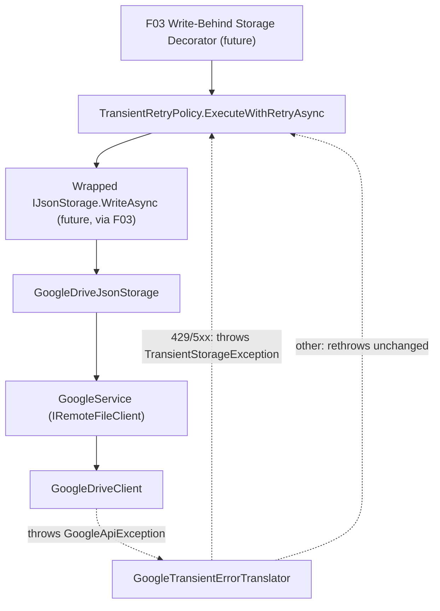

# Spec: F02. Transient-Failure Retry Helper

## 1. Technical Overview

**What:** A new async-only retry helper, `TransientRetryPolicy`, in `Financial.Shared.Infrastructure`. It retries a delegate on network/timeout exceptions and on a new provider-agnostic `TransientStorageException`, using the same exponential backoff shape as the existing `GoogleRetryPolicy` (2s, 4s, 8s, 16s, 32s — 5 attempts), then surfaces the original exception once attempts are exhausted. A small translation layer in `Integrations/GoogleFinancialSupport` (the only project in the solution that references the Google Drive SDK) recognizes Drive's HTTP 429/5xx responses and re-throws them as `TransientStorageException`, so `Financial.Shared.Infrastructure` never needs to know about Google-specific exception types.

**Why:** F03 (Write-Behind Storage Decorator) runs its Drive push from a background task with no request deadline, so it can afford to — and should — survive more transient-failure categories than `GoogleRetryPolicy` currently handles (which exists to keep synchronous, in-request calls from stalling too long, and only retries HTTP 429). Rather than widen `GoogleRetryPolicy`'s responsibility and risk changing behavior for its existing callers, the PRD calls for a separate, new helper — this feature is that helper.

Just as importantly, `Financial.Shared.Infrastructure` is used by both bounded contexts and currently has zero third-party package dependencies — the only project in the solution referencing the Google Drive SDK (`Google.Apis.*`) is `Integrations/GoogleFinancialSupport`. An earlier version of this spec had `TransientRetryPolicy` catch `Google.GoogleApiException` directly, which would have added a `Google.Apis.Core` package reference to `Financial.Shared.Infrastructure` — poking a hole in a boundary the codebase has deliberately kept intact (every other project reaches Google Drive only through the provider-agnostic `IRemoteFileClient` interface). This revision keeps that boundary: the Google-aware classification (429/5xx) lives entirely inside `GoogleFinancialSupport`, translated into a shared, framework-free exception type before it ever reaches `Financial.Shared.Infrastructure`.

**Scope:**
- Included: `TransientRetryPolicy.ExecuteWithRetryAsync<T>`, retrying on `TransientStorageException` and network/timeout exceptions; 5-attempt exponential backoff; final-failure surfacing. `TransientStorageException`, a new public, framework-free exception type in `Financial.Shared.Infrastructure`. `GoogleTransientErrorTranslator` in `Integrations/GoogleFinancialSupport`, a pure classification helper recognizing Drive's 429/5xx responses. `GoogleService`'s `DownloadFileContent`/`UploadFileContent` wired to use it.
- Excluded: any change to `GoogleRetryPolicy` or `GoogleDriveClient` (the PRD explicitly scopes those out — this feature touches `GoogleService.cs` instead, one layer above `GoogleDriveClient`, which the PRD does not name). No synchronous variant (F03 always calls this from a background task). No wiring into `GoogleDriveJsonStorage` or any repository — that begins with F03.

## 2. Architecture Impact

**Affected components:**
- `Financial.Shared.Infrastructure/Resilience/TransientStorageException.cs` (new)
- `Financial.Shared.Infrastructure/Resilience/TransientRetryPolicy.cs` (new)
- `Integrations/GoogleFinancialSupport/GoogleTransientErrorTranslator.cs` (new)
- `Integrations/GoogleFinancialSupport/GoogleService.cs` (modified — `DownloadFileContent`/`UploadFileContent` translate transient `GoogleApiException`s)

## 3. Technical Decisions

| Decision | Chosen Approach | Alternative Considered | Trade-off |
|----------|----------------|----------------------|-----------|
| Detecting "Drive HTTP 5xx" without a Google package in `Financial.Shared.Infrastructure` | A new `TransientStorageException` (public, no dependencies) lives in `Financial.Shared.Infrastructure`; `GoogleTransientErrorTranslator` in `GoogleFinancialSupport` catches `GoogleApiException`, and for 429/5xx status codes throws `TransientStorageException` wrapping the original; `GoogleService.DownloadFileContent`/`UploadFileContent` call it | Add a direct `PackageReference` to `Google.Apis.Core` in `Financial.Shared.Infrastructure` and catch `GoogleApiException` there directly | The direct-reference approach is simpler (one file, one package reference) but breaks an existing, deliberate boundary: `Financial.Shared.Infrastructure` and both bounded-context Infrastructure projects currently have zero references to `Google.Apis.*` — only `GoogleFinancialSupport` does. Keeping that boundary costs one extra small file (`GoogleTransientErrorTranslator`) and a modified `GoogleService.cs`, in exchange for `Financial.Shared.Infrastructure` staying free of any specific storage provider's SDK, consistent with `IRemoteFileClient` already being provider-agnostic by design |
| Where the translation lives | `GoogleService.cs` (the `IRemoteFileClient` implementation) | `GoogleDriveClient.cs` | The PRD explicitly scopes `GoogleDriveClient` (a `GoogleRetryPolicy` call site) out of this feature; `GoogleService` is a distinct file one layer above it that simply delegates to `GoogleDriveClient`, so wrapping its two methods touches nothing the PRD named as out of scope |
| Classification logic testability | Extract the 429/5xx check into `GoogleTransientErrorTranslator.ThrowIfTransient(GoogleApiException)`, a pure static method with no dependency on a live `DriveService`, callable directly from tests | Inline the try/catch directly in `GoogleService.DownloadFileContent`/`UploadFileContent` | `GoogleService`'s `_driveClient` field is constructed internally from real Google credentials with no injection seam (matching `GoogleDriveClient` itself, which also has no unit tests in this codebase for the same reason) — inlining the check would leave it untestable. A separate pure static method can be unit-tested directly, the same way `GoogleRetryPolicy`'s status-code check is exercised only indirectly through its retry tests today |
| Exception categories treated as retryable in `TransientRetryPolicy` | `TransientStorageException`; `HttpRequestException`; `TaskCanceledException` (covers `HttpClient` timeouts); `System.Net.Sockets.SocketException` | Retry on every `Exception` | The PRD scopes this to "network errors, timeouts, and Drive server errors" specifically — retrying arbitrary exceptions (e.g. a bug throwing `NullReferenceException`) would mask real defects behind 5 retries and ~1 minute of backoff instead of failing fast |
| Failure surfacing after retries exhausted | Rethrow the original exception unchanged (the `when` filter simply stops matching once `retryCount == maxRetries`, so the exception propagates via normal exception flow) | Wrap in a new exception, like `GoogleRetryPolicy` wraps rate-limit exhaustion in `HttpRequestException` | F03 needs the original exception's message for `SyncStatus.LastError` (F01); preserving the real exception (its type and message, including `TransientStorageException`'s wrapped `InnerException` for Drive-originated failures) is more useful for that than `GoogleRetryPolicy`'s wrapping, which exists for a different reason (giving `GoogleDriveClient`'s callers today a stable, user-facing message) that doesn't apply to a background-only caller |
| `TransientStorageException` accessibility | `public sealed class TransientStorageException : Exception`, in `Financial.Shared.Infrastructure.Resilience` | `internal` | Must be constructible and throwable from `Integrations/GoogleFinancialSupport`, a separate assembly; `Financial.Shared.Infrastructure` types are already reachable there today (`GoogleService` implements `IRemoteFileClient`) via the existing transitive project reference chain (`GoogleFinancialSupport` → `Financial.Investment.Infrastructure` → `Financial.Shared.Infrastructure`), so no new project reference is needed |
| `TransientRetryPolicy`/`GoogleTransientErrorTranslator` accessibility | `internal static`, each consumed only within its own assembly | `public` | Matches `GoogleRetryPolicy`'s existing `internal` accessibility; nothing outside either assembly needs to call these directly |
| Namespace/folder | `Financial.Shared.Infrastructure.Resilience` (both new shared types); `Integrations/GoogleFinancialSupport` root namespace (translator, alongside `GoogleRetryPolicy.cs`) | Alongside `Persistence/` | Retrying isn't a persistence concern by itself (F03, the actual persistence decorator, will live in `Persistence/`) — a dedicated `Resilience/` folder keeps these reusable-in-principle types visibly separate |

## 4. Component Overview

**Backend (Financial.Shared.Infrastructure):**

| File Path | New/Modified | Purpose | Key Responsibilities |
|-----------|--------------|---------|---------------------|
| `Financial.Shared.Infrastructure/Resilience/TransientStorageException.cs` | New | Provider-agnostic "this storage operation failed transiently" signal | Plain `Exception` subclass wrapping the original cause; no framework dependency |
| `Financial.Shared.Infrastructure/Resilience/TransientRetryPolicy.cs` | New | Async retry helper for transient Drive/network failures | Classifies an exception as retryable or not; exponential backoff (2/4/8/16/32s, 5 attempts); rethrows the original exception once exhausted |

**Backend (Integrations/GoogleFinancialSupport):**

| File Path | New/Modified | Purpose | Key Responsibilities |
|-----------|--------------|---------|---------------------|
| `Integrations/GoogleFinancialSupport/GoogleTransientErrorTranslator.cs` | New | Classifies a `GoogleApiException` as transient (429/5xx) and translates it | `ThrowIfTransient(GoogleApiException)`: throws `TransientStorageException` wrapping the original for 429/5xx; returns normally otherwise (caller rethrows unchanged) |
| `Integrations/GoogleFinancialSupport/GoogleService.cs` | Modified | `IRemoteFileClient` implementation | `DownloadFileContent`/`UploadFileContent` catch `GoogleApiException` from `_driveClient`, call the translator, and rethrow if not transient |

**Tests:**

| File Path | New/Modified | Purpose | Key Responsibilities |
|-----------|--------------|---------|---------------------|
| `Tests/Financial.Shared.Infrastructure.Tests/Resilience/TransientRetryPolicyTests.cs` | New | Unit tests for the retry helper | Covers each retryable category, exhaustion, and non-retryable passthrough |
| `Tests/Financial.Investment.Infrastructure.Tests/Integrations/GoogleTransientErrorTranslatorTests.cs` | New | Unit tests for the Google-specific classification | Covers 429, 5xx, and non-transient status codes |

No API, database, or frontend changes in this feature.

## 5. API Contracts

Not applicable — F02 has no API surface.

## 6. Data Model

Not applicable — F02 is a stateless static helper plus one exception type.

## 7. Testing Strategy

**Test File Structure:**

| Test File | Test Type | Target | Coverage Goal |
|-----------|-----------|--------|---------------|
| `Tests/Financial.Shared.Infrastructure.Tests/Resilience/TransientRetryPolicyTests.cs` | Unit | `TransientRetryPolicy.ExecuteWithRetryAsync` | 100% (small, branch-heavy helper — mirrors `GoogleRetryPolicyTests`' coverage shape) |
| `Tests/Financial.Investment.Infrastructure.Tests/Integrations/GoogleTransientErrorTranslatorTests.cs` | Unit | `GoogleTransientErrorTranslator.ThrowIfTransient` | 100% (pure classification function) |

**Test Functions — `TransientRetryPolicyTests`:**

| Test Function | Description | Assertions |
|---------------|-------------|------------|
| `ExecuteWithRetryAsync_ActionSucceedsImmediately_ReturnsResultWithoutRetrying` | Delegate succeeds on the first call | Result returned; delegate invoked exactly once |
| `ExecuteWithRetryAsync_TransientStorageException_RetriesAndEventuallySucceeds` | Delegate throws `TransientStorageException` twice, then succeeds | Result returned; delegate invoked 3 times; logger receives `Retry 1/5`/`Retry 2/5` messages, proving the default `maxRetries: 5` shape |
| `ExecuteWithRetryAsync_NetworkTimeout_RetriesAndEventuallySucceeds` | Delegate throws `TaskCanceledException` once, then succeeds | Result returned; delegate invoked twice |
| `ExecuteWithRetryAsync_HttpRequestException_RetriesAndEventuallySucceeds` | Delegate throws `HttpRequestException` once, then succeeds | Result returned; delegate invoked twice |
| `ExecuteWithRetryAsync_SocketException_RetriesAndEventuallySucceeds` | Delegate throws `SocketException` once, then succeeds | Result returned; delegate invoked twice |
| `ExecuteWithRetryAsync_ExceedsMaxRetries_SurfacesOriginalExceptionUnwrapped` | Delegate always throws `TransientStorageException`, called with `maxRetries: 0` | Original `TransientStorageException` (not further wrapped) propagates to the caller once retries are exhausted; delegate invoked exactly once (mirrors `GoogleRetryPolicyTests`' own `maxRetries: 0` pattern for exercising the exhaustion branch without waiting through the full backoff in a unit test) |
| `ExecuteWithRetryAsync_NonRetryableException_PropagatesImmediatelyWithoutRetrying` | Delegate throws `InvalidOperationException` | Exception propagates immediately; delegate invoked exactly once |

Note on timing: the exhaustion path is verified with `maxRetries: 0` rather than letting the real default (5 retries) run to completion, which would sleep through the full 2+4+8+16+32 = 62 real seconds of backoff in a single unit test. The retry-then-succeed tests above already exercise the same loop/backoff code path (with real, short waits) against the default `maxRetries: 5`, so the exhaustion branch is covered by the same logic at a fast, deterministic parameter — the identical trade-off `GoogleRetryPolicyTests` already makes for `GoogleRetryPolicy`.

**Test Functions — `GoogleTransientErrorTranslatorTests`:**

| Test Function | Description | Assertions |
|---------------|-------------|------------|
| `ThrowIfTransient_HttpStatus429_ThrowsTransientStorageExceptionWrappingOriginal` | `GoogleApiException` with `HttpStatusCode.TooManyRequests` | Throws `TransientStorageException`; its `InnerException` is the original `GoogleApiException` |
| `ThrowIfTransient_HttpStatus5xx_ThrowsTransientStorageExceptionWrappingOriginal` | `GoogleApiException` with `HttpStatusCode.ServiceUnavailable` (503) | Throws `TransientStorageException`; its `InnerException` is the original `GoogleApiException` |
| `ThrowIfTransient_HttpStatus400_DoesNotThrow` | `GoogleApiException` with `HttpStatusCode.BadRequest` | Returns normally, no exception thrown |

**Soft-fail (documented, not a gap in this spec):** `GoogleService.DownloadFileContent`/`UploadFileContent`'s try/catch wiring itself is not directly unit-tested — `GoogleService._driveClient` is constructed internally from real Google credentials with no injection seam, matching the existing codebase's precedent (`GoogleDriveClient` itself has no direct unit tests for the same reason; `GoogleRetryPolicy`'s actual call sites inside it are likewise untested directly). The classification logic it delegates to (`GoogleTransientErrorTranslator`) is fully unit-tested in isolation instead.

**Acceptance criteria covered (PRD Section 9, F02):**
- A simulated HTTP 429 is retried with the existing 5-attempt, 2/4/8/16/32s backoff shape → `ThrowIfTransient_HttpStatus429_ThrowsTransientStorageExceptionWrappingOriginal` (classification) + `ExecuteWithRetryAsync_TransientStorageException_RetriesAndEventuallySucceeds` (retry/backoff shape, since a translated 429 becomes a `TransientStorageException` by the time it reaches the retry helper)
- A simulated network/timeout exception is retried the same way → `ExecuteWithRetryAsync_NetworkTimeout_RetriesAndEventuallySucceeds`, `ExecuteWithRetryAsync_HttpRequestException_RetriesAndEventuallySucceeds`, `ExecuteWithRetryAsync_SocketException_RetriesAndEventuallySucceeds`
- A simulated Drive HTTP 5xx response is retried the same way → `ThrowIfTransient_HttpStatus5xx_ThrowsTransientStorageExceptionWrappingOriginal` (classification) + `ExecuteWithRetryAsync_TransientStorageException_RetriesAndEventuallySucceeds` (retry/backoff shape)
- After 5 failed attempts, the helper surfaces the final failure to the caller instead of retrying further → `ExecuteWithRetryAsync_ExceedsMaxRetries_SurfacesOriginalExceptionUnwrapped`
- `GoogleRetryPolicy` and its existing callers are unchanged → no modification to `GoogleRetryPolicy.cs` or `GoogleDriveClient.cs`; the existing `GoogleRetryPolicyTests` suite is re-run unmodified as part of full-suite verification and must stay green
