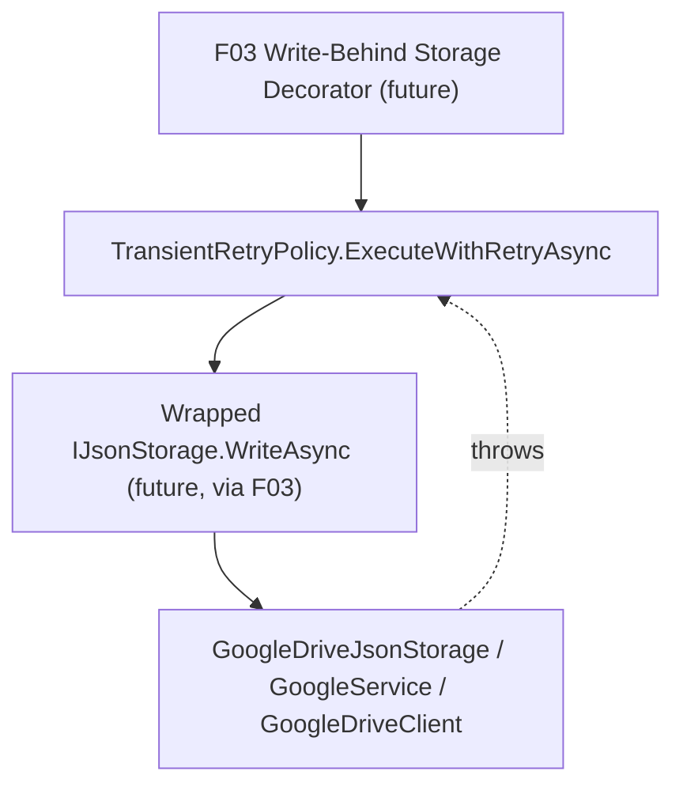

# Spec: F02. Transient-Failure Retry Helper

## 1. Technical Overview

**What:** A new async-only retry helper, `TransientRetryPolicy`, in `Financial.Shared.Infrastructure`. It retries a delegate on HTTP 429 (rate limit), network/timeout exceptions, and Drive HTTP 5xx responses, using the same exponential backoff shape as the existing `GoogleRetryPolicy` (2s, 4s, 8s, 16s, 32s — 5 attempts), then surfaces the original exception once attempts are exhausted.

**Why:** F03 (Write-Behind Storage Decorator) runs its Drive push from a background task with no request deadline, so it can afford to — and should — survive more transient-failure categories than `GoogleRetryPolicy` currently handles (which exists to keep synchronous, in-request calls from stalling too long, and only retries HTTP 429). Rather than widen `GoogleRetryPolicy`'s responsibility and risk changing behavior for its existing callers (`GoogleDriveClient`'s `GetFilesAsync`/`DownloadFileContent`/`UploadFileContent`), the PRD calls for a separate, new helper — this feature is that helper, with zero other code changes.

**Scope:**
- Included: `TransientRetryPolicy.ExecuteWithRetryAsync<T>`, covering 429, network/timeout exceptions, and Drive 5xx; 5-attempt exponential backoff; final-failure surfacing.
- Excluded: any change to `GoogleRetryPolicy` or its call sites in `GoogleDriveClient`. No synchronous variant (F03 always calls this from a background task). No wiring into `GoogleDriveJsonStorage` or any repository — that begins with F03.

## 2. Architecture Impact

**Affected components:**
- `Financial.Shared.Infrastructure/Resilience/TransientRetryPolicy.cs` (new)
- `Financial.Shared.Infrastructure/Financial.Shared.Infrastructure.csproj` (modified — adds `Google.Apis.Core` package reference)
- `Tests/Financial.Shared.Infrastructure.Tests/Financial.Shared.Infrastructure.Tests.csproj` (modified — adds `Google.Apis.Core` package reference, needed to construct `GoogleApiException` in tests)

## 3. Technical Decisions

| Decision | Chosen Approach | Alternative Considered | Trade-off |
|----------|----------------|----------------------|-----------|
| Detecting "Drive HTTP 5xx" without widening `GoogleRetryPolicy` | Add a direct `PackageReference` to `Google.Apis.Core` (same version already pinned elsewhere, `1.64.0`) in `Financial.Shared.Infrastructure`, and catch `Google.GoogleApiException` by inspecting `HttpStatusCode` | Define a provider-agnostic `IsTransientError(Exception)` abstraction with a Google-specific implementation injected from `GoogleFinancialSupport`, keeping `Financial.Shared.Infrastructure` free of any Google SDK reference | `GoogleDriveJsonStorage`/`GoogleService` (already in `Financial.Shared.Infrastructure`'s dependency path via `IRemoteFileClient`) can throw a raw `GoogleApiException` from the Drive SDK today, so the exception type already reaches this project's call boundary in practice. An injectable abstraction would be real over-engineering for a single-user app with one storage provider (`LocalJson`/`GoogleDrive`) and one retry consumer (F03) — the PRD's own "no over-engineering" guidance applies directly here |
| Exception categories treated as retryable | `GoogleApiException` with `HttpStatusCode == 429` or `(int)HttpStatusCode >= 500`; `HttpRequestException`; `TaskCanceledException` (covers `HttpClient` timeouts); `System.Net.Sockets.SocketException` | Retry on every `Exception` | The PRD scopes this to "network errors, timeouts, and Drive server errors" specifically — retrying arbitrary exceptions (e.g. a bug throwing `NullReferenceException`) would mask real defects behind 5 retries and ~1 minute of backoff instead of failing fast |
| Failure surfacing after retries exhausted | Rethrow the original exception unchanged (via `throw;` inside the final catch, or simply letting the last attempt's exception propagate) | Wrap in a new exception, like `GoogleRetryPolicy` wraps rate-limit exhaustion in `HttpRequestException` | F03 needs the original exception's message for `SyncStatus.LastError` (F01); preserving the real exception (its type and message) is more useful for that than `GoogleRetryPolicy`'s wrapping, which exists for a different reason (giving `GoogleDriveClient`'s callers today a stable, user-facing message) that doesn't apply to a background-only caller |
| Accessibility | `internal static class TransientRetryPolicy`, consumed only from within `Financial.Shared.Infrastructure` (F03) | `public` | Matches `GoogleRetryPolicy`'s existing `internal` accessibility; nothing outside this assembly needs to call it |
| Namespace/folder | `Financial.Shared.Infrastructure.Resilience` | Alongside `Persistence/` | Retrying isn't a persistence concern by itself (F03, the actual persistence decorator, will live in `Persistence/`) — a dedicated `Resilience/` folder keeps this reusable-in-principle helper visibly separate, matching the PRD's framing of it as a standalone building block |

## 4. Component Overview

**Backend (Financial.Shared.Infrastructure):**

| File Path | New/Modified | Purpose | Key Responsibilities |
|-----------|--------------|---------|---------------------|
| `Financial.Shared.Infrastructure/Resilience/TransientRetryPolicy.cs` | New | Async retry helper for transient Drive/network failures | Classifies an exception as retryable or not; exponential backoff (2/4/8/16/32s, 5 attempts); rethrows the original exception once exhausted |
| `Financial.Shared.Infrastructure/Financial.Shared.Infrastructure.csproj` | Modified | Adds `Google.Apis.Core` `PackageReference` (version `1.64.0`, matching `Integrations/GoogleFinancialSupport`) | Enables referencing `Google.GoogleApiException` for the 429/5xx check |

**Tests:**

| File Path | New/Modified | Purpose | Key Responsibilities |
|-----------|--------------|---------|---------------------|
| `Tests/Financial.Shared.Infrastructure.Tests/Resilience/TransientRetryPolicyTests.cs` | New | Unit tests for the retry helper | Covers each retryable category, exhaustion, and non-retryable passthrough |
| `Tests/Financial.Shared.Infrastructure.Tests/Financial.Shared.Infrastructure.Tests.csproj` | Modified | Adds `Google.Apis.Core` `PackageReference` | Needed to construct `GoogleApiException` instances in tests, mirroring `GoogleRetryPolicyTests`' existing pattern |

No API, database, or frontend changes in this feature.

## 5. API Contracts

Not applicable — F02 has no API surface.

## 6. Data Model

Not applicable — F02 is a stateless static helper.

## 7. Testing Strategy

**Test File Structure:**

| Test File | Test Type | Target | Coverage Goal |
|-----------|-----------|--------|---------------|
| `Tests/Financial.Shared.Infrastructure.Tests/Resilience/TransientRetryPolicyTests.cs` | Unit | `TransientRetryPolicy.ExecuteWithRetryAsync` | 100% (small, branch-heavy helper — mirrors `GoogleRetryPolicyTests`' coverage shape) |

**Test Functions:**

| Test Function | Description | Assertions |
|---------------|-------------|------------|
| `ExecuteWithRetryAsync_ActionSucceedsImmediately_ReturnsResultWithoutRetrying` | Delegate succeeds on the first call | Result returned; delegate invoked exactly once |
| `ExecuteWithRetryAsync_RateLimited429_RetriesAndEventuallySucceeds` | Delegate throws `GoogleApiException` (429) twice, then succeeds | Result returned; delegate invoked 3 times; logger receives retry messages |
| `ExecuteWithRetryAsync_DriveServerError5xx_RetriesAndEventuallySucceeds` | Delegate throws `GoogleApiException` (503) once, then succeeds | Result returned; delegate invoked twice |
| `ExecuteWithRetryAsync_NetworkTimeout_RetriesAndEventuallySucceeds` | Delegate throws `TaskCanceledException` once, then succeeds | Result returned; delegate invoked twice |
| `ExecuteWithRetryAsync_HttpRequestException_RetriesAndEventuallySucceeds` | Delegate throws `HttpRequestException` once, then succeeds | Result returned; delegate invoked twice |
| `ExecuteWithRetryAsync_SocketException_RetriesAndEventuallySucceeds` | Delegate throws `SocketException` once, then succeeds | Result returned; delegate invoked twice |
| `ExecuteWithRetryAsync_ExceedsMaxRetries_SurfacesOriginalExceptionUnwrapped` | Delegate always throws `GoogleApiException` (429), called with `maxRetries: 0` | Original `GoogleApiException` (not a wrapped type) propagates to the caller once retries are exhausted; delegate invoked exactly once (mirrors `GoogleRetryPolicyTests`' own `maxRetries: 0` pattern for exercising the exhaustion branch without waiting through the full backoff in a unit test) |
| `ExecuteWithRetryAsync_NonRetryableException_PropagatesImmediatelyWithoutRetrying` | Delegate throws `InvalidOperationException` | Exception propagates immediately; delegate invoked exactly once |
| `ExecuteWithRetryAsync_NonRetryableGoogleApiException_PropagatesImmediatelyWithoutRetrying` | Delegate throws `GoogleApiException` (400 Bad Request) | Exception propagates immediately; delegate invoked exactly once |

Note on timing: the exhaustion path is verified with `maxRetries: 0` rather than letting the real default (5 retries) run to completion, which would sleep through the full 2+4+8+16+32 = 62 real seconds of backoff in a single unit test. The retry-then-succeed tests above already exercise the same loop/backoff code path (with real, short waits) against the default `maxRetries: 5`, so the exhaustion branch is covered by the same logic at a fast, deterministic parameter — the identical trade-off `GoogleRetryPolicyTests` already makes for `GoogleRetryPolicy`.

**Acceptance criteria covered (PRD Section 9, F02):**
- A simulated HTTP 429 is retried with the existing 5-attempt, 2/4/8/16/32s backoff shape → `ExecuteWithRetryAsync_RateLimited429_RetriesAndEventuallySucceeds` (asserts default `maxRetries: 5` via the `Retry 1/5`/`Retry 2/5` log messages)
- A simulated network/timeout exception is retried the same way → `ExecuteWithRetryAsync_NetworkTimeout_RetriesAndEventuallySucceeds`, `ExecuteWithRetryAsync_HttpRequestException_RetriesAndEventuallySucceeds`, `ExecuteWithRetryAsync_SocketException_RetriesAndEventuallySucceeds`
- A simulated Drive HTTP 5xx response is retried the same way → `ExecuteWithRetryAsync_DriveServerError5xx_RetriesAndEventuallySucceeds`
- After 5 failed attempts, the helper surfaces the final failure to the caller instead of retrying further → `ExecuteWithRetryAsync_ExceedsMaxRetries_SurfacesOriginalExceptionUnwrapped`
- `GoogleRetryPolicy` and its existing callers are unchanged → no modification to `GoogleRetryPolicy.cs` or `GoogleDriveClient.cs`; the existing `GoogleRetryPolicyTests` suite is re-run unmodified as part of full-suite verification and must stay green
