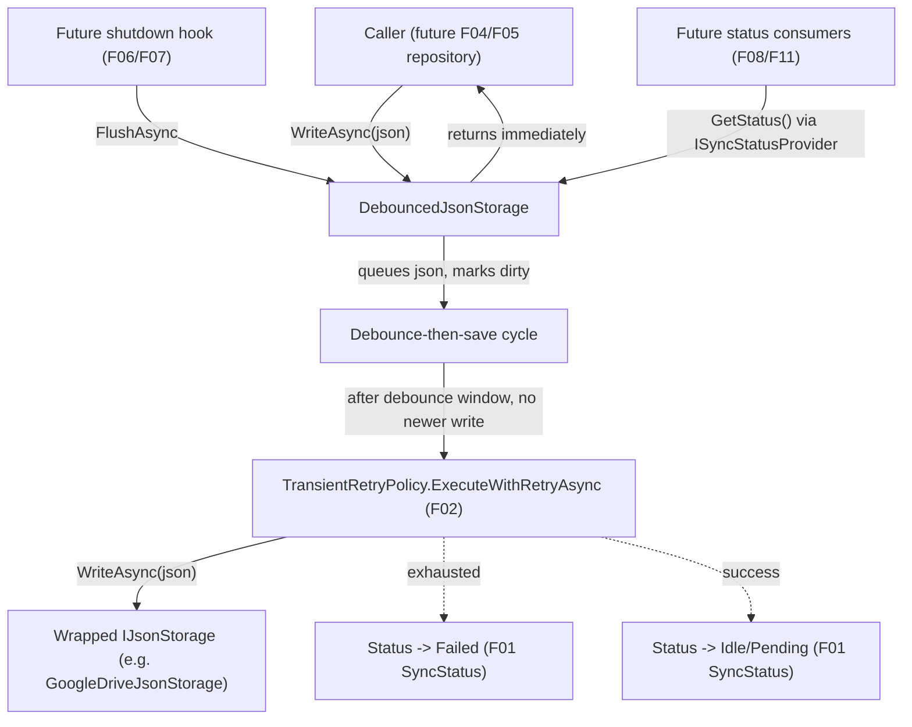

# Spec: F03. Debounced Storage Decorator

## 1. Technical Overview

**What:** `DebouncedJsonStorage`, a new `IJsonStorage` decorator in `Financial.Shared.Infrastructure`, plus a small `ISyncStatusProvider` contract it implements. Wrapping any other `IJsonStorage` instance, it makes `WriteAsync` return as soon as the latest JSON is queued in memory; a debounced background cycle uploads the latest queued JSON via F02's `TransientRetryPolicy`, tracking status through F01's `SyncStatus`/`SyncState` shape. `FlushAsync()` gives a caller (a future shutdown hook) a way to force an immediate, bounded-wait save attempt.

**Why:** This is the mechanism the whole PRD is built around — decoupling a mutation's in-memory apply from its Drive upload. F01 (status shape) and F02 (retry executor) exist specifically to be consumed here. Each instance is fully self-contained (its own dirty flag, debounce cycle, and status) so F04 and F05 can each wrap their own context's storage independently, with zero shared state between them, satisfying the PRD's cross-context isolation requirement without either of those features needing any locking or coordination logic of their own.

**Scope:**
- Included: `DebouncedJsonStorage` (implements `IJsonStorage` + `ISyncStatusProvider`); `ISyncStatusProvider` (the narrow "status + flush" contract F04–F11 will depend on instead of the concrete decorator type); debounce-then-save cycle with reset-on-write and re-dirty-during-save handling; `FlushAsync()` bounded by a fixed 8-second timeout; per-instance isolation.
- Excluded: wiring this decorator into `CashFlowRepositoryFactory`/the Investment equivalent, or into any DI registration (F04, F05). Calling `FlushAsync()` from a shutdown hook (F06, F07). Exposing status over HTTP or in either UI (F08–F12). No local-disk write-ahead log or crash durability beyond what a graceful `FlushAsync()` call provides — explicitly out of scope per the PRD.

## 2. Architecture Impact

**Affected components:**
- `Financial.Shared.Infrastructure/Sync/ISyncStatusProvider.cs` (new)
- `Financial.Shared.Infrastructure/Persistence/DebouncedJsonStorage.cs` (new)

## 3. Technical Decisions

| Decision | Chosen Approach | Alternative Considered | Trade-off |
|----------|----------------|----------------------|-----------|
| Status/flush exposure surface | New `ISyncStatusProvider` interface (`GetStatus()`, `FlushAsync()`) in `Financial.Shared.Infrastructure.Sync`, implemented by `DebouncedJsonStorage` alongside `IJsonStorage` | Have later features (F06, F08, F11) depend on the concrete `DebouncedJsonStorage` type directly | The PRD's own wording for F04 ("the wrapped instance, or its status/flush surface, is resolvable via DI... without those features needing to know about the wrapping decision") calls for an abstraction; a 2-member interface is the minimum that satisfies it without inventing anything unused |
| Debounce reset mechanism | A monotonically increasing generation counter: each `WriteAsync` bumps it and (if no save is in-flight) starts a new debounced wait tagged with that generation; when a wait elapses, it proceeds to save only if its generation is still current, otherwise a newer write already superseded it | A `CancellationTokenSource` replaced-and-cancelled on every write | The CTS approach is the more textbook debounce pattern, but its create/cancel/dispose lifecycle under concurrent writes is easy to get subtly wrong (dispose-while-referenced races). The generation counter has no disposal surface at all — a superseded wait just wakes up, checks a number, and exits. The cost (an extra harmless `Task.Delay` per superseded write during a rapid burst) is negligible for this single-user app's actual write frequency |
| Retry integration | Wrap the inner `WriteAsync(json)` call in a `Func<Task<bool>>` (returning a dummy `true`) passed to `TransientRetryPolicy.ExecuteWithRetryAsync<T>` (F02's only overload is generic) | Add a non-generic overload to `TransientRetryPolicy` | F02 is already implemented and reviewed; adding an overload there re-opens a finished feature for a one-line convenience. The dummy-return wrapper is a two-line adaptation fully contained in this feature |
| Failure semantics: does a `Failed` instance auto-retry if still dirty? | No — matching the PRD's exact wording ("the instance does not retry again until the next dirty-triggering write starts a fresh cycle"), the save-failure handler does **not** start a follow-up debounce cycle even if `_isDirty` is still true (e.g., because a write arrived during the failed attempt). Only a subsequent `WriteAsync` call (or an explicit `FlushAsync()`) re-arms it | Auto-retry immediately, matching the success path's "if still dirty, start a fresh cycle" behavior | The PRD deliberately asymmetric here: uncontrolled auto-retry against a down/failing Drive would degrade into a retry storm indistinguishable from the very problem F02's backoff exists to prevent. This is a subtle, easy-to-miss point — called out explicitly here and covered by a dedicated test |
| `FlushAsync()` when a save is already in-flight | Await the same in-flight save's task (bounded by the same 8-second timeout) rather than starting a second, overlapping save | Start a second, independent save attempt | The decorator's whole design (one dirty flag, one in-flight flag) assumes at most one save runs at a time per instance; overlapping saves would race on `_pendingJson`/status writes for no benefit — the in-flight save already carries the latest data that was dirty when it started, and post-completion re-dirty handling covers anything newer |
| Timestamp source for `LastSuccessfulSaveUtc` | Constructor-injected `TimeProvider?` (defaults to `TimeProvider.System`) | `DateTime.UtcNow` directly | Matches the existing codebase convention (`AnnualSummaryService(ICashFlowRepository, TimeProvider? timeProvider = null)`), keeping the timestamp deterministically testable the same way the rest of the codebase already does |
| Test seams for `maxRetries` and the flush timeout | A second, `internal` constructor exposing both as parameters (defaulting to the production values — 5 retries, 8 seconds), mirroring `GoogleDriveJsonStorage`'s existing public/internal constructor split; the public constructor only exposes `inner`, `debounceWindow`, and `timeProvider`, matching the PRD's "debounce window is a constructor parameter... no default baked in" while keeping the 8-second flush bound and 5-retry shape as fixed, non-configurable production behavior | Make the real default values run in every test (5 retries × up to 32s backoff; a real 8-second flush wait) | The "retries exhausted" and "flush times out" acceptance criteria would otherwise cost over a minute of real wall-clock time per test run; the internal seam (already an established pattern in this codebase via `InternalsVisibleTo("Financial.Shared.Infrastructure.Tests")`) lets tests exercise the same code paths with small values instead |
| Concurrency primitive | A single `lock (object)` guarding all mutable state (dirty flag, generation, in-flight flag, status fields, current-cycle task reference); all critical sections are synchronous field mutations, never an `await` | `SemaphoreSlim`/async-aware locking | Every guarded operation is plain state mutation with no I/O — a synchronous `lock` is sufficient and matches the simplicity of `LocalJsonStorage`/`GoogleDriveJsonStorage`'s existing style; an async lock would add complexity with no corresponding benefit for a single-process app |

## 4. Component Overview

**Backend (Financial.Shared.Infrastructure):**

| File Path | New/Modified | Purpose | Key Responsibilities |
|-----------|--------------|---------|---------------------|
| `Financial.Shared.Infrastructure/Sync/ISyncStatusProvider.cs` | New | Narrow contract for querying sync status and forcing a flush | `SyncStatus GetStatus()`; `Task FlushAsync()` |
| `Financial.Shared.Infrastructure/Persistence/DebouncedJsonStorage.cs` | New | `IJsonStorage` decorator implementing debounced persistence | Dirty-marking on `WriteAsync`; debounce-then-save cycle (reset-on-write, re-dirty-during-save, no-auto-retry-after-failure); calls F02's retry executor around the wrapped storage's `WriteAsync`; maintains F01's `SyncStatus`; `FlushAsync()` bypasses the debounce wait, bounded by an 8-second timeout; `ReadAsync()` passthrough |

**Tests:**

| File Path | New/Modified | Purpose | Key Responsibilities |
|-----------|--------------|---------|---------------------|
| `Tests/Financial.Shared.Infrastructure.Tests/Persistence/DebouncedJsonStorageTests.cs` | New | Behavioral coverage of the decorator | Covers every F03 acceptance criterion |
| `Tests/Financial.Shared.Infrastructure.Tests/Persistence/ControllableJsonStorage.cs` | New | Test double implementing `IJsonStorage` | Records every `WriteAsync` call's JSON; optionally gates completion on a signal (to reliably observe the `Saving` state mid-test); optionally throws a configured exception for a configured number of calls |

No API, database, or frontend changes in this feature.

## 5. API Contracts

Not applicable — F03 has no API surface. `ISyncStatusProvider` is an in-process .NET interface, not an HTTP contract (F08 defines the HTTP shape later).

## 6. Data Model

Not applicable — F03 holds its state entirely in memory, per-instance.

## 7. Testing Strategy

**Test File Structure:**

| Test File | Test Type | Target | Coverage Goal |
|-----------|-----------|--------|---------------|
| `Tests/Financial.Shared.Infrastructure.Tests/Persistence/DebouncedJsonStorageTests.cs` | Unit | `DebouncedJsonStorage` | Every acceptance criterion for F03, plus the two cross-feature integration criteria this feature alone can satisfy |

**Test Functions:**

| Test Function | Description | Assertions |
|---------------|-------------|------------|
| `WriteAsync_ReturnsImmediately_AndStatusBecomesPending` | Call `WriteAsync` against a wrapped storage that would otherwise take time to write | Returns before the wrapped storage's `WriteAsync` is observed to complete; `GetStatus().State` is `Pending` immediately after the call |
| `AfterDebounceWindowElapses_LatestJsonIsUploaded` | `WriteAsync` once, wait past the (short, test-configured) debounce window | Wrapped storage's `WriteAsync` is eventually called exactly once with the written JSON; status settles to `Idle` |
| `WriteDuringDebounceWindow_ResetsWait_OnlyLatestJsonUploaded` | `WriteAsync` twice in quick succession, both within the debounce window | Wrapped storage's `WriteAsync` is called exactly once, with the *second* (latest) JSON only |
| `WriteDuringInFlightSave_StartsFollowUpCycleWithoutBlockingTheWrite` | `WriteAsync` once, wait until status is `Saving` (via the gated test double), call `WriteAsync` again with new data while the first save is still held open, release the gate | The second `WriteAsync` call returns immediately (doesn't block on the held-open first save); after the first save completes and the follow-up debounce window elapses, the wrapped storage receives a second call with the newer JSON |
| `RetriesExhausted_StatusBecomesFailed_LastSuccessfulSaveUtcPreserved` | Prime one successful save first (to populate `LastSuccessfulSaveUtc`), then a write whose wrapped storage always throws a retryable exception, using the internal `maxRetries: 0` seam for speed | `GetStatus().State` becomes `Failed`; `LastError` is populated from the triggering exception; `LastSuccessfulSaveUtc` is unchanged from the earlier successful save |
| `SaveFailure_DoesNotAutoStartFollowUpCycle` | A write that fails (via `maxRetries: 0`) while a second write arrives during the failed attempt (leaving the instance dirty) | After the failure, the wrapped storage is not called again on its own; only an explicit subsequent `WriteAsync` (or `FlushAsync`) triggers the next attempt |
| `SuccessfulSave_StatusBecomesIdle_LastSuccessfulSaveUtcUpdates` | A single write allowed to succeed, using an injected `TimeProvider` | `GetStatus().State` becomes `Idle`; `LastSuccessfulSaveUtc` equals the injected provider's timestamp |
| `SuccessfulSave_WhenStillDirtyFromANewerWrite_StatusBecomesPendingNotIdle` | A write arrives during an in-flight save (as in the follow-up-cycle test) | Immediately after the in-flight save completes, status is `Pending` (not `Idle`), reflecting the still-dirty follow-up cycle about to run |
| `FlushAsync_OnDirtyInstance_SavesImmediatelyWithoutWaitingForDebounce` | `WriteAsync` with a long (test-configured) debounce window, then call `FlushAsync()` | Wrapped storage's `WriteAsync` is called before the debounce window would otherwise have elapsed |
| `FlushAsync_WhenSaveExceedsTimeout_ReturnsWithoutWaitingFurther` | Using the internal flush-timeout seam set to a small value and a wrapped storage held open indefinitely | `FlushAsync()` returns at (approximately) the configured timeout, not when the held-open save eventually would complete |
| `ReadAsync_PassesThroughToWrappedStorage` | Call `ReadAsync()` | Returns exactly what the wrapped storage's `ReadAsync()` returns, unmodified |
| `TwoInstances_NeverShareDirtyDebounceRetryOrStatusState` | Two `DebouncedJsonStorage` instances wrapping two independent storages; force one to fail (`maxRetries: 0`) | The failing instance's status is `Failed`; the other instance's status remains `Idle`, unaffected |

**Acceptance criteria covered (PRD Section 9, F03):**
- `WriteAsync(json)` returns before any Drive upload has occurred, and the instance's status becomes `Pending` → `WriteAsync_ReturnsImmediately_AndStatusBecomesPending`
- After the configured debounce window elapses with no further writes, the latest queued JSON is uploaded via the wrapped storage → `AfterDebounceWindowElapses_LatestJsonIsUploaded`
- A write arriving during the debounce window resets the wait; only the latest JSON is eventually uploaded → `WriteDuringDebounceWindow_ResetsWait_OnlyLatestJsonUploaded`
- A write arriving while a save is in-flight causes another debounce-and-save cycle after the in-flight save finishes, without blocking the write call → `WriteDuringInFlightSave_StartsFollowUpCycleWithoutBlockingTheWrite`
- After retries are exhausted (via F02), status becomes `Failed` with the triggering error, and `lastSuccessfulSaveUtc` retains its previous value → `RetriesExhausted_StatusBecomesFailed_LastSuccessfulSaveUtcPreserved`
- After a successful save, status becomes `Idle` (or `Pending`/`Saving` if already dirty again) and `lastSuccessfulSaveUtc` updates → `SuccessfulSave_StatusBecomesIdle_LastSuccessfulSaveUtcUpdates`, `SuccessfulSave_WhenStillDirtyFromANewerWrite_StatusBecomesPendingNotIdle`
- `FlushAsync()` on a dirty instance immediately attempts a save without waiting for the debounce window, bounded by 8 seconds → `FlushAsync_OnDirtyInstance_SavesImmediatelyWithoutWaitingForDebounce`, `FlushAsync_WhenSaveExceedsTimeout_ReturnsWithoutWaitingFurther`
- `ReadAsync()` passes through unchanged to the wrapped storage → `ReadAsync_PassesThroughToWrappedStorage`
- Two separate instances never share dirty/debounce/retry/status state → `TwoInstances_NeverShareDirtyDebounceRetryOrStatusState`

**Cross-Feature Integration criteria this feature can satisfy on its own (PRD Section 9):**
- "The debounced decorator (F03) correctly uses the sync status shape from F01 and the retry executor from F02" → satisfied by construction (`DebouncedJsonStorage` returns `SyncStatus`/`SyncState` from `GetStatus()` and calls `TransientRetryPolicy.ExecuteWithRetryAsync` for every save attempt) and exercised indirectly by every test above, since each one asserts on the F01 `SyncStatus` shape and depends on F02's retry behavior for the exhaustion test

The two remaining Cross-Feature Integration criteria referencing F03 ("a CashFlow mutation results in F03 queuing..." / "an Investment mutation results in F03 queuing...") depend on F04 and F05 respectively, which are not yet implemented — out of scope for this feature's tests.
