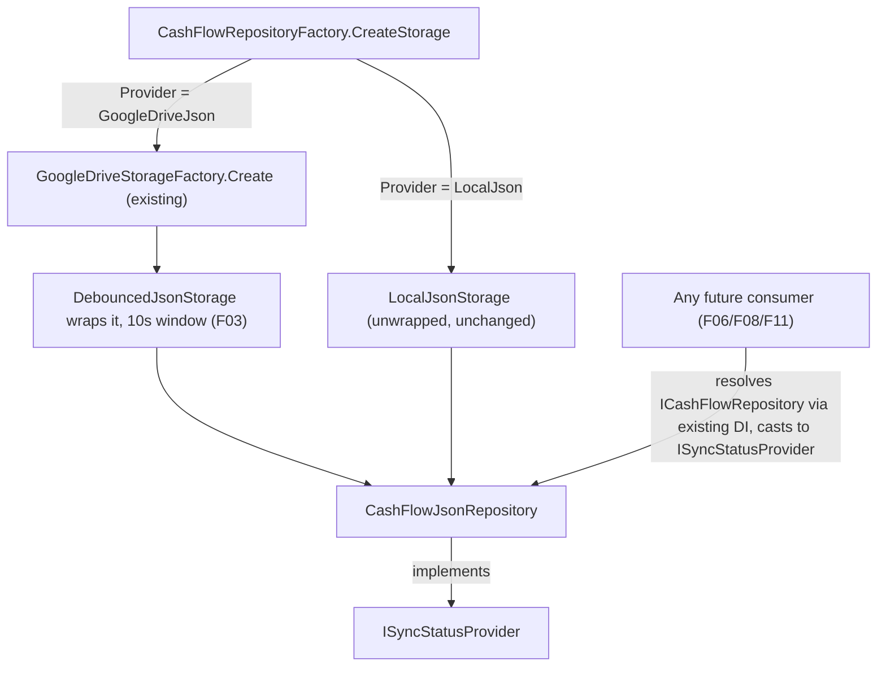

# Spec: F04. CashFlow Debounced Wiring

## 1. Technical Overview

**What:** When CashFlow's repository resolves a `GoogleDriveJsonStorage` (i.e. `CashFlow:Repository:Provider` is `GoogleDrive`), `CashFlowRepositoryFactory` wraps it in a dedicated `DebouncedJsonStorage` (F03) with a 10-second debounce window before handing it to `CashFlowJsonRepository`. `CashFlowJsonRepository` implements `ISyncStatusProvider` by delegating to that wrapped storage, so its status/flush surface is reachable by any component that already resolves `ICashFlowRepository` via DI — with zero new DI registrations.

**Why:** This is where the write-behind mechanism actually starts doing something for CashFlow, the context edited near-daily and therefore the one where blocking Drive saves are most painful. `CashFlowJsonRepository.SaveChangesAsync()` already just calls `_storage.WriteAsync(json)` — swapping in a debounced storage instance underneath it is the entire change; no repository interface, caller, or domain code needs to know.

**Scope:**
- Included: wrapping decision in `CashFlowRepositoryFactory` (GoogleDrive only, 10-second window); `CashFlowJsonRepository` implementing `ISyncStatusProvider`.
- Excluded: any change to `ICashFlowRepository`'s public interface, `CashFlowJsonRepository`'s constructor signature, or any caller of `SaveChangesAsync()`. Calling `FlushAsync()` from a shutdown hook (F06). Exposing status over HTTP or WPF UI (F08, F11) — those features consume what F04 makes resolvable, but adding the actual consumers is out of scope here. Investment's equivalent wiring (F05) — mirrors this pattern in a separate feature.

## 2. Architecture Impact

**Affected components:**
- `Financial.CashFlow.Infrastructure/Repositories/CashFlowRepositoryFactory.cs` (modified)
- `Financial.CashFlow.Infrastructure/Repositories/CashFlowJsonRepository.cs` (modified)

## 3. Technical Decisions

| Decision | Chosen Approach | Alternative Considered | Trade-off |
|----------|----------------|----------------------|-----------|
| How the wired instance becomes "resolvable via DI" (PRD's F04 wording) | `CashFlowJsonRepository` implements `ISyncStatusProvider` itself, delegating to `_storage as ISyncStatusProvider` (the field it already holds); no new DI registration | Register `ISyncStatusProvider` as its own singleton DI service, or use keyed DI (`AddKeyedSingleton<ISyncStatusProvider>("CashFlow", ...)`) to distinguish it from Investment's later registration | `ICashFlowRepository` is already registered as a singleton and already the unique, per-context-distinguishable type every future consumer (F06/F08/F11) would resolve for CashFlow specifically. Adding a second registration of the shared `ISyncStatusProvider` interface would collide with Investment's future registration of the same interface (F05) unless resolved via keyed services or `IEnumerable<ISyncStatusProvider>` — both are more moving parts than simply casting the already-unique, already-resolvable repository type. This keeps F05 free to mirror the identical pattern against its own repository interface without any shared-registration coordination between the two contexts |
| `ISyncStatusProvider` fallback when unwrapped (`LocalJson` provider) | `GetStatus()` returns `new SyncStatus(SyncState.Idle, null, null)` when `_storage` isn't an `ISyncStatusProvider`; `FlushAsync()` no-ops (`Task.CompletedTask`) | Throw `NotSupportedException` when not wrapped | The PRD's own F08 capability describes the `LocalJson` case as reporting `Idle` rather than being an error — matching that shape here means F08 doesn't need special-case logic per context provider; it can treat every context uniformly as "cast to `ISyncStatusProvider`, read `GetStatus()`" |
| Debounce window value | `TimeSpan.FromSeconds(10)`, a private constant in `CashFlowRepositoryFactory` | Configurable via `appsettings` | The PRD states the value directly ("a dedicated F03 instance with a 10-second debounce window") as a fixed per-context constant, not a user-facing setting — matches F03's own "no default baked into the decorator itself; each context wiring feature supplies its own value" design, and avoids a config knob nothing asks for |
| Where the wrap happens | Inside `CashFlowRepositoryFactory.CreateStorage`'s `GoogleDriveJson` branch, wrapping the result of the existing `CreateGoogleDriveStorage` call | Wrap in the DI registration lambda (`AddFinancialCashFlowInfrastructure`) instead of inside the factory | `CashFlowRepositoryFactory` is already the single place that decides what `IJsonStorage` backs a given provider selection (`CreateStorage`); adding the wrap there keeps that decision co-located instead of splitting "which storage" across two files |

## 4. Component Overview

**Backend (Financial.CashFlow.Infrastructure):**

| File Path | New/Modified | Purpose | Key Responsibilities |
|-----------|--------------|---------|---------------------|
| `Financial.CashFlow.Infrastructure/Repositories/CashFlowRepositoryFactory.cs` | Modified | Decides which `IJsonStorage` backs the repository | `CreateGoogleDriveStorage`'s result is wrapped in a `DebouncedJsonStorage` (10s window) before being returned; `LocalJson` branch is unchanged |
| `Financial.CashFlow.Infrastructure/Repositories/CashFlowJsonRepository.cs` | Modified | CashFlow's `ICashFlowRepository` implementation | Implements `ISyncStatusProvider`; `GetStatus()`/`FlushAsync()` delegate to `_storage` when it's an `ISyncStatusProvider`, else report `Idle`/no-op |

No API, database, or frontend changes in this feature.

## 5. API Contracts

Not applicable — F04 has no API surface (F08 adds the HTTP endpoint later).

## 6. Data Model

Not applicable.

## 7. Testing Strategy

**Test File Structure:**

| Test File | Test Type | Target | Coverage Goal |
|-----------|-----------|--------|---------------|
| `Tests/Financial.CashFlow.Infrastructure.Tests/Repositories/CashFlowRepositoryFactoryTests.cs` | Unit | `CashFlowRepositoryFactory.Create` (GoogleDrive wrapping) | Existing suite extended, not replaced |
| `Tests/Financial.CashFlow.Infrastructure.Tests/Repositories/CashFlowJsonRepositoryTests.cs` | Unit | `CashFlowJsonRepository`'s `ISyncStatusProvider` implementation | Existing suite extended, not replaced |

**Test Functions (new):**

| Test Function | Description | Assertions |
|---------------|-------------|------------|
| `Create_WithGoogleDriveProvider_SaveChangesAsync_ReturnsWithoutWaitingOnUpload` | Build a repository via `Factory.Create` with `GoogleDriveJson` provider and a stub `IRemoteFileClient` whose `UploadFileContent` blocks on a gate; add an expense and call `SaveChangesAsync()` | The call completes well before the gate is released, proving the Drive round-trip isn't awaited (AC1) |
| `Create_WithGoogleDriveProvider_ResultImplementsISyncStatusProvider_ReportingPendingAfterAWrite` | Same setup as above, cast the created repository to `ISyncStatusProvider` after `SaveChangesAsync()` | `GetStatus().State` is `Pending` immediately after the call returns (proves the storage was wrapped, not left synchronous) — covers AC3 |
| `Create_WithLocalJsonProvider_ResultReportsIdleStatus` | Build a repository via `Factory.Create` with `LocalJson` provider | `(result as ISyncStatusProvider)!.GetStatus().State` is `Idle`, matching "CashFlow saves remain fully synchronous with no behavior change" (AC2) |
| `GetStatus_WhenStorageIsNotASyncStatusProvider_ReturnsIdleWithNoError` | Construct `CashFlowJsonRepository` directly with a plain `LocalJsonStorage` | `((ISyncStatusProvider)repository).GetStatus()` equals `new SyncStatus(SyncState.Idle, null, null)` |
| `GetStatus_WhenStorageIsASyncStatusProvider_DelegatesToIt` | Construct `CashFlowJsonRepository` with an `ISyncStatusProvider`-implementing test double as storage, configured to report `Failed` | `((ISyncStatusProvider)repository).GetStatus()` equals exactly what the double reports |
| `FlushAsync_WhenStorageIsNotASyncStatusProvider_CompletesWithoutError` | Construct `CashFlowJsonRepository` with `LocalJsonStorage` | `((ISyncStatusProvider)repository).FlushAsync()` completes without throwing |
| `FlushAsync_WhenStorageIsASyncStatusProvider_DelegatesToIt` | Construct `CashFlowJsonRepository` with an `ISyncStatusProvider`-implementing test double | The double's `FlushAsync()` is observed to have been called |

**Acceptance criteria covered (PRD Section 9, F04):**
- When `CashFlow:Repository:Provider` is `GoogleDrive`, `CashFlowJsonRepository.SaveChangesAsync()` returns without waiting on a Drive round-trip → `Create_WithGoogleDriveProvider_SaveChangesAsync_ReturnsWithoutWaitingOnUpload`
- When the provider is `LocalJson`, CashFlow saves remain fully synchronous with no behavior change → `Create_WithLocalJsonProvider_ResultReportsIdleStatus` (plus the pre-existing `Create_WithLocalJsonProvider_ReturnsCashFlowJsonRepository` and all of `CashFlowJsonRepositoryTests`' existing `LocalJsonStorage`-backed tests, re-run unmodified as regression coverage that local behavior is unchanged)
- The wired instance is resolvable by other components needing its status/flush capability → `Create_WithGoogleDriveProvider_ResultImplementsISyncStatusProvider_ReportingPendingAfterAWrite`, `GetStatus_WhenStorageIsASyncStatusProvider_DelegatesToIt`, `FlushAsync_WhenStorageIsASyncStatusProvider_DelegatesToIt`
