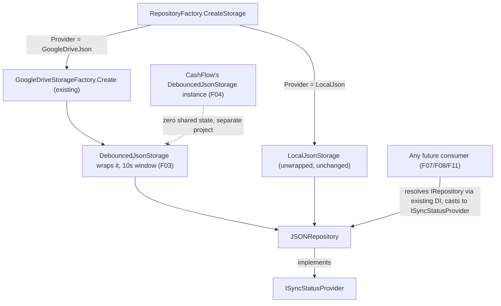

# Spec: F05. Investment Debounced Wiring

## 1. Technical Overview

**What:** When Investment's repository resolves a `GoogleDriveJsonStorage` (i.e. Investment's provider is `GoogleDrive`), `RepositoryFactory` wraps it in a dedicated `DebouncedJsonStorage` (F03) with a 10-second debounce window before handing it to `JSONRepository`. `JSONRepository` implements `ISyncStatusProvider` by delegating to that wrapped storage — the exact same pattern F04 applied to CashFlow, mirrored one-for-one against Investment's own repository/factory pair.

**Why:** Investment is edited far less often than CashFlow (fewer than 10 times a month per the PRD), but every mutation still pays the same synchronous Drive round-trip today. Wiring it through the same F03 decorator gives it the same responsiveness, entirely independently of CashFlow — `JSONRepository.SaveChangesAsync()` already just calls `_storage.WriteAsync(json)`, so swapping in a debounced storage instance underneath is the entire change here too.

**Scope:**
- Included: wrapping decision in `RepositoryFactory` (GoogleDrive only, 10-second window); `JSONRepository` implementing `ISyncStatusProvider`.
- Excluded: any change to `IRepository`'s public interface, `JSONRepository`'s constructor signature, or any caller of `SaveChangesAsync()`. Calling `FlushAsync()` from a shutdown hook (F07). Exposing status over HTTP or WPF UI (F08, F11). CashFlow's wiring (F04) — already implemented, unchanged by this feature.

## 2. Architecture Impact

**Affected components:**
- `Financial.Investment.Infrastructure/Repositories/RepositoryFactory.cs` (modified)
- `Financial.Investment.Infrastructure/Repositories/JSONRepository.cs` (modified)

## 3. Technical Decisions

| Decision | Chosen Approach | Alternative Considered | Trade-off |
|----------|----------------|----------------------|-----------|
| Mirror F04's design exactly | Same wrap-in-factory + implement-`ISyncStatusProvider`-on-the-repository approach, applied to `RepositoryFactory`/`JSONRepository` instead of `CashFlowRepositoryFactory`/`CashFlowJsonRepository` | Any divergent approach for Investment (e.g. keyed DI, a marker interface) | F04 already resolved every open design question for "how does a context's write-behind instance become resolvable" (see F04's spec); Investment has no different requirement, so repeating the identical, already-reviewed pattern is strictly simpler than inventing a second approach for the second context |
| Proving cross-context isolation (AC3: "independent of the CashFlow instance from F04") | Two within-Investment-context tests: (a) two separate `JSONRepository` instances from two separate `Factory.Create()` calls, forcing one to fail and confirming the other is unaffected; (b) rely on the structural guarantee that `Financial.CashFlow.Infrastructure` and `Financial.Investment.Infrastructure` are separate projects that never reference each other and each independently constructs its own `DebouncedJsonStorage` (a class with zero static/shared state, already verified in F03's own suite) | Add a new test project reference from `Financial.Investment.Infrastructure.Tests` to `Financial.CashFlow.Infrastructure` to literally construct one instance of each context side-by-side in one test | The literal cross-project test would be the only place in the entire test suite where an Investment test project depends on CashFlow's production code (or vice versa) — a real coupling cost for confidence that's already structurally impossible to violate: neither `RepositoryFactory`/`JSONRepository` (Investment) nor `CashFlowRepositoryFactory`/`CashFlowJsonRepository` (CashFlow) share a single static field, singleton, or common instance anywhere, and `DebouncedJsonStorage` itself holds no static state (F03's `TwoInstances_NeverShareDirtyDebounceRetryOrStatusState` test already covers the general case for any two instances, which includes one from each context) |
| Debounce window value | `TimeSpan.FromSeconds(10)`, a private constant in `RepositoryFactory` | A different value from CashFlow's, given Investment's much lower edit frequency | The PRD states 10 seconds for both F04 and F05 identically ("a dedicated F03 instance with a 10-second debounce window") — no PRD signal that Investment should differ, and a differing value with no stated rationale would be unexplained inconsistency |
| Test double for GoogleDrive-provider tests | Add a `StubRemoteFileClientFactory`/`StubRemoteFileClient` pair to `RepositoryFactoryTests.cs`, mirroring the one already established in `CashFlowRepositoryFactoryTests.cs` | Use the existing `GoogleFileClientFactory` (the real Google client) already used by this test file's other GoogleDrive-provider tests | The existing GoogleDrive-provider tests in this file all deliberately stop at credential-parsing failure (no successful `JSONRepository` is ever produced) — none of them can exercise a working wrapped storage. A stub is required to reach a successfully-constructed, GoogleDrive-backed `JSONRepository` at all, exactly as CashFlow's sibling test file already does |

## 4. Component Overview

**Backend (Financial.Investment.Infrastructure):**

| File Path | New/Modified | Purpose | Key Responsibilities |
|-----------|--------------|---------|---------------------|
| `Financial.Investment.Infrastructure/Repositories/RepositoryFactory.cs` | Modified | Decides which `IJsonStorage` backs the repository | `CreateGoogleDriveStorage`'s result is wrapped in a `DebouncedJsonStorage` (10s window) before being returned; `LocalJson` branch is unchanged |
| `Financial.Investment.Infrastructure/Repositories/JSONRepository.cs` | Modified | Investment's `IRepository` implementation | Implements `ISyncStatusProvider`; `GetStatus()`/`FlushAsync()` delegate to `_storage` when it's an `ISyncStatusProvider`, else report `Idle`/no-op |

No API, database, or frontend changes in this feature.

## 5. API Contracts

Not applicable — F05 has no API surface (F08 adds the HTTP endpoint later).

## 6. Data Model

Not applicable.

## 7. Testing Strategy

**Test File Structure:**

| Test File | Test Type | Target | Coverage Goal |
|-----------|-----------|--------|---------------|
| `Tests/Financial.Investment.Infrastructure.Tests/Repositories/RepositoryFactoryTests.cs` | Unit | `RepositoryFactory.Create` (GoogleDrive wrapping) | Existing suite extended, not replaced |
| `Tests/Financial.Investment.Infrastructure.Tests/Repositories/JsonRepositoryTests.cs` | Unit | `JSONRepository`'s `ISyncStatusProvider` implementation | Existing suite extended, not replaced |

**Test Functions (new):**

| Test Function | Description | Assertions |
|---------------|-------------|------------|
| `Create_WithGoogleDriveProvider_SaveChangesAsync_ReturnsWithoutWaitingOnUpload` | Build a repository via `Factory.Create` with `GoogleDriveJson` provider and a new stub `IRemoteFileClient`; call `SaveChangesAsync()` | The call completes well before any real upload could occur, proving the Drive round-trip isn't awaited (AC1) |
| `Create_WithGoogleDriveProvider_ResultImplementsISyncStatusProvider_ReportingPendingAfterAWrite` | Same setup, cast the created repository to `ISyncStatusProvider` after a mutation + `SaveChangesAsync()` | `GetStatus().State` is `Pending` immediately after the call returns |
| `Create_WithLocalJsonProvider_ResultReportsIdleStatus` | Build a repository via `Factory.Create` with `LocalJson` provider | `(result as ISyncStatusProvider)!.GetStatus().State` is `Idle` (AC2) |
| `Create_WithGoogleDriveProvider_TwoInstancesFromSeparateCreateCalls_NeverShareStatus` | Two separate `Factory.Create()` calls, both `GoogleDriveJson`, one wired to a stub that fails every write (`maxRetries` exhausted quickly is not directly controllable here, so force failure via a stub whose upload always throws) | Forcing the first instance to `Failed` leaves the second at `Idle` — the within-context half of AC3; see the spec's Technical Decisions for why this, plus F03's own instance-isolation coverage, is the chosen evidence for the full "independent of the CashFlow instance from F04" claim |
| `GetStatus_WhenStorageIsNotASyncStatusProvider_ReturnsIdleWithNoError` | Construct `JSONRepository` directly with a plain `LocalJsonStorage` | `((ISyncStatusProvider)repository).GetStatus()` equals `new SyncStatus(SyncState.Idle, null, null)` |
| `GetStatus_WhenStorageIsASyncStatusProvider_DelegatesToIt` | Construct `JSONRepository` with an `ISyncStatusProvider`-implementing test double as storage, configured to report `Failed` | `((ISyncStatusProvider)repository).GetStatus()` equals exactly what the double reports |
| `FlushAsync_WhenStorageIsNotASyncStatusProvider_CompletesWithoutError` | Construct `JSONRepository` with `LocalJsonStorage` | `((ISyncStatusProvider)repository).FlushAsync()` completes without throwing |
| `FlushAsync_WhenStorageIsASyncStatusProvider_DelegatesToIt` | Construct `JSONRepository` with an `ISyncStatusProvider`-implementing test double | The double's `FlushAsync()` is observed to have been called |

**Acceptance criteria covered (PRD Section 9, F05):**
- When Investment's provider is `GoogleDrive`, `JSONRepository.SaveChangesAsync()` returns without waiting on a Drive round-trip → `Create_WithGoogleDriveProvider_SaveChangesAsync_ReturnsWithoutWaitingOnUpload`
- When the provider is `LocalJson`, Investment saves remain fully synchronous with no behavior change → `Create_WithLocalJsonProvider_ResultReportsIdleStatus` (plus all pre-existing `LocalJsonStorage`-backed tests in `JsonRepositoryTests.cs`, re-run unmodified as regression coverage)
- The wired instance is independent of the CashFlow instance from F04 — forcing one to fail has no effect on the other → `Create_WithGoogleDriveProvider_TwoInstancesFromSeparateCreateCalls_NeverShareStatus` (within-context evidence) plus the structural guarantee documented in Technical Decisions (cross-project: no shared code path exists between `Financial.CashFlow.Infrastructure` and `Financial.Investment.Infrastructure`'s storage wiring, and `DebouncedJsonStorage` itself is proven instance-isolated by F03's own `TwoInstances_NeverShareDirtyDebounceRetryOrStatusState` test)
